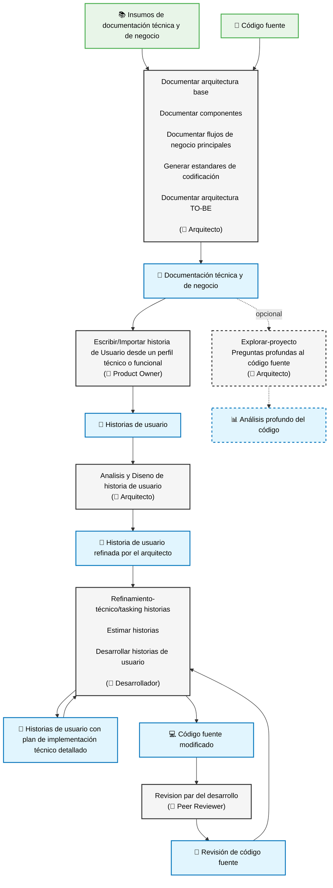

# Método Ceiba

## ¿Qué es el Método Ceiba?

El **Método Ceiba** es una forma estructurada de trabajar el ciclo de vida del desarrollo de software apoyada por agentes impulsados por IA. Su objetivo es:

- Acelerar la entrega manteniendo calidad consistente.
- Reutilizar el conocimiento del proyecto (documentación + código) en cada iteración.
- Guiar a roles técnicos y no técnicos con pasos claros y automatizados.
- Mantener una "documentación viva" (Mapa de Arquitectura / *GPS arquitectónico*) siempre alineada con el código fuente.

Cada agente cubre una etapa crítica: definición del requerimiento, análisis y diseño, refinamiento, desarrollo y revisión de calidad. El sistema siempre toma como contexto la documentación y el código existente para producir salidas más precisas y reducir retrabajos.

---

## Diagrama general del flujo para desarrollo y migraciones



**Leyenda de colores:**
- 🟢 **Verde claro**: Insumos iniciales del proceso
- ⚪ **Gris claro**: Tareas agrupadas por agente responsable
- 🔵 **Azul**: Salidas/Resultados generados
- **Líneas punteadas**: Procesos opcionales que se ejecutan bajo demanda

> Si el diagrama no se renderiza en tu visor Markdown, verifica que la plataforma soporte Mermaid o utiliza una extensión de Visual Studio Code que lo habilite.

---

## Roles y Responsabilidades

| Agente | Responsabilidades Principales | Roles de la Empresa que lo Usan |
|--------|-------------------------------|----------------------------------|
| Arquitecto | Documentar arquitectura base; Documentar componentes; Documentar flujos; Análisis y diseño de historia de usuario | Coach técnico / Líder técnico |
| Product Owner | Escribir historias de usuario | Gerentes de proyecto |
| Desarrollador | Refinar/tasking de historias de usuario; Estimar historias de usuario; Desarrollar historias de usuario | Desarrolladores |
| Peer Reviewer | Revisión par del desarrollo de la historia de usuario | Desarrolladores |

---

## Prerrequisitos

- Node.js v22 o superior instalado.
- (Recomendado) Usar bajo el IDE Visual Studio Code.
- Acceso al repositorio del proyecto y su base de código existente.
- Permisos para ejecutar `npx` en el entorno de trabajo.

---

## 🎯 **Beneficios y Características del Método Ceiba**

### ⚡ **Eficiencia y Velocidad**
- **Velocidad con contexto:** Cada acción consume documentación y código existentes para evitar redacción duplicada
- **Onboarding acelerado:** Nuevo talento entiende el sistema a través del Mapa de Arquitectura (GPS) y las historias enriquecidas
- **Reduce tiempo de onboarding** con documentación clara y estructurada

### 📚 **Documentación Viva e Integración**
- **GPS arquitectónico** que se actualiza con cada desarrollo
- **Trazabilidad completa:** Historias conectadas a componentes, flujos y decisiones de arquitectura
- **Estándares de código específicos** del proyecto basados en análisis real del código existente
- **Las historias se basan** en documentación arquitectónica existente para mayor coherencia

### 🛡️ **Calidad y Gestión Estructurada**
- **Calidad continua:** Revisión estructurada y estándares derivados del propio proyecto
- **Reducción de riesgo técnico:** Análisis y diseño explícitos antes de codificar
- **Revisión por pares obligatoria** con gates de calidad definidos
- **Estimación fundamentada** en análisis de riesgos y complejidad técnica

### 🔄 **Aprendizaje y Mejora Continua**
- **Aprendizaje organizacional:** La documentación viva evoluciona con cada entrega
- **Patrones arquitectónicos reutilizables** que aceleran desarrollos futuros
- **Procesos transparentes y trazables** con retroalimentación continua entre roles

---

## Descripción

El **Método Ceiba** es un framework de desarrollo especializado con prácticas y procesos específicos de Ceiba Software. Proporciona agentes especializados, flujos de trabajo estructurados y herramientas para equipos de desarrollo fullstack que manejan proyectos de desarrollo de software.

## 📋 **Proceso Completo del Método Ceiba**

Resumen de alto nivel de fases:

1. Documentación Arquitectónica (Arquitecto)
2. Creación de Historias (Product Owner)
3. Análisis y Diseño específico (Arquitecto en historias complejas)
4. Refinamiento y Estimación (Desarrollador)
5. Desarrollo (Desarrollador)
6. Revisión de Calidad (Peer Reviewer)
7. Correcciones Post-Revisión (Desarrollador) - *Ciclo iterativo hasta aprobación*

El Método Ceiba sigue un flujo estructurado y sistemático que garantiza la calidad del software desde la documentación arquitectónica hasta la entrega final. A continuación se presenta el proceso completo paso a paso:

---

## 🏗️ **FASE 1: DOCUMENTACIÓN ARQUITECTÓNICA**

### **Agente: Arquitecto**

#### **Paso 1.1: Documentar Arquitectura Base**

```bash
architect *documentar-arquitectura-base
```

**📄 Propósito:** Crear la documentación base de arquitectura para proyectos con múltiples repositorios y sistemas complejos.

**📦 Entregables:**

- **Archivo principal:** `docs/architecture/index.md` - Documento completo de arquitectura

**✅ Cuándo usar:** Al inicio del proyecto o cuando no existe documentación arquitectónica actualizada.

#### **Paso 1.2: Documentar Componentes Específicos**

```bash
architect *documentar-componente
```

**📄 Propósito:** Documentar componentes individuales del sistema con detalle técnico específico.

**📦 Entregables:**

- **Archivo:** `docs/architecture/architecture-{nombre-componente}.md`
- **Contenido:** Overview, arquitectura interna, APIs, dependencias, despliegue

**✅ Cuándo usar:** Para cada componente crítico del sistema que requiere documentación detallada.

#### **Paso 1.3: Documentar Flujos de Negocio**

```bash
architect *documentar-flujo-negocio
```

**📄 Propósito:** Documentar flujos de negocio críticos mediante diagramas de secuencia detallados.

**📦 Entregables:**

- **Archivo:** `docs/architecture/flujo-{nombre-flujo}.md`
- **Contenido:** Diagramas de secuencia Mermaid, manejo de errores, casos de prueba, métricas

**✅ Cuándo usar:** Para flujos de negocio complejos que involucran múltiples componentes.

#### **Paso 1.4: Generar Estándares de Código**

```bash
architect *generar-estandares-codigo
```

**📄 Propósito:** Crear estándares de código específicos del proyecto basándose en análisis del código existente y mejores prácticas del equipo.

**📦 Entregables:**

- **Archivo:** `docs/architecture/coding-standards.md`
- **Contenido:** Estándares obligatorios, convenciones recomendadas, configuración de herramientas, ejemplos prácticos

**✅ Cuándo usar:**

- Para proyectos sin estándares documentados pero con código existente
- Cuando se necesita formalizar convenciones del equipo
- Para crear guías claras para nuevos desarrolladores

**🔍 Proceso:** Elicitación de contexto → Análisis de documentación existente → Análisis de código base → Generación de estándares

---

## 📝 **FASE 2: CREACIÓN DE HISTORIAS DE USUARIO**

### **Agente: Product Owner (PO)**

#### **Paso 2.1: Crear Historia de Usuario**

```bash
po *escribir-historia
```

**📄 Propósito:** Crear historias de usuario estructuradas con información completa del negocio, aprovechando la documentación arquitectónica existente.

**📦 Entregables:**

- **Archivo:** `docs/stories/{número}.story.md`
- **Contenido:**
  - Historia en formato "Como... Quiero... Para..."
  - Criterios de aceptación en formato Gherkin
  - Información recopilada del negocio
  - Análisis de documentación arquitectónica existente
  - Referencias a componentes y flujos relacionados

**📋 Estado:** `Borrador (PO)` - Lista para análisis arquitectónico

**✅ Proceso:** Análisis de requerimientos → Consulta documentación arquitectónica → Elicitación → Historia completa

---

## 🏗️ **FASE 3: ANÁLISIS Y DISEÑO ARQUITECTÓNICO**

### **Agente: Arquitecto (Architect)**

#### **Paso 3.1: Analizar y Diseñar Arquitectura de Historia**

```bash
architect *analisis-y-diseno {número}
```

**📄 Propósito:** Analizar la historia desde perspectiva arquitectónica, tomar decisiones de diseño y proponer implementación validada por arquitecto humano.

**📦 Entregables:**

- **Archivo actualizado:** `docs/stories/{número}.story.md`
- **Contenido añadido:**
  - Análisis arquitectónico completo basado en documentación existente
  - Decisiones de diseño validadas por arquitecto humano
  - Especificación de componentes y modificaciones requeridas
  - Estrategia de implementación y flujo de integración
  - Identificación de riesgos arquitectónicos
  - Referencias a decisiones similares en historias previas

**📋 Estado:** `Analizado (Arquitecto)` - Lista para refinamiento técnico

**✅ Proceso:** Análisis de impacto → Propuesta de diseño → **Validación humana obligatoria** → Decisiones documentadas

---

## 🔧 **FASE 4: REFINAMIENTO TÉCNICO**

### **Agente: Desarrollador (Developer)**

#### **Paso 4.1: Refinar Historia de Usuario**

```bash
dev *refinamiento-tecnico {número}
```

**📄 Propósito:** Enriquecer la historia con contexto técnico profundo usando decisiones arquitectónicas como base, y descomponer en tareas ejecutables.

**📦 Entregables:**

- **Archivo actualizado:** `docs/stories/{número}.story.md`
- **Contenido añadido:**
  - Descomposición técnica basada en análisis arquitectónico (si existe)
  - Tareas de implementación específicas organizadas por fases
  - Análisis de historias refinadas similares
  - Contexto técnico complementario al diseño arquitectónico
  - Análisis de riesgos técnicos e impacto
  - Checklist de actualización documental

**📋 Estado:** `Refinado (Dev)` - Lista para estimación

**✅ Proceso:** Uso de decisiones arquitectónicas → Análisis técnico complementario → Descomposición en tareas → Historia lista para desarrollo

---

## 📊 **FASE 5: ESTIMACIÓN**

### **Agente: Desarrollador (Developer)**

#### **Paso 5.1: Estimar Historia de Usuario**

```bash
dev *estimar-historia-usuario {número}
```

**📄 Propósito:** Realizar estimación fundamentada basada en complejidad técnica y análisis de riesgos.

**📦 Entregables:**

- **Archivo actualizado:** `docs/stories/{número}.story.md`
- **Contenido añadido:**
  - Estimación en story points
  - Justificación de la estimación
  - Análisis de complejidad por dimensiones
  - Identificación de riesgos

**📋 Estado:** `Estimado (Dev)` - Lista para desarrollo

---

## 💻 **FASE 6: DESARROLLO**

### **Agente: Developer (Dev)**

#### **Paso 6.1: Implementar Historia de Usuario**

```bash
dev *desarrollar-historia-usuario {número}
```

**📄 Propósito:** Implementar la funcionalidad siguiendo los estándares documentados y patrones arquitectónicos establecidos.

**📦 Entregables:**

- **Código implementado** según especificaciones y estándares
- **Pruebas unitarias e integración** completas
- **Archivo actualizado:** `docs/stories/{número}.story.md`
- **Secciones actualizadas:**
  - Checkboxes de tareas completadas
  - Dev Agent Record con detalles de implementación
  - File List con archivos modificados/creados
  - Change Log con cambios realizados
- **Documentación actualizada** (según checklist de tareas):
  - GPS arquitectónico si hay nuevos componentes
  - Documentación de componentes modificados
  - Flujos de negocio actualizados si aplica

**📋 Estado:** `Implementado (Dev)` - Listo para revisión

**✅ Proceso:** Implementación por fases → Pruebas → Validaciones → Actualización documental → Historia completada

---

## 🧪 **FASE 7: REVISIÓN DE CALIDAD**

### **Agente: Peer Reviewer**

#### **Paso 7.1: Revisar Código y Arquitectura**

```bash
peer-reviewer  *revisar-historia {número}
```

**📄 Propósito:** Realizar revisión integral de calidad incluyendo código, arquitectura, pruebas y cumplimiento de estándares.

**📦 Entregables:**

- **Archivo actualizado:** `docs/stories/{número}.story.md`
  - Sección QA Results con resultados de revisión
- **Archivo de decisión:** `docs/qa/gates/{epic}.{story}-{slug}.yml`
- **Decisiones posibles:**
  - ✅ **PASS** - Cumple todos los criterios de calidad
  - ⚠️ **CONCERNS** - Tiene observaciones pero puede continuar
  - ❌ **FAIL** - Requiere correcciones antes de continuar
  - 🔄 **WAIVED** - Exenciones justificadas aprobadas

**📋 Estado:** `Revisado (QA)` - Según decisión del gate

**✅ Análisis incluye:**

- Trazabilidad de requisitos
- Evaluación de riesgos
- Arquitectura de pruebas
- Cumplimiento de NFRs (Non-Functional Requirements)
- Adherencia a estándares documentados
- Calidad del código y testabilidad

**🔄 Siguiente paso:** Si la revisión identifica correcciones necesarias (estado FAIL o CONCERNS), el flujo retorna al Desarrollador para implementar los ajustes antes de la aprobación final.

---

## 🔧 **FASE 8: CORRECCIONES POST-REVISIÓN**

### **Agente: Desarrollador (Developer)**

#### **Paso 8.1: Implementar Correcciones**

```bash
dev *desarrollar-historia-usuario {número}
```

**📄 Propósito:** Implementar las correcciones y ajustes identificados durante la revisión de calidad.

**📦 Entregables:**

- **Código corregido** según observaciones del Peer Reviewer
- **Pruebas actualizadas** si es necesario
- **Archivo actualizado:** `docs/stories/{número}.story.md`
- **Secciones actualizadas:**
  - Correcciones implementadas documentadas
  - Change Log con ajustes realizados

**📋 Estado:** `Corregido (Dev)` - Listo para re-revisión

**✅ Proceso:** Análisis de observaciones → Implementación de correcciones → Validación → Retorno a revisión de calidad

**🔄 Ciclo iterativo:** El proceso de revisión y corrección puede repetirse hasta que la historia cumpla todos los criterios de calidad (estado PASS).

---

## 🔄 **MIGRACIONES**

Las migraciones son procesos especiales que requieren un enfoque diferente dependiendo de su naturaleza y complejidad.

Es fundamental identificar desde la fase comercial la arquitectura TO-BE, los indicadores KPI de éxito del proceso de migración, drivers de arquitectura que se deben garantizar y así mismo los adicionales que se deben de ejecutar en esta migración como por ejemplo: migrar pruebas existentes, nuevas pruebas unitarias, resolver deuda técnica, garantizar un porcentaje de cobertura, nuevas pruebas de integración, nuevas pruebas de carga, nuevas pruebas funcionales automatizadas, nuevas pruebas de seguridad. 

Recordar que migrar no necesariamente debe de tener los adicionales anteriores y deben ser claramente identificados y estimados en la fase de pivotes en caso de aplicar. 

En caso de no aplicar adicionales tener presente que es perfectamente valido según el proceso de desarrollo de ceiba no tener en estos casos sonar, quality gate y revisiones par con todo el proceso de calidad de la compañia. Es vital dejarlo claro desde la entrega comercial.

**Principios clave de migración:**

- **Plan de pruebas:** Definir estrategia de validación incremental por cada entregable, es decir debemos definir la forma para asegurar la calidad de cada entregable en el origen/destino y los data sets de pruebas para lograr esto, sino se tiene una estrategia clara de pruebas la migración será inviable. 

Algunos ejemplos: Hacer ingenieria inversa para sacar pruebas ejecutables en insomnia de los endpoint origen para ejecutarlos posteriormente en el destino, definir desde el inicio del proyecto si se debe detener un qa de parte del cliente/ceiba para que certifique cada camino posible.
- **Despliegue incremental:** Establecer plan de releases graduales con validación en producción
- **Evitar Big Bang:** Siempre que sea posible, priorizar entregas incrementales sobre despliegues masivos
- **Rollback controlado:** Garantizar capacidad de reversión sin afectar el sistema completo

---

## 🔧 **FASE 1: MIGRACIÓN NO PIVOTABLE**

### **¿Qué es una Migración No Pivotable?**

Una **migración no pivotable** es aquella donde no es posible identificar pivotes claros de migración. Ejemplos comunes incluyen:

- Actualizaciones de versiones de frameworks o lenguajes
- Desacoplamiento de librerías legadas
- Cambios tecnológicos sin ruta de migración incremental clara
- Refactorizaciones masivas sin puntos intermedios identificables

### **Estimación**

La estimación de esta estrategia se realiza a **juicio experto** basándose en la experiencia del equipo técnico. Si no se tiene una idea clara del esfuerzo o alcance, se recomienda utilizar la tarea del arquitecto `*explorar-proyecto` para apoyarse en la toma de decisión y obtener un análisis profundo que facilite la estimación.

### **Proceso Recomendado**

#### **Paso 1.1: Exploración y Análisis con IA**

```bash
architect *explorar-proyecto
```

**📄 Propósito:** Utilizar el agente Arquitecto con la tarea de exploración-proyecto para analizar el código existente y, junto con la IA, identificar alternativas y estrategias para ejecutar la migración.

**📦 Actividades:**

- Análisis profundo del código actual y dependencias
- Identificación de riesgos y puntos críticos
- Evaluación de alternativas de migración
- Definición de estrategia de migración incremental (si es posible)
- Documentación de decisiones arquitectónicas

**📊 Entregables:**

- Análisis de impacto de la migración
- Propuesta de estrategia de migración
- Identificación de historias de usuario para la implementación

#### **Paso 1.2: Creación de Historias de Migración**

```bash
po *escribir-historia
```

**📄 Propósito:** Una vez identificada la estrategia de migración, utilizar el agente Product Owner para crear las **historias de usuario técnicas** que implementarán la migración de forma estructurada.

**📦 Proceso:**

1. Convertir la estrategia de migración en historias ejecutables técnicas
2. Priorizar las historias según dependencias y riesgos
3. Seguir el flujo normal del Método Ceiba para cada historia:
   - Análisis y Diseño (Arquitecto)
   - Refinamiento Técnico (Desarrollador)
   - Estimación (Desarrollador)
   - Desarrollo (Desarrollador)
   - Revisión de Calidad (Peer Reviewer) Solo en caso de que la migración incluya adicionales como deuda técnica, cobertura, etc.
   - Correcciones Post-Revisión (Desarrollador) - *Ciclo iterativo hasta aprobación*

**✅ Beneficios de este enfoque:**

- Aprovecha la IA para identificar estrategias de migración no evidentes
- Mantiene la trazabilidad y documentación del proceso
- Permite validación incremental y reducción de riesgos
- Genera documentación viva del proceso de migración

---

## 🎯 **FASE 2: MIGRACIÓN PIVOTABLE**

### **¿Qué es una Migración Pivotable?**

Una **migración pivotable** es aquella donde es posible identificar pivotes claros de migración que permiten una transformación incremental y estructurada del sistema. 

**Ejemplos de pivotes técnicos:**

- **Endpoints REST/API:** Migración endpoint por endpoint
- **Vistas/Páginas:** Migración de interfaz vista por vista
- **Procedimientos almacenados:** Migración de lógica de base de datos
- **Tareas programadas/Jobs:** Migración de procesos batch o schedulers
- **Escuchadores de mensajes/Event handlers:** Migración de procesadores de eventos

**Casos de uso comunes:**

- **Migración de arquitectura:** De monolito a microservicios
- **Migración de lenguaje:** De un lenguaje a otro manteniendo la funcionalidad
- **Migración de framework:** De Angular a React, de JSF a Angular, de ASPX a Angular

### **Características de una Migración Pivotable**

- ✅ **Unidades identificables:** Cada pivote es una unidad funcional independiente
- ✅ **Migración incremental:** Permite migrar de forma gradual sin big bang
- ✅ **Validación por pivote:** Cada unidad puede ser probada y validada independientemente
- ✅ **Rollback controlado:** Posibilidad de revertir pivotes específicos sin afectar el sistema completo
- ✅ **Coexistencia:** Sistema legacy y nuevo pueden coexistir durante la migración

### **Estimación**

La estimación de una migración pivotable se basa en **mediciones empíricas** mediante la migración completa de pivotes representativos:

**📊 Proceso de Estimación:**

1. **Migración de Pivotes de Referencia:** Migrar completamente tres pivotes representativos:
   - 1 pivote de **complejidad 1** (baja)
   - 1 pivote de **complejidad 3** (media)
   - 1 pivote de **complejidad 5** (alta)

2. **Medición de Tiempo Real:** Registrar el tiempo efectivo que le tomó al equipo migrar cada pivote, incluyendo:
   - Análisis y diseño
   - Desarrollo e implementación
   - Pruebas y validación de que lo migrado si corresponde 100% a lo original.

3. **Extrapolación al Inventario Total:** Con los tiempos medidos, calcular la estimación total del proyecto:
   - Multiplicar el tiempo de cada nivel de complejidad por la cantidad de pivotes de ese nivel en el inventario
   - Sumar los tiempos totales para obtener la estimación del proyecto completo
   - Aplicar factores de ajuste por aprendizaje y mejora continua

**✅ Beneficios de esta estrategia:**
- Estimación basada en datos reales del proyecto
- Reduce incertidumbre al medir esfuerzo concreto
- Permite ajustes tempranos de alcance o recursos
- Valida viabilidad de la estrategia de migración

### **Proceso Recomendado**

#### **Paso 2.1: Inventario y Clasificación de Pivotes**

```bash
architect *explorar-proyecto
```

**📄 Propósito:** Identificar y catalogar todos los pivotes de migración del sistema, clasificándolos por tipo, proceso de negocio, complejidad 1-5 y dependencias.

**📦 Actividades:**

- Inventario completo de pivotes (endpoints, vistas, stored procedures, etc.)
- Clasificación por tipo de pivote
- Análisis de dependencias entre pivotes
- Evaluación de complejidad técnica por pivote
- Identificación de riesgos específicos por pivote
- Priorización de pivotes según valor de negocio y riesgo

**📊 Entregables:**

- **Archivo:** `docs/migration/pivotes-inventario.md`
- **Contenido:**
  - Listado completo de pivotes identificados
  - Matriz de clasificación y complejidad
  - Grafo de dependencias entre pivotes
  - Estrategia de orden de migración
  - Métricas de progreso y KPIs

#### **Paso 2.2: Definición de Arquitectura TO-BE**

```bash
architect *explorar-proyecto
architect *crear-arquitectura
```

**📄 Propósito:** Documentar la arquitectura objetivo (TO-BE) que se implementará durante la migración.

**📦 Actividades:**

- Definición de arquitectura objetivo
- Documentación de patrones arquitectónicos a aplicar
- Especificación de tecnologías y frameworks destino
- Definición de estrategia de coexistencia (Strangler Pattern, Branch by Abstraction, etc.)
- Establecimiento de NFRs (Non-Functional Requirements) objetivo

**📊 Entregables:**

- **Archivo:** `docs/migration/arquitectura-to-be.md`
- Documentación de componentes target
- Patrones de integración entre legacy y nuevo sistema
- Estrategia de datos y sincronización

#### **Paso 2.3: Creación de Historia de Usuario por Pivote**

```bash
po *escribir-historia
```

**📄 Propósito:** Crear una **historia de usuario técnica** específica para cada pivote o grupo de pivotes relacionados, siguiendo la estrategia de migración definida.

**📦 Proceso por Historia:**

1. Seguir el flujo completo del Método Ceiba para cada pivote:
   - **Análisis y Diseño** (Arquitecto) - Decisiones específicas del pivote
   - **Refinamiento Técnico** (Desarrollador) - Descomposición de la migración
   - **Estimación** (Desarrollador) - Esfuerzo específico del pivote
   - **Desarrollo** (Desarrollador) - Implementación de la migración
   - **Revisión de Calidad** (Peer Reviewer) - Validación de funcionalidad y calidad - Solo en caso de que la migración incluya adicionales como deuda técnica, cobertura, etc.

### **✅ Beneficios de la Migración Pivotable**

- **Riesgo controlado:** Migración incremental reduce el riesgo de fallos masivos
- **Validación continua:** Cada pivote se valida independientemente
- **Feedback rápido:** Detección temprana de problemas arquitectónicos
- **Flexibilidad:** Posibilidad de ajustar estrategia según aprendizajes
- **Coexistencia segura:** Sistema legacy y nuevo operan paralelamente
- **Trazabilidad completa:** Cada pivote tiene su historia documentada
- **Rollback granular:** Reversión controlada por pivote sin afectar el sistema completo

### **🎯 Comparación: Pivotable vs. No Pivotable**

| Aspecto | Migración Pivotable | Migración No Pivotable |
|---------|---------------------|------------------------|
| **Granularidad** | Unidades funcionales claras | Sistema completo o módulos grandes |
| **Riesgo** | Bajo - Migración incremental | Alto - Big bang o refactorización masiva |
| **Rollback** | Por pivote individual | Todo o nada |
| **Validación** | Continua por pivote | Al final de la migración |
| **Coexistencia** | Legacy y nuevo en paralelo | Difícil mantener ambos sistemas |
| **Ejemplos** | Endpoints, vistas, stored procedures | Actualización de framework, cambio de librería core |

---

---

## 🚀 **Instalación y Configuración**

### Instalación

```bash
npm cache clean --force
npx @ceiba/metodo-ceiba@latest install
```

---

## 📂 **Estructura de Archivos Generados**

```
proyecto/
├── docs/
│   ├── architecture/
│   │   ├── index.md                           # GPS arquitectónico
│   │   ├── coding-standards.md               # Estándares de desarrollo
│   │   ├── architecture-{componente}.md      # Documentación de componentes
│   │   └── flujo-{nombre}.md                # Flujos de negocio
│   └── stories/
│       ├── 1.story.md                        # Historia de usuario #1
│       ├── 2.story.md                        # Historia de usuario #2
│       └── ...
```

---

## 📞 **Soporte**

Este método es mantenido por Ceiba Software siguiendo los principios del Método Ceiba.

---

_Desarrollado con ❤️ por el equipo de Ceiba Software_
