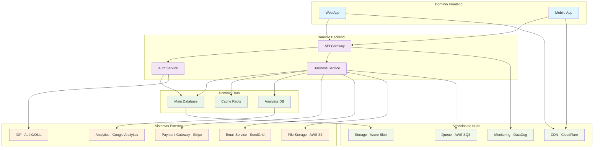
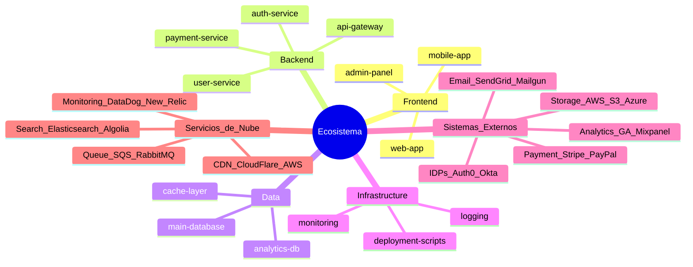
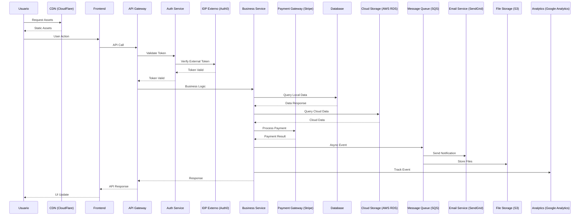

# Arquitectura del Sistema - GPS Principal

Este documento sirve como **GPS arquitectónico** para navegar el ecosistema y guiar el desarrollo cuando lleguen nuevas historias de usuario.

## 🎯 **Visión General del Sistema**

### Propósito Principal

{{contexto_proyecto}}

### Distribución del Ecosistema

<!-- FORMATO: - **Total de repositorios identificados**: {número}
- **Dominios/módulos principales**: {lista de dominios encontrados}
- **Repositorios críticos**: {los 3-5 más importantes} -->

{{estructura_repositorios}}

### Diagrama de Arquitectura de Alto Nivel

<!-- FORMATO:
_Nota: Adaptar según la arquitectura real encontrada en el análisis. **ASEGURAR** que se incluyan todos los sistemas externos identificados (IDPs, payment gateways, servicios de email, storage de archivos, analytics, etc.) y servicios de la nube (CDN, queues, monitoring, databases en la nube)_

_Nota: Adaptar según la estructura real de repositorios encontrada. **INCLUIR** las integraciones externas y servicios de terceros identificados en la investigación de código y documentación_
 -->



{{diagramas_requeridos}}

## 🗂️ **Mapa de Repositorios por Dominio**

<!-- FORMATO:
 ### {Dominio/Módulo A}

- **Repositorios**: {lista de repos}
- **Stack principal**: {tecnologías identificadas}
- **Función**: {propósito principal}
- **Estado**: {criticidad/desarrollo activo}

### {Dominio/Módulo B}

- **Repositorios**: {lista de repos}
- **Stack principal**: {tecnologías identificadas}
- **Función**: {propósito principal}
- **Estado**: {criticidad/desarrollo activo}

### {Dominio/Módulo C}

- **Repositorios**: {lista de repos}
- **Stack principal**: {tecnologías identificadas}
- **Función**: {propósito principal}
- **Estado**: {criticidad/desarrollo activo}
-->

{{estructura_repositorios}}

### Mapa Visual de Repositorios

<!-- FORMATO:
_Si aplica, generar diagrama Mermaid para visualizar la organización de repositorios **INCLUYENDO integraciones con sistemas externos**:_

_Nota: Adaptar según la estructura real de repositorios encontrada. **INCLUIR** las integraciones externas y servicios de terceros identificados en la investigación de código y documentación_
-->



## ⚙️ **Stack Tecnológico Global**

### Tecnologías Principales Identificadas

<!-- FORMATO:
- **Lenguajes**: {lenguajes encontrados}
- **Frameworks**: {frameworks principales}
- **Bases de datos**: {DBs identificadas}
- **Herramientas de build**: {herramientas encontradas}
-->

{{stacks_tecnologicos}}

### Patrones Arquitectónicos Detectados

<!-- FORMATO:
- {Patrón 1}: {descripción y ubicación}
- {Patrón 2}: {descripción y ubicación}
- {Patrón 3}: {descripción y ubicación}
-->

{{patrones_integracion}}

## 🔗 **Puntos de Integración Críticos**

### APIs Internas

<!-- FORMATO:
- {API 1}: {descripción y repos involucrados}
- {API 2}: {descripción y repos involucrados}
-->

{{patrones_integracion}}

### Bases de Datos Compartidas

<!-- FORMATO:
- {DB 1}: {repos que la usan}
- {DB 2}: {repos que la usan}
-->

{{stacks_tecnologicos}}

### Sistemas de Mensajería/Eventos

<!-- FORMATO:
- {Sistema 1}: {descripción y repos}
- {Sistema 2}: {descripción y repos}
-->

{{patrones_integracion}}

## 🔐 **Patrones de Integración y Seguridad**

### Canales de Comunicación Identificados

<!-- FORMATO:
| Canal                | Protocolo     | Sistemas Participantes  | Monitoreo/Logging        | Estado   |
| -------------------- | ------------- | ----------------------- | ------------------------ | -------- |
| {API REST principal} | HTTP/REST     | {Sistema A → Sistema B} | {herramienta/logs}       | ✅ Activo |
| {Message Queue}      | AMQP/RabbitMQ | {Sistema C → Sistema D} | {herramienta de monitor} | ✅ Activo |
| {DB Connection}      | SQL/Direct    | {Sistema E → DB X}      | {DB logs/monitoring}     | ⚠️ Legacy |
| {Event Bus}          | WebSocket     | {Sistema F ↔ Sistema G} | {logs de eventos}        | ✅ Activo |
-->

{{patrones_integracion}}

### Mecanismos de Autenticación/Autorización por Capa

#### Capa de API/Servicios

<!-- FORMATO:
- **Autenticación**: {método usado - ej: "JWT tokens vía API Gateway"}
- **Autorización**: {mecanismo - ej: "RBAC con roles en DB de usuarios"}
- **Protocolos**: {protocolos - ej: "OAuth 2.0 + OpenID Connect"}
-->

{{patrones_integracion}}

#### Capa de Base de Datos

<!-- FORMATO:
- **Autenticación**: {método - ej: "Usuarios específicos por servicio"}
- **Autorización**: {mecanismo - ej: "Permisos a nivel de schema"}
- **Encriptación**: {estado - ej: "TLS 1.3 para conexiones, datos encriptados en reposo"}
-->

{{patrones_integracion}}

#### Capa de Infraestructura

<!-- FORMATO:
- **Autenticación**: {método - ej: "Service accounts con certificados"}
- **Autorización**: {mecanismo - ej: "IAM policies en cloud provider"}
- **Network Security**: {configuración - ej: "VPN/VPC, firewalls configurados"}
-->

{{patrones_integracion}}

### Patrones de Resilencia Detectados

<!-- FORMATO:
- **Circuit Breakers**: {ubicación y configuración encontrada}
- **Retry Policies**: {patrones de retry identificados}
- **Timeouts**: {configuraciones de timeout críticas}
- **Fallbacks**: {mecanismos de fallback implementados}
- **Rate Limiting**: {limitaciones de rate implementadas}
-->

{{patrones_integracion}}

### Flujos de negocio críticos

<!-- FORMATO:
Para cada flujo crítico identificado
- **FlujoNegocioA**: {breve descripción del flujo, componentes involucrados y dependencia entre estos, ej: componente1 -> componente2 -> componenteX }
-->

{{patrones_integracion}}

### Monitoreo de Integraciones

# Verificación de salud de APIs

<!-- FORMATO:
```bash
{comandos para health checks de APIs}
-->

{{comandos_desarrollo}}

# Monitoreo de message queues

<!-- FORMATO:
```bash
{comandos para verificar colas}
-->

{{comandos_desarrollo}}

# Logs de integración

<!-- FORMATO:
```bash
{comandos para acceder a logs de integraciones}
-->

{{comandos_desarrollo}}

# Métricas de performance

<!-- FORMATO:
```bash
{comandos para métricas de integración}
-->

{{comandos_desarrollo}}

### Diagrama de Flujo de Integraciones

<!-- FORMATO:
_Si aplica, generar diagrama Mermaid que muestre los flujos de comunicación críticos **INCLUYENDO sistemas externos y servicios de la nube**:_

_Nota: Adaptar según los flujos reales identificados en el análisis. **PRIORIZAR** mostrar todas las integraciones con sistemas externos, APIs de terceros, servicios de la nube, y flujos de datos hacia/desde proveedores externos_
-->



{{diagramas_requeridos}}

## 🧪 **Realidad de Testing Actual**

### Cobertura por Módulo

<!-- FORMATO:
- **{Módulo A}**: {estado de testing encontrado - ej: "80% cobertura Jest, sin tests de integración"}
- **{Módulo B}**: {estado de testing encontrado - ej: "Tests manuales únicamente, sin automatización"}
- **{Módulo C}**: {estado de testing encontrado - ej: "60% cobertura, tests obsoletos"}
-->

{{deuda_tecnica}}

### Comandos de Testing Identificados

# Tests por módulo específico

<!-- FORMATO:
```bash
{comandos específicos encontrados por repo}
-->

{{comandos_desarrollo}}

# Tests de integración cross-sistema

<!-- FORMATO:
```bash
{comandos de integración encontrados}
-->

{{comandos_desarrollo}}

# Tests de regresión completa

<!-- FORMATO:
```bash
{comandos de testing completo del ecosistema}
-->

{{comandos_desarrollo}}

### Tipos de Testing por Módulo

<!-- FORMATO:
| Módulo     | Unitarios | Integración | E2E       | Performance | Security  |
| ---------- | --------- | ----------- | --------- | ----------- | --------- |
| {Módulo A} | ✅ Jest    | ❌ Ninguno   | ❌ Ninguno | ❌ Ninguno   | ❌ Ninguno |
| {Módulo B} | ⚠️ Básicos | ✅ Postman   | ❌ Ninguno | ❌ Ninguno   | ❌ Ninguno |
-->

{{deuda_tecnica}}

### Gaps Críticos de Testing Detectados

<!-- FORMATO:
- **{Módulo sin testing}**: Sin tests automatizados, solo verificación manual
- **{Integración sin tests}**: Comunicación entre servicios X y Y sin validación automática
- **{Performance sin monitoreo}**: Sin tests de carga para endpoints críticos
- **{Security gaps}**: Sin tests de seguridad para autenticación/autorización
-->

{{deuda_tecnica}}

## ⚠️ **Deuda Técnica y Restricciones**

### Componentes con Deuda Técnica

<!-- FORMATO:
- **{Repo/Componente 1}**: {descripción del problema técnico}
- **{Repo/Componente 2}**: {descripción del problema técnico}
-->

{{deuda_tecnica}}

### Restricciones Técnicas Conocidas

<!-- FORMATO:
- **{Restricción 1}**: {descripción y impacto}
- **{Restricción 2}**: {descripción y impacto}
-->

{{deuda_tecnica}}

### Workarounds Temporales

<!-- FORMATO:
- **{Workaround 1}**: {descripción y razón}
- **{Workaround 2}**: {descripción y razón}
-->

{{deuda_tecnica}}

## 📦 **Dependencias Externas Críticas**

### Dependencias Principales por Módulo

<!-- FORMATO:
- **{Módulo A}**: {dependencias clave identificadas - ej: "React 18.2, Express 4.18, MongoDB 5.x"}
- **{Módulo B}**: {dependencias clave identificadas - ej: "Spring Boot 2.7, PostgreSQL 13, Redis 6.x"}
- **{Módulo C}**: {dependencias clave identificadas - ej: "Python 3.9, FastAPI 0.95, MySQL 8.0"}
-->

{{stacks_tecnologicos}}

### Análisis de Riesgo de Dependencias

<!-- FORMATO:
| Dependencia          | Versión Actual | Última Versión | Riesgo  | Módulos Afectados | Notas                      |
| -------------------- | -------------- | -------------- | ------- | ----------------- | -------------------------- |
| {Lib obsoleta}       | v2.1           | v4.5           | 🔴 Alto  | {Módulo X, Y}     | Vulnerabilidades conocidas |
| {Lib desactualizada} | v1.8           | v2.1           | 🟡 Medio | {Módulo Z}        | Breaking changes en v2.0   |
| {Lib crítica}        | v3.2           | v3.2           | 🟢 Bajo  | {Módulo A}        | Actualizada                |

-->

{{deuda_tecnica}}

### Dependencias con Vulnerabilidades Conocidas

<!-- FORMATO:
- **{Dependencia vulnerable}**: CVE-XXXX-XXXX - {descripción del riesgo y módulos afectados}
- **{Otra dependencia}**: {descripción de vulnerabilidad y plan de actualización}
-->

{{deuda_tecnica}}

### Dependencias Críticas para el Ecosistema

#### Sistemas Internos Compartidos

<!-- FORMATO:
- **{Base de datos compartida}**: {versión} - Usada por {X} repositorios
- **{Message broker}**: {versión} - Crítica para comunicación inter-servicios
-->

{{stacks_tecnologicos}}

#### Sistemas Externos y Servicios de Terceros

<!-- FORMATO:
- **{IDP Externo}**: {ej: "Auth0, Okta, Azure AD"} - Para autenticación/autorización
- **{Payment Gateway}**: {ej: "Stripe, PayPal, Square"} - Para procesamiento de pagos
- **{Email Service}**: {ej: "SendGrid, Mailgun, AWS SES"} - Para comunicaciones
- **{File Storage}**: {ej: "AWS S3, Azure Blob, Google Cloud Storage"} - Para archivos
- **{CDN}**: {ej: "CloudFlare, AWS CloudFront"} - Para distribución de contenido
- **{Monitoring}**: {ej: "DataDog, New Relic, Splunk"} - Para observabilidad
- **{Analytics}**: {ej: "Google Analytics, Mixpanel, Amplitude"} - Para métricas
- **{Search}**: {ej: "Elasticsearch, Algolia, AWS OpenSearch"} - Para búsquedas
- **{Auth service}**: {versión} - Dependencia transversal de autenticación
-->

{{stacks_tecnologicos}}

## 🔧 **Comandos de Desarrollo Esenciales**

### Setup Inicial

# Configuración inicial del workspace

<!-- FORMATO:
```bash
# Configuración inicial del workspace
{comandos de setup encontrados}

# Instalación de dependencias
{comandos de instalación}
```
-->

{{comandos_desarrollo}}

### Desarrollo Diario

<!-- FORMATO:
```bash
# Build completo del ecosistema
{comandos de build encontrados}

# Tests básicos
{comandos de testing básico}

# Linting y formateo
{comandos de calidad de código}
```
-->

{{comandos_desarrollo}}

### Debugging Cross-Sistema

<!-- FORMATO:
```bash
# Logs centralizados
{comandos para ver logs}

# Monitoring
{comandos de monitoreo}
```
-->

{{comandos_desarrollo}}

## 📋 **Archivos de Referencia Rápida**

### Documentación Existente Encontrada

<!-- FORMATO:
- **{README principal}**: {ubicación y contenido clave}
- **{Documentación específica}**: {ubicación y propósito}
-->

{{documentacion_analizada}}

### Configuraciones Importantes

<!-- FORMATO:
- **{Archivo de config 1}**: {propósito y ubicación}
- **{Archivo de config 2}**: {propósito y ubicación}
-->

{{estructura_repositorios}}

---

**📌 Este GPS será el punto de partida para crear documentación más específica según las necesidades del equipo de desarrollo.**
