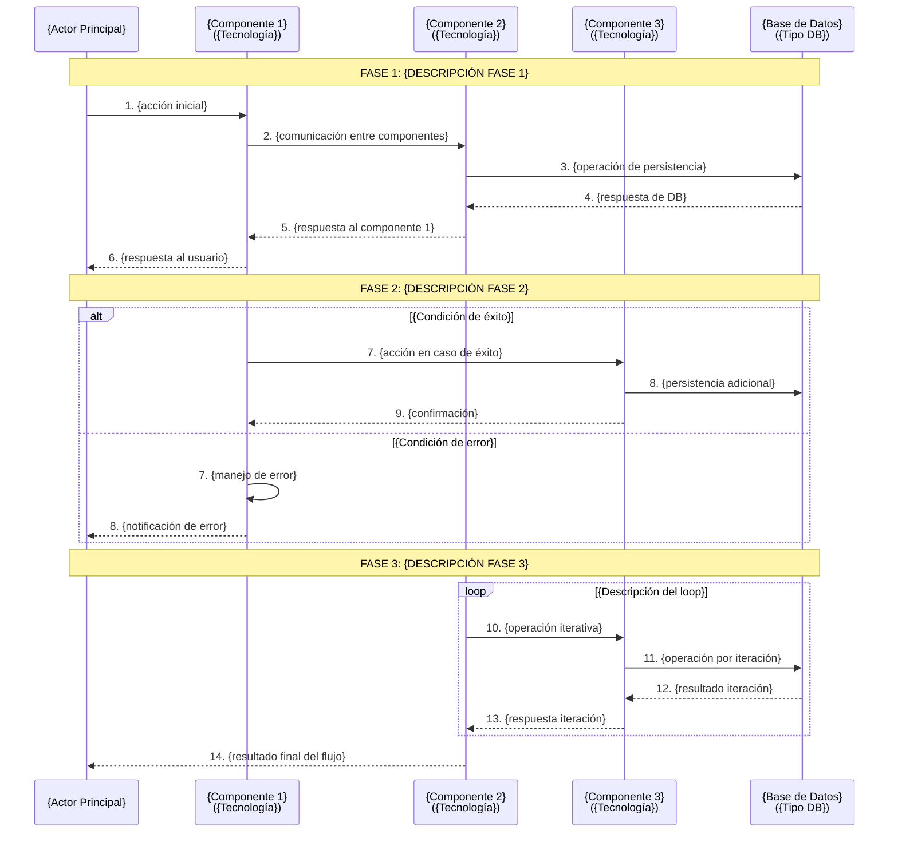
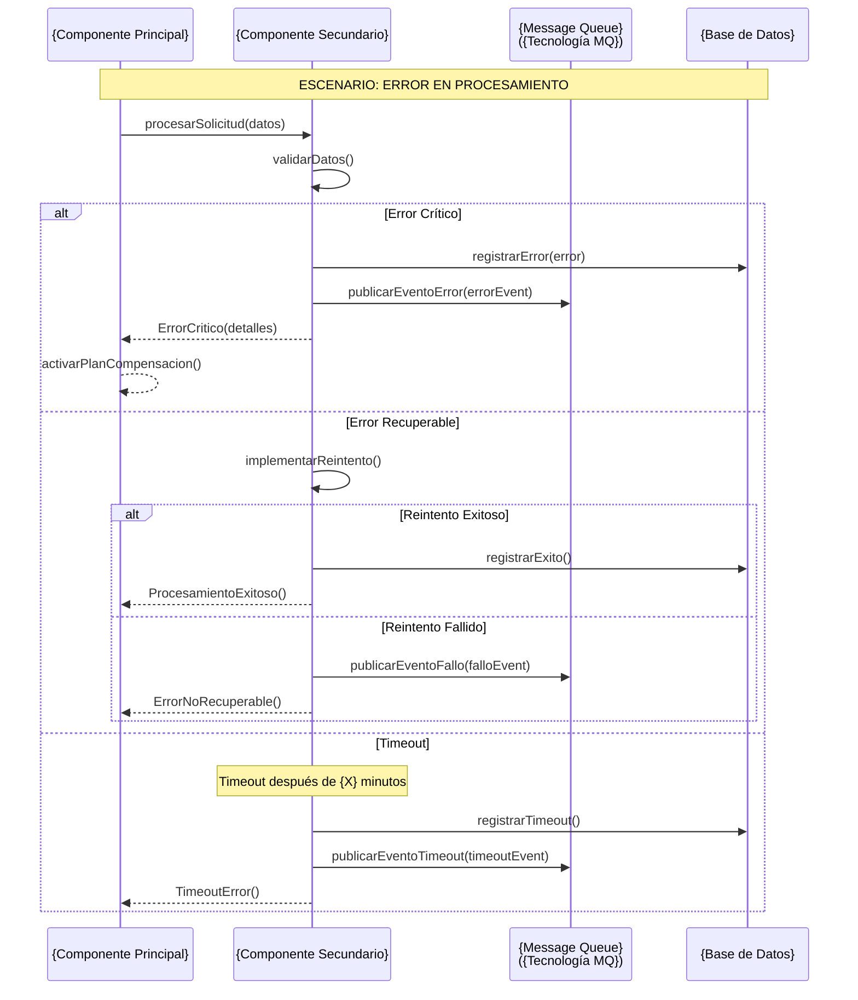
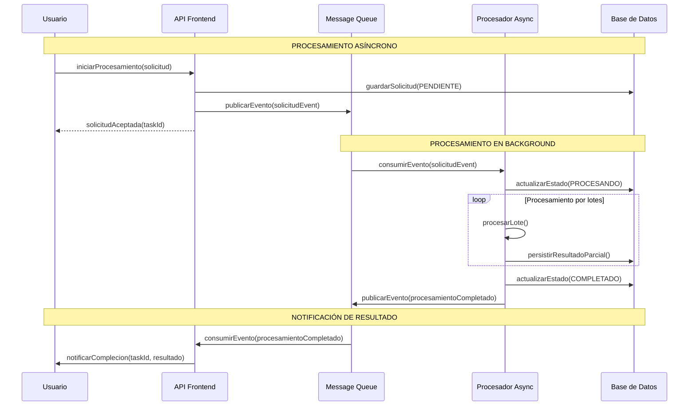
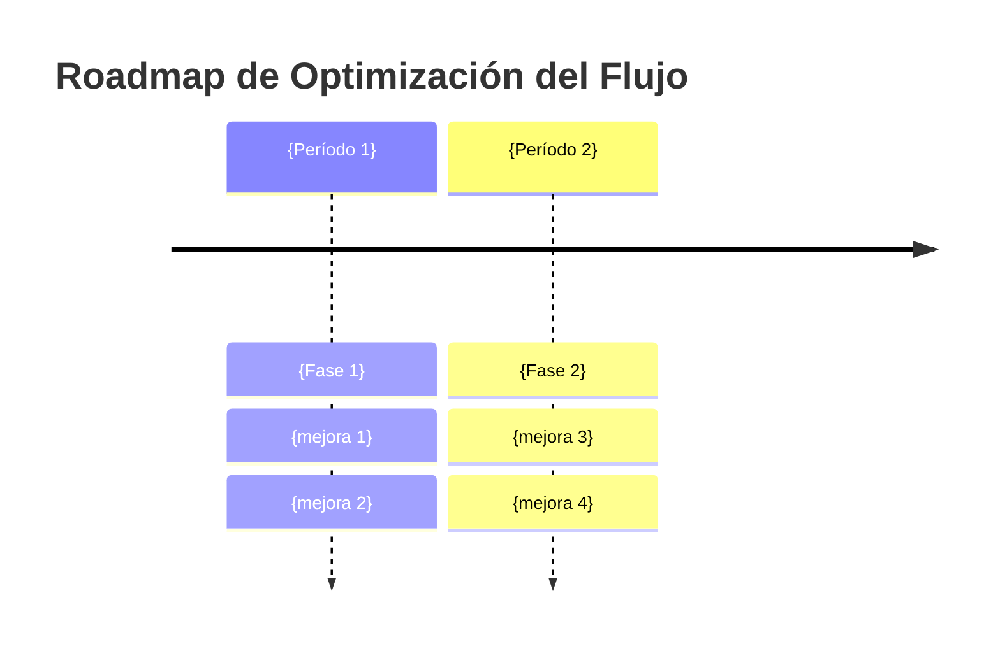

# {{Nombre del Sistema}} - Flujo: {{Nombre del Flujo}} 🔄

## 📋 **Introducción**

### Descripción del Flujo
<!-- 
Formato: Descripción del proceso de negocio basada en la respuesta del usuario 
-->
{{step0_2_elicitacion_contexto_flujo}}

### Scope del Documento
<!-- 
Formato: **Enfoque Principal**: Documentación técnica del flujo de trabajo
**Audiencia**: Desarrolladores, Arquitectos, Analistas de Negocio  
**Última Actualización**: {fecha actual}
-->
{{step0_2_elicitacion_contexto_flujo}}

### Componentes Involucrados

<!-- Formato: 

| Componente         | Tecnología   | Puerto/Contexto   | Responsabilidad               |
| ------------------ | ------------ | ----------------- | ----------------------------- |
| **{Componente 1}** | {tecnología} | {puerto/contexto} | {responsabilidad en el flujo} |
| **{Componente 2}** | {tecnología} | {puerto/contexto} | {responsabilidad en el flujo} |
| **{Componente 3}** | {tecnología} | {puerto/contexto} | {responsabilidad en el flujo} |
-->
{{step1_1_revision_contexto_arquitectonico}}
{{step1_2_analisis_componentes_flujo}}


---

## 🔄 **Diagramas de Secuencia**

### 1. Flujo Principal: {{Nombre del Flujo}}
<!-- 
Formato: Genera el digrama del flujo principal usando como plantilla el siguiente diagrama, reemplaza y adapta el diagrama usando la información correspondiente.
-->



{{step1_3_mapeo_interacciones_secuencias}}
{{step2_1_generar_diagramas_secuencia}}

### 2. Flujo de Manejo de Errores
<!-- 
Formato: Si el flujo tiene manejo de errores complejos, generar diagrama específico.
Nota: Adaptar según los escenarios de error específicos del flujo.
-->


{{step1_4_analisis_escenarios_error}}
{{step2_2_documentar_manejo_errores}}

### 3. Flujo de Operaciones Asíncronas

<!-- Formato: Solo incluir si el flujo contiene operaciones asíncronas. Ejemplo de template 
Nota: Adaptar componentes, tecnologías y secuencias según el flujo específico
-->


{{step2_3_documentar_operaciones_asincronas}}

---

## 📊 **Estados y Transiciones**

### Diagrama de Estados del Flujo

<!-- Formato: Genera el diagrama usando como plantilla el siguiente diagrama, reemplaza y adapta el diagrama usando la información correspondiente.-->

```mermaid
stateDiagram-v2
    [*] --> {Estado_Inicial}: {trigger inicial}
    {Estado_Inicial} --> {Estado_Procesando}: {condición}
    {Estado_Procesando} --> {Estado_Exitoso}: {condición éxito}
    {Estado_Procesando} --> {Estado_Error}: {condición error}
    {Estado_Procesando} --> {Estado_Timeout}: {condición timeout}

    {Estado_Error} --> {Estado_Reintentando}: {usuario reintenta}
    {Estado_Timeout} --> {Estado_Reintentando}: {reintento automático}
    {Estado_Reintentando} --> {Estado_Procesando}: {reinicia procesamiento}

    {Estado_Exitoso} --> [*]
    {Estado_Error} --> [*]: {usuario cancela}
```

{{step3_1_generar_diagrama_estados}}

---

## 📋 **Configuración y Parámetros**

### Configuración del Flujo

<!-- Formato: Si aplica, documentar configuraciones específicas -->

| Parámetro         | Valor         | Descripción             | Impacto si se Cambia |
| ----------------- | ------------- | ----------------------- | -------------------- |
| `{parametro1}`    | `{valor}`     | {descripción}           | {impacto del cambio} |
| `{parametro2}`    | `{valor}`     | {descripción}           | {impacto del cambio} |
| `{timeout_flujo}` | `{X} minutos` | Tiempo máximo del flujo | {impacto del cambio} |

{{step3_2_documentar_configuracion_parametros}}

### Message Queues Utilizadas

<!-- Formato: Solo incluir si el flujo utiliza message queues. Ejemplo de template -->

| Cola             | Exchange     | Routing Key     | TTL     | Propósito               |
| ---------------- | ------------ | --------------- | ------- | ----------------------- |
| `{nombre.cola1}` | `{exchange}` | `{routing.key}` | `{ttl}` | {propósito en el flujo} |
| `{nombre.cola2}` | `{exchange}` | `{routing.key}` | `{ttl}` | {propósito en el flujo} |

{{step3_2_documentar_configuracion_parametros}}

---

## 🔧 **Métricas y Monitoreo**

### Puntos Críticos de Medición

<!-- Formato: Métrica, Componente, Umbral Esperado, Acción si se Excede -->

| Métrica                    | Componente             | Umbral Esperado | Acción si se Excede    |
| -------------------------- | ---------------------- | --------------- | ---------------------- |
| **{métrica1}**             | {componente}           | {umbral}        | {acción}               |
| **{métrica2}**             | {componente}           | {umbral}        | {acción}               |
| **Tiempo total del flujo** | {componente principal} | < {X} minutos   | {acción de escalación} |

{{step3_3_definir_metricas_monitoreo}}


### Logs Críticos a Monitorear

<!-- Formato: Componente, Archivo Log, Patrón a Buscar, Severidad -->

| Componente        | Archivo Log     | Patrón a Buscar       | Severidad |
| ----------------- | --------------- | --------------------- | --------- |
| **{Componente1}** | `{archivo.log}` | `{patrón de error}`   | ERROR     |
| **{Componente2}** | `{archivo.log}` | `{patrón de warning}` | WARN      |

{{step3_3_definir_metricas_monitoreo}}

---

## 🧪 **Escenarios de Prueba**

### Casos de Prueba Críticos

#### TC001: Flujo Exitoso Completo

<!-- Formato: Gherkin Scenario con Given/When/Then/And -->

```gherkin
Scenario: {descripción del escenario exitoso}
  Given {condiciones iniciales}
  When {acción del usuario}
  Then {resultado esperado}
  And {verificaciones adicionales}
```

{{step4_1_definir_escenarios_prueba}}

#### TC002: Manejo de Error Crítico

```gherkin
Scenario: {descripción del escenario de error}
  Given {condiciones que causan error}
  When {acción que trigger el error}
  Then {respuesta esperada del sistema}
  And {verificación de recuperación}
```

{{step4_1_definir_escenarios_prueba}}

#### TC003: Timeout en Procesamiento

```gherkin
Scenario: {descripción del escenario de timeout}
  Given {condiciones que causan timeout}
  When {el procesamiento excede el límite}
  Then {el sistema debe manejar el timeout}
  And {debe permitir recuperación}
```

{{step4_1_definir_escenarios_prueba}}

---

## 🔍 **Troubleshooting**

{{step4_2_documentar_troubleshooting}}

### Problemas Comunes y Soluciones

#### Error: "{Descripción del error común 1}"

**Causa**: {causa raíz del problema}
**Diagnóstico**:

```bash
# Comandos para diagnosticar
{comandos de diagnóstico}
```

**Solución**: {pasos para resolver}

#### Error: "{{Descripción del error común 2}}"

**Causa**: {causa raíz del problema}
**Diagnóstico**: {método de diagnóstico}
**Solución**: {pasos para resolver}

### Comandos de Diagnóstico Útiles

<!-- Formato: Comandos bash específicos para diagnóstico -->

```bash
# Verificar estado de componentes
{comandos para verificar salud}

# Revisar logs de errores
{comandos para logs}

# Verificar métricas
{comandos para métricas}
```

---

## 🚀 **Optimizaciones Futuras**

{{step5_1_identificar_oportunidades_mejora}}

### Oportunidades de Mejora Identificadas

<!-- Formato: Lista numerada con descripción, beneficio, complejidad -->

1. **{Área de mejora 1}**
   - {descripción de la mejora}
   - {beneficio esperado}
   - {complejidad estimada}

2. **{Área de mejora 2}**
   - {descripción de la mejora}
   - {beneficio esperado}
   - {complejidad estimada}

### Roadmap de Evolución

<!-- Formato: Mermaid timeline con períodos y fases -->



---

## 📚 **Referencias**

{{step5_2_completar_referencias}}

- **GPS Arquitectónico**: [{nombre del GPS}](./{archivo-gps}.md)
- **Documentación de Componentes**:
  - [{Componente 1}](./{archivo-componente1}.md)
  - [{Componente 2}](./{archivo-componente2}.md)
- **Configuración**: {referencias a configuración}

---

<!-- Formato: Footer estándar con información de generación -->
_Documentación generada con Método Ceiba - Arquitecto_  
_Última actualización: {fecha}_  
_Versión: 1.0_