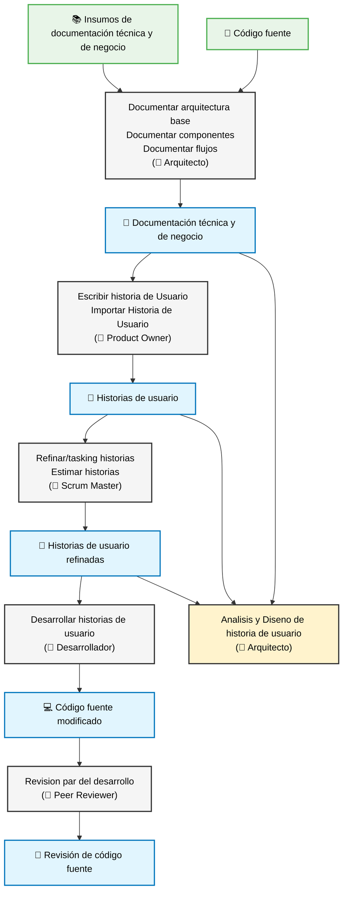

# Método Ceiba

## ¿Qué es el Método Ceiba?

El **Método Ceiba** es una forma estructurada de trabajar el ciclo de vida del desarrollo de software apoyada por agentes impulsados por IA. Su objetivo es:

- Acelerar la entrega manteniendo calidad consistente.
- Reutilizar el conocimiento del proyecto (documentación + código) en cada iteración.
- Guiar a roles técnicos y no técnicos con pasos claros y automatizados.
- Mantener una "documentación viva" (Mapa de Arquitectura / _GPS arquitectónico_) siempre alineada con el código fuente.

Cada agente cubre una etapa crítica: definición del requerimiento, análisis y diseño, refinamiento, desarrollo y revisión de calidad. El sistema siempre toma como contexto la documentación y el código existente para producir salidas más precisas y reducir retrabajos.

---

## Diagrama General del Flujo



**Leyenda de colores:**

- 🟢 **Verde claro**: Insumos iniciales del proceso
- ⚪ **Gris claro**: Tareas agrupadas por agente responsable
- 🔵 **Azul**: Salidas/Resultados generados
- 🟡 **Amarillo**: Análisis y diseño (proceso especial del Arquitecto)

> Si el diagrama no se renderiza en tu visor Markdown, verifica que la plataforma soporte Mermaid o utiliza una extensión de Visual Studio Code que lo habilite.

---

## Roles y Responsabilidades

| Agente        | Responsabilidades Principales                                                                                     | Roles de la Empresa que lo Usan        |
| ------------- | ----------------------------------------------------------------------------------------------------------------- | -------------------------------------- |
| Arquitecto    | Documentar arquitectura base; Documentar componentes; Documentar flujos; Análisis y diseño de historia de usuario | Coach técnico / Líder técnico          |
| Product Owner | Escribir historias de usuario; Importar historias de usuario                                                      | Gerentes de proyecto                   |
| Scrum Master  | Refinar/tasking de historias de usuario; Estimar historias de usuario                                             | Gerentes de proyecto / Desarrolladores |
| Desarrollador | Desarrollar historias de usuario                                                                                  | Desarrolladores                        |
| Peer Reviewer | Revisión par del desarrollo de la historia de usuario                                                             | Desarrolladores / Coach técnicos       |

---

## Prerrequisitos

- Node.js v20 o superior instalado.
- (Recomendado) Usar bajo el IDE Visual Studio Code.
- Acceso al repositorio del proyecto y su base de código existente.
- Permisos para ejecutar `npx` en el entorno de trabajo.

---

## 📚 **Importancia de la Documentación Completa**

### 🎯 **Documentación Fundamental para Resultados Esperados**

Para que el **Método Ceiba** genere resultados óptimos en todos sus pasos, es **fundamental** contar con documentación arquitectónica completa y actualizada. El método se basa en el análisis de documentación existente para generar historias de usuario más precisas, análisis arquitectónicos fundamentados y desarrollo más eficiente.

### 📋 **Se considera documentación completa cuando incluye:**

#### **1. 🏗️ Documentación General del Proyecto**

```bash
architect *documentar-arquitectura-base
```

- **Propósito:** Crear el "GPS arquitectónico" completo del sistema
- **Genera:** `docs/architecture/index.md` con visión general de arquitectura, componentes principales, flujos de datos y decisiones de diseño
- **Impacto:** Base fundamental para análisis arquitectónico de historias de usuario

#### **2. 🔧 Documentación de Componentes Principales**

```bash
architect *documentar-componente
```

- **Propósito:** Documentar cada componente crítico del sistema con detalle técnico
- **Genera:** `docs/architecture/architecture-{componente}.md` para cada componente
- **Impacto:** Permite análisis preciso de impacto y dependencias en nuevas funcionalidades

#### **3. 🔄 Documentación de Flujos de Negocio Principales**

```bash
architect *documentar-flujo-negocio
```

- **Propósito:** Documentar procesos de negocio críticos con diagramas de secuencia
- **Genera:** `docs/architecture/flujo-{nombre}.md` con diagramas Mermaid detallados
- **Impacto:** Facilita la integración de nuevas funcionalidades en flujos existentes

### ⚠️ **Consecuencias de Documentación Incompleta**

**Sin documentación completa, el Método Ceiba:**

- Generará historias de usuario con menos contexto arquitectónico
- Requerirá más iteraciones de refinamiento
- Producirá análisis arquitectónicos menos precisos
- Aumentará el riesgo de inconsistencias entre componentes
- Reducirá la eficiencia del desarrollo

### ✅ **Recomendación**

**Ejecutar los tres comandos de documentación antes de iniciar el ciclo de historias de usuario** para garantizar que todos los agentes del método tengan el contexto arquitectónico necesario para generar resultados de alta calidad.

---

## 🎯 **Beneficios y Características del Método Ceiba**

### ⚡ **Eficiencia y Velocidad**

- **Velocidad con contexto:** Cada acción consume documentación y código existentes para evitar redacción duplicada
- **Onboarding acelerado:** Nuevo talento entiende el sistema a través del Mapa de Arquitectura (GPS) y las historias enriquecidas
- **Reduce tiempo de onboarding** con documentación clara y estructurada

### 📚 **Documentación Viva e Integración**

- **GPS arquitectónico** que se actualiza con cada desarrollo
- **Trazabilidad completa:** Historias conectadas a componentes, flujos y decisiones de arquitectura
- **Estándares de código específicos** del proyecto basados en análisis real del código existente
- **Las historias se basan** en documentación arquitectónica existente para mayor coherencia

### 🛡️ **Calidad y Gestión Estructurada**

- **Calidad continua:** Revisión estructurada y estándares derivados del propio proyecto
- **Reducción de riesgo técnico:** Análisis y diseño explícitos antes de codificar
- **Revisión por pares obligatoria** con gates de calidad definidos
- **Estimación fundamentada** en análisis de riesgos y complejidad técnica

### 🔄 **Aprendizaje y Mejora Continua**

- **Aprendizaje organizacional:** La documentación viva evoluciona con cada entrega
- **Patrones arquitectónicos reutilizables** que aceleran desarrollos futuros
- **Procesos transparentes y trazables** con retroalimentación continua entre roles

---

## Descripción

El **Método Ceiba** es un framework de desarrollo especializado con prácticas y procesos específicos de Ceiba Software. Proporciona agentes especializados, flujos de trabajo estructurados y herramientas para equipos de desarrollo fullstack que manejan proyectos de desarrollo de software.

## 📋 **Proceso Completo del Método Ceiba**

Resumen de alto nivel de fases:

1. Documentación Arquitectónica (Arquitecto)
2. Creación de Historias (Product Owner)
3. Refinamiento y Estimación (Scrum Master)
4. Análisis y Diseño específico (Arquitecto en historias complejas)
5. Desarrollo (Desarrollador)
6. Revisión de Calidad (Peer Reviewer)

El Método Ceiba sigue un flujo estructurado y sistemático que garantiza la calidad del software desde la documentación arquitectónica hasta la entrega final. A continuación se presenta el proceso completo paso a paso:

---

## 🏗️ **FASE 1: DOCUMENTACIÓN ARQUITECTÓNICA**

### **Agente: Arquitecto**

#### **Paso 1.1: Documentar Arquitectura Base**

```bash
architect *documentar-arquitectura-base
```

**📄 Propósito:** Crear la documentación base de arquitectura para proyectos con múltiples repositorios y sistemas complejos.

**📦 Entregables:**

- **Archivo principal:** `docs/architecture/index.md` - Documento completo de arquitectura

**✅ Cuándo usar:** Al inicio del proyecto o cuando no existe documentación arquitectónica actualizada.

#### **Paso 1.2: Documentar Componentes Específicos**

```bash
architect *documentar-componente
```

**📄 Propósito:** Documentar componentes individuales del sistema con detalle técnico específico.

**📦 Entregables:**

- **Archivo:** `docs/architecture/architecture-{nombre-componente}.md`
- **Contenido:** Overview, arquitectura interna, APIs, dependencias, despliegue

**✅ Cuándo usar:** Para cada componente crítico del sistema que requiere documentación detallada.

#### **Paso 1.3: Documentar Flujos de Negocio**

```bash
architect *documentar-flujo-negocio
```

**📄 Propósito:** Documentar flujos de negocio críticos mediante diagramas de secuencia detallados.

**📦 Entregables:**

- **Archivo:** `docs/architecture/flujo-{nombre-flujo}.md`
- **Contenido:** Diagramas de secuencia Mermaid, manejo de errores, casos de prueba, métricas

**✅ Cuándo usar:** Para flujos de negocio complejos que involucran múltiples componentes.

#### **Paso 1.4: Generar Estándares de Código**

```bash
architect *generar-estandares-codigo
```

**📄 Propósito:** Crear estándares de código específicos del proyecto basándose en análisis del código existente y mejores prácticas del equipo.

**📦 Entregables:**

- **Archivo:** `docs/architecture/coding-standards.md`
- **Contenido:** Estándares obligatorios, convenciones recomendadas, configuración de herramientas, ejemplos prácticos

**✅ Cuándo usar:**

- Para proyectos sin estándares documentados pero con código existente
- Cuando se necesita formalizar convenciones del equipo
- Para crear guías claras para nuevos desarrolladores

**🔍 Proceso:** Elicitación de contexto → Análisis de documentación existente → Análisis de código base → Generación de estándares

---

## 📝 **FASE 2: CREACIÓN DE HISTORIAS DE USUARIO**

### **Agente: Product Owner (PO)**

#### **Paso 2.1: Crear Historia de Usuario**

```bash
po *create-user-story
```

**📄 Propósito:** Crear historias de usuario estructuradas con información completa del negocio, aprovechando la documentación arquitectónica existente.

**📦 Entregables:**

- **Archivo:** `docs/stories/{número}.story.md`
- **Contenido:**
  - Historia en formato "Como... Quiero... Para..."
  - Criterios de aceptación en formato Gherkin
  - Información recopilada del negocio
  - Análisis de documentación arquitectónica existente
  - Referencias a componentes y flujos relacionados

**📋 Estado:** `Borrador (PO)` - Lista para análisis arquitectónico

**✅ Proceso:** Análisis de requerimientos → Consulta documentación arquitectónica → Elicitación → Historia completa

---

## 🏗️ **FASE 3: ANÁLISIS Y DISEÑO ARQUITECTÓNICO**

### **Agente: Arquitecto (Architect)**

#### **Paso 3.1: Analizar y Diseñar Arquitectura de Historia**

```bash
architect *analisis-y-diseno {número}
```

**📄 Propósito:** Analizar la historia desde perspectiva arquitectónica, tomar decisiones de diseño y proponer implementación validada por arquitecto humano.

**📦 Entregables:**

- **Archivo actualizado:** `docs/stories/{número}.story.md`
- **Contenido añadido:**
  - Análisis arquitectónico completo basado en documentación existente
  - Decisiones de diseño validadas por arquitecto humano
  - Especificación de componentes y modificaciones requeridas
  - Estrategia de implementación y flujo de integración
  - Identificación de riesgos arquitectónicos
  - Referencias a decisiones similares en historias previas

**📋 Estado:** `Analizado (Arquitecto)` - Lista para refinamiento técnico

**✅ Proceso:** Análisis de impacto → Propuesta de diseño → **Validación humana obligatoria** → Decisiones documentadas

---

## 🔧 **FASE 4: REFINAMIENTO TÉCNICO**

### **Agente: Scrum Master (SM)**

#### **Paso 4.1: Refinar Historia de Usuario**

```bash
sm *refine-story {número}
```

**📄 Propósito:** Enriquecer la historia con contexto técnico profundo usando decisiones arquitectónicas como base, y descomponer en tareas ejecutables.

**📦 Entregables:**

- **Archivo actualizado:** `docs/stories/{número}.story.md`
- **Contenido añadido:**
  - Descomposición técnica basada en análisis arquitectónico (si existe)
  - Tareas de implementación específicas organizadas por fases
  - Análisis de historias refinadas similares
  - Contexto técnico complementario al diseño arquitectónico
  - Análisis de riesgos técnicos e impacto
  - Checklist de actualización documental

**📋 Estado:** `Refinado (SM)` - Lista para estimación

**✅ Proceso:** Uso de decisiones arquitectónicas → Análisis técnico complementario → Descomposición en tareas → Historia lista para desarrollo

---

## 📊 **FASE 5: ESTIMACIÓN**

### **Agente: Scrum Master (SM)**

#### **Paso 5.1: Estimar Historia de Usuario**

```bash
sm *estimate-story {número}
```

**📄 Propósito:** Realizar estimación fundamentada basada en complejidad técnica y análisis de riesgos.

**📦 Entregables:**

- **Archivo actualizado:** `docs/stories/{número}.story.md`
- **Contenido añadido:**
  - Estimación en story points
  - Justificación de la estimación
  - Análisis de complejidad por dimensiones
  - Identificación de riesgos

**📋 Estado:** `Estimado (SM)` - Lista para desarrollo

---

## 💻 **FASE 6: DESARROLLO**

### **Agente: Developer (Dev)**

#### **Paso 6.1: Implementar Historia de Usuario**

```bash
dev *develop-story {número}
```

**📄 Propósito:** Implementar la funcionalidad siguiendo los estándares documentados y patrones arquitectónicos establecidos.

**📦 Entregables:**

- **Código implementado** según especificaciones y estándares
- **Pruebas unitarias e integración** completas
- **Archivo actualizado:** `docs/stories/{número}.story.md`
- **Secciones actualizadas:**
  - Checkboxes de tareas completadas
  - Dev Agent Record con detalles de implementación
  - File List con archivos modificados/creados
  - Change Log con cambios realizados
- **Documentación actualizada** (según checklist de tareas):
  - GPS arquitectónico si hay nuevos componentes
  - Documentación de componentes modificados
  - Flujos de negocio actualizados si aplica

**📋 Estado:** `Implementado (Dev)` - Listo para revisión

**✅ Proceso:** Implementación por fases → Pruebas → Validaciones → Actualización documental → Historia completada

---

## 🧪 **FASE 7: REVISIÓN DE CALIDAD**

### **Agente: Peer Reviewer**

#### **Paso 7.1: Revisar Código y Arquitectura**

```bash
peer-reviewer  *review {número}
```

**📄 Propósito:** Realizar revisión integral de calidad incluyendo código, arquitectura, pruebas y cumplimiento de estándares.

**📦 Entregables:**

- **Archivo actualizado:** `docs/stories/{número}.story.md`
  - Sección QA Results con resultados de revisión
- **Archivo de decisión:** `docs/qa/gates/{epic}.{story}-{slug}.yml`
- **Decisiones posibles:**
  - ✅ **PASS** - Cumple todos los criterios de calidad
  - ⚠️ **CONCERNS** - Tiene observaciones pero puede continuar
  - ❌ **FAIL** - Requiere correcciones antes de continuar
  - 🔄 **WAIVED** - Exenciones justificadas aprobadas

**📋 Estado:** `Revisado (QA)` - Según decisión del gate

**✅ Análisis incluye:**

- Trazabilidad de requisitos
- Evaluación de riesgos
- Arquitectura de pruebas
- Cumplimiento de NFRs (Non-Functional Requirements)
- Adherencia a estándares documentados
- Calidad del código y testabilidad

---

---

## 🚀 **Instalación y Configuración**

### Instalación

```bash
npm cache clean --force
npx @ceiba/metodo-ceiba@latest install
```

### Activar Agentes Ceiba

```bash
/ceiba architect      # Arquitecto
/ceiba po            # Product Owner
/ceiba sm            # Scrum Master
/ceiba dev           # Developer
/ceiba peer-reviewer # Peer Reviewer
```

---

## 📂 **Estructura de Archivos Generados**

```
proyecto/
├── docs/
│   ├── architecture/
│   │   ├── index.md                           # GPS arquitectónico
│   │   ├── coding-standards.md               # Estándares de desarrollo
│   │   ├── architecture-{componente}.md      # Documentación de componentes
│   │   └── flujo-{nombre}.md                # Flujos de negocio
│   ├── stories/
│   │   ├── 1.story.md                        # Historia de usuario #1
│   │   ├── 2.story.md                        # Historia de usuario #2
│   │   └── ...
│   └── qa/
│       └── gates/
│           ├── epic1.1-login.yml             # Decisión QA historia #1
│           └── epic1.2-dashboard.yml         # Decisión QA historia #2
└── core-config.yaml                          # Configuración
```

---

## 📞 **Soporte**

Este método es mantenido por Ceiba Software siguiendo los principios del Método Ceiba.

---

_Desarrollado con ❤️ por el equipo de Ceiba Software_
