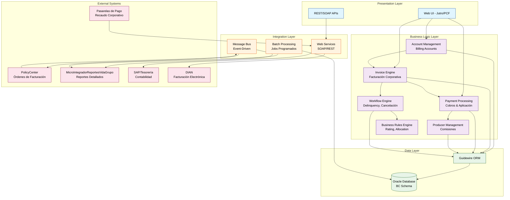

# Componente: BillingCenter

## 📋 **Overview**

### Propósito

BillingCenter es el **Sistema de Registro (System of Record)** para todas las **transacciones financieras, de facturación y pagos** de la aseguradora Seguros Sura. Funciona como el "tesorero" del ecosistema Guidewire Insurance Suite, gestionando integralmente quién debe qué, quién pagó qué y cuándo se debe pagar. Especializado en **facturación corporativa para pólizas colectivas de Vida Grupo**, maneja todo el ciclo desde la consolidación de primas por empleador hasta la gestión de mora y cancelación por no pago.

### Contexto de Negocio

Dentro del ecosistema Guidewire Insurance Suite de Seguros Sura - Vida Grupo, BillingCenter es uno de los tres componentes core junto a PolicyCenter y ClaimCenter. Su rol es crítico en el flujo de negocio:

1. **Recibe órdenes de facturación** desde PolicyCenter cuando se emite o modifica una póliza de Vida Grupo
2. **Traduce la prima total** en planes de pago corporativos (consolidados por empresa)
3. **Gestiona el ciclo completo de cobranza**, incluyendo débitos automáticos, interfaces con recaudo empresarial y mora
4. **Notifica a PolicyCenter** cuando una póliza debe cancelarse por falta de pago, iniciando el proceso de cancelación grupal
5. **Genera reportería especializada** para análisis de cartera, estados de cuenta corporativos y comisiones a intermediarios

Es el único sistema autorizado para registrar transacciones monetarias relacionadas con las pólizas y mantiene la fuente de verdad sobre el estado financiero de cada cuenta de facturación corporativa.

### Responsabilidades Principales

- **Facturación Corporativa Vida Grupo**: Consolidación de primas por empleador (una factura por empresa), cálculo automático basado en nóminas de empleados activos, aplicación de descuentos por volumen y gestión de períodos de gracia empresariales.

- **Gestión de Cobranza Especializada**: Generación automática de débitos bancarios corporativos, interfaz con sistemas de recaudo empresarial, manejo de mora empresarial (diferente a pólizas individuales) y proceso de cancelación por no pago grupal.

- **Reportería Avanzada de Facturación**: Detalle de cobro por empleado/dependiente, reportes de comisiones a intermediarios, estados de cuenta corporativos y análisis de cartera por empresa.

- **Integración Financiera Crítica**: Sistema de facturación electrónica (DIAN), pasarelas de pago corporativo, sistema de tesorería Sura y orquestación con MicroIntegradorReportesVidaGrupo para reportes especializados.

- **Gestión del Ciclo de Vida de Cuentas**: Manejo de accounts receivable, aplicación de estrategias de asignación de pagos, tracking de transacciones y auditoría financiera completa.

### Ubicación

- **Repositorio**: MetodoCeibaSura (workspace actual)
- **Ruta**: `C:\Guidewire\BillingCenter` (código fuente: `C:\Guidewire\BillingCenter\modules`)
- **Tipo**: Aplicación Empresarial Completa - Sistema de Administración de Facturación (Billing Administration System)

## 🏗️ **Architecture**

### Stack Tecnológico

- **Lenguaje Principal**: Gosu (lenguaje propietario de Guidewire, 100% interoperable con Java)
- **Plataforma Base**: Java (JVM) - Versión 1.7.0_09-amd64
- **Framework**: Guidewire Platform 8.0.7 (InsuranceSuite Core Framework)
- **Frontend (Moderno)**: Jutro (framework UI de Guidewire basado en React/JavaScript) para versiones cloud
- **Frontend (Legado)**: JavaScript + Guidewire PCF (Page Configuration Files en XML)
- **Configuración Declarativa**: XML extensivo para UI, workflows, modelo de datos y reglas
- **Build System**: Maven 4.0.0 (pom.xml) + Ant scripts legacy (gwbc.bat/gwbc.sh)
- **IDE/Studio**: Guidewire Studio (IntelliJ IDEA personalizado con SDK BillingCenter)

### Patrones de Diseño

- **Patrón Principal**: **Domain-Driven Design (DDD)** con arquitectura por capas específica de Guidewire InsuranceSuite. El sistema está organizado en dominios de negocio claros (Account, Invoice, Payment, Producer) con separación estricta entre lógica de negocio, persistencia y presentación.

- **Justificación**: Este patrón permite manejar la complejidad inherente a los procesos de facturación de seguros colectivos, donde las reglas de negocio son extensas y cambiantes. Al centralizar la lógica en el dominio (usando Gosu), se facilita la configuración sin código (low-code) para ajustes de negocio específicos de Sura Vida Grupo, mientras mantiene una plataforma base estable y upgradeable de Guidewire.

**Patrones Adicionales Implementados:**
- **Event-Driven Architecture**: Sistema de mensajería basado en eventos (messaging-config.xml) para comunicación asíncrona con PolicyCenter, ClaimCenter y sistemas externos
- **Plugin Architecture**: Extensibilidad a través de plugins personalizados (request plugins, transport plugins, reply plugins) sin modificar el core de Guidewire
- **Workflow Engine**: Orquestación de procesos de negocio complejos (aprobaciones, delinquency, cancelaciones) usando workflows declarativos
- **Strategy Pattern**: Allocation strategies para distribución de pagos, payment plan modifiers para personalización de planes de pago

### Estructura del Código

```
BillingCenter/
├── modules/                          # Módulos de configuración y código personalizado
│   └── configuration/                # Configuración principal de Sura
│       ├── gsrc/                     # Código fuente Gosu
│       │   ├── gw/                   # Extensiones Guidewire core (account, invoice, payment, etc.)
│       │   ├── sura/                 # Código custom de Sura (⭐ principal)
│       │   │   ├── bc/               # Lógica de negocio BillingCenter Sura
│       │   │   │   ├── accountinginfo/      # Información contable
│       │   │   │   ├── billingapi/          # APIs de facturación
│       │   │   │   ├── billinginformation/  # Gestión de información billing
│       │   │   │   ├── batch/               # Procesos batch
│       │   │   │   ├── invoice/             # Lógica de facturación
│       │   │   │   ├── payment/             # Procesamiento de pagos
│       │   │   │   ├── webservice/          # Web services personalizados
│       │   │   │   ├── workflow/            # Workflows custom
│       │   │   │   ├── reports/             # Generación de reportes
│       │   │   │   └── messaging/           # Integración con message queues
│       │   │   ├── constants/        # Constantes de negocio
│       │   │   ├── suite/            # Integraciones con suite Guidewire
│       │   │   └── util/             # Utilidades compartidas
│       │   ├── acc/                  # Accelerators GMC (Gestión Masiva Clientes)
│       │   ├── edge/                 # Integraciones EDGE
│       │   └── wsi/                  # Web Service Interfaces
│       ├── config/                   # Configuraciones XML
│       │   ├── messaging/            # Config de mensajería (events, destinations)
│       │   ├── webservices/          # WSDL y config de web services
│       │   ├── workflow/             # Definiciones de workflows
│       │   ├── database-config.xml   # Configuración de base de datos
│       │   └── config.xml            # Configuración principal del sistema
│       ├── wsdl/                     # Definiciones WSDL de integraciones
│       ├── xsd/                      # Esquemas XML
│       └── deploy/                   # Recursos desplegables (bundles, recursos web)
├── webapps/                          # Aplicación web desplegable
│   └── bc/                           # Web app BillingCenter
│       ├── WEB-INF/                  # Configuración web
│       └── resources/                # Recursos estáticos (CSS, JS, imágenes)
├── build/                            # Artefactos de compilación
│   ├── dictionary/                   # Diccionario de datos generado
│   ├── gosudoc/                      # Documentación Gosu generada
│   └── reports/                      # Reportes de build
├── doc/                              # Documentación técnica de Guidewire
├── admin/                            # Herramientas administrativas
│   ├── bin/                          # Scripts de administración
│   └── lib/                          # Librerías administrativas
├── bin/                              # Scripts de ejecución (gwbc.bat/sh)
├── studio/                           # Configuración de Guidewire Studio (IDE)
├── repository/                       # Repositorio Maven local
└── pom.xml                           # Descriptor Maven del proyecto
```

### Diagrama Conceptual



## 🔌 **APIs**

### Endpoints Expuestos

BillingCenter expone APIs principalmente a través de **Web Services SOAP** (estándar Guidewire) y algunas **APIs REST** para integraciones modernas. Las APIs están configuradas en `/modules/configuration/config/webservices/`.

#### Web Services SOAP (APIs Públicas Guidewire)

| Servicio | Endpoint | Descripción | Métodos Principales |
| -------- | -------- | ----------- | ------------------- |
| `BCAccountAPI` | `/ws/gw/wsi/bc/account/AccountAPI` | Gestión de cuentas de facturación | `createAccount()`, `getAccount()`, `updateAccount()` |
| `BCInvoiceAPI` | `/ws/gw/wsi/bc/invoice/InvoiceAPI` | Consulta y gestión de facturas | `getInvoice()`, `getInvoicesByAccount()`, `reverseInvoice()` |
| `BCPaymentAPI` | `/ws/gw/wsi/bc/payment/PaymentAPI` | Registro de pagos | `makePayment()`, `reversePayment()`, `getPaymentInstruments()` |
| `BCProducerAPI` | `/ws/gw/wsi/bc/producer/ProducerAPI` | Gestión de productores y comisiones | `getProducer()`, `getCommissions()` |

#### APIs REST Customizadas (Sura)

| Método | Ruta | Descripción | Payload | Respuesta |
| ------ | ---- | ----------- | ------- | --------- |
| POST | `/api/sura/billing/detalle-cobro` | Solicitud de reporte de detalle de cobro | `{"policyNumber": "string", "period": "string"}` | `{"reportId": "string", "status": "PENDING"}` |
| GET | `/api/sura/billing/account/{accountNumber}` | Consulta de cuenta corporativa | - | `AccountDetailDTO` (JSON) |
| POST | `/api/sura/billing/payment/corporate` | Registro de pago corporativo | `CorporatePaymentDTO` | `PaymentConfirmationDTO` |

#### Web Services de Integración con PolicyCenter

Configurados en `/config/webservices/` para comunicación bidireccional:

| WSDL | Propósito | Tipo |
| ---- | --------- | ---- |
| `PCCancellationAPI.wsdl` | Recepción de cancelaciones desde PolicyCenter | Inbound |
| `PCPolicyRenewalAPI.wsdl` | Recepción de renovaciones desde PolicyCenter | Inbound |

#### Códigos de Error

| Código | Descripción | Casos |
| ------ | ----------- | ----- |
| 400 | Bad Request | Payload inválido, datos de cuenta incompletos, formato de fecha incorrecto |
| 401 | Unauthorized | Credenciales inválidas, token expirado |
| 404 | Not Found | Cuenta no existe, factura no encontrada, póliza no vinculada |
| 409 | Conflict | Pago duplicado, cuenta en estado inconsistente, factura ya procesada |
| 500 | Internal Error | Error en motor de reglas, fallo de base de datos, timeout en integración externa |

#### Contratos y Versionamiento

- **Estrategia de versionado**: Guidewire utiliza versionamiento implícito basado en la versión del producto (8.0.7). Los contratos SOAP son estables dentro de una versión major.minor.
- **Versión actual**: 8.0.7 (APIs Guidewire estables desde 8.0.x)
- **Breaking changes**: Los cambios incompatibles solo ocurren en upgrades major de Guidewire. Las extensiones custom de Sura siguen versionamiento semántico en headers (`X-Sura-API-Version: 1.0`).

### Eventos y Mensajería

BillingCenter utiliza un sistema robusto de mensajería basado en eventos para comunicación asíncrona con otros componentes del ecosistema.

#### Eventos Publicados

| Evento | Descripción | Payload | Consumidores |
| ------ | ----------- | ------- | ------------ |
| `BillingReadyToSend_ExtChanged` | Factura lista para enviar a sistemas externos | `Invoice`, `Account`, `PolicyPeriod` | Sistema facturación electrónica (DIAN), MicroIntegradorReportesVidaGrupo |
| `InvoiceChanged` | Cambio en estado de factura | `Invoice`, `AccountNumber` | Sistema de comisiones, SAP Tesorería |
| `PaymentMoneyReceivedAdded` | Pago recibido y registrado | `Payment`, `Amount`, `PaymentInstrument` | PolicyCenter (reactivación), Sistema de bonificaciones |
| `PolicyPeriodChanged` | Cambio en período de póliza (desde PC) | `PolicyPeriod`, `EffectiveDate` | Recálculo de primas, Ajuste de planes de pago |
| `DisbursementChanged` | Cambio en desembolso (comisiones) | `Disbursement`, `ProducerCode` | Sistema de pagos a productores |
| `InvoiceCollectivePolicyChanged` | Cambio en factura de póliza colectiva | `CollectiveInvoice`, `RiskList` | MicroIntegradorReportesVidaGrupo (detalle de cobro) |

#### Eventos Consumidos

| Evento | Descripción | Origen | Acción |
| ------ | ----------- | ------ | ------ |
| `PolicyPeriodChanged` | Emisión/modificación de póliza | PolicyCenter | Crear/actualizar billing instruction, generar nueva factura |
| `PolicyCancelled` | Cancelación de póliza | PolicyCenter | Cancelar billing instruction, emitir factura final (pro-rata) |
| `RiskClasification_ExtAdded` | Clasificación de riesgo agregada | PolicyCenter | Recalcular prima según clasificación, ajustar plan de pago |
| `PAS_*` (eventos PAS) | Eventos del sistema PAS | Sistema PAS interno | Procesamiento interno según tipo de evento |

**Configuración de Mensajería:** Definida en `/modules/configuration/config/messaging/messaging-config.xml` con 20+ destinations configurados, incluyendo plugins de transporte personalizados para integraciones con SAP, sistemas de facturación electrónica y RabbitMQ.

## 📦 **Dependencies**

### Dependencias Externas

#### Librerías Críticas

| Librería | Versión | Propósito | Criticidad |
| -------- | ------- | --------- | ---------- |
| Gosu Language | 0.11-SNAPSHOT | Lenguaje de programación principal para lógica de negocio | 🔴 Crítica |
| Guidewire Platform (bc.jar) | 8.0.7.183 | Framework core de BillingCenter (ORM, Workflow Engine, Rules) | 🔴 Crítica |
| Oracle JDBC Driver | Compatible con Oracle 11g+ | Conectividad con base de datos Oracle | 🔴 Crítica |
| Apache Commons (varios) | Varias | Utilidades Java (IO, Collections, Lang) | 🟡 Importante |
| Gosu XML | 0.11-SNAPSHOT | Procesamiento XML para SOAP/integraciones | 🟡 Importante |
| Gosu WebServices | 0.11-SNAPSHOT | Cliente/servidor SOAP para APIs | 🟡 Importante |
| Gosu Servlet | 0.11-SNAPSHOT | Servidor web embebido para UI | 🟡 Importante |
| DBCP (Database Connection Pool) | Fragment 1.0 | Pool de conexiones de base de datos | 🟡 Importante |
| Apache Axis/CXF | Bundled | Framework SOAP para web services | 🟡 Importante |

#### Servicios Externos

- **Oracle Database**: Base de datos relacional para persistencia de todas las entidades (accounts, invoices, payments). Configurado en múltiples ambientes (DLLO_MGR, QA, PROD).
- **Sistema de Facturación Electrónica (DIAN)**: Integración para emisión de facturas electrónicas legalmente válidas en Colombia.
- **Pasarelas de Pago Corporativo**: Servicios de recaudo bancario para débitos automáticos y pagos en línea.
- **SAP/Tesorería Sura**: Sistema ERP para contabilización de transacciones y conciliación bancaria.
- **RabbitMQ (vía MicroIntegradorReportesVidaGrupo)**: Message broker para comunicación asíncrona con microservicios.

### Dependencias Internas

#### Componentes del Sistema

- **PolicyCenter**: Origen de las órdenes de facturación (billing instructions). BillingCenter consume eventos de PolicyCenter cuando se emite, modifica o cancela una póliza. También notifica a PolicyCenter cuando una póliza debe cancelarse por mora.
- **MicroIntegradorReportesVidaGrupo**: Microservicio que consume datos de BillingCenter para generar reportes especializados de detalle de cobro. BillingCenter publica eventos cuando las facturas están listas y expone APIs REST para consultas.
- **ClaimCenter**: Integración indirecta para validación de vigencia de póliza al momento del siniestro (consulta a través de PolicyCenter).

#### Bases de Datos

- **BC_OP (Operational Tables)**: Tablas principales de negocio (bc_account, bc_invoice, bc_payment, bc_policyperiod, bc_producer). Almacena el 90% de las transacciones diarias.
- **BC_ADMIN (Admin Tables)**: Tablas administrativas y de configuración (usuarios, roles, parámetros del sistema).
- **BC_INDEX (Índices)**: Tablespace dedicado para índices de performance en consultas de facturación y pagos.
- **BC_STAGING (Staging)**: Área temporal para procesos batch de carga masiva y migraciones.
- **BC_TYPELIST (TypeLists)**: Catálogos y listas de tipos (códigos de pago, tipos de cuenta, estados de factura).

### Quién Usa Este Componente

#### Consumidores Directos

- **MicroIntegradorReportesVidaGrupo**: Consume APIs REST de BillingCenter y escucha eventos de mensajería para generar reportes de detalle de cobro por empleado/dependiente.
- **Sistema de Facturación Electrónica (DIAN)**: Recibe facturas electrónicas desde BillingCenter vía web service SOAP para validación y timbrado legal.
- **SAP/Tesorería**: Consume interfaces de BillingCenter para contabilización de ingresos, desembolsos de comisiones y conciliación bancaria.
- **Portal de Clientes Corporativos**: Consume APIs REST para que empresas consulten estados de cuenta, facturas pendientes y realicen pagos en línea.

#### Consumidores Indirectos

- **Agentes/Intermediarios**: A través de portal de productores que consulta comisiones calculadas por BillingCenter.
- **Departamento de Cobranzas**: Utiliza UI de BillingCenter para gestión de mora y seguimiento de cartera vencida.
- **Auditoría Interna**: Consume reportes generados desde BillingCenter para análisis de transacciones financieras.

### Gestión de Dependencias

```bash
# Actualización de dependencias Guidewire (requiere upgrade de plataforma)
# Nota: Solo se realiza con aprobación de Guidewire y plan de migración
cd C:\Guidewire\BillingCenter
mvn clean install -U

# Verificación de vulnerabilidades en librerías Java
# Ejecutar desde directorio raíz de BillingCenter
cd C:\Guidewire\BillingCenter\admin\lib
# Usar herramientas de seguridad corporativas de Sura

# Auditoría de dependencias Maven
mvn dependency:tree > dependency-report.txt

# Actualización de librerías custom Sura (módulo configuration)
cd modules\configuration
mvn clean install

# Sincronización con repositorio Maven local
mvn dependency:resolve
```

**Nota Importante:** BillingCenter utiliza un repositorio Maven local customizado (`/repository`) que incluye artefactos propietarios de Guidewire no disponibles en Maven Central. Las actualizaciones de versión major/minor de Guidewire requieren proceso formal de upgrade con soporte de Guidewire.

## 🚀 **Deployment**

### Configuración de Entorno

#### Variables de Entorno Requeridas

| Variable | Descripción | Ejemplo | Requerida |
| -------- | ----------- | ------- | --------- |
| `BC_HOME` | Directorio raíz de instalación de BillingCenter | `C:\Guidewire\BillingCenter` | ✅ Sí |
| `JAVA_HOME` | Directorio de instalación de JDK | `C:\Program Files\Java\jdk1.7.0_09` | ✅ Sí |
| `BC_DB_URL` | JDBC URL de base de datos Oracle | `jdbc:oracle:thin:@host:1537:SID` | ✅ Sí |
| `BC_DB_USER` | Usuario de base de datos | `bc_user` | ✅ Sí |
| `BC_DB_PASSWORD` | Password de base de datos (encriptado) | `{encrypted}abcd1234...` | ✅ Sí |
| `BC_ENV` | Identificador de ambiente (DLLO_MGR, QA, PROD) | `DLLO_MGR` | ✅ Sí |
| `BC_SERVER_PORT` | Puerto HTTP del servidor de aplicaciones | `8580` | ✅ Sí |
| `BC_SERVER_SSL_PORT` | Puerto HTTPS del servidor de aplicaciones | `8543` | ⚠️ Opcional (requerido en PROD) |
| `MAVEN_OPTS` | Opciones JVM para Maven | `-Xmx2048m -XX:MaxPermSize=512m` | ⚠️ Opcional (mejora performance) |
| `BC_LOG_LEVEL` | Nivel de logging | `INFO`, `DEBUG`, `ERROR` | ⚠️ Opcional (default: INFO) |

#### Archivo .env de Ejemplo

```bash
# Configuración de desarrollo local
BC_HOME=C:\Guidewire\BillingCenter
JAVA_HOME=C:\Program Files\Java\jdk1.7.0_09
BC_ENV=DLLO_MGR
BC_SERVER_PORT=8580

# Base de datos Oracle - Ambiente Desarrollo
BC_DB_URL=jdbc:oracle:thin:@srcsbdd01.suramericana.com.co:1537:DLLGWMGR
BC_DB_USER=bc_dev_user
BC_DB_PASSWORD={encrypted}dev_password_hash

# Configuración JVM para desarrollo
MAVEN_OPTS=-Xmx2048m -XX:MaxPermSize=512m -Dfile.encoding=UTF-8

# Logging
BC_LOG_LEVEL=DEBUG

# Configuración específica del componente
BC_BATCH_ENABLED=true
BC_MESSAGING_ENABLED=true
BC_WEBSERVICES_ENABLED=true
```

### Comandos de Desarrollo

#### Setup Inicial

```bash
# Instalación de dependencias Maven
cd C:\Guidewire\BillingCenter
mvn clean install -DskipTests

# Configuración inicial de base de datos (crear esquema)
cd admin\bin
.\gwbc.bat dbschemainstall

# Carga de datos de configuración inicial (typelists, usuarios admin)
.\gwbc.bat loadsampledata

# Generación de proyecto para Guidewire Studio (IDE)
cd C:\Guidewire\BillingCenter
mvn idea:project -P generate-project

# Verificación de setup (health check)
.\bin\gwbc.bat test
```

#### Compilación

```bash
# Build de desarrollo (compila Gosu + empaqueta módulos)
cd C:\Guidewire\BillingCenter
mvn clean compile

# Build de producción (incluye optimizaciones)
mvn clean package -P production -DskipTests

# Compilación incremental solo de módulo configuration
cd modules\configuration
mvn compile

# Verificación de build (sin tests)
mvn verify -DskipTests

# Generación de artefactos desplegables
mvn package
```

#### Testing

```bash
# Tests unitarios Gosu (GUnit)
mvn test

# Tests de integración
mvn integration-test

# Coverage de código
mvn clean test jacoco:report
# Reporte en: target/site/jacoco/index.html

# Linting de código Gosu
mvn gosu:lint
# O desde Studio: Analyze > Inspect Code

# Tests de smoke (post-deployment)
.\bin\gwbc.bat smoketest
```

#### Ejecución Local

```bash
# Modo desarrollo (hot reload de cambios Gosu)
cd C:\Guidewire\BillingCenter
.\bin\gwbc.bat run

# Modo producción local (sin hot reload)
.\bin\gwbc.bat run -Dbc.env=production

# Debug mode (puerto 5005 para remote debugging)
.\bin\gwbc.bat debug

# Acceso a aplicación:
# UI: http://localhost:8580/bc
# Web Services: http://localhost:8580/bc/ws
```

### Pipeline de Despliegue

#### Prerequisitos de Infraestructura

- **Servidor de Aplicaciones**: Servidor Windows/Linux con JDK 1.7+ instalado y 8GB+ RAM
- **Base de Datos Oracle**: Instancia Oracle 11g+ con tablespaces BC_OP, BC_ADMIN, BC_INDEX, BC_STAGING creados
- **Conectividad de Red**: Acceso a PolicyCenter, sistemas externos (DIAN, SAP), y message brokers (RabbitMQ)
- **Certificados SSL**: Certificados válidos para HTTPS y firma de web services
- **Storage**: Mínimo 20GB para instalación + 100GB para logs y archivos temporales

#### Etapas del Pipeline

1. **Build Stage**
   - Checkout de código desde repositorio Git (rama main/release)
   - Compilación de código Gosu y Java con Maven
   - Ejecución de tests unitarios (GUnit) y linters
   - Generación de artefactos: `bc-configuration.jar`, webapps, módulos
   - Comandos: `mvn clean package -P production`

2. **Test Stage**
   - Despliegue en ambiente de testing (H2 in-memory para tests rápidos)
   - Ejecución de suite de tests de integración
   - Validación de contratos de APIs (SOAP/REST)
   - Verificación de migraciones de base de datos
   - Comandos: `mvn integration-test`, `.\gwbc.bat dbschemaverify`

3. **Deploy to QA Stage**
   - Backup de base de datos Oracle QA
   - Ejecución de scripts de upgrade de schema (`gwbc.bat dbschemaupgrade`)
   - Despliegue de artefactos al servidor QA
   - Reinicio de servicio BillingCenter
   - Smoke tests automatizados post-deployment
   - Comandos: `.\gwbc.bat stop`, `xcopy /E /Y artifacts\*`, `.\gwbc.bat start`, `.\gwbc.bat smoketest`

4. **Deploy to Production Stage** (manual approval required)
   - Ventana de mantenimiento programada
   - Backup completo de base de datos PROD
   - Deployment de artefactos con rollback plan preparado
   - Validación de conectividad con sistemas externos
   - Monitoreo intensivo post-deployment (24h)
   - Comandos: Similar a QA pero con validaciones adicionales de compliance

#### Variables de Entorno por Ambiente

**Desarrollo:**
```bash
BC_ENV=DLLO_MGR
BC_DB_URL=jdbc:oracle:thin:@srcsbdd01.suramericana.com.co:1537:DLLGWMGR
BC_SERVER_PORT=8580
BC_LOG_LEVEL=DEBUG
BC_MESSAGING_ENABLED=true
```

**Staging:**
```bash
BC_ENV=QA
BC_DB_URL=jdbc:oracle:thin:@srcsbqa01.suramericana.com.co:1537:QAGWMGR
BC_SERVER_PORT=8580
BC_SERVER_SSL_PORT=8543
BC_LOG_LEVEL=INFO
BC_MESSAGING_ENABLED=true
BC_BATCH_ENABLED=true
```

**Producción:**
```bash
BC_ENV=PROD
BC_DB_URL=jdbc:oracle:thin:@srcsbprod01.suramericana.com.co:1537:PRODGWMGR
BC_SERVER_PORT=8580
BC_SERVER_SSL_PORT=8543
BC_LOG_LEVEL=WARN
BC_MESSAGING_ENABLED=true
BC_BATCH_ENABLED=true
BC_HA_ENABLED=true
BC_CLUSTER_NODES=bc-prod-node1,bc-prod-node2
```

### Buenas Prácticas de Despliegue

- **Backup Obligatorio Pre-Deployment**: Siempre realizar backup completo de base de datos Oracle antes de cualquier deployment a QA/PROD. Verificar que el backup sea restaurable ejecutando restore en ambiente de testing.

- **Ventanas de Mantenimiento Coordinadas**: Coordinar deployments de BillingCenter con PolicyCenter y ClaimCenter para evitar inconsistencias en mensajería. Ideal: deployment simultáneo de la suite completa.

- **Validación de Schema Migrations**: Ejecutar `gwbc.bat dbschemaverify` en ambiente de testing antes de aplicar upgrades de schema en QA/PROD. Revisar scripts SQL generados para detectar operaciones costosas (full table scan, recreación de índices grandes).

- **Monitoreo de Conectividad Post-Deployment**: Validar conectividad con todos los sistemas externos (PolicyCenter, DIAN, SAP, pasarelas de pago) ejecutando health checks de integración inmediatamente post-deployment.

- **Rollback Plan Documentado**: Mantener scripts de rollback de schema database y procedimiento documentado para reversión rápida en caso de issues críticos. Practicar rollback en ambiente de desarrollo trimestralmente.

### Pasos Manuales

1. **Activación de Batch Jobs en PROD**: Después de deployment en producción, los batch jobs (facturación automática, cálculo de comisiones, procesos de mora) deben habilitarse manualmente desde la UI administrativa de BillingCenter (`Administration > Batch Processes > Enable All`). Esto previene ejecuciones accidentales durante la ventana de deployment.

2. **Configuración de Certificados SSL**: Los certificados SSL para web services externos (DIAN, SAP) deben importarse manualmente al keystore de Java usando `keytool`. Requiere acceso administrativo al servidor.
   ```bash
   keytool -import -alias dian-cert -file dian-prod.cer -keystore %JAVA_HOME%\jre\lib\security\cacerts
   ```

3. **Sincronización Inicial de Typelists**: En deployments que incluyen cambios en typelists (catálogos de códigos), ejecutar script de sincronización manual para actualizar tablas de referencia sin perder datos históricos.

### Rollback

```bash
# Detener servidor BillingCenter
cd C:\Guidewire\BillingCenter\bin
.\gwbc.bat stop

# Restaurar backup de base de datos Oracle (ejemplo RMAN)
# (Ejecutar desde cliente Oracle en servidor de BD)
rman target sys/password@PRODGWMGR
RMAN> restore database;
RMAN> recover database;
RMAN> alter database open;

# Reversión de artefactos de aplicación
cd C:\Guidewire\BillingCenter
xcopy /E /Y C:\Backups\BillingCenter_pre_deployment\* .

# Reinicio de servidor
.\bin\gwbc.bat start

# Verificación post-rollback
.\bin\gwbc.bat smoketest
curl http://localhost:8580/bc/health
```

**Tiempo estimado de rollback completo**: 30-45 minutos (incluye restore de BD).

### Monitoreo Post-Despliegue

- **Health Checks**: 
  ```bash
  # Endpoint de salud del sistema
  curl http://localhost:8580/bc/health
  
  # Verificación de conectividad a base de datos
  .\bin\gwbc.bat dbping
  ```

- **Logs**: 
  ```bash
  # Logs de aplicación en tiempo real
  tail -f C:\Guidewire\BillingCenter\logs\server.log
  
  # Logs de errores críticos
  grep -i "ERROR\|FATAL" C:\Guidewire\BillingCenter\logs\server.log
  
  # Logs de integración (mensajería)
  tail -f C:\Guidewire\BillingCenter\logs\messaging.log
  ```

- **Métricas**: 
  - JMX Monitoring: Conectar JConsole/VisualVM a puerto JMX (default: 9010) para métricas de JVM, threads, memoria
  - Guidewire Admin Console: `http://localhost:8580/bc/administration` > System > Performance Metrics
  - Splunk Dashboard: Logs centralizados y dashboards de performance (configurado por equipo de operaciones Sura)

---

**📌 Esta documentación debe mantenerse actualizada con cada cambio significativo en el componente.**

## 📝 **Notas de Mantenimiento**

| Fecha | Versión | Cambios | Autor |
| ----- | ------- | ------- | ----- |
| 2025-11-12 | 1.0 | Documentación inicial del componente BillingCenter | esteban.colorado |

_Documentación generada con Método Ceiba - Arquitecto_
