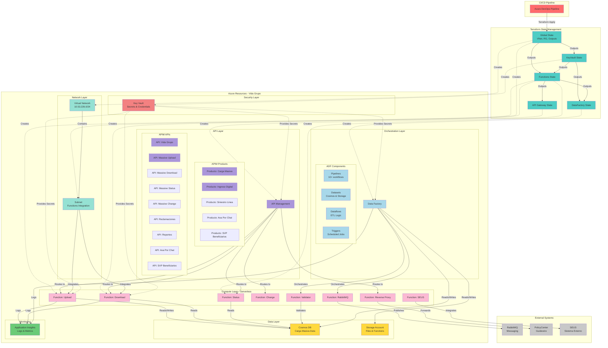

# Componente: VidaGrupoIAC

## 📋 **Overview**

### Propósito

VidaGrupoIAC es el componente de Infraestructura como Código (IaC) que define, versiona y despliega toda la infraestructura Azure necesaria para soportar las operaciones cloud de Vida Grupo en Sura. Utiliza Terraform para provisionar y gestionar declarativamente recursos de Azure incluyendo API Management, Azure Functions, Data Factory, Key Vault, redes virtuales y bases de datos Cosmos DB.

### Contexto de Negocio

El componente VidaGrupoIAC es responsable de la definición, versionamiento y despliegue de toda la infraestructura cloud necesaria para soportar las operaciones de Vida Grupo en Azure. Este proyecto permite la creación y gestión declarativa de recursos como APIs, funciones serverless, orquestación de datos y gestión de secretos, garantizando consistencia entre ambientes (Laboratorio, Staging, Producción).

VidaGrupoIAC actúa como la **capa fundacional** del ecosistema cloud, provisionando la infraestructura que soporta:
- APIs públicas para operaciones de Vida Grupo (Carga Masiva, Reportes, Reclamaciones)
- Procesamiento serverless de archivos masivos (miles de registros)
- Orquestación ETL para validación y transformación de datos
- Integración segura con sistemas empresariales (PolicyCenter, RabbitMQ, SEUS)
- Gestión centralizada de secretos y credenciales

### Responsabilidades Principales

- **Provisionamiento de Azure API Management** con 9 APIs y 5 productos configurados
- **Despliegue de 8 Azure Functions** para procesamiento serverless (Upload, Download, Status, Change, Validator, RabbitMQ, SEUS, ReverseProxy)
- **Configuración de Azure Data Factory** con 10+ pipelines, datasets, dataflows y triggers para orquestación ETL
- **Gestión de Azure Key Vault** para almacenamiento seguro de 10+ secretos críticos
- **Configuración de redes virtuales**, subnets y políticas de acceso con integración VNet
- **Provisionamiento de Cosmos DB** con containers, TTL policies y autoscaling
- **Versionamiento y trazabilidad** de cambios de infraestructura mediante Git

### Ubicación

- **Repositorio**: MetodoCeibaSura
- **Ruta**: `./VidaGrupoIAC`  
- **Tipo**: Infraestructura como Código (Terraform)

## 🏗️ **Architecture**

### Stack Tecnológico

- **Lenguaje**: HCL (HashiCorp Configuration Language)
- **Framework IaC**: Terraform >= 1.3.0
- **Provider Principal**: Azure RM (hashicorp/azurerm) ~> 3.25.0
- **Provider Secundario**: Random (hashicorp/random) ~> 3.4.3
- **Cloud Platform**: Microsoft Azure
- **CI/CD**: Azure DevOps Pipelines (YAML)
- **Shell Scripting**: Bash (utilidades de validación)
- **Lenguajes de Configuración**: YAML, JSON (pipelines DataFactory, OpenAPI specs)

### Patrones de Diseño

#### 1. Patrón de Módulos Reutilizables

El proyecto implementa el **patrón de módulos Terraform**, separando la lógica de infraestructura en componentes reutilizables independientes. Cada módulo (`apigateway`, `datafactory`, `functions`, `keyvault`, `permissions`) encapsula recursos relacionados y puede ser versionado independientemente.

**Justificación**: Facilita mantenimiento, testing independiente y reutilización entre ambientes (Lab, Staging, Prod). Promueve separación de concerns y Single Responsibility Principle.

#### 2. Patrón de Composición por Ambientes

Utiliza el **patrón de composición** donde cada ambiente (`environments/`) invoca los módulos base con configuraciones específicas mediante variables. Esto permite mantener código DRY (Don't Repeat Yourself) mientras se gestionan múltiples ambientes con distintas configuraciones.

**Justificación**: Evita duplicación de código entre ambientes. Permite promoción controlada de cambios desde Lab → Staging → Producción.

#### 3. Patrón de Remote State

Implementa referencias a **estados remotos** (`terraform_remote_state`) para compartir outputs entre módulos, permitiendo dependencias ordenadas y desacoplamiento entre componentes.

**Justificación**: Permite dependencias ordenadas (Key Vault → Functions → API Gateway) y evita acoplamiento circular entre módulos. Facilita despliegue independiente de componentes.

#### 4. Patrón de Infraestructura Inmutable

Los recursos se definen **declarativamente**, garantizando que la infraestructura se pueda recrear de forma idéntica en cualquier momento.

**Justificación**: Reduce drift de configuración. Permite disaster recovery rápido. Facilita compliance y auditoría.

#### 5. Patrón API Gateway (Backend for Frontend)

Azure API Management actúa como **punto único de entrada** para múltiples backends, implementando políticas, autenticación, rate limiting y enrutamiento centralizado.

**Justificación**: Simplifica autenticación, monitoreo, versionamiento de APIs. Desacopla clientes de implementaciones backend.

#### 6. Patrón Serverless / FaaS

Azure Functions implementan **lógica de negocio sin gestión de servidores**, escalando automáticamente según demanda.

**Justificación**: Escalabilidad automática, pago por uso, reducción de overhead operacional. Ideal para cargas de trabajo variables.

#### 7. Patrón de Orquestación ETL

Azure Data Factory orquesta **pipelines de datos** con dataflows, datasets y triggers programados para procesamiento batch.

**Justificación**: Orquestación visual de flujos ETL con monitoreo integrado, reintentos automáticos y manejo de errores.

#### 8. Patrón Secrets Management

Azure Key Vault centraliza la **gestión de secretos**, certificados y claves, con políticas de acceso granulares y Managed Identities.

**Justificación**: Seguridad centralizada, rotación de secretos, auditoría de acceso. Elimina hardcoding de credenciales.

### Estructura del Código

```
VidaGrupoIAC/
├── modules/                      # Módulos reutilizables (lógica de infraestructura)
│   ├── apigateway/               # 🌐 API Management
│   │   ├── apimanagement.shared.tf          # Recurso principal APIM
│   │   ├── apimanagement.api.*.tf           # Definiciones de APIs (9 APIs)
│   │   ├── apimanagement.product.*.tf       # Productos APIM (5 productos)
│   │   ├── apimanagement.shared.backends.tf # Backends para routing
│   │   ├── apimanagement.shared.namedvalues.tf # Named values
│   │   ├── apimanagement.users.tf           # Usuarios APIM
│   │   ├── files/                           # OpenAPI specs y policies
│   │   ├── variables.tf
│   │   └── outputs.tf
│   │
│   ├── datafactory/              # 🏭 Data Factory
│   │   ├── datafactory.tf                   # Recurso principal ADF
│   │   ├── datafactory.pipelines.tf         # Pipelines (10+)
│   │   ├── datafactory.datasets.tf          # Datasets (Cosmos, Storage)
│   │   ├── datafactory.dataflows.tf         # Dataflows de transformación
│   │   ├── datafactory.linkedservices.tf    # Linked services + Cosmos DB
│   │   ├── datafactory.triggers.tf          # Triggers programados
│   │   ├── pipelines/                       # JSON de pipelines
│   │   ├── datasets/                        # JSON de datasets
│   │   ├── dataflows/                       # JSON de dataflows
│   │   ├── controlSchema/                   # Esquemas de control
│   │   ├── variables.tf
│   │   └── outputs.tf
│   │
│   ├── functions/                # ⚡ Azure Functions
│   │   ├── functions.tf                     # Recursos compartidos
│   │   ├── functions.massiveupload.tf       # Function: Upload
│   │   ├── functions.massivedownload.tf     # Function: Download
│   │   ├── functions.massivestatus.tf       # Function: Status
│   │   ├── functions.massivechange.tf       # Function: Change
│   │   ├── functions.massivevalidator.tf    # Function: Validator
│   │   ├── functions.massiverabbit.tf       # Function: RabbitMQ
│   │   ├── functions.massiveseus.tf         # Function: SEUS
│   │   ├── functions.reverseproxy.tf        # Function: Reverse Proxy
│   │   ├── zippedFunctions/                 # Packages de funciones (.zip)
│   │   ├── variables.tf
│   │   └── output.tf
│   │
│   ├── keyvault/                 # 🔐 Key Vault
│   │   ├── keyvault.tf                      # Key Vault + políticas
│   │   ├── variables.tf
│   │   └── output.tf
│   │
│   └── permissions/              # 🔑 Permisos y RBAC
│
├── environments/                 # Configuraciones por ambiente
│   ├── main.tf                   # Orquestación principal (VNet, RG, locals)
│   ├── providers.tf              # Provider AzureRM
│   ├── variables.tf              # 60+ variables de entrada
│   ├── terraform.tfvars          # Valores para laboratorio
│   ├── apigateway/               # Instancia de módulo apigateway
│   │   └── main.tf               # Invoca módulo con remote state
│   ├── datafactory/              # Instancia de módulo datafactory
│   │   └── main.tf               # Invoca módulo con remote state
│   ├── functions/                # Instancia de módulo functions
│   ├── keyvault/                 # Instancia de módulo keyvault
│   └── permissions/              # Instancia de módulo permissions
│
├── CI/                           # Pipeline de CI/CD
│   └── pipeline.yml              # Azure DevOps YAML pipeline
│
└── utilidades/                   # Scripts de utilidad
    ├── validateTerraform.sh      # Terraform fmt + validate
    ├── environmentAsegidi117.sh  # Setup de ambiente Desarrollo
    ├── environmentAseguramientoSBOX.sh # Setup Sandbox
    └── imports.txt               # Comandos de importación de recursos
```

### Diagrama Conceptual



## 🔌 **APIs**

### Endpoints Expuestos

El componente VidaGrupoIAC provisiona **Azure API Management** como punto único de entrada para 9 APIs REST organizadas en 5 productos.

#### APIs Principales

| API | Path | Descripción | Protocolo | Versión |
|-----|------|-------------|-----------|---------|
| **Vida Grupo** | `/grouplife` | Gestión del ciclo de vida de pólizas de Vida Grupo | HTTPS | v1 |
| **Massive Upload** | `/massiveupload` | Carga de archivos para procesamiento masivo | HTTPS | v1 |
| **Massive Download** | `/massive-download` | Descarga de reportes y archivos de errores | HTTPS | v1 |
| **Massive Status** | `/massivestatus` | Consulta de estados de archivos de carga masiva | HTTPS | v1 |
| **Massive Change** | `/massivechange` | Descarga de reportes de modificaciones masivas | HTTPS | v1 |
| **Reclamaciones** | `/reclamaciones` | Gestión de reclamaciones de Vida Grupo | HTTPS | v1 |
| **Reportes** | `/reportes` | Generación y consulta de reportes | HTTPS | v1 |
| **Ava Por Chat** | `/avaporchat` | Integración con Ava (asistente virtual) | HTTPS | v1 |
| **SVP Beneficiarios** | `/svpbeneficiarios` | Sucursal Virtual Personas - Beneficiarios | HTTPS | v1 |

#### Productos y Suscripciones

| Producto | APIs Incluidas | Suscripción Requerida | Aprobación Manual |
|----------|----------------|----------------------|-------------------|
| **Carga Masiva** | Massive Upload, Download, Status, Change | ✅ Sí | ✅ Sí |
| **Ingreso Digital** | TBD | ✅ Sí | ✅ Sí |
| **Siniestro Línea** | TBD | ✅ Sí | ✅ Sí |
| **Ava Por Chat** | Ava Por Chat, Reportes | ✅ Sí | ✅ Sí |
| **Sucursal Virtual Personas** | SVP Beneficiarios | ✅ Sí | ✅ Sí |

#### Operaciones Destacadas

**API: Massive Upload**
- `GET /file/encoders/b64/integers/{integerdata}` - Encoding de datos en base64
- `GET /file/{codoffer}/{policyoperation}/{typefile}/{masterpolicyid}/{md5file}/blocks` - Consulta de bloques
- `POST /file/{codoffer}/{policyoperation}/{typefile}/{masterpolicyid}/{md5file}/blocks` - Envío de bloques
- `PUT /file/{codoffer}/{policyoperation}/{typefile}/{masterpolicyid}/{md5file}/blocks-bas` - Actualización

**API: Massive Download**
- `GET /file/output-errors/solutions/{solution}/{solution-operation}/{operation}/templ` - Template de errores
- `GET /consultar-número-de-bloques` - Consulta cantidad de bloques
- `POST /envío-de-bloques` - Envío de bloques del archivo
- `PUT /cerrar-archivo` - Cierre y finalización de archivo
- `DELETE /borrar-archivo` - Eliminación de archivo temporal

**API: Massive Status**
- `GET /consultar-cargas-en-proceso-por-poliza` - Consulta cargas activas por póliza
- `GET /file/{policynumber}/{md5file}` - Estado de archivo específico
- `PUT /file/{policynumber}/{md5file}` - Actualización de estado
- `GET /file/{policynumber}` - Listado de archivos por póliza

**API: Vida Grupo**
- `GET /v1/policies/masters/{policynumber}` - Consulta de póliza maestra
- `GET /v1/policies/risks/{policynumber}` - Consulta de riesgos de póliza
- `POST /v1/policies/masters/{policynumber}/risks/allowduplicated/{allowduplicated}` - Creación de riesgos
- `POST /v1/policies/masters/catalogs` - Consulta de catálogos

#### Backends y Routing

Cada API enruta a backends específicos (Azure Functions):

| Backend | URL Base | Autenticación | Resource ID |
|---------|----------|---------------|-------------|
| **massive-upload** | `{environment}Upload.azurewebsites.net` | Function Key (Key Vault) | Azure Function Resource ID |
| **massive-download** | `{environment}Download.azurewebsites.net` | Function Key (Key Vault) | Azure Function Resource ID |
| **massive-status** | `{environment}Status.azurewebsites.net` | Function Key (Key Vault) | Azure Function Resource ID |
| **massive-change** | `{environment}Change.azurewebsites.net` | Function Key (Key Vault) | Azure Function Resource ID |
| **massive-rabbit** | `{environment}Rabbit.azurewebsites.net` | Function Key (Key Vault) | Azure Function Resource ID |
| **massive-seus** | `{environment}SEUS.azurewebsites.net` | Function Key (Key Vault) | Azure Function Resource ID |
| **reverse-proxy** | `{environment}ReverseProxy.azurewebsites.net` | Function Key (Key Vault) | Azure Function Resource ID |

#### Códigos de Error

| Código | Descripción | Casos |
|--------|-------------|-------|
| 200 | OK | Operación exitosa |
| 201 | Created | Recurso creado correctamente |
| 400 | Bad Request | Parámetros inválidos, validación fallida |
| 401 | Unauthorized | Subscription key inválida o ausente |
| 403 | Forbidden | Subscription no aprobada, acceso denegado |
| 404 | Not Found | Recurso no encontrado |
| 429 | Too Many Requests | Rate limit excedido |
| 500 | Internal Server Error | Error en backend, Function failure |
| 502 | Bad Gateway | Backend no disponible |
| 503 | Service Unavailable | APIM o backend temporalmente no disponible |

#### Contratos y Versionamiento

- **Estrategia de versionado**: APIs versionadas mediante path (`/v1/...`)
- **Versión actual**: Todas las APIs en v1
- **Breaking changes**: Requieren nueva versión (v2)
- **OpenAPI Specs**: Almacenadas en `modules/apigateway/files/*.openapi.yaml`
- **Políticas**: Versionadas por operación en archivos XML separados

### Eventos y Mensajería

#### Eventos Publicados (Data Factory → RabbitMQ)

| Evento | Descripción | Payload | Routing Key |
|--------|-------------|---------|-------------|
| Carga Masiva Procesada | Archivo procesado exitosamente | `{fileId, status, recordCount}` | `sura.seguros.carga_masiva` |
| Notificación Reporte Success | Reporte generado correctamente | `{reportId, downloadUrl}` | `seguros.ava.reporte.solicitudGeneracionReporteRecibida` |
| Notificación Reporte Failed | Error en generación de reporte | `{reportId, error}` | `seguros.ava.reporte.solicitudGeneracionReporteRecibidaFallida` |
| Documento Exportado (PorChat) | Documento disponible para descarga | `{docId, url}` | `seguros.porchat.documentos.nuevoexportado` |

#### Eventos Consumidos

**Triggers Blob Storage**:

| Trigger | Evento | Patrón | Pipeline Invocado |
|---------|--------|--------|-------------------|
| `trigger_upload_csv` | BlobCreated | `/Solutions/*.csv` | `startFileValidation` |
| `trigger_upload_xlsx` | BlobCreated | `/Solutions/*.xlsx` | `startFileValidation` |

**Triggers Programados**:

| Trigger | Frecuencia | Horario | Pipeline | Propósito |
|---------|-----------|---------|----------|-----------|
| `trigger_end_phase_low` | Cada 5min (Lun-Vie 5-18h) | Semanal | `endPhase` | Cargas pequeñas (0-100 registros) |
| `trigger_end_phase_medium` | Cada 5min (Lun-Vie 5-18h) | Semanal | `endPhase` | Cargas medianas (101-2000 registros) |
| `trigger_end_phase_high` | Cada 5min (Lun-Vie 5-18h) | Semanal | `endPhase` | Cargas grandes (2001+ registros) |

## 📦 **Dependencies**

### Dependencias Externas

#### Librerías Críticas

| Librería/Proveedor | Versión | Propósito | Criticidad |
|-------------------|---------|-----------|------------|
| hashicorp/azurerm | ~> 3.25.0 | Provider principal para recursos Azure | 🔴 Crítica |
| hashicorp/random | ~> 3.4.3 | Generación de valores aleatorios | 🟢 Opcional |
| hashicorp/subnets | latest | Cálculo de subnets CIDR | 🟡 Importante |

#### Servicios Externos

**Cloud Platform**:
- **Azure Resource Manager**: Gestión de recursos Azure (🔴 Crítica)
- **Azure Active Directory**: Autenticación y autorización (🔴 Crítica)
- **Azure DNS**: Resolución de nombres (🟡 Importante)

**Mensajería**:
- **RabbitMQ** (Laboratorio): `rabbitmqlab.suramericana.com` - Carga Masiva
- **RabbitMQ** (Producción): `msglab.suramericana.com.co` - Notificaciones

**Sistemas Empresariales**:
- **PolicyCenter (Guidewire)**: Sistema core de gestión de pólizas vía Reverse Proxy
- **SEUS**: Sistema legacy de Suramericana vía Function SEUS
- **Ava**: Asistente virtual - notificaciones vía RabbitMQ
- **Por Chat**: Sistema de chat - documentos vía RabbitMQ

**CI/CD**:
- **Azure DevOps**: Pipeline Templates desde `aseguramiento-generales-templates-conf`

### Dependencias Internas

#### Componentes del Sistema

**Módulo Key Vault** provee a:
- API Gateway: Function keys para autenticación
- Data Factory: Cosmos DB credentials
- Functions: Secrets de RabbitMQ, SEUS, configuraciones

**Módulo Functions** provee a:
- API Gateway: URLs y Resource IDs de backends
- Data Factory: URLs para orquestación de pipelines

**Módulo Global (environments/main.tf)** provee a:
- Todos los módulos: Resource Group, VNet, Subnet, variables globales

#### Bases de Datos

| Base de Datos | Propósito | Usado Por |
|---------------|-----------|-----------|
| **Cosmos DB** (`MASSIVE_UPLOAD` DB) | Almacenamiento de registros de carga masiva | Functions, Data Factory |
| **Cosmos Container** `MAIN_UPLOAD` | Registros principales (TTL 90 días) | Upload, Status, Download Functions |
| **Cosmos Container** `UPLOAD_DETAIL` | Detalle de registros (TTL 90 días) | Validator, Data Factory Pipelines |

### Quién Usa Este Componente

#### Consumidores Directos

**Desarrolladores y DevOps**:
- Ejecutan `terraform apply` para provisionar/actualizar infraestructura
- Modifican variables en `terraform.tfvars` para configurar ambientes
- Versionan cambios de infraestructura en Git

**Azure DevOps Pipeline**:
- Pipeline `CI/pipeline.yml` ejecuta Terraform automáticamente
- Requiere parámetros: `folderExec`, `changeOrderHURelease`

**Aplicaciones Cliente**:
- Frontend Web: Consume APIs de Vida Grupo
- Guidewire PolicyCenter: Recibe callbacks
- Aplicaciones Móviles: Carga masiva
- Sistemas de Reportería: Descarga de reportes

#### Consumidores Indirectos

**Usuarios de Negocio**:
- Operadores de pólizas (carga masiva)
- Analistas (generación de reportes)
- Agentes (consulta de beneficiarios)

**Sistemas de Monitoreo**:
- Application Insights: Telemetría
- Azure Monitor: Métricas
- Cost Management: Seguimiento de costos

### Gestión de Dependencias

#### Terraform State Management

```bash
# Estado local (por ambiente)
# Ubicación: environments/{ambiente}/terraform.tfstate

# Remote State References entre módulos
data "terraform_remote_state" "globals" {
  backend = "local"
  config  = { path = "../terraform.tfstate" }
}
```

**Orden de Despliegue**:
1. Global Resources (`environments/main.tf`) → VNet, RG
2. Key Vault (`environments/keyvault/`) → Secretos
3. Functions (`environments/functions/`) → Functions + Secrets
4. Data Factory (`environments/datafactory/`) → Pipelines + Cosmos
5. API Gateway (`environments/apigateway/`) → APIs + Backends

#### Comandos de Gestión

```bash
# Validación de sintaxis Terraform
terraform fmt
terraform validate

# Plan de cambios
terraform plan -var-file=terraform.tfvars

# Aplicar cambios
terraform apply -var-file=terraform.tfvars

# Importar recursos existentes
terraform import <resource_type>.<resource_name> <azure_resource_id>
```

## 🚀 **Deployment**

### Configuración de Entorno

#### Variables de Entorno Requeridas

| Variable | Descripción | Ejemplo | Requerida |
|----------|-------------|---------|-----------|
| `ARM_CLIENT_ID` | Application ID del Service Principal | `xxxxxxxx-xxxx-...` | ✅ Sí |
| `ARM_CLIENT_***` | Client Secret del Service Principal (***=SECRET) | `x.xxx~xxx...` | ✅ Sí |
| `ARM_SUBSCRIPTION_ID` | Azure Subscription ID | `xxxxxxxx-xxxx-...` | ✅ Sí |
| `ARM_TENANT_ID` | Azure AD Tenant ID | `xxxxxxxx-xxxx-...` | ✅ Sí |

#### Archivo .env de Ejemplo

```bash
# Configuración para Ambiente Desarrollo (Asegidi117)
export ARM_CLIENT_ID="xxxxxxxx-xxxx-xxxx-xxxx-xxxxxxxxxxxx"
export ARM_CLIENT_***="x.xxx~xxxxxxxxxxxxxxxxxxxxxxxxxx"  # *** = SECRET
export ARM_SUBSCRIPTION_ID="xxxxxxxx-xxxx-xxxx-xxxx-xxxxxxxxxxxx"
export ARM_TENANT_ID="xxxxxxxx-xxxx-xxxx-xxxx-xxxxxxxxxxxx"

# Configuración para Sandbox
# export ARM_SUBSCRIPTION_ID="xxxxxxxx-xxxx-xxxx-xxxx-xxxxxxxxxxxx"
```

### Comandos de Desarrollo

#### Setup Inicial

```bash
# 1. Configurar credenciales Azure
source utilidades/environmentAsegidi117.sh

# 2. Login a Azure CLI
az login
az account set --subscription "xxxxxxxx-xxxx-xxxx-xxxx-xxxxxxxxxxxx"

# 3. Inicializar Terraform
cd environments
terraform init
```

#### Compilación

```bash
# Formatear código Terraform
terraform fmt -recursive

# Validar sintaxis
terraform validate

# Script de validación automatizado
bash utilidades/validateTerraform.sh
```

#### Testing

```bash
# Generar plan de ejecución (DRY RUN)
cd environments
terraform plan -var-file=terraform.tfvars -out=tfplan

# Revisar plan
terraform show tfplan
```

#### Ejecución Local

```bash
# PASO 1: Desplegar recursos base
cd environments
terraform apply -var-file=terraform.tfvars -auto-approve

# PASO 2: Desplegar Key Vault
cd keyvault
terraform init && terraform apply -auto-approve

# PASO 3: Desplegar Functions
cd ../functions
terraform init && terraform apply -auto-approve

# PASO 4: Desplegar Data Factory
cd ../datafactory
terraform init && terraform apply -auto-approve

# PASO 5: Desplegar API Gateway
cd ../apigateway
terraform init && terraform apply -auto-approve
```

### Pipeline de Despliegue

#### Prerequisitos de Infraestructura

- Repository: `VidaGrupoIAC`
- Repository: `aseguramiento-generales-templates-conf`
- Service Connection a Azure
- Variable Groups con secretos
- Agent Pool de Azure DevOps

#### Etapas del Pipeline

```yaml
# CI/pipeline.yml
trigger: none  # Manual

parameters:
- name: folderExec
  type: string  # apigateway, datafactory, functions, keyvault
- name: changeOrderHURelease
  type: string  # HU para producción

# Usa template compartido
extends:     
 template: templates/TemplateTerraform.yml@AseguramientoTemplates
```

**Etapas**:
1. Checkout → Terraform Init → Terraform Plan
2. Approval Gate (Producción)
3. Terraform Apply
4. Post-Deployment Validation

#### Variables de Entorno por Ambiente

**Desarrollo**: Subscription `xxxxxxxx-xxxx-...`  
**Sandbox**: Subscription `xxxxxxxx-xxxx-...`  
**Producción**: Requiere HU Release + Aprobaciones

### Buenas Prácticas de Despliegue

1. **Validación Pre-Despliegue**: Siempre ejecutar `terraform plan`
2. **Despliegue Incremental**: Módulo por módulo en orden
3. **Gestión de State**: Nunca editar manualmente, hacer backups
4. **Versionamiento**: Tags Git para releases
5. **Secrets Management**: Nunca commitear `terraform.tfvars` con valores reales
6. **Testing**: Probar en Sandbox antes de Staging/Producción

### Pasos Manuales

1. **Importación de Recursos Existentes**: Ver `utilidades/imports.txt`
2. **Creación de Service Principal** (primera vez):
   ```bash
   az ad sp create-for-rbac --role="Contributor" \
     --scopes="/subscriptions/{subscription-id}"
   ```
3. **Configuración Azure CLI para Data Factory**: Requiere `az login`
4. **Aprobaciones APIM**: Suscripciones requieren aprobación manual
5. **Verificación de Integraciones**: Validar RabbitMQ, PolicyCenter, SEUS

### Rollback

```bash
# Opción 1: Revertir a versión anterior
git checkout <previous-commit>
terraform apply -var-file=terraform.tfvars

# Opción 2: Usar state backup
cp terraform.tfstate.backup terraform.tfstate
terraform apply -refresh-only

# Opción 3: Destruir y recrear recurso específico
terraform destroy -target=<resource>
terraform apply -target=<resource>
```

### Monitoreo Post-Despliegue

#### Health Checks

```bash
# Azure Functions
curl https://{env}Upload.azurewebsites.net/api/health
curl https://{env}Download.azurewebsites.net/api/health

# API Management
curl -H "Ocp-Apim-Subscription-Key: {key}" \
  https://api-vidagrupo-lab-apigateway.azure-api.net/health
```

#### Logs

```bash
# Application Insights Query
traces
| where timestamp > ago(1h)
| where cloud_RoleName contains "Upload"
| order by timestamp desc

# Function App Logs
az functionapp log tail --name {env}Upload \
  --resource-group {rg}
```

#### Métricas

**Dashboards** (Azure Portal):
- API Management: Requests, Latency, Error Rate
- Functions: Executions, Duration, Failures
- Cosmos DB: RU/s, Storage, Throttling
- Data Factory: Pipeline Runs, Activity Runs

**Alertas Sugeridas**:
- Function failures > 5% en 5min
- API 5xx errors > 10 en 5min
- Cosmos DB throttling (429)
- Data Factory pipeline failures

---

## 📝 **Notas de Mantenimiento**

| Fecha | Versión | Cambios | Autor |
|-------|---------|---------|-------|
| 2025-11-25 | 1.0 | Documentación inicial completa del componente VidaGrupoIAC | esteban.colorado |

---

_Documentación generada con Método Ceiba - Arquitecto_