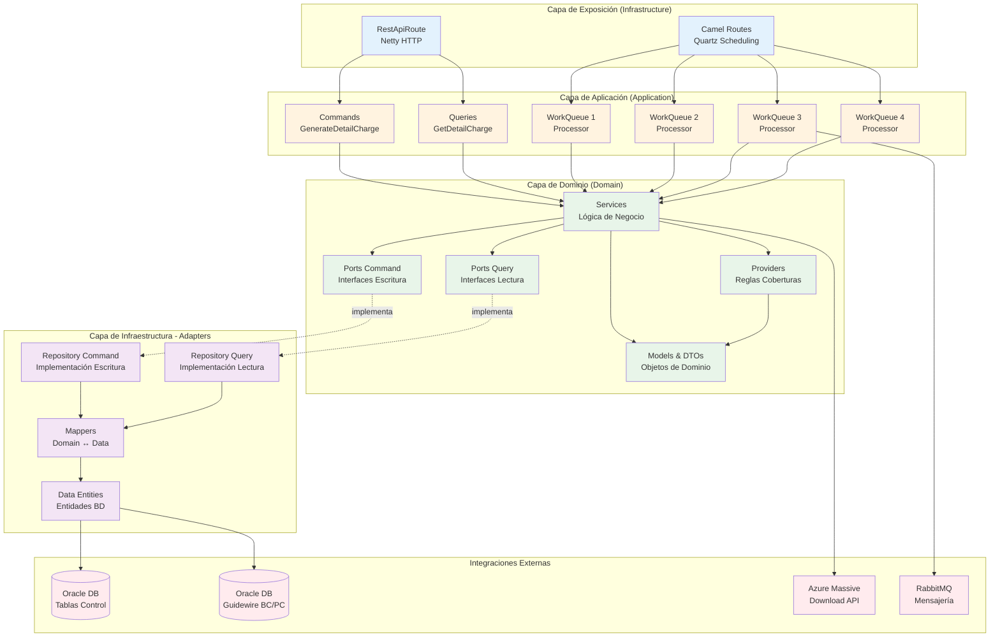

# Componente: MicroIntegradorReportesVidaGrupo

## 📋 **Overview**

### Propósito

El MicroIntegradorReportesVidaGrupo es un microservicio especializado construido sobre Apache Camel que se encarga de **generar reportes masivos para pólizas de Vida Grupo**. Actualmente implementa la generación de **reportes detallados de cobro** para facturas colectivas, pero está diseñado con una **arquitectura extensible** que permite agregar nuevos tipos de reportes en el futuro sin afectar la funcionalidad existente.

El componente gestiona la construcción asíncrona de archivos de reporte que pueden contener desde miles hasta millones de registros, utilizando un patrón de work queues programadas para procesar grandes volúmenes de datos de forma eficiente.

**Visión de Extensibilidad:**
- 📊 **Actual**: Reporte de detalle de cobro (`detailcharge`)
- 🔮 **Futuro**: Diseñado para soportar múltiples tipos de reportes en paralelo (ej: reportes de siniestros, reportes de renovación, reportes de auditoría, etc.)

### Contexto de Negocio

Dentro del ecosistema de Seguros Sura - Vida Grupo, este microservicio sirve como puente crítico entre **BillingCenter** y la infraestructura de generación de archivos en **Azure (Massive Download API)**. Los reportes de detalle de cobro son documentos esenciales que contienen información granular de cada asegurado dentro de una factura colectiva, incluyendo coberturas, primas, valores asegurados y demás información regulatoria necesaria para clientes corporativos.

Los productos soportados son:
- **Vida Grupo Integral**
- **Deudores**
- **Docentes**  
- **Condiciones de Uso**

### Responsabilidades Principales

- **Generación de Reportes Masivos**: Motor extensible para construcción de diferentes tipos de reportes mediante procesamiento asíncrono
- **Detalle de Cobro (Implementado)**: Generar reportes detallados de cobro para facturas colectivas mediante work queues distribuidas
- **Gestión de Volúmenes Masivos**: Procesar eficientemente reportes con millones de registros utilizando insert-select optimizados
- **Integración con Azure Massive Download**: Comunicarse con la API de Azure para envío de bloques, cabeceras y cierre de archivos
- **Consulta de Estado**: Proporcionar endpoints REST para solicitar generación y consultar estado/descarga de reportes
- **Persistencia y Limpieza**: Mantener tablas de control de generación de reportes y limpieza automática de registros antiguos
- **Mensajería Asíncrona**: Notificar cambios de estado a aplicaciones externas vía RabbitMQ
- **Extensibilidad Futura**: Arquitectura preparada para agregar nuevos tipos de reportes sin modificar código existente

### Ubicación

- **Repositorio**: MetodoCeibaSura
- **Ruta**: `/MicroIntegradorReportesVidaGrupo`
- **Tipo**: Microservicio de Reportes (Apache Camel)
- **Módulos Actuales**: `detailcharge` (Detalle de Cobro)
- **Módulos Futuros**: Diseñado para soportar múltiples tipos de reportes

---

## 🏗️ **Architecture**

### Stack Tecnológico

- **Lenguaje**: Java 17
- **Framework**: Apache Camel 3.20.0
- **Build Tool**: Gradle 6.9.2
- **Base de Datos**: Oracle Database (JDBC 19.8.0.0)
- **Message Broker**: RabbitMQ
- **Containerización**: Docker
- **Logging**: Log4j2 + SLF4J 1.7.36 + Splunk Integration
- **Testing**: JUnit 4.13.2, Mockito 4.11.0, Jacoco (85%+ cobertura)
- **Seguridad**: OWASP Dependency Check
- **Mutation Testing**: PIT 1.15.8
- **Calidad de Código**: 124+ pruebas unitarias con cobertura superior al 85%

### Patrones de Diseño y Arquitectónicos

El componente implementa una arquitectura basada en **patrones empresariales de integración** combinados con **arquitectura hexagonal** (ports & adapters) con una clara separación de responsabilidades:

#### Patrones Arquitectónicos

- **Hexagonal Architecture (Ports & Adapters)**
  - Separación estricta en 3 capas: Application, Domain, Infrastructure
  - Domain puro sin dependencias de frameworks
  - Inversión de dependencias mediante ports (interfaces en Domain, implementaciones en Infrastructure)
  - Facilita testing con 85%+ cobertura mediante aislamiento de capas

- **Event-Driven Architecture (EDA)**
  - Comunicación asíncrona mediante RabbitMQ
  - Publicación de eventos de cambio de estado (WorkQueue 3)
  - Desacoplamiento entre productores y consumidores de eventos

- **Modular Architecture**
  - Organización por tipo de reporte (`detailcharge` actual, futuros módulos independientes)
  - Cada módulo tiene su propio conjunto completo de capas (Application/Domain/Infrastructure)
  - Principio Open/Closed: abierto para extensión, cerrado para modificación

#### Patrones de Diseño

- **CQRS (Command Query Responsibility Segregation)**
  - Separación clara de Commands (escritura) y Queries (lectura) en capa de aplicación
  - Ports separados por responsabilidad: `command/` y `query/` en capa de dominio
  - Optimización independiente de operaciones de lectura vs escritura

- **Repository Pattern**
  - Abstracción del acceso a datos mediante interfaces (ports) en Domain
  - Implementaciones concretas en Infrastructure (adapters)
  - Aislamiento de la lógica de persistencia

- **Scheduled Job Pattern (con Quartz)**
  - 4 procesos programados independientes (WorkQueues 1-4) ejecutados por Quartz Scheduler
  - WorkQueue 1: Ejecución horaria (consulta datos y creación de cabecera)
  - WorkQueue 2: Ejecución horaria (envío de bloques a Azure)
  - WorkQueue 3: Ejecución horaria (cierre de archivo y notificación)
  - WorkQueue 4: Ejecución diaria (limpieza de registros antiguos)
  - Procesamiento batch con volúmenes configurables (2,000-10,000 registros)

- **Batch Processing Pattern**
  - Procesamiento por lotes de grandes volúmenes (miles a millones de registros)
  - WorkQueue 2 divide el procesamiento en bloques configurables
  - Optimización de memoria y throughput mediante paginación

- **Competing Consumers Pattern**
  - Múltiples WorkQueues procesando independientemente según estado
  - Mecanismo de lock optimista para evitar procesamiento concurrente del mismo registro
  - Cada WorkQueue consume trabajos según criterios específicos (estado, lock)

- **Enterprise Integration Patterns (Apache Camel)**
  - **Processor Pattern**: Lógica de negocio encapsulada en procesadores reutilizables
  - **Route Pattern**: Definición declarativa de flujos de integración
  - **Content Enricher**: Enriquecimiento de datos desde múltiples fuentes (BC, PC, Azure)
  - **Message Translator**: Transformación de formatos (Domain ↔ Data, JSON ↔ Objetos)

- **Service Layer Pattern**
  - Servicios de dominio que orquestan lógica de negocio compleja
  - Reutilización de reglas de negocio entre diferentes casos de uso
  - Coordinación de múltiples repositories y providers

- **Provider Pattern**
  - Proveedores especializados que encapsulan reglas de negocio específicas
  - Ejemplo: Providers de cálculo de coberturas según producto (Vida Grupo Integral, Deudores, etc.)
  - Inyección de dependencias para facilitar testing

**Justificación de la Arquitectura**: 

La combinación de **Scheduled Job Pattern** (Quartz) con **Batch Processing** permite gestionar el procesamiento masivo de datos sin afectar el rendimiento del sistema, ejecutando trabajos en momentos específicos con volúmenes controlados. La **arquitectura hexagonal** estricta con **diseño modular** facilita testing (85%+ cobertura), mantenibilidad a largo plazo y **extensibilidad** para agregar nuevos tipos de reportes sin modificar código existente. El uso de **CQRS** optimiza las operaciones de lectura y escritura de forma independiente, mientras que **EDA** permite desacoplamiento total entre el microservicio y sus consumidores.

### Estructura del Código

**Organización por Capas Hexagonales y Módulos de Negocio:**

El proyecto está estructurado para soportar **múltiples tipos de reportes** de forma modular. Cada tipo de reporte tiene su propio conjunto completo de capas (Application/Domain/Infrastructure), permitiendo evolución independiente sin acoplamiento.

**Estructura Actual (Detalle de Cobro implementado):**

```
MicroIntegradorReportesVidaGrupo/
├── src/
│   ├── main/
│   │   ├── java/com/sura/mi/reportes/vidagrupo/
│   │   │   ├── MicrointegratorMain.java          # Punto de entrada principal
│   │   │   │
│   │   │   ├── application/                      # 🎯 CAPA DE APLICACIÓN
│   │   │   │   ├── common/                       # Utilidades compartidas de aplicación
│   │   │   │   ├── detailcharge/                 # ✅ MÓDULO: Detalle de Cobro (ACTUAL)
│   │   │   │   │   ├── command/                  # Comandos (escritura)
│   │   │   │   │   │   └── GenerateDetailChargeProcessor.java
│   │   │   │   │   ├── query/                    # Consultas (lectura)
│   │   │   │   │   │   └── GetDetailChargeProcessor.java
│   │   │   │   │   └── workqueue/                # Procesadores Work Queues
│   │   │   │   │       ├── WorkQueue1Processor.java
│   │   │   │   │       ├── WorkQueue2Processor.java
│   │   │   │   │       ├── WorkQueue3Processor.java
│   │   │   │   │       └── WorkQueue4Processor.java
│   │   │   │   └── [futurereport]/               # 🔮 ESPACIO: Nuevos tipos de reportes
│   │   │   │       ├── command/                  # Comandos del nuevo reporte
│   │   │   │       ├── query/                    # Queries del nuevo reporte
│   │   │   │       └── workqueue/                # Work queues específicas
│   │   │   │
│   │   │   ├── domain/                           # 🧠 CAPA DE DOMINIO
│   │   │   │   ├── common/                       # Elementos compartidos de dominio
│   │   │   │   │   ├── constant/                 # Constantes globales
│   │   │   │   │   ├── exception/                # Excepciones base
│   │   │   │   │   └── util/                     # Utilidades compartidas
│   │   │   │   ├── detailcharge/                 # ✅ MÓDULO: Dominio Detalle Cobro
│   │   │   │   │   ├── dto/                      # Data Transfer Objects
│   │   │   │   │   ├── enums/                    # Enumeraciones de negocio
│   │   │   │   │   ├── model/                    # Modelos de dominio
│   │   │   │   │   ├── ports/                    # Interfaces (Puertos)
│   │   │   │   │   │   ├── command/              # Puertos de escritura
│   │   │   │   │   │   └── query/                # Puertos de lectura
│   │   │   │   │   ├── provider/                 # Proveedores de reglas
│   │   │   │   │   ├── service/                  # Servicios de dominio
│   │   │   │   │   └── util/                     # Utilidades específicas
│   │   │   │   └── [futurereport]/               # 🔮 ESPACIO: Dominio nuevo reporte
│   │   │   │       ├── dto/                      # DTOs específicos
│   │   │   │       ├── model/                    # Modelos del nuevo reporte
│   │   │   │       ├── ports/                    # Puertos del nuevo reporte
│   │   │   │       └── service/                  # Servicios del nuevo reporte
│   │   │   │
│   │   │   └── infrastructure/                   # 🔧 CAPA DE INFRAESTRUCTURA
│   │   │       ├── common/                       # Configuración común (DB, Camel, etc)
│   │   │       ├── detailcharge/                 # ✅ MÓDULO: Infra Detalle Cobro
│   │   │       │   ├── adapter/                  # Adaptadores (hexagonal)
│   │   │       │   │   ├── data/                 # Entidades de BD
│   │   │       │   │   ├── mapper/               # Mappers Domain ↔ Data
│   │   │       │   │   ├── repository/           # Implementación de ports
│   │   │       │   │   │   ├── command/          # Repos de escritura
│   │   │       │   │   │   └── query/            # Repos de lectura
│   │   │       │   │   └── util/                 # Utilidades de BD
│   │   │       │   └── route/                    # Rutas Apache Camel
│   │   │       │       ├── CommonRoute.java      # Rutas comunes
│   │   │       │       ├── RestApiRoute.java     # API REST
│   │   │       │       └── workqueue/            # Rutas WQ (1-4)
│   │   │       └── [futurereport]/               # 🔮 ESPACIO: Infra nuevo reporte
│   │   │           ├── adapter/                  # Adaptadores específicos
│   │   │           │   ├── data/                 # Entidades específicas
│   │   │           │   └── repository/           # Repositorios específicos
│   │   │           └── route/                    # Rutas específicas
│   │   │
│   │   └── resources/
│   │       ├── log4j2.yml                        # Configuración logging
│   │       ├── properties/
│   │       │   └── microintegrator.properties    # Config del microservicio
│   │       └── sql/                              # Scripts SQL
│   │           ├── CREATE.sql                    # DDL de tablas
│   │           ├── script_billing.sql            # Consultas BillingCenter
│   │           ├── script_policy.sql             # Consultas PolicyCenter
│   │           └── script_bc_pc.sql              # Consultas combinadas
│   │
│   └── test/                                      # 🧪 PRUEBAS UNITARIAS (124+ tests)
│       ├── java/com/sura/mi/reportes/vidagrupo/
│       │   ├── application/                      # Tests de aplicación
│       │   │   ├── detailcharge/                 # ✅ Tests detalle cobro
│       │   │   │   ├── command/                  # Tests de comandos
│       │   │   │   ├── query/                    # Tests de queries
│       │   │   │   └── workqueue/                # Tests de work queues
│       │   │   └── [futurereport]/               # 🔮 Tests nuevo reporte
│       │   ├── domain/                           # Tests de dominio
│       │   │   ├── detailcharge/                 # ✅ Tests dominio detalle cobro
│       │   │   │   ├── service/                  # Tests de servicios
│       │   │   │   ├── provider/                 # Tests de providers
│       │   │   │   └── util/                     # Tests de utilidades
│       │   │   └── [futurereport]/               # 🔮 Tests dominio nuevo reporte
│       │   └── infrastructure/                   # Tests de infraestructura
│       │       ├── detailcharge/                 # ✅ Tests infra detalle cobro
│       │       │   ├── adapter/                  # Tests de adaptadores
│       │       │   └── route/                    # Tests de rutas
│       │       └── [futurereport]/               # 🔮 Tests infra nuevo reporte
│       └── resources/                            # Recursos de test
│
├── build.gradle                                   # Configuración de Gradle
├── gradle.properties                              # Versiones centralizadas
├── Dockerfile                                     # Imagen Docker multi-stage
└── README.md                                      # Documentación básica
```

**Características de la Arquitectura:**

- ✅ **Separación estricta de capas**: Application → Domain ← Infrastructure
- ✅ **Dependencias unidireccionales**: Infrastructure y Application dependen de Domain (nunca al revés)
- ✅ **Domain puro**: Sin dependencias de frameworks en la capa de dominio
- ✅ **CQRS**: Commands y Queries separados tanto en application como en ports
- ✅ **Alta testabilidad**: 85%+ de cobertura con 124+ pruebas unitarias
- ✅ **Inversión de dependencias**: Infrastructure implementa interfaces definidas en Domain (ports)
- ✅ **Modularidad por tipo de reporte**: Cada reporte (`detailcharge`, futuros) es un módulo independiente
- ✅ **Extensibilidad sin modificación**: Nuevos reportes se agregan como módulos paralelos sin tocar código existente
- ✅ **Common layers**: Elementos compartidos (common/) disponibles para todos los módulos

**Estrategia de Extensión para Nuevos Reportes:**

Cuando se requiera agregar un nuevo tipo de reporte (ej: `claimreport`, `renewalreport`, `auditreport`):

1. **Application Layer**: Crear `application/[nuevoreporte]/` con sus Commands, Queries y WorkQueues
2. **Domain Layer**: Crear `domain/[nuevoreporte]/` con Models, Services, Ports y Providers específicos
3. **Infrastructure Layer**: Crear `infrastructure/[nuevoreporte]/` con Adapters, Repositories y Routes
4. **Tests**: Replicar estructura en `test/` para el nuevo módulo
5. **Sin impacto**: El módulo `detailcharge` existente NO se modifica
6. **Reutilización**: Usar elementos de `common/` cuando aplique

### Diagrama Conceptual



**Leyenda del Diagrama:**
- 🔵 **Azul**: Capa de exposición (Routes & API)
- 🟠 **Naranja**: Capa de aplicación (Use Cases)
- 🟢 **Verde**: Capa de dominio (Business Logic)
- 🟣 **Púrpura**: Capa de infraestructura (Technical Details)
- 🔴 **Rojo**: Sistemas externos

**Principios Arquitectónicos:**
- Las flechas sólidas (→) representan dependencias directas
- Las flechas punteadas (-.→) representan implementaciones de interfaces
- El dominio NO depende de capas externas (inversión de dependencias)
- Infrastructure y Application dependen de Domain
- Separación clara entre Commands (escritura) y Queries (lectura)

### Diseño de Extensibilidad Modular

#### Visión General

El microservicio está diseñado siguiendo el principio **Open/Closed** (abierto para extensión, cerrado para modificación). La estructura modular permite agregar nuevos tipos de reportes sin modificar el código existente de `detailcharge`.

#### Módulos Actuales vs Futuros

| Módulo             | Estado       | Descripción                                        | Ubicación en Capas                           |
| ------------------ | ------------ | -------------------------------------------------- | -------------------------------------------- |
| `detailcharge`     | ✅ Implementado | Reporte de detalle de cobro para facturas          | `*/detailcharge/*` (3 capas)                 |
| `claimreport`      | 🔮 Ejemplo Futuro | Reporte de siniestros procesados                  | `*/claimreport/*` (pendiente)                |
| `renewalreport`    | 🔮 Ejemplo Futuro | Reporte de renovaciones de pólizas                | `*/renewalreport/*` (pendiente)              |
| `auditreport`      | 🔮 Ejemplo Futuro | Reporte de auditoría de operaciones               | `*/auditreport/*` (pendiente)                |

#### Patrón de Extensión

Para agregar un nuevo tipo de reporte, se sigue este patrón consistente:

```
Nuevo Reporte: [reporttype]

1. Application Layer (Casos de Uso)
   application/[reporttype]/
   ├── command/
   │   └── Generate[ReportType]Processor.java
   ├── query/
   │   └── Get[ReportType]Processor.java
   └── workqueue/
       ├── WorkQueue1Processor.java
       └── WorkQueue2Processor.java

2. Domain Layer (Lógica de Negocio)
   domain/[reporttype]/
   ├── dto/
   ├── enums/
   ├── model/
   ├── ports/
   │   ├── command/
   │   └── query/
   ├── provider/
   ├── service/
   └── util/

3. Infrastructure Layer (Detalles Técnicos)
   infrastructure/[reporttype]/
   ├── adapter/
   │   ├── data/
   │   ├── mapper/
   │   └── repository/
   │       ├── command/
   │       └── query/
   └── route/
       ├── RestApiRoute.java
       └── workqueue/

4. Test Layer (Pruebas)
   test/.../[reporttype]/
   ├── [mismo patrón de capas]
   └── [tests para cada componente]
```

#### Beneficios del Diseño Modular

1. **Aislamiento de Cambios**: Modificaciones en un tipo de reporte no afectan a otros
2. **Evolución Independiente**: Cada módulo puede evolucionar a su propio ritmo
3. **Testing Aislado**: Tests de un módulo no interfieren con otros
4. **Deployment Seguro**: Menor riesgo al agregar funcionalidad nueva
5. **Mantenibilidad**: Código organizado por contexto de negocio claro
6. **Reutilización**: Elementos comunes en `common/` disponibles para todos
7. **Escalabilidad**: Equipos diferentes pueden trabajar en módulos diferentes

#### Elementos Compartidos (`common/`)

Algunos componentes son compartidos entre todos los módulos:

- **`application/common/`**: Utilidades de procesamiento, validadores genéricos
- **`domain/common/`**: Excepciones base, constantes del sistema, utilidades
- **`infrastructure/common/`**: Configuración de BD, Camel, RabbitMQ, Azure API

#### Ejemplo: Cómo Agregar un Nuevo Reporte de Siniestros

Supongamos que necesitamos agregar un reporte de siniestros (`claimreport`):

**Paso 1: Domain Layer** (Lógica de Negocio Pura)
```java
// domain/claimreport/model/ClaimReportData.java
// domain/claimreport/service/ClaimReportService.java
// domain/claimreport/ports/command/ClaimReportCommandPort.java
// domain/claimreport/ports/query/ClaimReportQueryPort.java
```

**Paso 2: Application Layer** (Casos de Uso)
```java
// application/claimreport/command/GenerateClaimReportProcessor.java
// application/claimreport/query/GetClaimReportProcessor.java
// application/claimreport/workqueue/ClaimWorkQueue1Processor.java
```

**Paso 3: Infrastructure Layer** (Adaptadores)
```java
// infrastructure/claimreport/adapter/repository/ClaimReportCommandRepository.java
// infrastructure/claimreport/route/ClaimReportRestApiRoute.java
```

**Paso 4: Tests**
```java
// test/.../claimreport/service/ClaimReportServiceTest.java
// test/.../claimreport/command/GenerateClaimReportProcessorTest.java
```

**Resultado**: El módulo `detailcharge` NO se toca, permanece intacto y funcional.

#### Diagrama de Arquitectura Multi-Módulo (Visión Futura)

```mermaid
graph TB
    subgraph "Microservicio de Reportes - Vista Modular"
        subgraph "Common Layer - Compartido"
            COMMON_APP[Common Application]
            COMMON_DOM[Common Domain]
            COMMON_INF[Common Infrastructure]
        end
        
        subgraph "Módulo: DetailCharge - ✅ ACTUAL"
            DC_APP[Application<br/>detailcharge]
            DC_DOM[Domain<br/>detailcharge]
            DC_INF[Infrastructure<br/>detailcharge]
        end
        
        subgraph "Módulo: ClaimReport - 🔮 FUTURO"
            CR_APP[Application<br/>claimreport]
            CR_DOM[Domain<br/>claimreport]
            CR_INF[Infrastructure<br/>claimreport]
        end
        
        subgraph "Módulo: RenewalReport - 🔮 FUTURO"
            RR_APP[Application<br/>renewalreport]
            RR_DOM[Domain<br/>renewalreport]
            RR_INF[Infrastructure<br/>renewalreport]
        end
    end
    
    subgraph "Sistemas Externos Compartidos"
        DB[(Oracle DB)]
        AZURE[Azure API]
        RABBIT[RabbitMQ]
    end
    
    %% Uso de Common
    DC_APP -.usa.-> COMMON_APP
    DC_DOM -.usa.-> COMMON_DOM
    DC_INF -.usa.-> COMMON_INF
    
    CR_APP -.usa.-> COMMON_APP
    CR_DOM -.usa.-> COMMON_DOM
    CR_INF -.usa.-> COMMON_INF
    
    RR_APP -.usa.-> COMMON_APP
    RR_DOM -.usa.-> COMMON_DOM
    RR_INF -.usa.-> COMMON_INF
    
    %% Conexiones a externos
    DC_INF --> DB
    DC_INF --> AZURE
    DC_INF --> RABBIT
    
    CR_INF -.futuro.-> DB
    CR_INF -.futuro.-> AZURE
    
    RR_INF -.futuro.-> DB
    RR_INF -.futuro.-> AZURE
    
    classDef current fill:#c8e6c9
    classDef future fill:#e1f5fe
    classDef shared fill:#fff9c4
    classDef external fill:#ffccbc
    
    class DC_APP,DC_DOM,DC_INF current
    class CR_APP,CR_DOM,CR_INF,RR_APP,RR_DOM,RR_INF future
    class COMMON_APP,COMMON_DOM,COMMON_INF shared
    class DB,AZURE,RABBIT external
```



**Beneficios Visualizados:**
- 🟢 **Verde**: Módulo actual implementado (`detailcharge`)
- 🔵 **Azul**: Módulos futuros sin implementar aún
- 🟡 **Amarillo**: Componentes compartidos (`common`)
- 🟠 **Naranja**: Sistemas externos compartidos
- Las líneas punteadas muestran uso/dependencias sin acoplamiento fuerte

---

## 🔌 **APIs**

### Endpoints Expuestos

El componente expone **2 endpoints REST** a través de Apache Camel Netty HTTP para el módulo de **Detalle de Cobro** (actualmente implementado).

**Nota de Extensibilidad**: Cuando se agreguen nuevos tipos de reportes, cada módulo expondrá sus propios endpoints siguiendo el mismo patrón de versionado y estructura REST.

#### REST Endpoints - Detalle de Cobro (Actual)

| Método | Ruta                                                   | Descripción                                             | Parámetros               | Respuesta          |
| ------ | ------------------------------------------------------ | ------------------------------------------------------- | ------------------------ | ------------------ |
| POST   | `/v1/he/invoices/{invoiceNumber}/chargedetail/report` | Solicita generación de reporte de detalle de cobro      | `{invoiceNumber}` (path) | `200 OK` / `500`   |
| GET    | `/v1/he/invoices/{invoiceNumber}/chargedetail/report` | Consulta y descarga archivo de reporte ya generado      | `{invoiceNumber}` (path) | `200 OK` / `404`   |

#### REST Endpoints - Futuros Módulos (Ejemplos)

| Método | Ruta Ejemplo                                           | Descripción                                             | Estado         |
| ------ | ------------------------------------------------------ | ------------------------------------------------------- | -------------- |
| POST   | `/v1/he/claims/{claimNumber}/claimreport/report`      | Generar reporte de siniestros                           | 🔮 Futuro      |
| GET    | `/v1/he/policies/{policyNumber}/renewalreport/report` | Consultar reporte de renovaciones                       | 🔮 Futuro      |

**Patrón de URLs**: `/v{version}/he/{contexto}/{identificador}/{tiporeporte}/report`

**Detalles de Endpoints:**

**POST - Generar Reporte**
- **Descripción**: Registra una solicitud de generación de reporte en la tabla principal con estado 1. El procesamiento real ocurre asíncronamente mediante work queues.
- **Parámetros**:
  - `invoiceNumber` (path): Número de factura colectiva
- **Headers esperados**: `autorizacion`
- **Response**:
  - `200 OK`: Solicitud registrada exitosamente
  - `500 Internal Server Error`: Error al procesar solicitud

**GET - Consultar/Descargar Reporte**
- **Descripción**: Verifica el estado del reporte y descarga el archivo desde Azure Massive Download API si está disponible (estado 4).
- **Parámetros**:
  - `invoiceNumber` (path): Número de factura colectiva
- **Headers esperados**: `autorizacion`
- **Response**:
  - `200 OK`: Archivo disponible y descargado
  - `404 Not Found`: Reporte no encontrado o aún en proceso
  - `500 Internal Server Error`: Error al procesar solicitud

#### Códigos de Error

| Código | Descripción          | Casos                                                 |
| ------ | -------------------- | ----------------------------------------------------- |
| 200    | OK                   | Operación exitosa                                     |
| 400    | Bad Request          | Parámetro invoiceNumber inválido                      |
| 401    | Unauthorized         | Header de autorización inválido/faltante             |
| 404    | Not Found            | Reporte no encontrado o aún no disponible             |
| 500    | Internal Error       | Error de BD, Azure API, o procesamiento interno       |

#### Contratos y Versionamiento

- **Estrategia de versionado**: Versionado mediante prefijo en URL (`/v1/`)
- **Versión actual**: v1
- **Breaking changes**: Cambios en URL o parámetros requerirán nueva versión (v2)

### Eventos y Mensajería

#### Eventos Publicados

| Evento                                      | Descripción                                  | Payload          | Consumidores                          |
| ------------------------------------------- | -------------------------------------------- | ---------------- | ------------------------------------- |
| `sura.seguros.vidagrupo.chargedetail.risk`  | Notificación de cambio de estado del reporte | JSON con estado  | Aplicaciones externas del ecosistema  |

**Detalles del Evento:**

- **Exchange**: `sura.seguros.vidagrupo.chargedetail.ex`
- **Routing Key**: `sura.seguros.vidagrupo.chargedetail.risk`
- **Queue**: `sura.seguros.vidagrupo.chargedetail.risk.qu`
- **Cuándo se publica**: Al completar el cierre de archivo (WorkQueue 3)
- **Propósito**: Notificar a aplicaciones externas fuera del dominio que el reporte ha cambiado de estado y está listo para descarga

#### Eventos Consumidos

| Evento                                            | Descripción                        | Origen                   | Acción                              |
| ------------------------------------------------- | ---------------------------------- | ------------------------ | ----------------------------------- |
| `sura.seguros.vidagrupo.chargedetail.risk.reply`  | Respuesta de aplicaciones externas | Aplicaciones consumidoras | Procesar confirmación de recepción  |

**Detalles del Evento Consumido:**

- **Exchange**: `sura.seguros.vidagrupo.chargedetail.ex`
- **Routing Key**: `sura.seguros.vidagrupo.chargedetail.risk.reply`
- **Queue**: `sura.seguros.vidagrupo.chargedetail.risk.reply.qu`
- **Acción**: Registrar confirmación de que la aplicación externa recibió la notificación de cambio de estado

---

## 📦 **Dependencies**

### Dependencias Externas

#### Librerías Críticas

| Librería                             | Versión     | Propósito                                  | Criticidad     |
| ------------------------------------ | ----------- | ------------------------------------------ | -------------- |
| Apache Camel (Suite completa)        | 3.20.0      | Framework de integración y orquestación    | 🔴 Crítica     |
| Oracle JDBC Driver (ojdbc8)          | 19.8.0.0    | Conectividad con bases de datos Oracle     | 🔴 Crítica     |
| Quartz Scheduler                     | 2.3.2       | Scheduling de work queues programadas      | 🔴 Crítica     |
| Apache Commons DBCP2                 | 2.9.0       | Pool de conexiones de BD                   | 🔴 Crítica     |
| Jackson Datatype JDK8                | 2.13.3      | Serialización/deserialización JSON         | 🟡 Importante  |
| OkHttp                               | 4.10.0      | Cliente HTTP para Azure API                | 🟡 Importante  |
| ms-lib-seus                          | 1.0.1       | Librería interna de Seguros Sura           | 🟡 Importante  |
| Lombok                               | 1.18.26     | Reducción de boilerplate                   | 🟢 Opcional    |
| SLF4J + Log4j2                       | 1.7.36      | Logging y observabilidad                   | 🟡 Importante  |
| Splunk Java Logging                  | 1.7.3       | Envío de logs a Splunk                     | 🟢 Opcional    |

#### Servicios Externos

- **Azure Massive Download API**: API de Microsoft Azure para generación y almacenamiento de archivos masivos. Se utiliza para enviar bloques de datos, cerrar archivos y consultar disponibilidad.
  - **Base URL**: `https://labapicorevidagrupo.suramericana.com/massive-download`
  - **Criticidad**: 🔴 Crítica (sin este servicio no se pueden generar reportes)
  
- **Splunk (Holmes Lab)**: Plataforma de observabilidad para centralización de logs
  - **URL**: `http://holmeslab.suramericana.com.co:9088/`
  - **Criticidad**: 🟢 Opcional (útil para troubleshooting)

### Dependencias Internas

#### Componentes del Sistema

- **BillingCenter (Guidewire)**: Sistema core de facturación. Se consulta su base de datos Oracle para obtener información de facturas colectivas, items de factura, coberturas y períodos.
- **PolicyCenter (Guidewire)**: Sistema core de pólizas. Se consulta su base de datos Oracle para obtener información de asegurados, pólizas maestras, productos y condiciones.

#### Bases de Datos

- **Oracle DB (Tablas Control)**: Base de datos específica del microservicio que mantiene:
  - Tabla principal de control de generación de reportes
  - Tablas de detalle con información de asegurados procesados
  - Estados y trazabilidad de procesamiento
  
- **Oracle DB (Guidewire)**: Base de datos compartida de BillingCenter y PolicyCenter
  - Consultas read-only a tablas de facturación y pólizas
  - Sin modificaciones directas

### Quién Usa Este Componente

#### Consumidores Directos

- **Aplicaciones Web de Clientes Corporativos**: Solicitan y descargan reportes de detalle de cobro mediante API REST
- **Sistemas de Notificación Externa**: Reciben eventos de cambio de estado vía RabbitMQ

#### Consumidores Indirectos

- **Clientes Finales (Empresas Aseguradas)**: Acceden a reportes generados a través de portales web

### Gestión de Dependencias

```bash
# Actualizar dependencias
./gradlew build --refresh-dependencies

# Verificación de vulnerabilidades (OWASP)
./gradlew dependencyCheckAnalyze

# Auditoría de dependencias
./gradlew dependencies

# Reporte de versiones desactualizadas
./gradlew dependencyUpdates
```

---

## 🎯 **Calidad de Código**

### Métricas de Calidad

| Métrica                    | Valor Actual | Objetivo | Estado |
| -------------------------- | ------------ | -------- | ------ |
| Cobertura de Tests         | 85%+         | ≥ 85%    | ✅ Cumple |
| Pruebas Unitarias          | 124+         | -        | ✅ Excelente |
| Mutation Score (PIT)       | Por definir  | ≥ 70%    | ⚠️ Pendiente |
| Vulnerabilidades Críticas  | 0            | 0        | ✅ Cumple |
| Deuda Técnica              | Baja         | Baja     | ✅ Cumple |

### Estrategia de Testing

#### Distribución de Tests por Capa

- **Capa de Aplicación** (Commands, Queries, WorkQueues)
  - Tests de procesadores
  - Validación de orquestación
  - Manejo de excepciones
  
- **Capa de Dominio** (Services, Providers, Utils)
  - Tests de lógica de negocio
  - Validación de reglas de coberturas
  - Tests de utilidades y transformaciones
  
- **Capa de Infraestructura** (Adapters, Routes, Repositories)
  - Tests de adaptadores de BD
  - Tests de rutas de Camel
  - Tests de mappers

#### Prácticas de Testing

- ✅ **Unit Testing**: Pruebas unitarias aisladas con Mockito
- ✅ **Test Coverage**: Jacoco configurado para medir cobertura
- ✅ **Mutation Testing**: PIT para validar calidad de tests
- ✅ **Test Naming**: Convenciones claras (given_when_then o should_when)
- ✅ **Mock Strategy**: Uso de mocks para dependencias externas (BD, APIs, RabbitMQ)
- ✅ **Test Data Builders**: Builders para crear objetos de test complejos

### Herramientas de Calidad

| Herramienta           | Propósito                              | Comando                          |
| --------------------- | -------------------------------------- | -------------------------------- |
| Jacoco                | Cobertura de código                    | `./gradlew jacocoTestReport`     |
| PIT                   | Mutation testing                       | `./gradlew pitest`               |
| OWASP Dependency Check| Análisis de vulnerabilidades          | `./gradlew dependencyCheckAnalyze` |
| JUnit 4.13.2          | Framework de testing                   | `./gradlew test`                 |
| Mockito 4.11.0        | Framework de mocking                   | -                                |

### Quality Gates

Antes de cada despliegue, se deben cumplir los siguientes criterios:

1. ✅ Todas las pruebas unitarias pasan
2. ✅ Cobertura de código ≥ 85%
3. ✅ Sin vulnerabilidades críticas (OWASP)
4. ✅ Build exitoso sin errores de compilación
5. ⚠️ Mutation score ≥ 70% (en evaluación)

---

## 🚀 **Deployment**

### Configuración de Entorno

#### Variables de Entorno Requeridas

| Variable                                   | Descripción                                    | Ejemplo                                      | Requerida   |
| ------------------------------------------ | ---------------------------------------------- | -------------------------------------------- | ----------- |
| `ARTIFACTORY_TOKEN`                        | Token de acceso a Artifactory Sura             | `<token_secreto>`                            | ✅ Sí       |
| `oracle.jdbc.url`                          | URL JDBC de la base de datos Oracle            | `jdbc:oracle:thin:@//host:1537/LABGWDWH`     | ✅ Sí       |
| `oracle.jdbc.username`                     | Usuario de base de datos                       | `ADM_VIDAGRUPOREPORTES`                      | ✅ Sí       |
| `oracle.jdbc.password`                     | Contraseña de base de datos                    | `<password_secreto>`                         | ✅ Sí       |
| `spring.rabbitmq.producer.host`            | Host de RabbitMQ para productor                | `msglab.suramericana.com.co`                 | ✅ Sí       |
| `spring.rabbitmq.producer.username`        | Usuario RabbitMQ productor                     | `seguros.core.billing.usr`                   | ✅ Sí       |
| `spring.rabbitmq.producer.password`        | Contraseña RabbitMQ productor                  | `<password_secreto>`                         | ✅ Sí       |
| `spring.rabbitmq.consumer.host`            | Host de RabbitMQ para consumidor               | `msglab.suramericana.com.co`                 | ✅ Sí       |
| `spring.rabbitmq.consumer.username`        | Usuario RabbitMQ consumidor                    | `seguros.core.policy.usr`                    | ✅ Sí       |
| `spring.rabbitmq.consumer.password`        | Contraseña RabbitMQ consumidor                 | `<password_secreto>`                         | ✅ Sí       |
| `api.massive.download.url`                 | URL base de Azure Massive Download API         | `https://labapicorevidagrupo.suramericana...` | ✅ Sí       |
| `api.massive.download.authorization`       | Header de autorización para Azure API          | `Basic <base64_credentials>`                 | ✅ Sí       |
| `api.massive.download.subscription.key`    | Subscription key de Azure                      | `f8b7a06d70904951b04f35f433f038c6`           | ✅ Sí       |
| `server.port`                              | Puerto HTTP del microservicio                  | `9000`                                       | ⚠️ Opcional |
| `autorizacion`                             | Password para validación de endpoints          | `<password_secreto>`                         | ✅ Sí       |

#### Archivo .env de Ejemplo

```bash
# Configuración de desarrollo
ARTIFACTORY_TOKEN=<tu_token_aqui>
environment=development
autorizacion=dev_password

# Base de Datos Oracle
oracle.jdbc.url=jdbc:oracle:thin:@//dbdevserver.com:1537/DEVDB
oracle.jdbc.username=DEV_VIDAGRUPOREPORTES
oracle.jdbc.password=dev_password
oracle.jdbc.initialSize=5
oracle.jdbc.maxTotal=10

# RabbitMQ - Productor
spring.rabbitmq.producer.host=devrabbit.com
spring.rabbitmq.producer.port=5672
spring.rabbitmq.producer.username=dev_billing_usr
spring.rabbitmq.producer.password=dev_password
spring.rabbitmq.producer.virtual-host=dev.vh
spring.rabbitmq.producer.exchange=sura.seguros.vidagrupo.chargedetail.ex
spring.rabbitmq.producer.routingKey=sura.seguros.vidagrupo.chargedetail.risk
spring.rabbitmq.producer.queue=sura.seguros.vidagrupo.chargedetail.risk.qu

# RabbitMQ - Consumidor
spring.rabbitmq.consumer.host=devrabbit.com
spring.rabbitmq.consumer.port=5672
spring.rabbitmq.consumer.username=dev_policy_usr
spring.rabbitmq.consumer.password=dev_password
spring.rabbitmq.consumer.virtual-host=dev.vh
spring.rabbitmq.consumer.exchange=sura.seguros.vidagrupo.chargedetail.ex
spring.rabbitmq.consumer.routingKey=sura.seguros.vidagrupo.chargedetail.risk.reply
spring.rabbitmq.consumer.queue=sura.seguros.vidagrupo.chargedetail.risk.reply.qu

# Azure API
api.massive.download.url=https://devapicorevidagrupo.suramericana.com/massive-download
api.massive.download.authorization=Basic <base64_dev_credentials>
api.massive.download.subscription.key=dev_subscription_key

# Servidor
server.name=vidagruporeportes-mi
server.port=9000
```

### Comandos de Desarrollo

#### Setup Inicial

```bash
# Instalación de dependencias
./gradlew clean build

# Configuración inicial (verificar properties)
cat src/main/resources/properties/microintegrator.properties

# Verificación de setup
./gradlew dependencies --configuration runtimeClasspath
```

#### Compilación

```bash
# Build de desarrollo (sin tests)
./gradlew clean build -x test

# Build de producción (con tests y análisis)
./gradlew clean build

# Build de JAR ejecutable con Shadow
./gradlew shadowJar

# Verificación de build
ls -lh build/libs/
```

#### Testing

```bash
# Tests unitarios (124+ tests)
./gradlew test

# Tests de integración (si existen)
./gradlew integrationTest

# Coverage (Jacoco) - Genera reporte de cobertura
./gradlew jacocoTestReport
# Reporte en: build/reports/jacocoHtml/index.html
# Cobertura actual: 85%+

# Verificar umbral de cobertura
./gradlew jacocoTestCoverageVerification

# Mutation Testing (PIT) - Calidad de tests
./gradlew pitest
# Reporte en: target/pit-reports/pitest/index.html

# Linting y análisis de seguridad
./gradlew dependencyCheckAnalyze
# Reporte en: target/dependencyCheck/dependency-check-report.json

# Ejecutar todos los análisis de calidad
./gradlew test jacocoTestReport pitest dependencyCheckAnalyze
```

#### Ejecución Local

```bash
# Modo desarrollo (usando Gradle)
./gradlew run

# Modo producción local (usando JAR)
java -jar build/libs/MicroIntegradorReportesVidaGrupo-1.0-SNAPSHOT-all.jar

# Debug mode (puerto 5005)
java -agentlib:jdwp=transport=dt_socket,server=y,suspend=n,address=*:5005 \
     -jar build/libs/MicroIntegradorReportesVidaGrupo-1.0-SNAPSHOT-all.jar

# Verificar health
curl http://localhost:9000/actuator/health
```

### Pipeline de Despliegue

#### Prerequisitos de Infraestructura

- **Oracle Database**: Instancia configurada con tablas de control creadas (ver `CREATE.sql`)
- **RabbitMQ**: Exchange, queues y bindings configurados según especificación
- **Azure Massive Download API**: Acceso configurado con subscription key válida
- **Splunk (Opcional)**: Configuración de logging centralizado
- **Runtime Java 17**: JRE/JDK instalado en el ambiente de ejecución

#### Etapas del Pipeline

1. **Build Stage**
   - Compilación con Gradle
   - Ejecución de tests unitarios
   - Generación de reportes de cobertura (Jacoco)
   - Análisis de vulnerabilidades (OWASP)
   - Comandos: `./gradlew clean build jacocoTestReport dependencyCheckAnalyze`

2. **Test Stage**
   - Tests de integración (si existen)
   - Mutation testing (PIT)
   - Validación de umbrales de cobertura (mínimo 85%)
   - Verificación de calidad de código
   - Comandos: `./gradlew integrationTest pitest jacocoTestCoverageVerification`

3. **Package Stage**
   - Generación de Shadow JAR (fat JAR)
   - Construcción de imagen Docker multi-stage
   - Push a registry de contenedores
   - Comandos: `./gradlew shadowJar && docker build -t vidagruporeportes-mi:${VERSION} .`

4. **Deploy Stage**
   - Despliegue a Kubernetes/OpenShift
   - Configuración de variables de entorno por ambiente
   - Health checks post-despliegue
   - Comandos: `kubectl apply -f k8s/deployment-${ENV}.yaml`

#### Variables de Entorno por Ambiente

**Desarrollo:**

```bash
environment=development
oracle.jdbc.url=jdbc:oracle:thin:@//devdb:1537/DEVDB
spring.rabbitmq.producer.host=devrabbit.com
api.massive.download.url=https://devapi.suramericana.com/massive-download
server.port=9000
```

**Staging:**

```bash
environment=staging
oracle.jdbc.url=jdbc:oracle:thin:@//stgdb:1537/STGDB
spring.rabbitmq.producer.host=stgrabbit.com
api.massive.download.url=https://stgapi.suramericana.com/massive-download
server.port=9000
```

**Producción:**

```bash
environment=production
oracle.jdbc.url=jdbc:oracle:thin:@//prddb:1537/PRDDB
spring.rabbitmq.producer.host=prdrabbit.com
api.massive.download.url=https://prdapi.suramericana.com/massive-download
server.port=9000
```

### Buenas Prácticas de Despliegue

- **Health Checks Configurados**: Implementar endpoints de health para verificación automática de estado
- **Graceful Shutdown**: Configurar tiempos adecuados de terminación para completar work queues en proceso
- **Connection Pooling**: Validar configuración de pools de BD (initialSize, maxTotal, timeouts) según carga esperada
- **Resource Limits**: Establecer límites de CPU y memoria en Kubernetes basados en perfil de uso
- **Secrets Management**: Nunca commitear credenciales; usar secrets de Kubernetes o vault externo
- **Monitoring Proactivo**: Configurar alertas en Splunk para errores críticos y degradación de rendimiento
- **Quality Gates**: Validar cobertura de tests (mínimo 85%) y mutation score antes de despliegue
- **Code Review**: Revisar cambios que afecten la arquitectura hexagonal para mantener separación de capas

### Pasos Manuales

**Despliegue Inicial (Primera vez):**

1. **Crear Tablas de Control**: Ejecutar script `src/main/resources/sql/CREATE.sql` en la base de datos Oracle de control
2. **Configurar RabbitMQ**: Crear exchange, queues y bindings según especificación de mensajería
3. **Validar Conectividad Azure API**: Verificar acceso a Massive Download API con subscription key
4. **Verificar Acceso a Guidewire DBs**: Validar permisos read-only en BillingCenter y PolicyCenter

**Despliegues Posteriores:** Todo el proceso está automatizado vía pipeline CI/CD

### Rollback

```bash
# Comando para rollback en Kubernetes
kubectl rollout undo deployment/vidagruporeportes-mi -n <namespace>

# Verificación post-rollback
kubectl rollout status deployment/vidagruporeportes-mi -n <namespace>

# Verificar logs
kubectl logs -f deployment/vidagruporeportes-mi -n <namespace>

# Health check manual
curl http://<service-url>:9000/actuator/health
```

### Monitoreo Post-Despliegue

- **Health Checks**: 
  - Endpoint: `http://<host>:9000/actuator/health`
  - Frecuencia: Cada 30 segundos
  
- **Logs**: 
  - Comando: `kubectl logs -f deployment/vidagruporeportes-mi -n <namespace>`
  - Splunk: `http://holmeslab.suramericana.com.co:9088/` (buscar por `source="vidagruporeportes-mi"`)
  
- **Métricas**: 
  - Verificar work queues ejecutándose según cronograma
  - Monitorear tasa de procesamiento de registros
  - Validar estados de reportes en tabla de control
  - Revisar tasa de errores en integración con Azure API

---

**📌 Esta documentación debe mantenerse actualizada con cada cambio significativo en el componente.**

## 📝 **Notas de Mantenimiento**

| Fecha      | Versión | Cambios                                                                  | Autor             |
| ---------- | ------- | ------------------------------------------------------------------------ | ----------------- |
| 2025-11-10 | 1.1     | Actualización: reestructuración hexagonal y cobertura 85%+               | Arquitecto Ceiba  |
| 2025-10-30 | 1.0     | Documentación inicial del componente                                     | Arquitecto Ceiba  |

### Changelog v1.1 (2025-11-10)

**Mejoras de Calidad:**
- ✅ Agregadas 124+ pruebas unitarias
- ✅ Cobertura de código incrementada a 85%+
- ✅ Configuración de Jacoco para reportes de cobertura
- ✅ Mutation testing con PIT configurado

**Reestructuración Arquitectónica:**
- ✅ Reorganización completa de paquetes respetando arquitectura hexagonal
- ✅ Separación estricta en 3 capas: Application, Domain, Infrastructure
- ✅ Implementación de CQRS en capa de aplicación (Commands/Queries)
- ✅ Separación de ports por responsabilidad (command/query)
- ✅ Mejora en la mantenibilidad y testabilidad del código
- ✅ **Diseño modular por tipo de reporte** (`detailcharge` como primer módulo)
- ✅ **Arquitectura extensible** preparada para agregar nuevos tipos de reportes sin modificar código existente

**Estructura de Paquetes:**
- `application/detailcharge/{command,query,workqueue}` - Casos de uso organizados
- `domain/detailcharge/{dto,enums,model,ports,provider,service,util}` - Dominio puro
- `infrastructure/detailcharge/{adapter,route}` - Detalles de implementación
- `*/common/` - Elementos compartidos entre módulos
- **Espacios reservados** para futuros módulos (`claimreport`, `renewalreport`, etc.)

**Visión de Extensibilidad:**
- El microservicio está diseñado como **plataforma de reportes** (no solo detalle de cobro)
- Cada tipo de reporte futuro será un **módulo independiente** con sus propias 3 capas
- Principio **Open/Closed**: Abierto para extensión, cerrado para modificación
- Nuevos reportes se agregan **sin tocar código existente**

---

_Documentación generada con Método Ceiba - Arquitecto_
