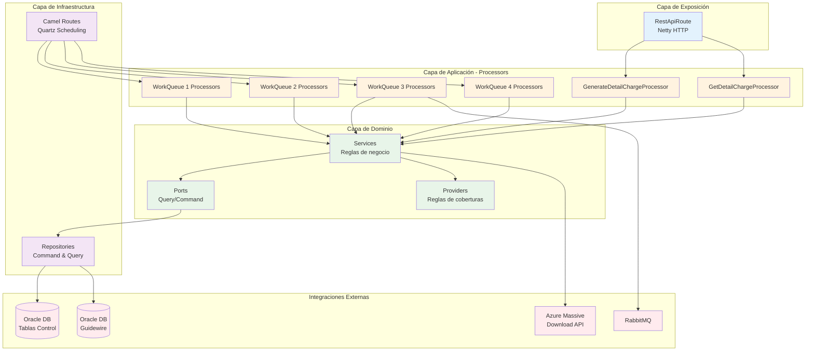

# Componente: MicroIntegradorReportesVidaGrupo

## 📋 **Overview**

### Propósito

El MicroIntegradorReportesVidaGrupo es un microservicio especializado construido sobre Apache Camel que se encarga de **generar reportes detallados de cobro para facturas colectivas de pólizas de Vida Grupo**. El componente gestiona la construcción asíncrona de archivos de reporte que pueden contener desde miles hasta millones de registros, utilizando un patrón de work queues programadas para procesar grandes volúmenes de datos de forma eficiente.

### Contexto de Negocio

Dentro del ecosistema de Seguros Sura - Vida Grupo, este microservicio sirve como puente crítico entre **BillingCenter** y la infraestructura de generación de archivos en **Azure (Massive Download API)**. Los reportes de detalle de cobro son documentos esenciales que contienen información granular de cada asegurado dentro de una factura colectiva, incluyendo coberturas, primas, valores asegurados y demás información regulatoria necesaria para clientes corporativos.

Los productos soportados son:
- **Vida Grupo Integral**
- **Deudores**
- **Docentes**  
- **Condiciones de Uso**

### Responsabilidades Principales

- **Generación Asíncrona de Reportes**: Construir reportes de detalle de cobro para facturas colectivas mediante procesamiento distribuido en work queues
- **Gestión de Volúmenes Masivos**: Procesar eficientemente reportes con millones de registros utilizando insert-select optimizados
- **Integración con Azure Massive Download**: Comunicarse con la API de Azure para envío de bloques, cabeceras y cierre de archivos
- **Consulta de Estado**: Proporcionar endpoints para solicitar generación y consultar estado/descarga de reportes
- **Persistencia y Limpieza**: Mantener tablas de control de generación de reportes y limpieza automática de registros antiguos
- **Mensajería Asíncrona**: Notificar cambios de estado del detalle de cobro a aplicaciones externas fuera del dominio que consumen esta funcionalidad vía RabbitMQ

### Ubicación

- **Repositorio**: MetodoCeibaSura
- **Ruta**: `/MicroIntegradorReportesVidaGrupo`
- **Tipo**: Microservicio (Apache Camel)

---

## 🏗️ **Architecture**

### Stack Tecnológico

- **Lenguaje**: Java 17
- **Framework**: Apache Camel 3.20.0
- **Build Tool**: Gradle 6.9.2
- **Base de Datos**: Oracle Database (JDBC 19.8.0.0)
- **Message Broker**: RabbitMQ
- **Containerización**: Docker
- **Logging**: Log4j2 + SLF4J 1.7.36 + Splunk Integration
- **Testing**: JUnit 4.13.2, Mockito 4.11.0
- **Seguridad**: OWASP Dependency Check
- **Mutation Testing**: PIT 1.15.8

### Patrones de Diseño

El componente implementa una arquitectura basada en **patrones empresariales de integración** combinados con **arquitectura hexagonal** (ports & adapters):

- **Patrón Principal**: **Work Queue Pattern** con scheduling programado (Quartz)
  - 4 work queues independientes con responsabilidades específicas
  - Procesamiento batch con volúmenes configurables (2-10,000 registros)
  - Ejecución en intervalos temporales específicos
  
- **Event-Driven Architecture**: Comunicación asíncrona mediante RabbitMQ
- **Hexagonal Architecture**: Separación clara entre dominio, puertos, adaptadores e infraestructura
- **Repository Pattern**: Abstracción del acceso a datos a través de ports (Query/Command)
- **Processor Pattern** (Apache Camel): Lógica de negocio encapsulada en procesadores reutilizables

**Justificación**: El patrón de work queues programadas permite gestionar el procesamiento masivo de datos sin afectar el rendimiento del sistema, mientras que la arquitectura hexagonal facilita testing y mantenibilidad.

### Estructura del Código

```
MicroIntegradorReportesVidaGrupo/
├── src/
│   ├── main/
│   │   ├── java/com/sura/mi/reportes/vidagrupo/
│   │   │   ├── MicrointegratorMain.java          # Punto de entrada principal
│   │   │   ├── application/
│   │   │   │   └── processor/                    # Procesadores de Camel
│   │   │   │       ├── detailcharge/             # Procesadores de generación/consulta
│   │   │   │       └── workqueue/                # Procesadores de work queues (1-4)
│   │   │   ├── domain/                           # Capa de dominio (hexagonal)
│   │   │   │   ├── common/
│   │   │   │   │   ├── constant/                 # Constantes del sistema
│   │   │   │   │   ├── exception/                # Excepciones de dominio
│   │   │   │   │   └── util/                     # Utilidades de negocio
│   │   │   │   ├── dto/                          # Data Transfer Objects
│   │   │   │   ├── enums/                        # Enumeraciones
│   │   │   │   ├── model/                        # Modelos de dominio
│   │   │   │   ├── ports/                        # Ports (interfaces)
│   │   │   │   │   ├── command/                  # Comandos (escritura)
│   │   │   │   │   └── query/                    # Queries (lectura)
│   │   │   │   ├── provider/                     # Proveedores de reglas/mapeos
│   │   │   │   └── service/                      # Servicios de dominio
│   │   │   └── infrastructure/                   # Capa de infraestructura
│   │   │       ├── adapter/                      # Adaptadores (hexagonal)
│   │   │       │   ├── data/                     # Entidades de BD
│   │   │       │   ├── mapper/                   # Mappers Domain ↔ Data
│   │   │       │   ├── repository/               # Implementación de ports
│   │   │       │   │   ├── command/              # Repositorios de escritura
│   │   │       │   │   └── query/                # Repositorios de lectura
│   │   │       │   └── util/                     # Utilidades de BD
│   │   │       ├── config/                       # Configuraciones
│   │   │       └── route/                        # Rutas de Apache Camel
│   │   │           ├── CommonRoute.java          # Rutas comunes/manejo errores
│   │   │           ├── RestApiRoute.java         # API REST expuesta
│   │   │           ├── detailcharge/             # Rutas de generación/consulta
│   │   │           └── workqueue/                # Rutas de work queues (1-4)
│   │   └── resources/
│   │       ├── log4j2.yml                        # Configuración logging
│   │       ├── properties/
│   │       │   └── microintegrator.properties    # Configuración del microservicio
│   │       └── sql/                              # Scripts SQL
│   │           ├── CREATE.sql                    # DDL de tablas
│   │           ├── script_billing.sql            # Consultas BillingCenter
│   │           ├── script_policy.sql             # Consultas PolicyCenter
│   │           └── script_bc_pc.sql              # Consultas combinadas
│   └── test/                                      # Tests unitarios y de integración
├── build.gradle                                   # Configuración de Gradle
├── gradle.properties                              # Versiones centralizadas
├── Dockerfile                                     # Imagen Docker multi-stage
└── README.md                                      # Documentación básica
```

### Diagrama Conceptual



---

## 🔌 **APIs**

### Endpoints Expuestos

El componente expone **2 endpoints REST** a través de Apache Camel Netty HTTP.

#### REST Endpoints

| Método | Ruta                                                   | Descripción                                             | Parámetros               | Respuesta          |
| ------ | ------------------------------------------------------ | ------------------------------------------------------- | ------------------------ | ------------------ |
| POST   | `/v1/he/invoices/{invoiceNumber}/chargedetail/report` | Solicita generación de reporte de detalle de cobro      | `{invoiceNumber}` (path) | `200 OK` / `500`   |
| GET    | `/v1/he/invoices/{invoiceNumber}/chargedetail/report` | Consulta y descarga archivo de reporte ya generado      | `{invoiceNumber}` (path) | `200 OK` / `404`   |

**Detalles de Endpoints:**

**POST - Generar Reporte**
- **Descripción**: Registra una solicitud de generación de reporte en la tabla principal con estado 1. El procesamiento real ocurre asíncronamente mediante work queues.
- **Parámetros**:
  - `invoiceNumber` (path): Número de factura colectiva
- **Headers esperados**: `autorizacion`
- **Response**:
  - `200 OK`: Solicitud registrada exitosamente
  - `500 Internal Server Error`: Error al procesar solicitud

**GET - Consultar/Descargar Reporte**
- **Descripción**: Verifica el estado del reporte y descarga el archivo desde Azure Massive Download API si está disponible (estado 4).
- **Parámetros**:
  - `invoiceNumber` (path): Número de factura colectiva
- **Headers esperados**: `autorizacion`
- **Response**:
  - `200 OK`: Archivo disponible y descargado
  - `404 Not Found`: Reporte no encontrado o aún en proceso
  - `500 Internal Server Error`: Error al procesar solicitud

#### Códigos de Error

| Código | Descripción          | Casos                                                 |
| ------ | -------------------- | ----------------------------------------------------- |
| 200    | OK                   | Operación exitosa                                     |
| 400    | Bad Request          | Parámetro invoiceNumber inválido                      |
| 401    | Unauthorized         | Header de autorización inválido/faltante             |
| 404    | Not Found            | Reporte no encontrado o aún no disponible             |
| 500    | Internal Error       | Error de BD, Azure API, o procesamiento interno       |

#### Contratos y Versionamiento

- **Estrategia de versionado**: Versionado mediante prefijo en URL (`/v1/`)
- **Versión actual**: v1
- **Breaking changes**: Cambios en URL o parámetros requerirán nueva versión (v2)

### Eventos y Mensajería

#### Eventos Publicados

| Evento                                      | Descripción                                  | Payload          | Consumidores                          |
| ------------------------------------------- | -------------------------------------------- | ---------------- | ------------------------------------- |
| `sura.seguros.vidagrupo.chargedetail.risk`  | Notificación de cambio de estado del reporte | JSON con estado  | Aplicaciones externas del ecosistema  |

**Detalles del Evento:**

- **Exchange**: `sura.seguros.vidagrupo.chargedetail.ex`
- **Routing Key**: `sura.seguros.vidagrupo.chargedetail.risk`
- **Queue**: `sura.seguros.vidagrupo.chargedetail.risk.qu`
- **Cuándo se publica**: Al completar el cierre de archivo (WorkQueue 3)
- **Propósito**: Notificar a aplicaciones externas fuera del dominio que el reporte ha cambiado de estado y está listo para descarga

#### Eventos Consumidos

| Evento                                            | Descripción                        | Origen                   | Acción                              |
| ------------------------------------------------- | ---------------------------------- | ------------------------ | ----------------------------------- |
| `sura.seguros.vidagrupo.chargedetail.risk.reply`  | Respuesta de aplicaciones externas | Aplicaciones consumidoras | Procesar confirmación de recepción  |

**Detalles del Evento Consumido:**

- **Exchange**: `sura.seguros.vidagrupo.chargedetail.ex`
- **Routing Key**: `sura.seguros.vidagrupo.chargedetail.risk.reply`
- **Queue**: `sura.seguros.vidagrupo.chargedetail.risk.reply.qu`
- **Acción**: Registrar confirmación de que la aplicación externa recibió la notificación de cambio de estado

---

## 📦 **Dependencies**

### Dependencias Externas

#### Librerías Críticas

| Librería                             | Versión     | Propósito                                  | Criticidad     |
| ------------------------------------ | ----------- | ------------------------------------------ | -------------- |
| Apache Camel (Suite completa)        | 3.20.0      | Framework de integración y orquestación    | 🔴 Crítica     |
| Oracle JDBC Driver (ojdbc8)          | 19.8.0.0    | Conectividad con bases de datos Oracle     | 🔴 Crítica     |
| Quartz Scheduler                     | 2.3.2       | Scheduling de work queues programadas      | 🔴 Crítica     |
| Apache Commons DBCP2                 | 2.9.0       | Pool de conexiones de BD                   | 🔴 Crítica     |
| Jackson Datatype JDK8                | 2.13.3      | Serialización/deserialización JSON         | 🟡 Importante  |
| OkHttp                               | 4.10.0      | Cliente HTTP para Azure API                | 🟡 Importante  |
| ms-lib-seus                          | 1.0.1       | Librería interna de Seguros Sura           | 🟡 Importante  |
| Lombok                               | 1.18.26     | Reducción de boilerplate                   | 🟢 Opcional    |
| SLF4J + Log4j2                       | 1.7.36      | Logging y observabilidad                   | 🟡 Importante  |
| Splunk Java Logging                  | 1.7.3       | Envío de logs a Splunk                     | 🟢 Opcional    |

#### Servicios Externos

- **Azure Massive Download API**: API de Microsoft Azure para generación y almacenamiento de archivos masivos. Se utiliza para enviar bloques de datos, cerrar archivos y consultar disponibilidad.
  - **Base URL**: `https://labapicorevidagrupo.suramericana.com/massive-download`
  - **Criticidad**: 🔴 Crítica (sin este servicio no se pueden generar reportes)
  
- **Splunk (Holmes Lab)**: Plataforma de observabilidad para centralización de logs
  - **URL**: `http://holmeslab.suramericana.com.co:9088/`
  - **Criticidad**: 🟢 Opcional (útil para troubleshooting)

### Dependencias Internas

#### Componentes del Sistema

- **BillingCenter (Guidewire)**: Sistema core de facturación. Se consulta su base de datos Oracle para obtener información de facturas colectivas, items de factura, coberturas y períodos.
- **PolicyCenter (Guidewire)**: Sistema core de pólizas. Se consulta su base de datos Oracle para obtener información de asegurados, pólizas maestras, productos y condiciones.

#### Bases de Datos

- **Oracle DB (Tablas Control)**: Base de datos específica del microservicio que mantiene:
  - Tabla principal de control de generación de reportes
  - Tablas de detalle con información de asegurados procesados
  - Estados y trazabilidad de procesamiento
  
- **Oracle DB (Guidewire)**: Base de datos compartida de BillingCenter y PolicyCenter
  - Consultas read-only a tablas de facturación y pólizas
  - Sin modificaciones directas

### Quién Usa Este Componente

#### Consumidores Directos

- **Aplicaciones Web de Clientes Corporativos**: Solicitan y descargan reportes de detalle de cobro mediante API REST
- **Sistemas de Notificación Externa**: Reciben eventos de cambio de estado vía RabbitMQ

#### Consumidores Indirectos

- **Clientes Finales (Empresas Aseguradas)**: Acceden a reportes generados a través de portales web

### Gestión de Dependencias

```bash
# Actualizar dependencias
./gradlew build --refresh-dependencies

# Verificación de vulnerabilidades (OWASP)
./gradlew dependencyCheckAnalyze

# Auditoría de dependencias
./gradlew dependencies

# Reporte de versiones desactualizadas
./gradlew dependencyUpdates
```

---

## 🚀 **Deployment**

### Configuración de Entorno

#### Variables de Entorno Requeridas

| Variable                                   | Descripción                                    | Ejemplo                                      | Requerida   |
| ------------------------------------------ | ---------------------------------------------- | -------------------------------------------- | ----------- |
| `ARTIFACTORY_TOKEN`                        | Token de acceso a Artifactory Sura             | `<token_secreto>`                            | ✅ Sí       |
| `oracle.jdbc.url`                          | URL JDBC de la base de datos Oracle            | `jdbc:oracle:thin:@//host:1537/LABGWDWH`     | ✅ Sí       |
| `oracle.jdbc.username`                     | Usuario de base de datos                       | `ADM_VIDAGRUPOREPORTES`                      | ✅ Sí       |
| `oracle.jdbc.password`                     | Contraseña de base de datos                    | `<password_secreto>`                         | ✅ Sí       |
| `spring.rabbitmq.producer.host`            | Host de RabbitMQ para productor                | `msglab.suramericana.com.co`                 | ✅ Sí       |
| `spring.rabbitmq.producer.username`        | Usuario RabbitMQ productor                     | `seguros.core.billing.usr`                   | ✅ Sí       |
| `spring.rabbitmq.producer.password`        | Contraseña RabbitMQ productor                  | `<password_secreto>`                         | ✅ Sí       |
| `spring.rabbitmq.consumer.host`            | Host de RabbitMQ para consumidor               | `msglab.suramericana.com.co`                 | ✅ Sí       |
| `spring.rabbitmq.consumer.username`        | Usuario RabbitMQ consumidor                    | `seguros.core.policy.usr`                    | ✅ Sí       |
| `spring.rabbitmq.consumer.password`        | Contraseña RabbitMQ consumidor                 | `<password_secreto>`                         | ✅ Sí       |
| `api.massive.download.url`                 | URL base de Azure Massive Download API         | `https://labapicorevidagrupo.suramericana...` | ✅ Sí       |
| `api.massive.download.authorization`       | Header de autorización para Azure API          | `Basic <base64_credentials>`                 | ✅ Sí       |
| `api.massive.download.subscription.key`    | Subscription key de Azure                      | `f8b7a06d70904951b04f35f433f038c6`           | ✅ Sí       |
| `server.port`                              | Puerto HTTP del microservicio                  | `9000`                                       | ⚠️ Opcional |
| `autorizacion`                             | Password para validación de endpoints          | `<password_secreto>`                         | ✅ Sí       |

#### Archivo .env de Ejemplo

```bash
# Configuración de desarrollo
ARTIFACTORY_TOKEN=<tu_token_aqui>
environment=development
autorizacion=dev_password

# Base de Datos Oracle
oracle.jdbc.url=jdbc:oracle:thin:@//dbdevserver.com:1537/DEVDB
oracle.jdbc.username=DEV_VIDAGRUPOREPORTES
oracle.jdbc.password=dev_password
oracle.jdbc.initialSize=5
oracle.jdbc.maxTotal=10

# RabbitMQ - Productor
spring.rabbitmq.producer.host=devrabbit.com
spring.rabbitmq.producer.port=5672
spring.rabbitmq.producer.username=dev_billing_usr
spring.rabbitmq.producer.password=dev_password
spring.rabbitmq.producer.virtual-host=dev.vh
spring.rabbitmq.producer.exchange=sura.seguros.vidagrupo.chargedetail.ex
spring.rabbitmq.producer.routingKey=sura.seguros.vidagrupo.chargedetail.risk
spring.rabbitmq.producer.queue=sura.seguros.vidagrupo.chargedetail.risk.qu

# RabbitMQ - Consumidor
spring.rabbitmq.consumer.host=devrabbit.com
spring.rabbitmq.consumer.port=5672
spring.rabbitmq.consumer.username=dev_policy_usr
spring.rabbitmq.consumer.password=dev_password
spring.rabbitmq.consumer.virtual-host=dev.vh
spring.rabbitmq.consumer.exchange=sura.seguros.vidagrupo.chargedetail.ex
spring.rabbitmq.consumer.routingKey=sura.seguros.vidagrupo.chargedetail.risk.reply
spring.rabbitmq.consumer.queue=sura.seguros.vidagrupo.chargedetail.risk.reply.qu

# Azure API
api.massive.download.url=https://devapicorevidagrupo.suramericana.com/massive-download
api.massive.download.authorization=Basic <base64_dev_credentials>
api.massive.download.subscription.key=dev_subscription_key

# Servidor
server.name=vidagruporeportes-mi
server.port=9000
```

### Comandos de Desarrollo

#### Setup Inicial

```bash
# Instalación de dependencias
./gradlew clean build

# Configuración inicial (verificar properties)
cat src/main/resources/properties/microintegrator.properties

# Verificación de setup
./gradlew dependencies --configuration runtimeClasspath
```

#### Compilación

```bash
# Build de desarrollo (sin tests)
./gradlew clean build -x test

# Build de producción (con tests y análisis)
./gradlew clean build

# Build de JAR ejecutable con Shadow
./gradlew shadowJar

# Verificación de build
ls -lh build/libs/
```

#### Testing

```bash
# Tests unitarios
./gradlew test

# Tests de integración (si existen)
./gradlew integrationTest

# Coverage (Jacoco)
./gradlew jacocoTestReport
# Reporte en: build/reports/jacocoHtml/index.html

# Mutation Testing (PIT)
./gradlew pitest
# Reporte en: target/pit-reports/pitest/index.html

# Linting y análisis de seguridad
./gradlew dependencyCheckAnalyze
# Reporte en: target/dependencyCheck/dependency-check-report.json
```

#### Ejecución Local

```bash
# Modo desarrollo (usando Gradle)
./gradlew run

# Modo producción local (usando JAR)
java -jar build/libs/MicroIntegradorReportesVidaGrupo-1.0-SNAPSHOT-all.jar

# Debug mode (puerto 5005)
java -agentlib:jdwp=transport=dt_socket,server=y,suspend=n,address=*:5005 \
     -jar build/libs/MicroIntegradorReportesVidaGrupo-1.0-SNAPSHOT-all.jar

# Verificar health
curl http://localhost:9000/actuator/health
```

### Pipeline de Despliegue

#### Prerequisitos de Infraestructura

- **Oracle Database**: Instancia configurada con tablas de control creadas (ver `CREATE.sql`)
- **RabbitMQ**: Exchange, queues y bindings configurados según especificación
- **Azure Massive Download API**: Acceso configurado con subscription key válida
- **Splunk (Opcional)**: Configuración de logging centralizado
- **Runtime Java 17**: JRE/JDK instalado en el ambiente de ejecución

#### Etapas del Pipeline

1. **Build Stage**
   - Compilación con Gradle
   - Ejecución de tests unitarios
   - Generación de reportes de cobertura (Jacoco)
   - Análisis de vulnerabilidades (OWASP)
   - Comandos: `./gradlew clean build jacocoTestReport dependencyCheckAnalyze`

2. **Test Stage**
   - Tests de integración (si existen)
   - Mutation testing (PIT)
   - Validación de umbrales de cobertura
   - Comandos: `./gradlew integrationTest pitest`

3. **Package Stage**
   - Generación de Shadow JAR (fat JAR)
   - Construcción de imagen Docker multi-stage
   - Push a registry de contenedores
   - Comandos: `./gradlew shadowJar && docker build -t vidagruporeportes-mi:${VERSION} .`

4. **Deploy Stage**
   - Despliegue a Kubernetes/OpenShift
   - Configuración de variables de entorno por ambiente
   - Health checks post-despliegue
   - Comandos: `kubectl apply -f k8s/deployment-${ENV}.yaml`

#### Variables de Entorno por Ambiente

**Desarrollo:**

```bash
environment=development
oracle.jdbc.url=jdbc:oracle:thin:@//devdb:1537/DEVDB
spring.rabbitmq.producer.host=devrabbit.com
api.massive.download.url=https://devapi.suramericana.com/massive-download
server.port=9000
```

**Staging:**

```bash
environment=staging
oracle.jdbc.url=jdbc:oracle:thin:@//stgdb:1537/STGDB
spring.rabbitmq.producer.host=stgrabbit.com
api.massive.download.url=https://stgapi.suramericana.com/massive-download
server.port=9000
```

**Producción:**

```bash
environment=production
oracle.jdbc.url=jdbc:oracle:thin:@//prddb:1537/PRDDB
spring.rabbitmq.producer.host=prdrabbit.com
api.massive.download.url=https://prdapi.suramericana.com/massive-download
server.port=9000
```

### Buenas Prácticas de Despliegue

- **Health Checks Configurados**: Implementar endpoints de health para verificación automática de estado
- **Graceful Shutdown**: Configurar tiempos adecuados de terminación para completar work queues en proceso
- **Connection Pooling**: Validar configuración de pools de BD (initialSize, maxTotal, timeouts) según carga esperada
- **Resource Limits**: Establecer límites de CPU y memoria en Kubernetes basados en perfil de uso
- **Secrets Management**: Nunca commitear credenciales; usar secrets de Kubernetes o vault externo
- **Monitoring Proactivo**: Configurar alertas en Splunk para errores críticos y degradación de rendimiento

### Pasos Manuales

**Despliegue Inicial (Primera vez):**

1. **Crear Tablas de Control**: Ejecutar script `src/main/resources/sql/CREATE.sql` en la base de datos Oracle de control
2. **Configurar RabbitMQ**: Crear exchange, queues y bindings según especificación de mensajería
3. **Validar Conectividad Azure API**: Verificar acceso a Massive Download API con subscription key
4. **Verificar Acceso a Guidewire DBs**: Validar permisos read-only en BillingCenter y PolicyCenter

**Despliegues Posteriores:** Todo el proceso está automatizado vía pipeline CI/CD

### Rollback

```bash
# Comando para rollback en Kubernetes
kubectl rollout undo deployment/vidagruporeportes-mi -n <namespace>

# Verificación post-rollback
kubectl rollout status deployment/vidagruporeportes-mi -n <namespace>

# Verificar logs
kubectl logs -f deployment/vidagruporeportes-mi -n <namespace>

# Health check manual
curl http://<service-url>:9000/actuator/health
```

### Monitoreo Post-Despliegue

- **Health Checks**: 
  - Endpoint: `http://<host>:9000/actuator/health`
  - Frecuencia: Cada 30 segundos
  
- **Logs**: 
  - Comando: `kubectl logs -f deployment/vidagruporeportes-mi -n <namespace>`
  - Splunk: `http://holmeslab.suramericana.com.co:9088/` (buscar por `source="vidagruporeportes-mi"`)
  
- **Métricas**: 
  - Verificar work queues ejecutándose según cronograma
  - Monitorear tasa de procesamiento de registros
  - Validar estados de reportes en tabla de control
  - Revisar tasa de errores en integración con Azure API

---

**📌 Esta documentación debe mantenerse actualizada con cada cambio significativo en el componente.**

## 📝 **Notas de Mantenimiento**

| Fecha      | Versión | Cambios                                          | Autor             |
| ---------- | ------- | ------------------------------------------------ | ----------------- |
| 2025-10-30 | 1.0     | Documentación inicial del componente             | Arquitecto Ceiba  |

---

_Documentación generada con Método Ceiba - Arquitecto_
