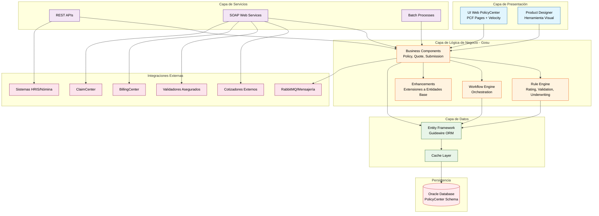

# Componente: PolicyCenter

## 📋 **Overview**

### Propósito

PolicyCenter es el **"Sistema de Registro" (System of Record)** para absolutamente toda la información relacionada con las pólizas de seguros de Sura. Actúa como la plataforma central que **gestiona todo el ciclo de vida completo de una póliza de seguro**, desde su cotización inicial hasta su renovación o finalización. 

En el contexto específico de **Vida Grupo**, PolicyCenter administra pólizas colectivas corporativas, gestionando masivamente empleados y dependientes, con reglas especializadas para cálculo de primas, coberturas jerárquicas y procesos de alta/baja de asegurados.

### Contexto de Negocio

PolicyCenter es el componente más crítico del ecosistema Guidewire Insurance Suite de Sura. Funciona como el cerebro que:

- **Alimenta a BillingCenter**: Notifica las pólizas emitidas para facturación y cobranza
- **Valida para ClaimCenter**: Proporciona información de vigencia, coberturas y asegurados para validación de siniestros
- **Integra con sistemas externos**: Se conecta con cotizadores externos, validadores de asegurados, portales de clientes y sistemas de nómina corporativos

En el ecosistema de Seguros Sura - Vida Grupo, PolicyCenter gestiona específicamente:
- Emisión de pólizas colectivas para empresas
- Administración masiva de empleados y dependientes como asegurados
- Configuración de productos Vida Grupo con estructuras jerárquicas de coberturas (básicas, adicionales, voluntarias)
- Validación automática contra listas restrictivas
- Generación de certificados individuales

### Responsabilidades Principales

- **Emisión de Pólizas Colectivas**: Gestión completa del proceso de cotización y expedición de pólizas de Vida Grupo para empresas corporativas
- **Administración de Asegurados**: Manejo masivo de empleados y dependientes mediante carga batch (archivos planos/Excel) y validación automática
- **Motor de Reglas de Negocio**: Ejecución de todas las reglas de suscripción, cálculo de primas por categorías/edades, aplicación de tablas actuariales
- **Gestión del Ciclo de Vida**: Procesos de endosos (cambios), renovaciones automáticas, cancelaciones y manejo de novedades (altas/bajas)
- **Integración Empresarial**: Hub de conectividad con sistemas externos (cotizadores, validadores, HRIS corporativos, sistemas de facturación)

### Ubicación

- **Repositorio**: MetodoCeibaSura (policycenterstatic + policy_center)
- **Ruta**: `C:\Guidewire\PolicyCenter`
- **Módulo de código**: `C:\Guidewire\PolicyCenter\modules\configuration`
- **Tipo**: Aplicación Web Empresarial + Backend de Servicios + Motor de Reglas

## 🏗️ **Architecture**

### Stack Tecnológico

- **Lenguaje**: Gosu (lenguaje propietario de Guidewire, interoperable 100% con Java)
- **Lenguaje Base**: Java 1.7 (J2EE)
- **Framework**: Guidewire Insurance Suite Platform 8.0.7.gw
- **Versión**: 8.0.7.gw
- **Otras tecnologías**: 
  - **XML**: Configuración declarativa extensiva (archivos `.pcf`, `.etx`, `.xml`)
  - **Velocity Templates**: Motor de plantillas para generación de documentos y emails
  - **Apache Ant**: Build automation y scripts de deployment
  - **Oracle Database**: Base de datos empresarial
  - **WebLogic Server**: Application server (servidor de aplicaciones J2EE)
  - **SOAP/REST**: Frameworks para exposición y consumo de web services

### Patrones de Diseño

- **Patrón Principal**: Arquitectura Monolítica Modular con separación **Estático/Dinámico**
  - **Estático** (`policycenterstatic`): Binarios de la plataforma Guidewire, herramientas de desarrollo (Studio), Product Designer
  - **Dinámico** (`modules/configuration`): Código de configuración y customizaciones específicas de Sura
- **Justificación**: Guidewire utiliza este patrón para:
  - Separar la plataforma base (inmutable, actualizable por Guidewire) del código de negocio (customizable por el cliente)
  - Permitir upgrades de la plataforma sin afectar configuraciones específicas
  - Facilitar el desarrollo mediante Guidewire Studio que gestiona ambas capas

**Patrones de Diseño Adicionales**:
- **Entity-Enhancement Pattern**: Extensión de entidades base mediante "enhancements" en Gosu
- **Rule Engine Pattern**: Motor de reglas declarativo para lógica de negocio
- **Workflow Engine Pattern**: Orquestación de procesos mediante definiciones XML
- **Data Model Extension Pattern**: Extensión del modelo de datos mediante archivos `.etx`

### Estructura del Código

```
PolicyCenter/
├── admin/                    # Herramientas administrativas de la plataforma
│   ├── bin/                  # Scripts de administración
│   ├── lib/                  # Librerías administrativas
│   └── src/                  # Código fuente de herramientas admin
├── bin/                      # Scripts de ejecución
│   ├── gwpc.bat              # Launcher Windows (desarrollo y servidor)
│   └── gwpc.sh               # Launcher Linux/Unix
├── build/                    # Artefactos de compilación
│   ├── dictionary/           # Diccionario de datos generado
│   ├── gosudoc/              # Documentación Gosu generada (similar a Javadoc)
│   └── reports/              # Reportes de build
├── doc/                      # Documentación oficial de Guidewire
│   ├── Application Guide/    # Guía de uso de la aplicación
│   ├── Configuration Guide/  # Guía de configuración
│   ├── Gosu Reference Guide/ # Referencia completa del lenguaje Gosu
│   ├── Integration Guide/    # Guía de integraciones
│   ├── Product Designer Guide/ # Guía de Product Designer
│   └── Product Model Guide/  # Guía del modelo de productos
├── modules/                  # CÓDIGO DINÁMICO - Configuración específica Sura
│   └── configuration/        # Módulo principal de configuración
│       ├── config/           # Configuraciones XML (servidores, BD, webservices)
│       │   ├── config.xml    # Configuración principal de ambientes
│       │   ├── database-config.xml # Configuración de bases de datos
│       │   ├── webservices/  # Definiciones de SOAP/REST APIs
│       │   ├── plugin/       # Configuración de plugins externos
│       │   ├── integration/  # Configuraciones de integraciones
│       │   ├── workflow/     # Definiciones de workflows de negocio
│       │   └── rules/        # Reglas de negocio declarativas
│       ├── gsrc/             # Código fuente Gosu (lógica de negocio customizada)
│       │   ├── acc/          # Código de aceleradores (ACC)
│       │   ├── com/          # Código común
│       │   ├── edge/         # Extensiones edge
│       │   ├── gw/           # Extensiones Guidewire core
│       │   ├── gwservices/   # Servicios Guidewire
│       │   ├── sura/         # CÓDIGO ESPECÍFICO SURA
│       │   └── wsi/          # Web Service Interfaces
│       ├── gtest/            # Tests unitarios en Gosu
│       ├── src/              # Código fuente Java (cuando se requiere)
│       ├── webresources/     # Recursos web estáticos (CSS, JS, imágenes)
│       ├── wsdl/             # Definiciones WSDL de servicios SOAP
│       └── xsd/              # Esquemas XML para validación
├── productdesigner/          # Product Designer - Diseño visual de productos
├── repository/               # Repositorio de configuraciones versionadas
├── solr/                     # Apache Solr para búsquedas avanzadas
├── studio/                   # Guidewire Studio - IDE especializado
├── template/                 # Templates de configuración base
├── ThemeApp/                 # Tematización y personalización UI
├── webapps/                  # Aplicaciones web deployadas
│   └── pc/                   # Aplicación PolicyCenter web
└── pom.xml                   # Maven Project Object Model
```

### Diagrama Conceptual



## 🔌 **APIs**

### Endpoints Expuestos

#### SOAP Web Services

PolicyCenter expone un conjunto robusto de APIs SOAP para integración empresarial:

| Servicio SOAP | Descripción | Operaciones Principales | Consumidores |
| ------ | ---------------------- | ----------- | ----------------- |
| **PolicyAPI** | Gestión completa de pólizas | `createSubmission`, `issuePolicy`, `endorsePolicy`, `renewPolicy`, `cancelPolicy` | Cotizadores externos, Portales web, Aplicaciones móviles |
| **AccountAPI** | Gestión de cuentas y contactos | `createAccount`, `updateAccount`, `searchAccounts` | CRM externo, Sistemas de ventas |
| **ProducerAPI** | Gestión de productores/intermediarios | `createProducer`, `assignProducer`, `getCommissions` | Sistemas de comisionamiento |
| **UnderwritingAPI** | Servicios de suscripción | `evaluateRisk`, `getUnderwritingIssues`, `approve`, `decline` | Sistemas de decisión automática |
| **QuoteAPI** | Cotización de pólizas | `rateQuote`, `getQuote`, `bindQuote` | Cotizadores externos, Portales de clientes |
| **BCBillingSystemAPI** | Integración con BillingCenter | `createInvoice`, `notifyPayment`, `syncPolicies` | BillingCenter |
| **CCClaimSearchAPI** | Búsqueda para ClaimCenter | `searchPolicies`, `validateCoverage` | ClaimCenter |

#### REST Endpoints (Guidewire Cloud API - si configurado)

| Método | Ruta                   | Descripción | Parámetros        | Respuesta         |
| ------ | ---------------------- | ----------- | ----------------- | ----------------- |
| GET    | `/api/policies/{id}`      | Obtener detalle de póliza | `id`: Policy ID | JSON con datos de póliza |
| POST   | `/api/submissions`      | Crear nueva cotización | Body: Submission data | JSON con submission creada |
| PUT    | `/api/policies/{id}/endorse` | Crear endoso | `id`: Policy ID, Body: Cambios | JSON con endoso creado |
| GET | `/api/accounts/{id}` | Consultar cuenta | `id`: Account ID | JSON con datos de cuenta |

**Nota**: La mayoría de las integraciones de PolicyCenter en Sura se realizan mediante **SOAP APIs** debido a la versión 8.0.7 de Guidewire. REST APIs están disponibles mediante configuración adicional o en versiones Cloud.

#### Códigos de Error

| Código | Descripción    | Casos             |
| ------ | -------------- | ----------------- |
| 200 | Success | Operación exitosa |
| 400    | Bad Request    | Datos de entrada inválidos, validaciones de negocio fallidas |
| 401    | Unauthorized   | Credenciales inválidas o token expirado |
| 403 | Forbidden | Usuario sin permisos para la operación |
| 404    | Not Found      | Póliza, cuenta o entidad no encontrada |
| 500    | Internal Error | Error interno del servidor, fallo en reglas de negocio |

#### Contratos y Versionamiento

- **Estrategia de versionado**: Los WSDLs de Guidewire incluyen versionamiento en el namespace (ej: `gw/pc/2015/01/PolicyAPI`)
- **Versión actual**: 8.0.7.gw
- **Breaking changes**: Guidewire sigue un modelo de compatibilidad hacia atrás dentro de major versions. Upgrades de minor versions (8.0.x) no rompen contratos existentes. Cambios en major versions requieren actualización de clientes.
- **Documentación de contratos**: WSDLs disponibles en `modules/configuration/wsdl/` y `modules/configuration/config/webservices/`

### Eventos y Mensajería

#### Eventos Publicados

| Evento    | Descripción | Payload  | Consumidores             |
| --------- | ----------- | -------- | ------------------------ |
| `PolicyIssued` | Póliza emitida exitosamente | `PolicyNumber, EffectiveDate, PremiumAmount, AccountID` | BillingCenter (para facturación), MicroIntegradorVidaGrupo (notificaciones) |
| `PolicyEndorsed` | Endoso aplicado a póliza | `PolicyNumber, EndorsementNumber, ChangeType, NewPremium` | BillingCenter (ajuste de facturación), Sistemas de auditoría |
| `PolicyCancelled` | Póliza cancelada | `PolicyNumber, CancellationDate, Reason, RefundAmount` | BillingCenter (cálculo de reembolso), ClaimCenter (cierre de coberturas) |
| `PolicyRenewed` | Renovación de póliza procesada | `OldPolicyNumber, NewPolicyNumber, RenewalDate` | BillingCenter, Sistemas de retención de clientes |
| `UnderwritingIssueCreated` | Issue de suscripción creado | `PolicyNumber, IssueType, Severity, Description` | Workflow de aprobaciones, Dashboards de gestión |

#### Eventos Consumidos

| Evento    | Descripción | Origen            | Acción                |
| --------- | ----------- | ----------------- | --------------------- |
| `PaymentReceived` | Pago recibido en BillingCenter | BillingCenter | Actualizar estado de la póliza, desbloquear servicios |
| `ClaimCreated` | Nuevo siniestro creado | ClaimCenter | Notificar al productor, actualizar historial de cuenta |
| `AccountUpdated` | Actualización de cuenta externa | CRM/Sistemas externos | Sincronizar datos de contacto, dirección, datos corporativos |
| `EmployeeStatusChanged` | Cambio de estado de empleado | Sistemas HRIS vía MicroIntegradorVidaGrupo | Procesar alta/baja de asegurado, ajustar prima |

**Mecanismo de Mensajería**: 
- RabbitMQ para mensajería asíncrona con MicroIntegradores
- Messaging framework interno de Guidewire para comunicación con BillingCenter/ClaimCenter
- Event listeners configurables en `modules/configuration/config/messaging/`

## 📦 **Dependencies**

### Dependencias Externas

#### Librerías Críticas

| Librería  | Versión | Propósito       | Criticidad   |
| --------- | ------- | --------------- | ------------ |
| Oracle JDBC Driver | ojdbc7 | Conectividad con base de datos Oracle | 🔴 Crítica |
| Apache Velocity | 1.7 | Motor de templates para generación de documentos | 🔴 Crítica |
| Apache Commons (Collections, Lang, IO) | Varias | Utilidades Java estándar | 🟡 Importante |
| Log4j | 1.2.x | Framework de logging | 🟡 Importante |
| Apache CXF | 2.x | Framework SOAP/REST web services | 🔴 Crítica |
| Jackson | 2.x | Serialización/deserialización JSON | 🟡 Importante |
| Quartz Scheduler | 2.x | Programación de trabajos batch | 🔴 Crítica |
| Apache POI | 3.x | Generación de documentos Excel | 🟢 Opcional |

**Nota**: Las dependencias exactas están gestionadas por Guidewire en el framework base. Librerías adicionales se agregan vía Maven en `pom.xml`.

#### Servicios Externos

- **Sistemas de Cotización**: Cotizadores externos de Vida Grupo para cálculo de primas en tiempo real
- **Validador de Asegurados**: Servicios de consulta a centrales de riesgo (CIFIN, DataCrédito, Procuraduría)
- **Sistemas HRIS Corporativos**: SAP HCM, SuccessFactors para sincronización de datos de empleados
- **Servicios de Facturación Electrónica**: Integración con DIAN para facturación electrónica
- **Servicios de Notificación**: Email/SMS para notificaciones a clientes

### Dependencias Internas

#### Componentes del Sistema

- **BillingCenter**: PolicyCenter notifica pólizas emitidas para iniciar facturación y cobro
- **ClaimCenter**: Proporciona información de vigencia y coberturas para validación de siniestros
- **MicroIntegradorVidaGrupo**: Orquestador de integraciones con sistemas externos (cotizadores, validadores, HRIS)
- **MicroIntegradorReportesVidaGrupo**: Generación de reportes de detalle de cobro desde datos de pólizas
- **PolicySearchSummary**: Servicio de búsqueda optimizada sobre datos de pólizas
- **SeusLibreria**: Librería compartida con utilidades comunes Java/Gosu

#### Bases de Datos

- **Oracle Database - Schema PolicyCenter**: Almacenamiento completo de datos de pólizas, cuentas, contactos, transacciones
  - Tablas principales: `pc_policy`, `pc_account`, `pc_contact`, `pc_policyperiod`, `pc_job`, `pc_submission`
  - Tablas de configuración: `pc_product`, `pc_coveragetype`, `pc_ratemodifier`
  - Tablas Vida Grupo customizadas: Extensiones para gestión de asegurados colectivos

### Quién Usa Este Componente

#### Consumidores Directos

- **BillingCenter**: Consume PolicyCenter vía SOAP API `BCBillingSystemAPI` para sincronización de pólizas y facturación
- **ClaimCenter**: Consume PolicyCenter vía SOAP API `CCClaimSearchAPI` para validación de coberturas y asegurados
- **MicroIntegradorVidaGrupo**: Consume y expone APIs de PolicyCenter para:
  - Cotización mediante sistemas externos
  - Validación de asegurados
  - Sincronización con HRIS corporativos
- **Cotizadores Externos**: Consumen `QuoteAPI` y `PolicyAPI` para cotizar y expedir pólizas desde canales externos
- **Portales Web/Móviles de Clientes**: Consumen APIs REST/SOAP para consulta de pólizas, certificados y datos

#### Consumidores Indirectos

- **Azure Data Factory**: Orquesta pipelines que extraen datos de PolicyCenter vía MicroIntegradores
- **Sistemas de Reportería Empresarial**: Acceden a datos de PolicyCenter vía vistas de base de datos o ETLs
- **Sistemas de Auditoría y Cumplimiento**: Consultan logs y datos de PolicyCenter para auditorías regulatorias

### Gestión de Dependencias

```bash
# Gestión de dependencias mediante Maven
cd C:\Guidewire\PolicyCenter
mvn clean install

# Verificación de vulnerabilidades (requiere configuración OWASP)
mvn org.owasp:dependency-check-maven:check

# Auditoría de dependencias
mvn dependency:tree
mvn dependency:analyze
```

**Nota Importante**: Guidewire gestiona la mayoría de dependencias core internamente. Las dependencias customizadas de Sura se agregan en `modules/configuration/pom.xml`.

## 🚀 **Deployment**

### Configuración de Entorno

#### Variables de Entorno Requeridas

| Variable | Descripción | Ejemplo         | Requerida  |
| -------- | ----------- | --------------- | ---------- |
| `JAVA_HOME`  | Ruta de instalación de JDK 1.7 | `C:\apps\java\jdk-1.7.0_79` | ✅ Sí |
| `ANT_HOME`  | Ruta de instalación de Apache Ant | `C:\apps\ant-1.8.2` | ✅ Sí |
| `MAVEN_HOME` | Ruta de instalación de Apache Maven | `C:\apps\apache-maven-3.3.9` | ✅ Sí |
| `Path` | Path del sistema (debe incluir Java, Ant, Maven) | `%JAVA_HOME%\bin;%ANT_HOME%\bin;%MAVEN_HOME%\bin` | ✅ Sí |
| `GW_HOME` | Ruta de instalación de PolicyCenter | `C:\Guidewire\PolicyCenter` | ⚠️ Opcional (inferida) |

#### Archivo .env de Ejemplo

**Nota**: PolicyCenter no usa archivos `.env` tradicionales. La configuración se gestiona mediante archivos XML en `modules/configuration/config/`.

**Configuración de ambientes en `config.xml`**:
```xml
<!-- Ambiente de Desarrollo Local -->
<server serverid="local_dev" isbatchserver="true" env="DLLO"/>

<!-- Configuración de base de datos en database-config.xml -->
<database name="PolicyCenterDatabase" dbtype="oracle" autoupgrade="true" env="DLLO_ORACLE">
    <dbcp-connection-pool jdbc-url="jdbc:oracle:thin:${username}/${password}@srvbdcsd01.suramericana.com.co:1537:DEVGWPC"
                          max-active="100"
                          max-idle="10"/>
</database>
```

### Comandos de Desarrollo

#### Setup Inicial

```bash
# 1. Clonar repositorios (estático + módulo)
cd C:\Guidewire
git clone https://<USER_GIT>@bitbucket.org/suracore/policycenterstatic.git PolicyCenter
cd PolicyCenter
git clone --recursive --jobs 2 https://<USER_GIT>@bitbucket.org/suracore/policy_center.git modules

# 2. Inicializar GitFlow
git flow init

# 3. Configurar variables de entorno (ver sección anterior)
# Editar variables de sistema Windows

# 4. Sincronizar configuración de base de datos
# Editar modules/configuration/config/database-config.xml con credenciales locales
```

#### Compilación

```bash
# Build completo (desde raíz de PolicyCenter)
cd C:\Guidewire\PolicyCenter
mvn clean install

# Build de módulo específico
cd modules/configuration
mvn compile

# Build con Ant (método tradicional Guidewire)
ant build

# Generación de diccionario de datos
ant build-dictionary
```

#### Testing

```bash
# Tests unitarios Gosu
cd C:\Guidewire\PolicyCenter\modules\configuration
ant test

# Tests específicos
ant test -Dtest.class=sura.vidagrupo.SomeTestClass

# Coverage (si configurado)
ant test-coverage

# Linting (Gosu Lint)
ant lint
```

#### Ejecución Local

```bash
# Modo desarrollo (Windows)
cd C:\Guidewire\PolicyCenter\bin
gwpc.bat studio

# Modo desarrollo (Linux)
cd /Guidewire/PolicyCenter/bin
./gwpc.sh studio

# El servidor arrancará en:
# http://localhost:8080/pc
# Credenciales por defecto: su / gw
```

### Pipeline de Despliegue

#### Prerequisitos de Infraestructura

- **WebLogic Server**: Application server J2EE configurado
- **Oracle Database**: Instancia de Oracle con schema PolicyCenter creado
- **Network**: Conectividad entre servidores de aplicación y base de datos
- **Certificados SSL**: Para ambientes productivos
- **Load Balancer**: Para distribución de carga entre nodos (ambientes UAT/PDN)

#### Etapas del Pipeline

1. **Build Stage**
   - Compilación de código Gosu y Java
   - Generación de artefactos WAR/EAR
   - Comandos: `mvn clean package`

2. **Test Stage**
   - Ejecución de tests unitarios
   - Validación de reglas de negocio
   - Comandos: `ant test`

3. **Deploy Stage**
   - Deployment a WebLogic Server
   - Ejecución de scripts de migración de BD (si aplica)
   - Comandos: `ant deploy -Denv=<AMBIENTE>`

4. **Smoke Tests**
   - Verificación de health checks
   - Validación de conectividad con BillingCenter/ClaimCenter
   - Comandos: Scripts de verificación custom

#### Variables de Entorno por Ambiente

**Desarrollo (DLLO):**
```xml
<server serverid="wls_pcd01" isbatchserver="true" env="DLLO"/>
<database jdbc-url="jdbc:oracle:thin:@srvbdcsd01.suramericana.com.co:1537:DEVGWPC" env="DLLO_ORACLE"/>
```

**QA:**
```xml
<server serverid="wls_pclqa01" isbatchserver="false" env="QA"/>
<server serverid="wls_pclqa02" isbatchserver="true" env="QA"/>
```

**UAT (User Acceptance Testing):**
```xml
<server serverid="wls_pcluat01" isbatchserver="false" env="UAT"/>
<!-- Servidores dedicados Vida Grupo -->
<server serverid="wls_pcluat08" isbatchserver="false" env="UAT"/>
<server serverid="wls_pcluat09" isbatchserver="false" env="UAT"/>
```

**Producción (PDN):**
```xml
<server serverid="wls_pcp01" isbatchserver="false" env="PDN"/>
<!-- Múltiples nodos para alta disponibilidad -->
<!-- Servidores dedicados Vida Grupo -->
<server serverid="wls_pcp12" isbatchserver="false" env="PDN"/>
<server serverid="wls_pcp13" isbatchserver="false" env="PDN"/>
<server serverid="wls_pcp16" isbatchserver="false" env="PDN"/>
<server serverid="wls_pcp17" isbatchserver="false" env="PDN"/>
<server serverid="wls_pcp18" isbatchserver="false" env="PDN"/>
<server serverid="wls_pcp19" isbatchserver="false" env="PDN"/>
```

### Buenas Prácticas de Despliegue

- **Deployment con Downtime Mínimo**: Usar estrategia rolling deployment entre nodos de WebLogic para minimizar interrupción de servicio
- **Backup de Base de Datos**: Siempre realizar backup de schema Oracle antes de upgrades o migraciones
- **Validación de Configuración**: Ejecutar `ant validate-config` antes de deployment para detectar errores de configuración
- **Sincronización de Configuración**: Asegurar que archivos de configuración (`config.xml`, `database-config.xml`) están sincronizados con el ambiente target
- **Logs Centralizados**: Configurar logging hacia Splunk o sistema centralizado para troubleshooting
- **Monitoreo Post-Deployment**: Verificar health checks, conectividad con BillingCenter/ClaimCenter, y funcionamiento de batch processes

### Pasos Manuales

1. **Verificación de Conectividad**: Después del deployment, validar manualmente que PolicyCenter puede conectarse a BillingCenter y ClaimCenter mediante pruebas de SOAP endpoints
2. **Validación de Product Designer**: Verificar que Product Designer está disponible y los productos Vida Grupo se cargan correctamente
3. **Prueba de Cotización End-to-End**: Ejecutar al menos una cotización de prueba en el ambiente deployado para validar integración completa

**Nota**: Los equipos de DevOps de Sura están trabajando en automatizar estos pasos mediante scripts de verificación.

### Rollback

```bash
# Rollback a versión anterior (WebLogic)
# 1. Detener aplicación PolicyCenter en WebLogic Admin Console
# 2. Re-deploy artefact anterior desde repositorio de artefactos
# 3. Reiniciar servidores managed

# Rollback de base de datos (si se ejecutaron scripts de migración)
# 1. Restaurar backup de schema Oracle
sqlplus sys as sysdba @restore_backup.sql

# Verificación post-rollback
curl http://<servidor>:8080/pc/health
```

### Monitoreo Post-Despliegue

- **Health Checks**: `http://<servidor>:8080/pc/health` (endpoint de salud de la aplicación)
- **Logs**: 
  - Windows: `C:\Guidewire\PolicyCenter\logs\PolicyCenter.log`
  - WebLogic Server logs: `<WEBLOGIC_DOMAIN>/servers/<SERVER_NAME>/logs/`
  - Splunk: Búsqueda con index `guidewire` y source `policycenter`
- **Métricas**: 
  - WebLogic Admin Console para monitoreo de threads, memoria heap, conexiones JDBC
  - Oracle Enterprise Manager (si configurado) para métricas de base de datos
  - Dashboards customizados en Grafana/Splunk (si implementados)

---

**📌 Esta documentación debe mantenerse actualizada con cada cambio significativo en el componente.**

## 📝 **Notas de Mantenimiento**

| Fecha   | Versión | Cambios               | Autor   |
| ------- | ------- | --------------------- | ------- |
| 2025-11-12 | 1.0     | Documentación inicial | esteban.colorado |

_Documentación generada con Método Ceiba - Arquitecto_
