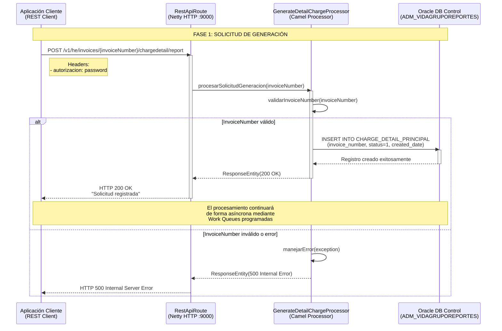
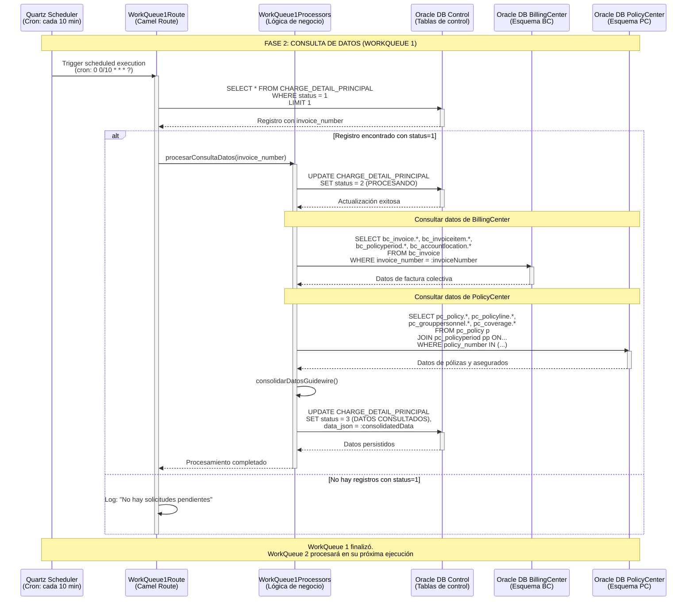
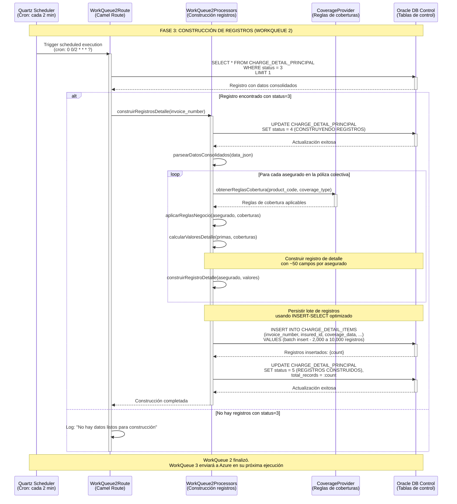
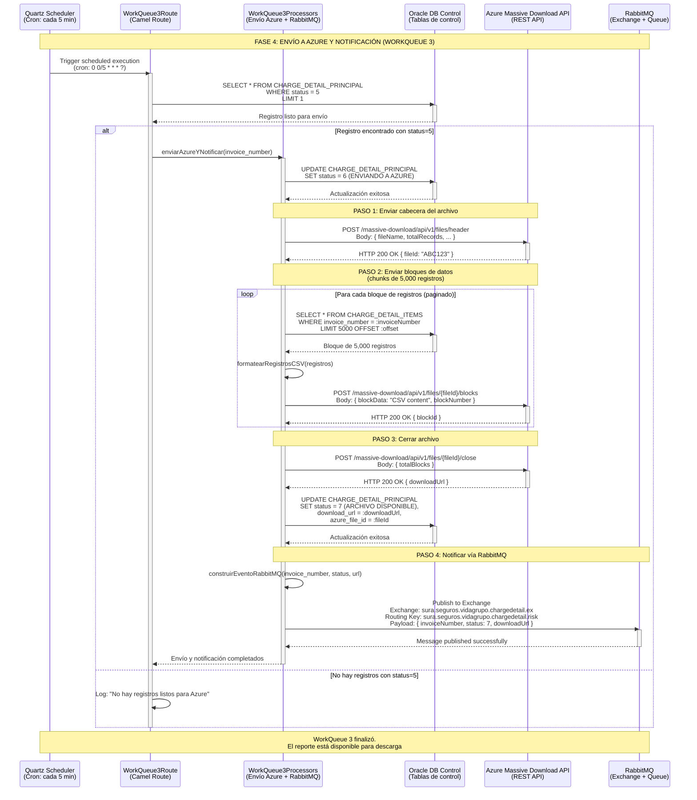
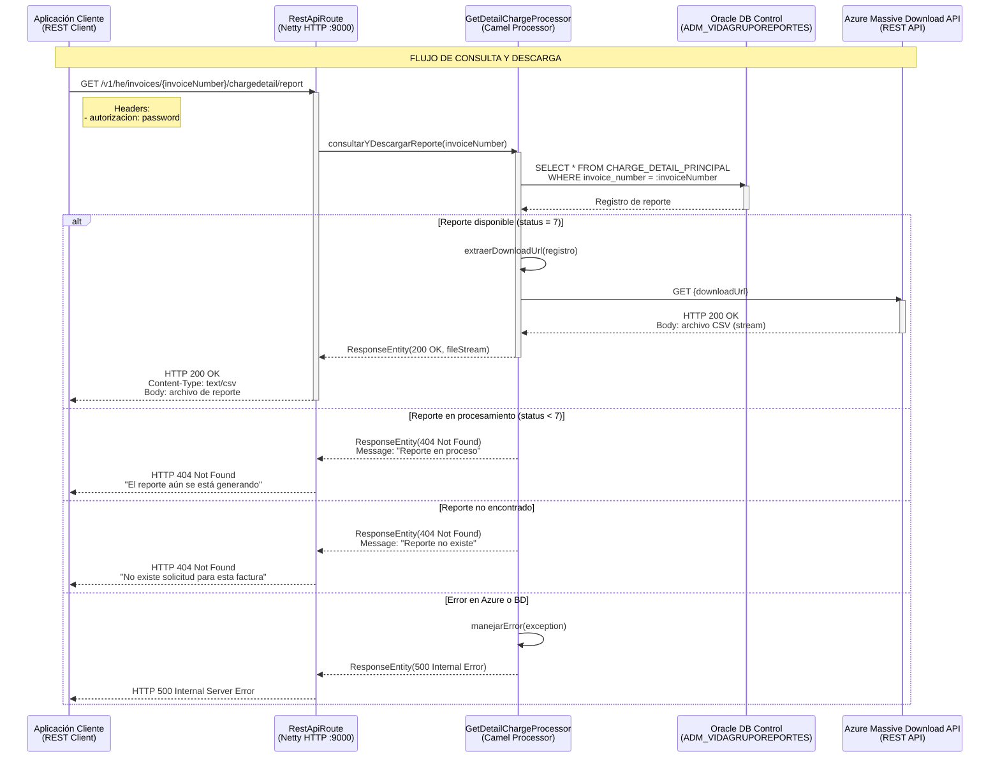
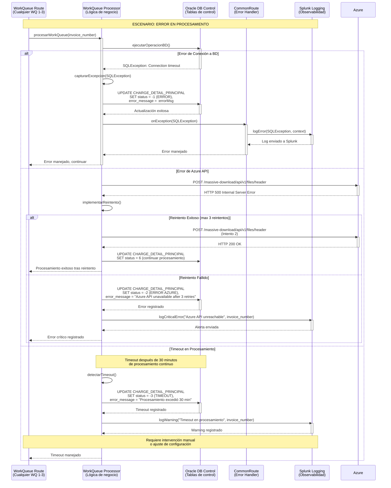
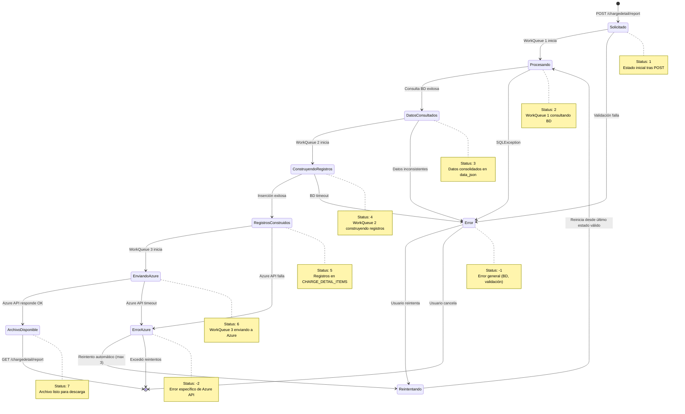
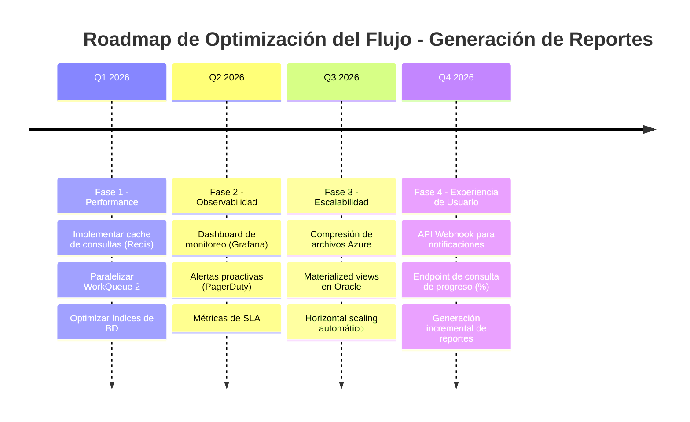

# Ecosistema Vida Grupo - Flujo: Generación de Reporte de Detalle de Cobro 🔄

## 📋 **Introducción**

### Descripción del Flujo

El flujo de **Generación de Reporte de Detalle de Cobro** es un proceso crítico que genera reportes detallados con información granular de cada asegurado dentro de una factura colectiva de pólizas de Vida Grupo. Este flujo orquesta la construcción asíncrona de archivos masivos que pueden contener desde miles hasta millones de registros, utilizando un patrón de work queues programadas para procesar grandes volúmenes de datos de forma eficiente sin impactar el rendimiento del sistema.

El proceso inicia cuando una aplicación externa (o BillingCenter) solicita la generación del reporte mediante una llamada REST. El sistema registra la solicitud y delega el procesamiento real a 4 work queues especializadas que ejecutan de forma programada y distribuida: consulta de datos de Guidewire, construcción de registros del detalle, envío a Azure Massive Download API, y notificación vía RabbitMQ a aplicaciones consumidoras.

### Scope del Documento

**Enfoque Principal**: Documentación técnica completa del flujo de trabajo end-to-end de generación de reportes de detalle de cobro  
**Audiencia**: Desarrolladores, Arquitectos, Analistas de Negocio, Equipos de Soporte  
**Última Actualización**: Octubre 28, 2025

### Componentes Involucrados

| Componente                        | Tecnología                    | Puerto/Contexto                              | Responsabilidad                                                    |
| --------------------------------- | ----------------------------- | -------------------------------------------- | ------------------------------------------------------------------ |
| **Aplicación Cliente**            | REST Client                   | Aplicaciones externas / BillingCenter        | Solicitar generación y consultar estado de reportes               |
| **MicroIntegradorReportesVG**     | Java 17 + Apache Camel 3.20   | `:9000` - `/v1/he/invoices/.../chargedetail` | Orquestar generación asíncrona mediante work queues programadas    |
| **WorkQueue 1**                   | Quartz Scheduler + Camel      | Cron: `0 0/10 * * * ?` (cada 10 min)         | Consultar datos de BillingCenter y PolicyCenter                    |
| **WorkQueue 2**                   | Quartz Scheduler + Camel      | Cron: `0 0/2 * * * ?` (cada 2 min)           | Construir registros de detalle de cobro y persistir                |
| **WorkQueue 3**                   | Quartz Scheduler + Camel      | Cron: `0 0/5 * * * ?` (cada 5 min)           | Enviar bloques a Azure, cerrar archivo, notificar vía RabbitMQ     |
| **WorkQueue 4**                   | Quartz Scheduler + Camel      | Cron: `0 0 0 1/1 * ? *` (diario a medianoche)| Limpiar registros antiguos de tablas de control                    |
| **Oracle DB - Control**           | Oracle Database               | Esquema: `ADM_VIDAGRUPOREPORTES`             | Persistir estado de generación y registros de detalle              |
| **Oracle DB - Guidewire**         | Oracle Database               | Esquemas: `BC` (BillingCenter), `PC` (Policy)| Proveer datos de facturas, pólizas y asegurados                    |
| **Azure Massive Download API**    | Azure PaaS                    | `https://...suramericana.com/massive-download` | Gestionar construcción y almacenamiento de archivos masivos       |
| **RabbitMQ**                      | RabbitMQ 3.x                  | `msglab.suramericana.com.co:5672`            | Mensajería asíncrona para notificar cambios de estado              |

---

## 🔄 **Diagramas de Secuencia**

### 1. Flujo Principal: Solicitud de Generación de Reporte (POST)



### 2. Flujo Asíncrono: WorkQueue 1 - Consulta de Datos de Guidewire



### 3. Flujo Asíncrono: WorkQueue 2 - Construcción de Registros de Detalle



### 4. Flujo Asíncrono: WorkQueue 3 - Envío a Azure y Notificación RabbitMQ



### 5. Flujo de Consulta y Descarga de Reporte (GET)



### 6. Flujo de Manejo de Errores



---

## 📊 **Estados y Transiciones**

### Diagrama de Estados del Flujo



### Tabla de Estados

| Estado                    | Código | Descripción                                              | WorkQueue Responsable | Siguiente Estado Esperado   |
| ------------------------- | ------ | -------------------------------------------------------- | --------------------- | --------------------------- |
| **Solicitado**            | 1      | Solicitud registrada, pendiente de procesamiento         | -                     | Procesando (2)              |
| **Procesando**            | 2      | Consultando datos de BillingCenter y PolicyCenter        | WorkQueue 1           | DatosConsultados (3)        |
| **DatosConsultados**      | 3      | Datos consolidados persistidos en data_json              | WorkQueue 1           | ConstruyendoRegistros (4)   |
| **ConstruyendoRegistros** | 4      | Construyendo registros de detalle de cobro               | WorkQueue 2           | RegistrosConstruidos (5)    |
| **RegistrosConstruidos**  | 5      | Registros insertados en CHARGE_DETAIL_ITEMS              | WorkQueue 2           | EnviandoAzure (6)           |
| **EnviandoAzure**         | 6      | Enviando bloques y cerrando archivo en Azure             | WorkQueue 3           | ArchivoDisponible (7)       |
| **ArchivoDisponible**     | 7      | Archivo listo para descarga, notificación enviada        | WorkQueue 3           | Final (descarga exitosa)    |
| **Error**                 | -1     | Error general (BD, validación, timeout)                  | Cualquiera            | Reintento manual            |
| **ErrorAzure**            | -2     | Error específico de Azure API (tras reintentos)          | WorkQueue 3           | Reintento manual/escalación |
| **Timeout**               | -3     | Procesamiento excedió tiempo máximo (30 min)             | Cualquiera            | Revisión manual             |

---

## 📋 **Configuración y Parámetros**

### Configuración del Flujo

| Parámetro                              | Valor                   | Descripción                                           | Impacto si se Cambia                                          |
| -------------------------------------- | ----------------------- | ----------------------------------------------------- | ------------------------------------------------------------- |
| `workqueue1.cron`                      | `0 0/10 * * * ?`        | Frecuencia de ejecución de WorkQueue 1 (cada 10 min) | Mayor frecuencia aumenta carga de BD Guidewire                |
| `workqueue2.cron`                      | `0 0/2 * * * ?`         | Frecuencia de ejecución de WorkQueue 2 (cada 2 min)  | Mayor frecuencia aumenta carga de BD de control               |
| `workqueue3.cron`                      | `0 0/5 * * * ?`         | Frecuencia de ejecución de WorkQueue 3 (cada 5 min)  | Mayor frecuencia aumenta llamadas a Azure API                 |
| `workqueue4.cron`                      | `0 0 0 1/1 * ? *`       | Frecuencia de limpieza (diario a medianoche)         | Cambiar para ajustar retención de registros históricos        |
| `batch.size.insert`                    | `2000 - 10000`          | Tamaño de lote para inserción de registros           | Muy alto puede causar OutOfMemory, muy bajo es ineficiente    |
| `azure.block.size`                     | `5000`                  | Registros por bloque enviado a Azure                 | Bloques muy grandes pueden causar timeout en Azure API        |
| `azure.api.timeout`                    | `60000 ms`              | Timeout para llamadas a Azure Massive Download       | Reducir puede causar falsos errores en archivos muy grandes   |
| `processing.timeout`                   | `30 minutos`            | Tiempo máximo de procesamiento por WorkQueue         | Ajustar según volumen de registros esperado                   |
| `retry.max.attempts`                   | `3`                     | Número máximo de reintentos ante error de Azure      | Aumentar puede incrementar latencia total en caso de falla    |
| `oracle.jdbc.maxTotal`                 | `10`                    | Máximo de conexiones en pool de BD                   | Aumentar si hay contención de conexiones                      |
| `oracle.jdbc.maxConnLifetimeMillis`    | `18300000 ms` (5.08 hr) | Tiempo de vida máximo de conexión                    | Reducir si hay problemas de conexiones stale                  |

### Message Queues Utilizadas

| Cola                                              | Exchange                                      | Routing Key                                     | TTL      | Propósito                                                      |
| ------------------------------------------------- | --------------------------------------------- | ----------------------------------------------- | -------- | -------------------------------------------------------------- |
| `sura.seguros.vidagrupo.chargedetail.risk.qu`     | `sura.seguros.vidagrupo.chargedetail.ex`      | `sura.seguros.vidagrupo.chargedetail.risk`      | No limit | Publicar eventos de cambio de estado (status 7) a consumidores |
| `sura.seguros.vidagrupo.chargedetail.risk.reply.qu` | `sura.seguros.vidagrupo.chargedetail.ex`    | `sura.seguros.vidagrupo.chargedetail.risk.reply`| No limit | Recibir confirmaciones de aplicaciones consumidoras            |

**Configuración de Virtual Host:**
- **Virtual Host**: `seguros.vh`
- **Exchange Type**: `topic` (permite routing patterns)
- **Durable**: `true` (mensajes persisten tras restart de RabbitMQ)
- **Auto-delete**: `false`

---

## 🔧 **Métricas y Monitoreo**

### Puntos Críticos de Medición

| Métrica                                  | Componente                 | Umbral Esperado          | Acción si se Excede                                        |
| ---------------------------------------- | -------------------------- | ------------------------ | ---------------------------------------------------------- |
| **Tiempo total de generación**          | End-to-end                 | < 30 minutos             | Revisar volumen de registros, optimizar consultas SQL      |
| **Tiempo de consulta BD Guidewire**      | WorkQueue 1                | < 5 minutos              | Optimizar índices en BC/PC, revisar plan de ejecución SQL  |
| **Throughput de inserción**              | WorkQueue 2                | > 5000 registros/min     | Aumentar batch size, revisar contención de BD              |
| **Latencia de Azure API**                | WorkQueue 3                | < 10 segundos por bloque | Contactar soporte Azure, verificar conectividad de red     |
| **Tasa de errores Azure**                | WorkQueue 3                | < 1% de bloques          | Revisar logs, escalar con soporte Azure                    |
| **Mensajes pendientes en RabbitMQ**      | Cola risk.qu               | < 100 mensajes           | Verificar que consumidores estén activos                   |
| **Conexiones activas de BD**             | Pool de conexiones Oracle  | < 8 (de 10 max)          | Revisar leaks de conexiones, aumentar maxTotal             |
| **Uso de memoria JVM**                   | MicroIntegradorReportesVG  | < 70% de heap            | Aumentar Xmx, revisar garbage collection, optimizar código |

### Logs Críticos a Monitorear

| Componente                | Archivo Log / Destino        | Patrón a Buscar                               | Severidad |
| ------------------------- | ---------------------------- | --------------------------------------------- | --------- |
| **WorkQueue 1**           | Splunk (index=vida_grupo)    | `ERROR.*SQLException.*WorkQueue1`             | ERROR     |
| **WorkQueue 2**           | Splunk (index=vida_grupo)    | `ERROR.*OutOfMemoryError.*WorkQueue2`         | CRITICAL  |
| **WorkQueue 3**           | Splunk (index=vida_grupo)    | `ERROR.*Azure.*5\d{2}` (Azure API 5xx)        | ERROR     |
| **Azure Integration**     | Splunk (index=vida_grupo)    | `WARN.*retry attempt.*Azure`                  | WARN      |
| **RabbitMQ Publisher**    | Splunk (index=vida_grupo)    | `ERROR.*RabbitMQ.*connection failed`          | ERROR     |
| **Common Error Handler**  | Splunk (index=vida_grupo)    | `FATAL.*unhandled exception`                  | CRITICAL  |

**Query de Splunk de ejemplo:**

```spl
index=vida_grupo source="microintegrador-reportes" 
| search "WorkQueue" AND "ERROR"
| stats count by workqueue_type, error_type
| sort -count
```

---

## 🧪 **Escenarios de Prueba**

### Casos de Prueba Críticos

#### TC001: Flujo Exitoso Completo - Factura con 10,000 Asegurados

```gherkin
Scenario: Generación exitosa de reporte de detalle de cobro para factura colectiva
  Given una factura colectiva "FAC2025001234" con 10,000 asegurados
  And todas las dependencias externas (BD, Azure, RabbitMQ) están disponibles
  When la aplicación cliente envía POST /v1/he/invoices/FAC2025001234/chargedetail/report
  Then el sistema responde HTTP 200 OK inmediatamente
  And un registro con status=1 se crea en CHARGE_DETAIL_PRINCIPAL
  And WorkQueue 1 procesa la solicitud en su próxima ejecución (max 10 min)
  And WorkQueue 2 construye 10,000 registros en CHARGE_DETAIL_ITEMS
  And WorkQueue 3 envía 2 bloques de 5,000 registros a Azure
  And WorkQueue 3 publica evento a RabbitMQ con status=7
  And el archivo está disponible para descarga en < 30 minutos
  When la aplicación cliente envía GET /v1/he/invoices/FAC2025001234/chargedetail/report
  Then el sistema responde HTTP 200 OK con el archivo CSV
  And el archivo contiene exactamente 10,000 líneas de detalle
```

#### TC002: Manejo de Error Crítico - Azure API No Disponible

```gherkin
Scenario: Manejo de error cuando Azure Massive Download API está caída
  Given una factura colectiva "FAC2025005678" procesada hasta status=5
  And WorkQueue 3 está intentando enviar a Azure
  And Azure Massive Download API retorna HTTP 503 Service Unavailable
  When WorkQueue 3 ejecuta su cron de 5 minutos
  Then el sistema implementa 3 reintentos con backoff exponencial
  And cada reintento espera 2, 4, 8 segundos respectivamente
  And si los 3 reintentos fallan
  Then el sistema actualiza CHARGE_DETAIL_PRINCIPAL con status=-2
  And registra error_message "Azure API unavailable after 3 retries"
  And envía log de severidad ERROR a Splunk
  And NO publica evento a RabbitMQ
  When un administrador revisa el estado
  Then puede identificar la factura en estado de error
  And puede reintentar manualmente o escalar con soporte Azure
```

#### TC003: Timeout en Procesamiento - Factura con 1 Millón de Asegurados

```gherkin
Scenario: Manejo de timeout en procesamiento de factura masiva
  Given una factura colectiva "FAC2025999999" con 1,000,000 de asegurados
  And el procesamiento de WorkQueue 2 excede 30 minutos
  When el sistema detecta que el procesamiento ha superado el timeout
  Then actualiza CHARGE_DETAIL_PRINCIPAL con status=-3 (TIMEOUT)
  And registra error_message "Procesamiento excedió 30 min"
  And envía log de severidad WARN a Splunk con detalles del invoice
  And detiene el procesamiento actual de WorkQueue 2
  When un administrador revisa el registro
  Then puede ajustar la configuración processing.timeout a 60 minutos
  Or puede partir el procesamiento en múltiples solicitudes más pequeñas
```

#### TC004: Consulta de Reporte en Proceso

```gherkin
Scenario: Cliente consulta reporte que aún se está generando
  Given una factura colectiva "FAC2025001111" con status=4 (construyendo registros)
  And el procesamiento total aún no ha completado
  When la aplicación cliente envía GET /v1/he/invoices/FAC2025001111/chargedetail/report
  Then el sistema responde HTTP 404 Not Found
  And el mensaje indica "El reporte aún se está generando. Estado actual: Construyendo registros"
  And el cliente debe implementar polling cada 2-5 minutos
  And eventualmente cuando status=7, el GET retornará HTTP 200 con el archivo
```

#### TC005: Validación de Consistencia de Datos

```gherkin
Scenario: Validación de que los datos del reporte coinciden con Guidewire
  Given una factura colectiva "FAC2025002222" procesada completamente
  And el archivo de detalle de cobro está disponible
  When se ejecuta una auditoría de datos
  Then cada registro del archivo debe tener un asegurado correspondiente en PolicyCenter
  And las sumas de primas en el archivo deben coincidir con BillingCenter
  And todas las coberturas listadas deben existir en la configuración de productos
  And los valores asegurados deben cumplir con las tablas actuariales
  And no debe haber duplicados de asegurados en el archivo
```

---

## 🔍 **Troubleshooting**

### Problemas Comunes y Soluciones

#### Error: "SQLException: Connection timeout to Oracle DB"

**Causa**: Pool de conexiones agotado o BD Guidewire no disponible  
**Diagnóstico**:

```bash
# Verificar estado del pool de conexiones
kubectl logs deployment/microintegrador-reportes-vidagrupo | grep "Connection pool"

# Verificar conectividad a BD
sqlplus ADM_VIDAGRUPOREPORTES/<password>@//srcsbdl07.suramericana.com.co:1537/LABGWDWH

# Verificar conexiones activas
SELECT COUNT(*) FROM v$session WHERE username = 'ADM_VIDAGRUPOREPORTES';
```

**Solución**:  
1. Aumentar `oracle.jdbc.maxTotal` de 10 a 20 en configuración
2. Reducir `oracle.jdbc.maxConnLifetimeMillis` si hay conexiones stale
3. Verificar que no haya leaks de conexiones en el código (usar try-with-resources)
4. Contactar DBA si la BD Guidewire está saturada

---

#### Error: "Azure Massive Download API returning HTTP 500"

**Causa**: Azure API experimentando problemas internos o rate limiting  
**Diagnóstico**:

```bash
# Revisar logs de WorkQueue 3
kubectl logs deployment/microintegrador-reportes-vidagrupo | grep "Azure" | grep "500"

# Verificar reintentos
kubectl logs deployment/microintegrador-reportes-vidagrupo | grep "retry attempt"

# Query en Splunk
index=vida_grupo source="microintegrador-reportes" "Azure" "500"
| stats count by error_message
```

**Solución**:  
1. Revisar dashboard de Azure APIM para verificar estado de la API
2. Verificar si se está excediendo rate limit de Azure (revisar headers de respuesta)
3. Implementar backoff exponencial más agresivo (aumentar tiempos de espera)
4. Contactar soporte de Azure con detalles de requests fallidos
5. Como workaround temporal, reintentar manualmente la factura en error (actualizar status a 5)

---

#### Error: "OutOfMemoryError in WorkQueue 2"

**Causa**: Batch size muy grande para construcción de registros  
**Diagnóstico**:

```bash
# Revisar uso de memoria JVM
kubectl top pod -l app=microintegrador-reportes-vidagrupo

# Revisar heap dump (si está configurado)
jmap -heap <pod-name>

# Revisar batch size actual
kubectl logs deployment/microintegrador-reportes-vidagrupo | grep "batch.size.insert"
```

**Solución**:  
1. Reducir `batch.size.insert` de 10,000 a 5,000 o 2,000
2. Aumentar memoria JVM: `-Xmx4g -Xms2g` en Dockerfile o deployment
3. Revisar si hay acumulación de objetos en memoria (posible leak)
4. Implementar procesamiento por páginas más pequeñas
5. Optimizar uso de memoria en `WorkQueue2Processors` (liberar objetos grandes)

---

#### Error: "RabbitMQ connection failed - Authentication failed"

**Causa**: Credenciales incorrectas o usuario sin permisos en virtual host  
**Diagnóstico**:

```bash
# Verificar credenciales en configuración
kubectl get secret microintegrador-reportes-config -o yaml | grep "rabbitmq"

# Verificar conectividad a RabbitMQ
telnet msglab.suramericana.com.co 5672

# Revisar logs de conexión
kubectl logs deployment/microintegrador-reportes-vidagrupo | grep "RabbitMQ"
```

**Solución**:  
1. Verificar credenciales de `spring.rabbitmq.producer.username` y `.password`
2. Verificar permisos del usuario en RabbitMQ Management Console
3. Confirmar que el usuario tiene acceso al virtual host `seguros.vh`
4. Re-generar credenciales si es necesario y actualizar secrets en Kubernetes
5. Verificar firewall/network policies que puedan bloquear puerto 5672

---

#### Error: "Timeout en procesamiento - Factura con millones de registros"

**Causa**: Volumen de datos excede capacidad de procesamiento en tiempo configurado  
**Diagnóstico**:

```bash
# Verificar total de registros de la factura
SELECT COUNT(*) 
FROM ADM_VIDAGRUPOREPORTES.CHARGE_DETAIL_ITEMS 
WHERE invoice_number = 'FAC2025999999';

# Verificar tiempo de procesamiento
SELECT invoice_number, status, created_date, updated_date, 
       (updated_date - created_date) AS processing_time
FROM ADM_VIDAGRUPOREPORTES.CHARGE_DETAIL_PRINCIPAL 
WHERE invoice_number = 'FAC2025999999';

# Revisar logs de timeout
kubectl logs deployment/microintegrador-reportes-vidagrupo | grep "Timeout"
```

**Solución**:  
1. Aumentar `processing.timeout` de 30 a 60 minutos para facturas masivas
2. Optimizar consultas SQL en WorkQueue 1 (agregar índices, revisar execution plan)
3. Aumentar `batch.size.insert` para reducir número de transacciones
4. Considerar particionar facturas muy grandes en múltiples solicitudes
5. Escalar horizontalmente el microservicio (más réplicas) si el problema persiste

---

### Comandos de Diagnóstico Útiles

```bash
# Verificar estado de componentes
kubectl get pods -l app=microintegrador-reportes-vidagrupo
kubectl describe pod <pod-name>

# Revisar logs en tiempo real
kubectl logs -f deployment/microintegrador-reportes-vidagrupo --tail=100

# Verificar métricas de recursos
kubectl top pod -l app=microintegrador-reportes-vidagrupo

# Verificar configuración actual
kubectl exec -it <pod-name> -- env | grep -E "oracle|rabbitmq|azure"

# Revisar cron jobs activos (Work Queues)
kubectl logs deployment/microintegrador-reportes-vidagrupo | grep "Quartz Scheduler"

# Verificar estado de reportes en BD
sqlplus ADM_VIDAGRUPOREPORTES/<password>@//host:1537/SERVICE << EOF
SELECT status, COUNT(*) as count 
FROM CHARGE_DETAIL_PRINCIPAL 
GROUP BY status 
ORDER BY status;
EXIT;
EOF

# Verificar mensajes pendientes en RabbitMQ
# Acceder a RabbitMQ Management: http://msglab.suramericana.com.co:15672
# Filtrar por queue: sura.seguros.vidagrupo.chargedetail.risk.qu

# Query de Splunk para análisis de errores
index=vida_grupo source="microintegrador-reportes" 
| search "ERROR" OR "FATAL"
| stats count by error_type, component
| sort -count
```

---

## 🚀 **Optimizaciones Futuras**

### Oportunidades de Mejora Identificadas

1. **Implementar Cache de Consultas Frecuentes**
   - **Descripción**: Cachear resultados de consultas a PolicyCenter para productos y coberturas estáticas que no cambian frecuentemente
   - **Beneficio**: Reducir en 30-40% el tiempo de consulta en WorkQueue 1, disminuir carga en BD PolicyCenter
   - **Complejidad**: Media (implementar Redis o Hazelcast, gestionar invalidación)
   - **Prioridad**: Alta

2. **Paralelizar Construcción de Registros en WorkQueue 2**
   - **Descripción**: Utilizar procesamiento paralelo (Java Streams paralelos o ExecutorService) para construcción de registros de detalle
   - **Beneficio**: Reducir en 50% el tiempo de construcción para facturas con >100K asegurados
   - **Complejidad**: Media (requiere gestión de hilos, pool de conexiones adecuado)
   - **Prioridad**: Alta

3. **Implementar Compresión de Archivos en Azure**
   - **Descripción**: Comprimir archivos CSV antes de enviar a Azure (gzip, zip) para reducir tamaño y tiempo de transferencia
   - **Beneficio**: Reducir en 60-70% el tiempo de envío de bloques grandes, optimizar ancho de banda
   - **Complejidad**: Baja (Azure Massive Download ya soporta compresión)
   - **Prioridad**: Media

4. **Dashboard de Monitoreo en Tiempo Real**
   - **Descripción**: Crear dashboard en Grafana/Kibana con métricas de generación de reportes (tiempo promedio, tasa de éxito, facturas en proceso)
   - **Beneficio**: Visibilidad completa del estado del sistema, alertas proactivas, mejor troubleshooting
   - **Complejidad**: Media (requiere exportar métricas, configurar dashboard)
   - **Prioridad**: Media

5. **API Webhook para Notificación de Finalización**
   - **Descripción**: Permitir que clientes registren webhooks para recibir notificación HTTP cuando el reporte esté listo (alternativa a polling)
   - **Beneficio**: Reducir carga de polling innecesario, mejorar experiencia de usuario
   - **Complejidad**: Alta (requiere gestión de webhooks, reintentos, seguridad)
   - **Prioridad**: Baja

6. **Optimización de Consultas SQL con Materialized Views**
   - **Descripción**: Crear materialized views en BD Oracle con datos pre-agregados de facturas y asegurados para acelerar consultas
   - **Beneficio**: Reducir en 40-50% el tiempo de consulta en WorkQueue 1
   - **Complejidad**: Media (requiere coordinación con DBA, gestión de refresh de views)
   - **Prioridad**: Alta

### Roadmap de Evolución



---

## 📚 **Referencias**

- **GPS Arquitectónico**: [Arquitectura del Sistema - GPS Principal](./index.md)
- **Documentación de Componentes**:
  - [MicroIntegradorReportesVidaGrupo](./architecture-microintegrador-reportes-vidagrupo.md)
  - [BillingCenter](./index.md#billingcenter) (referencia en GPS)
  - [PolicyCenter](./index.md#policycenter) (referencia en GPS)
- **Configuración**: 
  - `MicroIntegradorReportesVidaGrupoConf/shared/microintegrator.properties`
  - `MicroIntegradorReportesVidaGrupo/src/main/resources/sql/` (Scripts SQL)
- **APIs Externas**:
  - [Azure Massive Download API Documentation](https://labapicorevidagrupo.suramericana.com/massive-download/docs)
  - [RabbitMQ Management](http://msglab.suramericana.com.co:15672)
- **Herramientas de Monitoreo**:
  - [Splunk Holmes Lab](http://holmeslab.suramericana.com.co:9088/)
  - [Oracle Enterprise Manager](https://oem.suramericana.com.co) (si disponible)

---

_Documentación generada con Método Ceiba - Arquitecto_  
_Última actualización: Octubre 28, 2025_  
_Versión: 1.0_
