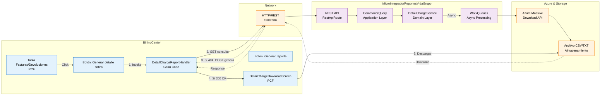
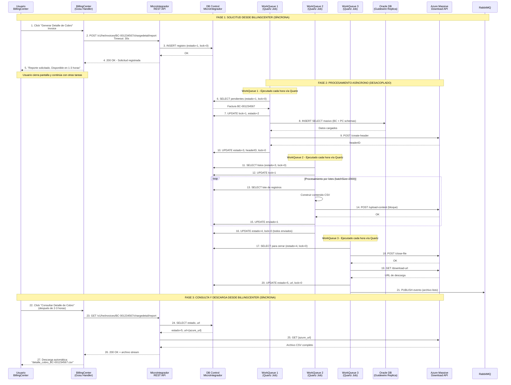
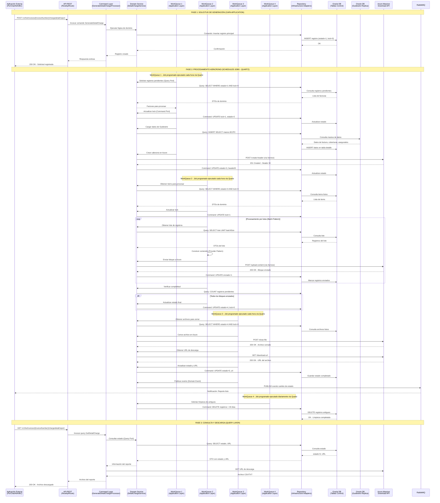
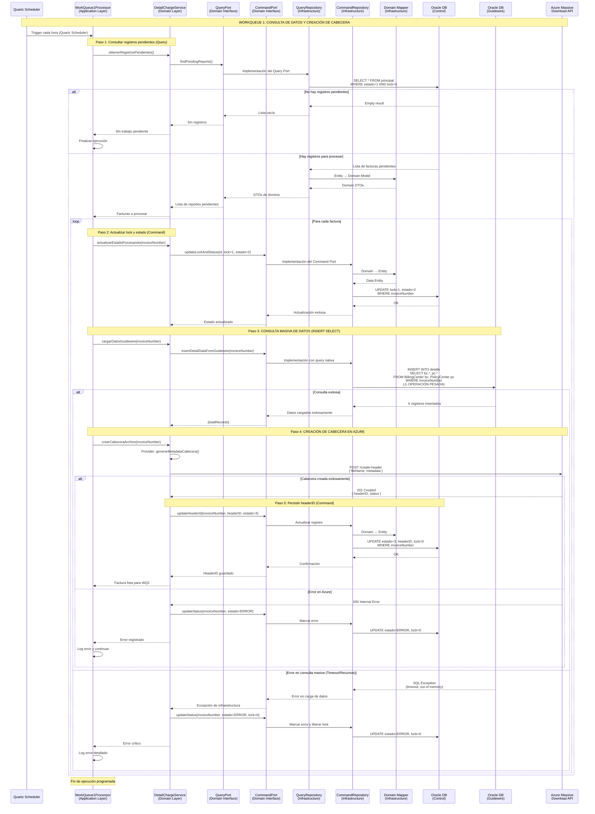
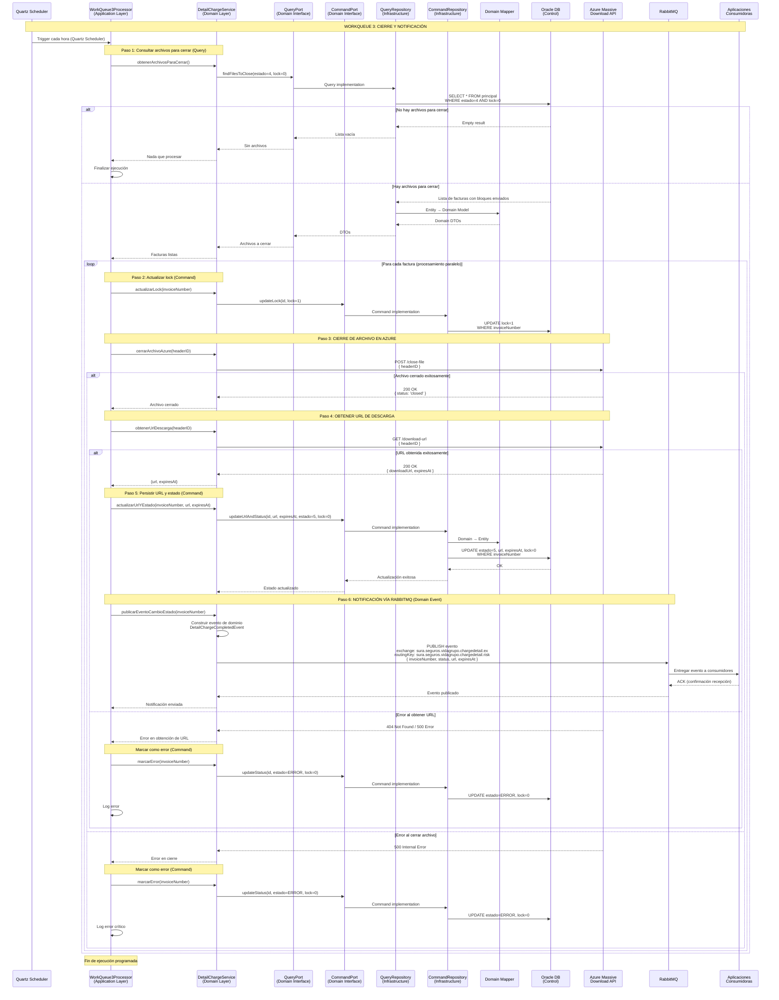
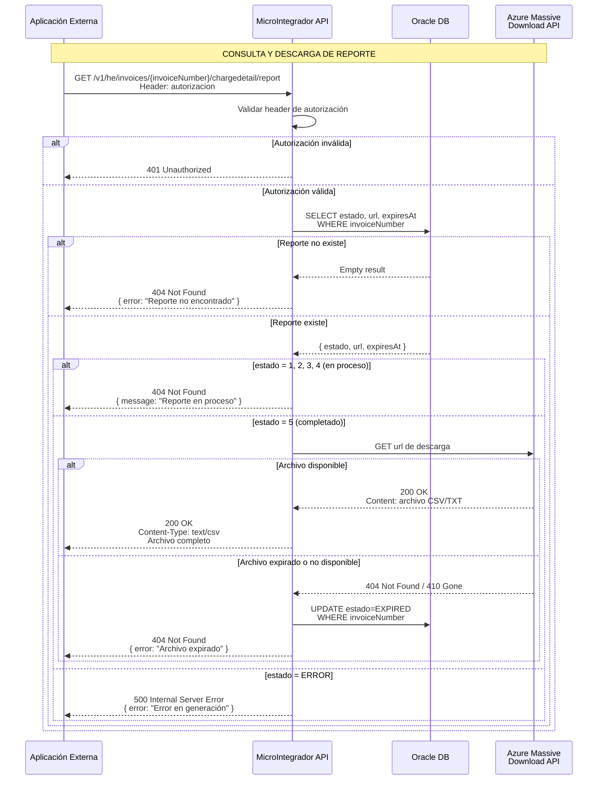
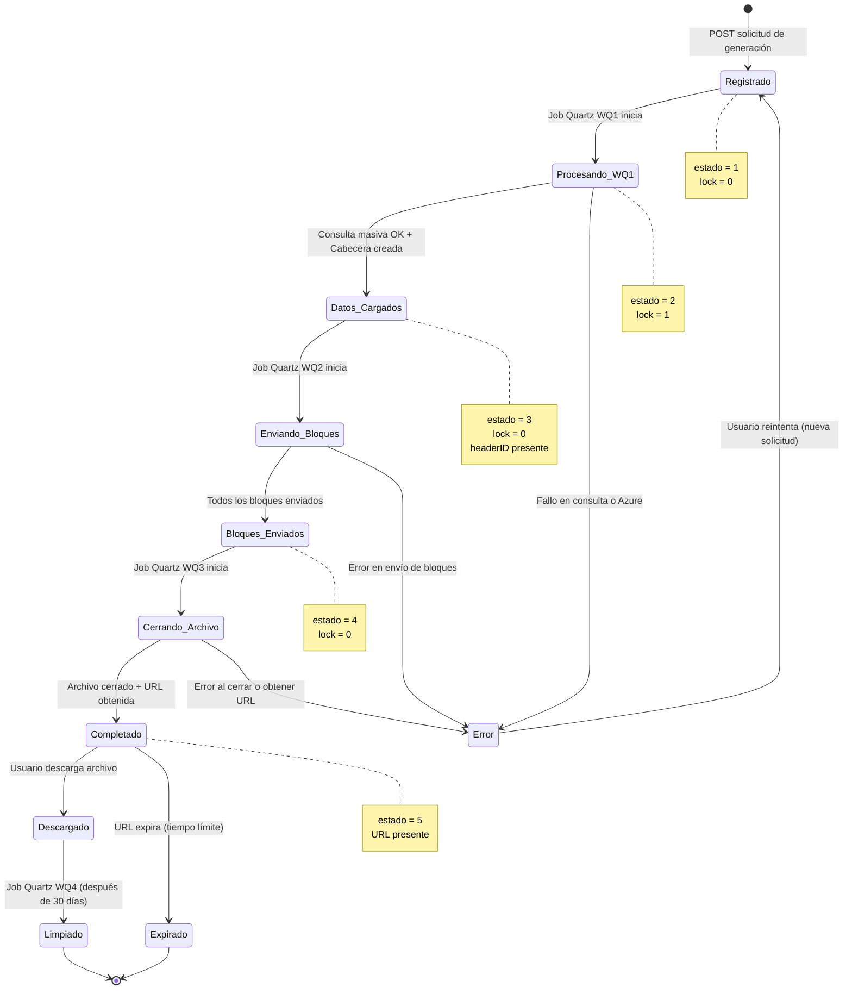
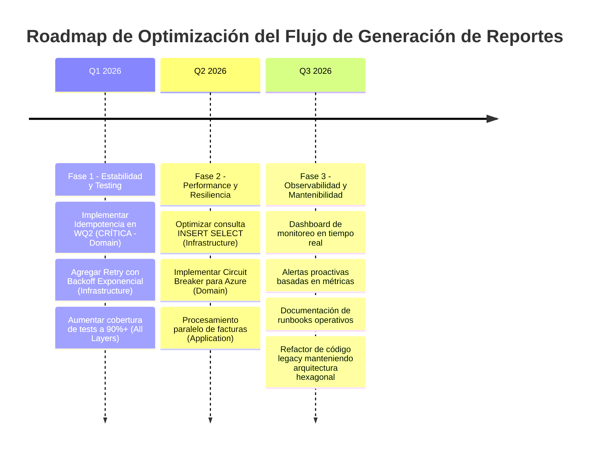

# Ecosistema Seguros Sura - Flujo: Generación de Reporte Detalle de Cobro 🔄

## 📋 **Introducción**

### Descripción del Flujo

El flujo de **Generación de Reporte de Detalle de Cobro** es un proceso crítico end-to-end que genera reportes detallados con información granular de cada asegurado dentro de una factura colectiva de pólizas de Vida Grupo. Este flujo abarca desde la **interacción del usuario en BillingCenter** hasta la **construcción asíncrona de archivos masivos** orquestada por el MicroIntegradorReportesVidaGrupo.

**Vista End-to-End del Flujo:**

1. **BillingCenter (Initiation Layer)**: Usuario consulta/genera reporte mediante botón en UI → Llamada REST síncrona al MicroIntegrador
2. **MicroIntegradorReportesVidaGrupo (Orchestration Layer)**: Registra solicitud y delega procesamiento asíncrono a **4 jobs programados (WorkQueues)** mediante Quartz Scheduler
3. **WorkQueues (Processing Layer)**: Construcción incremental del archivo (consulta datos, envío bloques, cierre) sin bloquear BillingCenter
4. **BillingCenter (Consumption Layer)**: Descarga archivo finalizado cuando usuario vuelve a consultar

Este documento cubre **ambas perspectivas**: la interacción síncrona desde BillingCenter y el procesamiento asíncrono en el MicroIntegrador.

**Jobs Programados del MicroIntegrador:**

1. **WorkQueue 1**: Consulta de datos de Guidewire y creación de cabecera en Azure (ejecutado cada hora)
2. **WorkQueue 2**: Construcción de registros del detalle y envío de bloques a Azure (ejecutado cada hora)
3. **WorkQueue 3**: Cierre de archivo en Azure y notificación vía RabbitMQ (ejecutado cada hora)
4. **WorkQueue 4**: Limpieza automática de registros antiguos (ejecutado diariamente)

### Scope del Documento

**Enfoque Principal**: Documentación técnica del flujo end-to-end desde BillingCenter hasta generación asíncrona en MicroIntegrador  
**Audiencia**: Desarrolladores, Arquitectos, Analistas de Negocio, Operaciones  
**Última Actualización**: 13 de Noviembre, 2025  
**Versión**: 3.0 (Actualizado con integración completa BillingCenter ↔ MicroIntegrador)

### Componentes Involucrados

| Componente                                  | Tecnología              | Puerto/Contexto                                 | Responsabilidad                                           |
| ------------------------------------------- | ----------------------- | ----------------------------------------------- | --------------------------------------------------------- |
| **BillingCenter (Guidewire)**               | Guidewire 8.0.7 + Gosu  | Puerto N/A (web app)                            | Interfaz de usuario, iniciación del flujo vía REST        |
| **MicroIntegradorReportesVidaGrupo**        | Apache Camel 3.20.0 + Java 17 | Puerto 9000                           | Microservicio de reportes con arquitectura hexagonal modular |
| **Módulo: detailcharge**                    | Hexagonal Architecture  | Módulo dentro del microservicio                 | Lógica específica del reporte de detalle de cobro         |
| **BillingCenter DB (Guidewire)**            | Oracle Database         | Esquema BC                                      | Fuente de datos de facturación y coberturas               |
| **PolicyCenter DB (Guidewire)**             | Oracle Database         | Esquema PC                                      | Fuente de datos de pólizas y asegurados                   |
| **Azure Massive Download API**              | Microsoft Azure         | https://labapicorevidagrupo.suramericana.com... | Construcción y almacenamiento de archivos masivos         |
| **RabbitMQ**                                | RabbitMQ                | msglab.suramericana.com.co:5672                 | Notificación asíncrona de cambio de estado a consumidores |
| **Oracle DB (Control MicroIntegrador)**     | Oracle Database         | JDBC 19.8.0.0                                   | Tablas de control y estado del proceso                    |
| **Oracle DB (Guidewire Replica)**           | Oracle Database         | JDBC 19.8.0.0                                   | Réplica read-only de esquemas BC y PC para consultas masivas |

---

## 🎯 **Vista desde BillingCenter: Iniciación y Consumo del Flujo**

### Contexto de Usuario

El flujo de generación de reporte de detalle de cobro se inicia desde la **interfaz de usuario de BillingCenter** cuando un usuario de negocio (típicamente del área de Facturación o Servicio al Cliente) necesita obtener el desglose granular de una factura colectiva o devolución de pólizas de Vida Grupo.

**Actor Principal**: Usuario de Facturación/Servicio al Cliente en BillingCenter
**Puntos de Entrada**: 
- Pantalla "Facturas Colectivas" (tabla de facturas de pólizas colectivas de Vida Grupo)
- Pantalla "Devoluciones de Pólizas Colectivas" (tabla de devoluciones/desembolsos colectivos)

**Opciones Disponibles en la Tabla**:
- **Botón "Generar reporte"**: Genera reporte básico directamente en BillingCenter (sin integración)
- **Botón "Generar detalle de cobro"**: Inicia flujo de integración con MicroIntegradorReportesVidaGrupo

**Acción del Usuario**: Click en botón "Generar detalle de cobro" en la fila de la factura/devolución

### Arquitectura de la Integración BillingCenter ↔ MicroIntegrador



### Flujo de Interacción: BillingCenter → MicroIntegrador

```mermaid
sequenceDiagram
    participant USER as Usuario<br/>(Facturación)
    participant UI as BillingCenter UI<br/>(Invoice Screen)
    participant GOSU as Gosu Handler<br/>(Backend BC)
    participant WS as Web Service Client<br/>(REST Client)
    participant MI as MicroIntegrador<br/>(REST API)
    participant DB_MI as DB Control<br/>(MicroIntegrador)
    participant WQ as WorkQueues<br/>(Async Jobs)
    participant AZURE as Azure API

    Note over USER,AZURE: ESCENARIO 1: CONSULTA AUTOMÁTICA AL HACER CLICK

    USER->>UI: 1. Navega a "Facturas Colectivas"<br/>o "Devoluciones de Pólizas Colectivas"
    UI->>UI: 2. Renderiza tabla con botones<br/>"Generar reporte" | "Generar detalle de cobro"
    USER->>UI: 3. Click en "Generar detalle de cobro"<br/>para Invoice #BC-001234567
    UI->>GOSU: 4. onClick() → consultarYGenerarDetalle()
    
    GOSU->>WS: 5. GET /v1/he/invoices/{invoiceNumber}/chargedetail/report
    Note over WS,MI: Llamada REST SÍNCRONA<br/>Timeout: 30 segundos
    
    WS->>MI: 6. HTTP GET Request<br/>Header: Authorization Bearer {token}
    MI->>MI: 7. Validar autenticación
    MI->>DB_MI: 8. SELECT estado, url FROM principal<br/>WHERE invoiceNumber='BC-001234567'
    
    alt Reporte NO existe en BD
        DB_MI-->>MI: Empty result
        MI-->>WS: 404 Not Found<br/>{ "error": "Reporte no encontrado" }
        WS-->>GOSU: Excepción: ReporteNoEncontrado
        
        Note over GOSU: GENERACIÓN AUTOMÁTICA (sin confirmación)
        GOSU->>GOSU: Detectar 404 → Invocar generación automáticamente
        
    else Reporte existe pero EN PROCESO (estado=1,2,3,4)
        DB_MI-->>MI: estado=3 (Datos cargados, enviando bloques)
        MI-->>WS: 404 Not Found<br/>{ "message": "Reporte en proceso",<br/>"status": "processing" }
        WS-->>GOSU: Excepción: ReporteEnProceso
        GOSU->>UI: Mostrar mensaje:<br/>"El reporte está siendo generado.<br/>Por favor intente en unos minutos."
        UI-->>USER: Notificación con spinner
        
    else Reporte COMPLETADO (estado=5)
        DB_MI-->>MI: estado=5, url={azure_url}
        MI-->>WS: 200 OK<br/>{ "status": "completed", "downloadUrl": "{url}" }
        WS-->>GOSU: Respuesta con URL
        
        Note over GOSU,UI: REDIRECCIÓN A PANTALLA DE DESCARGA
        GOSU->>UI: Redirigir a pantalla "Detalle de Cobro Disponible"
        UI->>UI: Renderizar pantalla con:<br/>- Info de la factura<br/>- Botón "Descargar Archivo"
        UI-->>USER: Pantalla de descarga lista
        
        USER->>UI: Click en "Descargar Archivo"
        UI->>GOSU: Invocar descarga
        GOSU->>AZURE: GET {azure_url} directamente
        AZURE-->>GOSU: Archivo CSV completo
        GOSU->>UI: Trigger descarga en navegador
        UI-->>USER: Descarga automática:<br/>"detalle_cobro_BC-001234567.csv"
            
        else Archivo expirado o no disponible
            AZURE-->>MI: 404 Not Found / 410 Gone
            MI->>DB_MI: UPDATE estado=EXPIRED
            MI-->>WS: 404 Not Found<br/>{ "error": "Archivo expirado.<br/>Solicite nueva generación" }
            WS-->>GOSU: Excepción: ArchivoExpirado
            GOSU->>UI: Mostrar mensaje de error
            UI-->>USER: "El archivo ha expirado.<br/>Genere nuevamente el reporte."
        end
        
    else Reporte con ERROR
        DB_MI-->>MI: estado=ERROR
        MI-->>WS: 500 Internal Server Error<br/>{ "error": "Error en generación" }
        WS-->>GOSU: Excepción: ErrorGeneracion
        GOSU->>UI: Mostrar mensaje de error
        UI-->>USER: "Ocurrió un error.<br/>Contacte soporte técnico."
    end

    Note over USER,AZURE: ESCENARIO 2: GENERACIÓN AUTOMÁTICA (POST después de 404)

    Note over GOSU: Continuación del flujo cuando GET retorna 404
    GOSU->>WS: POST /v1/he/invoices/{invoiceNumber}/chargedetail/report
    Note over WS,MI: Llamada REST SÍNCRONA<br/>Timeout: 30 segundos
    
    WS->>MI: HTTP POST Request<br/>Header: Authorization Bearer {token}<br/>Body: { "invoiceNumber": "BC-001234567" }
    MI->>MI: Validar autenticación
    MI->>DB_MI: SELECT * FROM principal<br/>WHERE invoiceNumber='BC-001234567'
    
    alt Reporte YA EXISTE (duplicado - race condition)
        DB_MI-->>MI: Registro existente (creado entre GET y POST)
        MI-->>WS: 409 Conflict<br/>{ "message": "Reporte ya existe",<br/>"status": "{estado_actual}" }
        WS-->>GOSU: Excepción: ReporteDuplicado
        GOSU->>UI: Mostrar en toolbar:<br/>"El reporte ya está siendo procesado.<br/>Por favor intente más tarde."
        UI-->>USER: Mensaje en toolbar (sin redirección)
        
    else Reporte NO EXISTE (creación exitosa)
        MI->>DB_MI: INSERT INTO principal<br/>(invoiceNumber, estado=1, lock=0, fecha_creacion=NOW())
        DB_MI-->>MI: OK - Registro creado
        MI-->>WS: 200 OK<br/>{ "message": "Solicitud registrada",<br/>"status": "pending" }
        WS-->>GOSU: Respuesta exitosa
        GOSU->>UI: Mostrar en toolbar (verde):<br/>"El archivo está en proceso de generación.<br/>Por favor intente más tarde."
        UI-->>USER: Mensaje en toolbar<br/>(permanece en tabla, sin redirección)
        
        Note over WQ,AZURE: Procesamiento asíncrono en background<br/>(WorkQueues 1→2→3 via Quartz)
        
        WQ->>DB_MI: WorkQueue 1 detecta solicitud (cada hora)
        WQ->>AZURE: Procesa datos y construye archivo
        WQ->>DB_MI: Actualiza estado=5, guarda URL
    end

    Note over USER,UI: Usuario puede cerrar pantalla<br/>y volver más tarde a consultar
```

### Casos de Uso de BillingCenter

#### CU-BC-01: Consulta y Descarga de Reporte Existente (Happy Path)

**Precondiciones**:
- Usuario autenticado en BillingCenter
- Usuario tiene permisos para gestionar facturas colectivas
- Factura o devolución colectiva existe en sistema (ej: BC-001234567)
- Reporte ya fue generado previamente (estado=5)

**Flujo Principal**:
1. Usuario navega a pantalla "Facturas Colectivas" o "Devoluciones de Pólizas Colectivas"
2. Sistema renderiza tabla con facturas/devoluciones
3. Usuario localiza factura BC-001234567 en la tabla
4. Usuario hace click en botón "Generar detalle de cobro" (columna derecha)
5. Sistema (Gosu handler) invoca REST GET al MicroIntegrador
6. MicroIntegrador responde 200 OK con status="completed" y URL de descarga
7. **Sistema redirige a pantalla "Detalle de Cobro Disponible"**:
   - Muestra información de la factura
   - Muestra botón "Descargar Archivo"
8. Usuario hace click en "Descargar Archivo"
9. Sistema descarga archivo desde Azure (usando URL provista)
10. Usuario recibe archivo CSV "detalle_cobro_BC-001234567.csv"

**Postcondiciones**:
- Usuario descarga archivo CSV con detalle de cobro
- Usuario permanece en pantalla de descarga (puede descargar múltiples veces)

#### CU-BC-02: Generación Automática de Nuevo Reporte (Primera Vez)

**Precondiciones**:
- Usuario autenticado en BillingCenter
- Factura o devolución existe y tiene coberturas activas
- No existe solicitud previa para esta factura (GET retornará 404)

**Flujo Principal**:
1. Usuario navega a pantalla "Facturas Colectivas" o "Devoluciones de Pólizas Colectivas"
2. Usuario hace click en botón "Generar detalle de cobro" para factura BC-001234567
3. Sistema (Gosu handler) invoca REST GET al MicroIntegrador (consulta automática)
4. MicroIntegrador responde 404 Not Found (reporte no existe)
5. **Sistema detecta 404 y automáticamente invoca REST POST** (sin confirmación del usuario)
6. MicroIntegrador registra solicitud en BD (estado=1)
7. MicroIntegrador responde 200 OK "Solicitud registrada"
8. Sistema muestra mensaje en **toolbar verde**: "El archivo está en proceso de generación. Por favor intente más tarde."
9. Usuario permanece en la tabla (sin redirección)
10. En background, WorkQueues del MicroIntegrador procesan la solicitud
11. Cuando usuario vuelva a hacer click en el botón (CU-BC-01), podrá descargar el archivo

**Postcondiciones**:
- Solicitud registrada en MicroIntegrador (estado=1)
- WorkQueues procesarán asíncronamente (1-3 horas)
- Usuario informado mediante mensaje en toolbar
- Usuario puede continuar trabajando en BillingCenter

### Manejo de Errores desde BillingCenter

| Código HTTP | Escenario                           | Mensaje al Usuario                                                  | Acción Sugerida                      |
| ----------- | ----------------------------------- | ------------------------------------------------------------------- | ------------------------------------ |
| **200 OK**  | Consulta exitosa (completado)       | Redirige a pantalla de descarga con botón "Descargar Archivo"       | N/A (flujo exitoso)                  |
| **404**     | Reporte no existe (GET)             | Genera automáticamente (POST) sin confirmación del usuario          | Mostrar toolbar: "En proceso..."     |
| **404**     | Reporte en proceso (GET)            | "El reporte está siendo generado. Por favor intente más tarde."    | Mostrar toolbar amarillo             |
| **404**     | Archivo expirado                    | "El archivo ha expirado (>7 días). Genere nuevamente el reporte."   | Generar automáticamente              |
| **409**     | Reporte duplicado (POST)            | "El reporte ya está siendo procesado. Por favor intente más tarde." | Mostrar toolbar (permanecer en tabla)|
| **500**     | Error en generación                 | "Ocurrió un error en el sistema. Contacte soporte técnico."         | Mostrar toolbar rojo + log error     |
| **401/403** | Error de autenticación              | "Sesión expirada. Inicie sesión nuevamente."                        | Redirect a login                     |
| **Timeout** | Timeout de red (>30s)               | "El servicio no responde. Intente nuevamente en unos minutos."      | Mostrar toolbar rojo                 |

### Configuración de Integración en BillingCenter

**Archivo de Configuración**: `BillingCenter/modules/configuration/config/integration-config.xml`

```xml
<!-- Configuración de integración con MicroIntegradorReportesVidaGrupo -->
<integration id="microintegrador-reportes">
  <endpoint>
    <name>DetailChargeReportService</name>
    <url>http://localhost:9000/v1/he/invoices/{invoiceNumber}/chargedetail/report</url>
    <timeout>30000</timeout> <!-- 30 segundos -->
    <retries>2</retries>
  </endpoint>
  
  <authentication>
    <type>Bearer</type>
    <tokenProvider>SuraOAuthProvider</tokenProvider>
  </authentication>
  
  <error-handling>
    <on-404>SHOW_GENERATE_OPTION</on-404>
    <on-409>REDIRECT_TO_QUERY</on-409>
    <on-timeout>RETRY_WITH_BACKOFF</on-timeout>
  </error-handling>
</integration>
```

**Código Gosu (Ejemplo Simplificado)**:

```gosu
// Archivo: BillingCenter/modules/configuration/gsrc/sura/bc/invoice/DetailChargeReportHandler.gs

package sura.bc.invoice

uses gw.api.web.WebserviceClient
uses sura.util.RestClient

class DetailChargeReportHandler {
  
  /**
   * Handler principal del botón "Generar detalle de cobro"
   * Primero consulta (GET), si no existe genera automáticamente (POST)
   * @param invoice La factura para la cual se consulta/genera el detalle
   */
  function handleGenerarDetalleCobro(invoice : Invoice) {
    var invoiceNumber = invoice.InvoiceNumber
    var endpoint = "http://localhost:9000/v1/he/invoices/${invoiceNumber}/chargedetail/report"
    
    try {
      // PASO 1: Intentar consultar reporte existente (GET)
      var response = RestClient.get(endpoint)
      
      if (response.StatusCode == 200) {
        // Reporte completado: Redirigir a pantalla de descarga
        var downloadUrl = response.JsonBody["downloadUrl"] as String
        redirectToDownloadScreen(invoice, downloadUrl)
        
      } else if (response.StatusCode == 404) {
        var message = response.JsonBody["message"] as String
        
        if (message.contains("en proceso")) {
          // Reporte en proceso: Mostrar mensaje en toolbar
          showToolbarMessage("El reporte está siendo generado. Por favor intente más tarde.", "warning")
        } else {
          // Reporte no existe: GENERAR AUTOMÁTICAMENTE (sin confirmación)
          generarReporteAutomaticamente(invoice)
        }
      } else if (response.StatusCode == 500) {
        showToolbarMessage("Ocurrió un error en el sistema. Contacte soporte técnico.", "error")
      }
      
    } catch (e : TimeoutException) {
      showToolbarMessage("El servicio no responde. Intente nuevamente en unos minutos.", "error")
    }
  }
  
  /**
   * Genera el reporte automáticamente cuando no existe (POST)
   * @param invoice La factura para generar el detalle
   */
  private function generarReporteAutomaticamente(invoice : Invoice) {
    var invoiceNumber = invoice.InvoiceNumber
    var endpoint = "http://localhost:9000/v1/he/invoices/${invoiceNumber}/chargedetail/report"
    
    try {
      var response = RestClient.post(endpoint, {"invoiceNumber": invoiceNumber})
      
      if (response.StatusCode == 200) {
        // Solicitud registrada exitosamente
        showToolbarMessage("El archivo está en proceso de generación. Por favor intente más tarde.", "success")
      } else if (response.StatusCode == 409) {
        // Race condition: Otro usuario ya generó entre GET y POST
        showToolbarMessage("El reporte ya está siendo procesado. Por favor intente más tarde.", "warning")
      } else {
        showToolbarMessage("Error al solicitar generación del reporte.", "error")
      }
    } catch (e : TimeoutException) {
      showToolbarMessage("El servicio no responde. Intente nuevamente.", "error")
    }
  }
  
  /**
   * Redirige a pantalla de descarga con botón
   * @param invoice La factura
   * @param downloadUrl URL de Azure para descarga
   */
  private function redirectToDownloadScreen(invoice : Invoice, downloadUrl : String) {
    // Navegar a pantalla "DetailChargeDownloadScreen.pcf"
    // Pasar invoice y downloadUrl como parámetros
    pcf.DetailChargeDownloadScreen.go(invoice, downloadUrl)
  }
  
  /**
   * Muestra mensaje en toolbar de BillingCenter
   * @param message Mensaje a mostrar
   * @param type Tipo: "success", "warning", "error"
   */
  private function showToolbarMessage(message : String, type : String) {
    // Implementación de toolbar message según tipo
    if (type == "success") {
      gw.api.util.LocationUtil.addRequestScopedInfoMessage(message)
    } else if (type == "warning") {
      gw.api.util.LocationUtil.addRequestScopedWarningMessage(message)
    } else {
      gw.api.util.LocationUtil.addRequestScopedErrorMessage(message)
    }
  }
}
```

**Configuración de PCF (Pantalla de Descarga)**:

```xml
<!-- Archivo: BillingCenter/modules/configuration/config/web/pcf/DetailChargeDownloadScreen.pcf -->
<PCF
  xmlns="urn:guidewire:pcf"
  title="Detalle de Cobro Disponible">
  
  <InputSet>
    <Input id="invoiceNumber" label="Número de Factura" value="invoice.InvoiceNumber" readOnly="true"/>
    <Input id="policyNumber" label="Póliza" value="invoice.Policy.PolicyNumber" readOnly="true"/>
    <Input id="reportDate" label="Fecha de Generación" value="Date.Today" readOnly="true"/>
  </InputSet>
  
  <ButtonSet>
    <PCFButton
      id="downloadButton"
      label="Descargar Archivo"
      action="downloadFile(downloadUrl)"
      icon="download"/>
    
    <PCFButton
      id="backButton"
      label="Volver"
      action="pcf.InvoicesListScreen.go()"/>
  </ButtonSet>
  
  <Code>
    function downloadFile(url : String) {
      // Descargar archivo directamente desde Azure usando URL
      var fileStream = RestClient.getStream(url)
      gw.api.web.WebUtil.downloadFile(fileStream, "detalle_cobro_${invoice.InvoiceNumber}.csv")
    }
  </Code>
</PCF>
```

### Puntos Críticos de Error en BillingCenter

#### Error: "Timeout al consultar MicroIntegrador (>30 segundos)"

**Causa**: El MicroIntegrador está descargando un archivo muy grande desde Azure y no responde dentro del timeout configurado.

**Diagnóstico**:
```gosu
// Revisar logs de BillingCenter
// Archivo: BillingCenter/logs/billing.log
// Buscar: "Timeout" + "MicroIntegrador" + invoiceNumber
```

**Solución**:
1. **Solución Inmediata**: Aumentar timeout en `integration-config.xml` de 30s a 60s
2. **Solución a Mediano Plazo**: Implementar patrón asíncrono:
   - POST para solicitar generación
   - GET con polling cada 30 segundos hasta que estado=5
   - Mostrar progress bar al usuario

#### Error: "Credenciales de autenticación inválidas (401 Unauthorized)"

**Causa**: El token OAuth usado por BillingCenter para autenticarse con MicroIntegrador ha expirado o es inválido.

**Diagnóstico**:
```bash
# Verificar token actual
curl -H "Authorization: Bearer {token}" \
  http://localhost:9000/v1/health

# Verificar configuración en BillingCenter
grep "oauth" BillingCenter/modules/configuration/config/integration-config.xml
```

**Solución**:
1. Renovar token en `SuraOAuthProvider`
2. Verificar que el servicio de OAuth está activo
3. Implementar refresh automático de token en el cliente

---

## 🔄 **Vista desde MicroIntegrador: Procesamiento Asíncrono**

> **Nota**: Las secciones siguientes documentan el procesamiento asíncrono que ocurre en el MicroIntegradorReportesVidaGrupo después de que BillingCenter registra la solicitud.

### Arquitectura del MicroIntegrador

El MicroIntegradorReportesVidaGrupo implementa una **arquitectura hexagonal estricta** combinada con **diseño modular por tipo de reporte**. El reporte de detalle de cobro está implementado como un módulo independiente (`detailcharge`) organizado en 3 capas:

- **Application Layer** (`application/detailcharge/`): Casos de uso - Commands, Queries y WorkQueue Processors (jobs programados)
- **Domain Layer** (`domain/detailcharge/`): Lógica de negocio pura - Services, Models, Ports (interfaces), Providers
- **Infrastructure Layer** (`infrastructure/detailcharge/`): Detalles técnicos - Adapters, Repositories, Routes (con Quartz Scheduler), Data Entities

**Patrones aplicados**: Hexagonal Architecture, CQRS (Command/Query Separation), Repository Pattern, **Scheduled Job Pattern (Quartz)**, Event-Driven Architecture, Provider Pattern, Batch Processing Pattern

### Diagramas de Secuencia del MicroIntegrador

### 0. Flujo End-to-End: BillingCenter → MicroIntegrador → Azure (Vista Completa)



### 1. Flujo Principal: Generación de Reporte Detalle de Cobro (Vista MicroIntegrador)



### 2. Flujo Detallado: WorkQueue 1 - Creación de Cabecera y Carga Inicial



### 3. Flujo Detallado: WorkQueue 2 - Construcción y Envío de Bloques

```mermaid
sequenceDiagram
    participant CRON as Quartz Scheduler
    participant WQ2 as WorkQueue2Processor<br/>(Application Layer)
    participant SVC as DetailChargeService<br/>(Domain Layer)
    participant PROV as ContentProvider<br/>(Domain Provider)
    participant PORT_Q as QueryPort<br/>(Domain Interface)
    participant PORT_C as CommandPort<br/>(Domain Interface)
    participant REPO_Q as QueryRepository<br/>(Infrastructure)
    participant REPO_C as CommandRepository<br/>(Infrastructure)
    participant MAPPER as Domain Mapper
    participant DB as Oracle DB<br/>(Control)
    participant AZURE as Azure Massive<br/>Download API

    Note over CRON,AZURE: WORKQUEUE 2: CONSTRUCCIÓN Y ENVÍO DE CONTENIDO

    CRON->>WQ2: Trigger cada hora (Quartz Scheduler)
    
    Note over WQ2,SVC: Sub-WorkQueue 2.1: Actualizar Lock (Command)
    WQ2->>SVC: obtenerItemsListosParaEnvio()
    SVC->>PORT_Q: findItemsReadyToSend(estado=3, lock=0)
    PORT_Q->>REPO_Q: Query implementation
    REPO_Q->>DB: SELECT * FROM principal<br/>WHERE estado=3 AND lock=0
    
    alt No hay registros listos
        DB-->>REPO_Q: Empty result
        REPO_Q-->>PORT_Q: Lista vacía
        PORT_Q-->>SVC: Sin items
        SVC-->>WQ2: Nada que procesar
        WQ2->>WQ2: Finalizar ejecución
    else Hay registros para procesar
        DB-->>REPO_Q: Lista de facturas con datos cargados
        REPO_Q->>MAPPER: Entity → Domain Model
        MAPPER-->>REPO_Q: Domain DTOs
        REPO_Q-->>PORT_Q: DTOs
        PORT_Q-->>SVC: Items a procesar
        SVC-->>WQ2: Facturas con datos listos
        
        WQ2->>SVC: actualizarLockItems(invoiceNumbers)
        SVC->>PORT_C: updateLock(ids, lock=1)
        PORT_C->>REPO_C: Command implementation
        REPO_C->>DB: UPDATE lock=1<br/>WHERE invoiceNumber IN (...)
        DB-->>REPO_C: OK
    end

    Note over WQ2,AZURE: Sub-WorkQueue 2.2: Procesar Items (Batch Pattern)

    loop Para cada factura (procesamiento paralelo)
        Note over WQ2,SVC: Consultar total de registros (Query)
        WQ2->>SVC: obtenerTotalRegistros(invoiceNumber)
        SVC->>PORT_Q: countDetailRecords(invoiceNumber)
        PORT_Q->>REPO_Q: Query count
        REPO_Q->>DB: SELECT COUNT(*) FROM detalle<br/>WHERE invoiceNumber
        DB-->>REPO_Q: totalRegistros
        REPO_Q-->>PORT_Q: count
        PORT_Q-->>SVC: total
        SVC-->>WQ2: {totalRegistros}
        
        Note over WQ2,SVC: Obtener lote de registros pendientes (Query)
        WQ2->>SVC: obtenerLotePendiente(invoiceNumber, batchSize)
        SVC->>PORT_Q: findPendingDetailBatch(invoiceNumber, enviado=0, limit)
        PORT_Q->>REPO_Q: Query with pagination
        REPO_Q->>DB: SELECT * FROM detalle<br/>WHERE invoiceNumber AND enviado=0<br/>LIMIT batchSize
        DB-->>REPO_Q: Lote de registros
        REPO_Q->>MAPPER: Entity → Domain Model
        MAPPER-->>REPO_Q: Domain DTOs
        REPO_Q-->>PORT_Q: Lote en domain
        PORT_Q-->>SVC: DTOs del lote
        SVC-->>WQ2: Registros a enviar
        
        alt Hay registros para enviar
            Note over WQ2,PROV: Construir contenido del bloque (Provider Pattern)
            WQ2->>PROV: buildBlockContent(detailRecords)
            PROV->>PROV: Aplicar reglas de negocio<br/>(formato CSV, coberturas, etc.)
            PROV-->>WQ2: Contenido formateado
            
            Note over WQ2,AZURE: Enviar bloque a Azure
            WQ2->>SVC: enviarBloqueAzure(headerID, content)
            SVC->>AZURE: POST /upload-content<br/>{ headerID, content }
            
            alt Bloque enviado exitosamente
                AZURE-->>SVC: 200 OK
                SVC-->>WQ2: Bloque confirmado
                
                Note over WQ2,SVC: Marcar registros como enviados (Command)
                WQ2->>SVC: marcarRegistrosEnviados(recordIds)
                SVC->>PORT_C: updateSentStatus(ids, enviado=1)
                PORT_C->>REPO_C: Command implementation
                REPO_C->>MAPPER: Domain → Entity
                REPO_C->>DB: UPDATE enviado=1<br/>WHERE id IN (lote)
                DB-->>REPO_C: OK
                REPO_C-->>PORT_C: Actualización exitosa
                PORT_C-->>SVC: Registros marcados
                
                Note over WQ2: ⚠️ PROBLEMA CONOCIDO: DUPLICACIÓN
                Note over WQ2: En producción, ocasionalmente<br/>los registros se envían dos veces<br/>si falla entre POST Azure y UPDATE DB
                
            else Error en envío a Azure
                AZURE-->>SVC: 500 Internal Error
                SVC-->>WQ2: Error en envío
                
                Note over WQ2,SVC: Incrementar contador de intentos (Command)
                WQ2->>SVC: incrementarIntentos(recordIds)
                SVC->>PORT_C: incrementRetries(ids)
                PORT_C->>REPO_C: Command implementation
                REPO_C->>DB: UPDATE intentos=intentos+1<br/>WHERE id IN (lote)
                WQ2->>WQ2: Log error y continuar
            end
            
            Note over WQ2,SVC: Verificar si todos los registros fueron enviados (Query)
            WQ2->>SVC: verificarCompletitud(invoiceNumber)
            SVC->>PORT_Q: countPendingDetails(invoiceNumber, enviado=0)
            PORT_Q->>REPO_Q: Query count
            REPO_Q->>DB: SELECT COUNT(*) FROM detalle<br/>WHERE invoiceNumber AND enviado=0
            DB-->>REPO_Q: count
            REPO_Q-->>PORT_Q: pendientes
            PORT_Q-->>SVC: cantidad pendiente
            SVC-->>WQ2: {pendientes}
            
            alt Todos los registros enviados
                WQ2->>SVC: finalizarEnvio(invoiceNumber)
                SVC->>PORT_C: updateStatusComplete(id, estado=4, lock=0)
                PORT_C->>REPO_C: Command implementation
                REPO_C->>DB: UPDATE estado=4, lock=0<br/>WHERE invoiceNumber
                DB-->>REPO_C: OK
                REPO_C-->>PORT_C: Estado actualizado
                PORT_C-->>SVC: Completado
                SVC-->>WQ2: Factura lista para WQ3
            else Aún hay registros pendientes
                WQ2->>WQ2: Se procesará en siguiente ejecución
            end
        end
    end
    
    Note over WQ2: Fin de ejecución programada
```



### 4. Flujo Detallado: WorkQueue 3 - Cierre de Archivo y Notificación



### 5. Flujo de Consulta y Descarga



---

## 📊 **Estados y Transiciones**

### Diagrama de Estados del Flujo



### Tabla de Estados

| Estado                  | Código | Lock | Descripción                                     | Job Programado Responsable | Siguiente Estado                  |
| ----------------------- | ------ | ---- | ----------------------------------------------- | -------------------------- | --------------------------------- |
| **Registrado**          | 1      | 0    | Solicitud registrada, pendiente de procesar     | -                          | Procesando_WQ1                    |
| **Procesando WQ1**      | 2      | 1    | Consultando datos y creando cabecera            | WorkQueue 1 (Quartz)       | Datos_Cargados / Error            |
| **Datos Cargados**      | 3      | 0    | Datos en DB, cabecera creada, listo para envío  | WorkQueue 1 (Quartz)       | Enviando_Bloques                  |
| **Enviando Bloques**    | 3      | 1    | Enviando bloques de contenido a Azure           | WorkQueue 2 (Quartz)       | Bloques_Enviados / Error          |
| **Bloques Enviados**    | 4      | 0    | Todos los bloques enviados, listo para cierre   | WorkQueue 2 (Quartz)       | Cerrando_Archivo                  |
| **Cerrando Archivo**    | 4      | 1    | Cerrando archivo y obteniendo URL               | WorkQueue 3 (Quartz)       | Completado / Error                |
| **Completado**          | 5      | 0    | Archivo listo para descarga                     | WorkQueue 3 (Quartz)       | Descargado / Expirado             |
| **Error**               | ERROR  | 0    | Error en procesamiento                          | Cualquiera                 | Registrado (reintento manual)     |
| **Expirado**            | EXPIRED| 0    | URL de descarga expirada                        | -                          | Fin                               |
| **Limpiado**            | -      | -    | Registro eliminado de BD                        | WorkQueue 4 (Quartz - Daily) | -                               |

---

## 📋 **Configuración y Parámetros**

### Configuración del Flujo

| Parámetro                            | Valor por Defecto | Descripción                                  | Impacto si se Cambia                                        | Capa Afectada           |
| ------------------------------------ | ----------------- | -------------------------------------------- | ----------------------------------------------------------- | ----------------------- |
| `workqueue.1.cron`                   | `0 0 * * * ?`     | Expresión cron para Job WQ1 (cada hora)      | Frecuencia de inicio de procesamiento de nuevas solicitudes | Infrastructure (Routes) |
| `workqueue.2.cron`                   | `0 0 * * * ?`     | Expresión cron para Job WQ2 (cada hora)      | Frecuencia de envío de bloques a Azure                      | Infrastructure (Routes) |
| `workqueue.2.batch.size`             | `2000`            | Tamaño de lote para envío de bloques         | Performance vs tamaño de bloques en Azure                   | Domain (Service)        |
| `workqueue.3.cron`                   | `0 0 * * * ?`     | Expresión cron para Job WQ3 (cada hora)      | Frecuencia de cierre de archivos                            | Infrastructure (Routes) |
| `workqueue.4.cron`                   | `0 0 0 * * ?`     | Expresión cron para Job WQ4 (diariamente)    | Frecuencia de limpieza de registros antiguos                | Infrastructure (Routes) |
| `workqueue.4.retention.days`         | `30`              | Días de retención de registros               | Espacio en disco vs histórico disponible                    | Domain (Service)        |
| `oracle.jdbc.maxTotal`               | `10`              | Conexiones máximas en pool de BD             | Concurrencia vs recursos de BD                              | Infrastructure (Config) |
| `azure.timeout.ms`                   | `60000`           | Timeout para llamadas a Azure API (60 seg)   | Tolerancia a latencia vs falsos timeouts                    | Infrastructure (Config) |

### Arquitectura de Capas y Responsabilidades

| Capa                  | Responsabilidad                                                      | Ejemplos de Componentes                                 |
| --------------------- | -------------------------------------------------------------------- | ------------------------------------------------------- |
| **Application**       | Casos de uso (Commands/Queries), WorkQueue Processors (Jobs Quartz)  | `GenerateDetailChargeProcessor`, `WorkQueue1Processor`  |
| **Domain**            | Lógica de negocio pura, Services, Ports (interfaces), Providers      | `DetailChargeService`, `ContentProvider`, Ports         |
| **Infrastructure**    | Detalles técnicos, Repositories (implementations), Routes, Adapters  | `CommandRepository`, `QueryRepository`, Routes, Mappers |

### Message Queues Utilizadas

| Cola                                                     | Exchange                                   | Routing Key                                        | TTL    | Propósito                                          |
| -------------------------------------------------------- | ------------------------------------------ | -------------------------------------------------- | ------ | -------------------------------------------------- |
| `sura.seguros.vidagrupo.chargedetail.risk.qu`            | `sura.seguros.vidagrupo.chargedetail.ex`   | `sura.seguros.vidagrupo.chargedetail.risk`         | N/A    | Notificación de cambio de estado a consumidores    |
| `sura.seguros.vidagrupo.chargedetail.risk.reply.qu`      | `sura.seguros.vidagrupo.chargedetail.ex`   | `sura.seguros.vidagrupo.chargedetail.risk.reply`   | N/A    | Confirmación de recepción de aplicaciones externas |

### Estructura del Mensaje RabbitMQ

```json
{
  "invoiceNumber": "BC-001234567",
  "status": "completed",
  "downloadUrl": "https://labapicorevidagrupo.suramericana.com/massive-download/files/abc123...",
  "expiresAt": "2025-11-05T23:59:59Z",
  "timestamp": "2025-10-30T18:45:00Z",
  "metadata": {
    "totalRecords": 15000,
    "fileSize": "25MB",
    "product": "Vida Grupo Integral"
  }
}
```

---

## 🔧 **Métricas y Monitoreo**

### Puntos Críticos de Medición

| Métrica                                  | Componente          | Umbral Esperado | Acción si se Excede                         | Capa Afectada      |
| ---------------------------------------- | ------------------- | --------------- | ------------------------------------------- | ------------------ |
| **Tiempo de consulta INSERT SELECT**    | WorkQueue 1 (Application) | < 5 minutos     | Revisar índices BD, optimizar query         | Infrastructure/DB  |
| **Tasa de éxito creación cabecera**      | WorkQueue 1 + Azure | > 95%           | Verificar conectividad Azure, credentials   | Domain Service     |
| **Tiempo de envío por bloque**           | WorkQueue 2 + Azure | < 30 segundos   | Reducir batch size, verificar red           | Application/Domain |
| **Tasa de duplicación de registros**     | WorkQueue 2         | 0%              | **CRÍTICO**: Implementar idempotencia       | Domain Service     |
| **Tiempo total del flujo (end-to-end)**  | Todo el sistema     | < 3 horas       | Revisar crons, paralelización, recursos BD  | All Layers         |
| **Tasa de error en cierre de archivo**   | WorkQueue 3 + Azure | < 5%            | Verificar estado de Azure API               | Domain Service     |
| **Latencia de publicación RabbitMQ**     | WorkQueue 3 + MQ    | < 5 segundos    | Verificar salud de RabbitMQ, colas llenas   | Infrastructure     |
| **Cobertura de tests unitarios**         | Todo el módulo detailcharge | > 85%   | Agregar tests para nuevo código            | All Layers (Tests) |

### Logs Críticos a Monitorear

| Componente      | Archivo Log                              | Patrón a Buscar                        | Severidad |
| --------------- | ---------------------------------------- | -------------------------------------- | --------- |
| **WorkQueue 1** | `vidagruporeportes-mi.log`               | `INSERT SELECT.*timeout`               | ERROR     |
| **WorkQueue 1** | `vidagruporeportes-mi.log`               | `Azure.*create-header.*500`            | ERROR     |
| **WorkQueue 2** | `vidagruporeportes-mi.log`               | `duplicate.*record.*sent`              | ERROR     |
| **WorkQueue 2** | `vidagruporeportes-mi.log`               | `Azure.*upload-content.*500`           | WARN      |
| **WorkQueue 3** | `vidagruporeportes-mi.log`               | `close-file.*failed`                   | ERROR     |
| **WorkQueue 3** | `vidagruporeportes-mi.log`               | `RabbitMQ.*connection.*refused`        | ERROR     |
| **Todos**       | `vidagruporeportes-mi.log`               | `OutOfMemoryError`                     | CRITICAL  |

### Comandos de Diagnóstico Útiles

```bash
# Verificar estado de work queues en BD
sqlplus ADM_VIDAGRUPOREPORTES/password@LABGWDWH <<EOF
SELECT estado, COUNT(*) as cantidad
FROM principal
GROUP BY estado;
EOF

# Revisar logs de errores recientes
tail -f /var/log/vidagruporeportes-mi/vidagruporeportes-mi.log | grep -i error

# Verificar salud de RabbitMQ
curl -u seguros.core.billing.usr:password \
  http://msglab.suramericana.com.co:15672/api/queues/%2Flab.vh/sura.seguros.vidagrupo.chargedetail.risk.qu

# Verificar pool de conexiones BD
curl http://localhost:9000/actuator/health | jq '.components.db'

# Búsqueda en Splunk de duplicaciones
# En Splunk UI: source="vidagruporeportes-mi" "duplicate" | stats count by invoiceNumber
```

---

## 🧪 **Escenarios de Prueba**

### Casos de Prueba Críticos

#### TC001: Flujo Exitoso Completo (Happy Path)

```gherkin
Scenario: Generación exitosa de reporte de detalle de cobro para factura con 5000 registros
  Given una factura colectiva "BC-001234567" existe en BillingCenter
  And la factura tiene 5000 asegurados con coberturas activas
  And no hay reportes previos para esta factura
  When la aplicación PorChat solicita el reporte vía POST /v1/he/invoices/BC-001234567/chargedetail/report
  Then el sistema responde 200 OK
  And se registra la solicitud con estado=1 en la tabla principal
  And WorkQueue 1 procesa la solicitud en su próxima ejecución (máximo 1 hora)
  And se consultan los datos de Guidewire exitosamente
  And se crea la cabecera en Azure Massive Download API
  And el estado cambia a estado=3
  And WorkQueue 2 envía los 5000 registros en bloques de 2000
  And todos los bloques se envían sin duplicación
  And el estado cambia a estado=4
  And WorkQueue 3 cierra el archivo en Azure
  And se obtiene la URL de descarga
  And se publica un evento en RabbitMQ notificando el cambio de estado
  And el estado cambia a estado=5
  And cuando PorChat consulta vía GET /v1/he/invoices/BC-001234567/chargedetail/report
  Then el sistema descarga el archivo desde Azure
  And responde 200 OK con el contenido del archivo CSV
```

#### TC002: Manejo de Error Crítico en Consulta Masiva (WorkQueue 1)

```gherkin
Scenario: Error de timeout en consulta INSERT SELECT de Guidewire
  Given una factura colectiva "BC-999999999" existe en BillingCenter
  And la factura tiene 1,000,000 asegurados (volumen extremo)
  And el estado de la solicitud es estado=1
  When WorkQueue 1 ejecuta la consulta INSERT SELECT
  And la consulta excede el timeout de 5 minutos
  Then WorkQueue 1 captura la excepción SQL Timeout
  And actualiza el registro a estado=ERROR
  And libera el lock (lock=0)
  And registra el error detallado en logs
  And el procesamiento de otros registros continúa sin afectación
  And cuando el usuario consulta el reporte vía GET
  Then el sistema responde 500 Internal Server Error
  And el mensaje indica "Error en generación del reporte"
```

#### TC003: Duplicación de Registros en Envío de Bloques (WorkQueue 2)

```gherkin
Scenario: Detección de duplicación de registros enviados a Azure (Problema Intermitente en Producción)
  Given una factura colectiva "BC-001234568" con estado=3
  And existen 10,000 registros en la tabla detalle
  And el batch size está configurado en 2000 registros
  When WorkQueue 2 inicia el envío del segundo bloque (registros 2001-4000)
  And ocurre una falla intermitente en la red durante el POST a Azure
  And Azure responde con timeout pero el bloque fue procesado parcialmente
  And WorkQueue 2 reintenta el envío del mismo bloque
  Then se detecta que algunos registros del bloque ya fueron enviados
  And el sistema registra un log de ERROR con patrón "duplicate record sent"
  And se incrementa el contador de intentos en la BD
  And el archivo final en Azure contiene registros duplicados
  And cuando el usuario descarga el archivo, identifica líneas repetidas
  # ACCIÓN CORRECTIVA ESPERADA: Implementar idempotencia en WorkQueue 2
```

#### TC004: Timeout en Procesamiento de Bloque a Azure

```gherkin
Scenario: Timeout al enviar bloque de contenido a Azure Massive Download API
  Given una factura colectiva "BC-001234569" con estado=3
  And existe un bloque de 2000 registros pendiente de envío
  When WorkQueue 2 invoca POST /upload-content a Azure
  And Azure no responde dentro de 60 segundos (timeout configurado)
  Then WorkQueue 2 captura la excepción de timeout
  And marca el intento como fallido en BD (intentos=intentos+1)
  And libera el lock para permitir reintento en próxima ejecución
  And registra un log de WARN con el detalle del timeout
  And en la próxima ejecución de WorkQueue 2, reintenta el mismo bloque
  And si Azure responde exitosamente, marca los registros como enviados
```

#### TC005: Archivo Expirado al Intentar Descarga

```gherkin
Scenario: Intento de descarga de reporte con URL expirada en Azure
  Given una factura colectiva "BC-001234570" con estado=5
  And la URL de descarga fue generada hace 7 días
  And la URL tiene una expiración de 7 días configurada en Azure
  When la aplicación PorChat solicita GET /v1/he/invoices/BC-001234570/chargedetail/report
  Then el microservicio intenta acceder a la URL de descarga
  And Azure responde 410 Gone (recurso expirado)
  Then el microservicio actualiza el estado a EXPIRED en BD
  And responde 404 Not Found con mensaje "Archivo expirado"
  And registra un log de WARN indicando la expiración
  And el usuario debe solicitar una nueva generación del reporte
```

#### TC006: Flujo End-to-End desde BillingCenter (Integración Completa)

```gherkin
Scenario: Usuario de BillingCenter genera y descarga reporte exitosamente
  Given el usuario está autenticado en BillingCenter
  And navega a la pantalla "Facturas Colectivas"
  And la factura "BC-001234567" aparece en la tabla
  And la factura tiene 5,000 asegurados activos
  And no existe reporte previo para esta factura
  
  When el usuario hace click en botón "Generar detalle de cobro"
  Then BillingCenter invoca GET /v1/he/invoices/BC-001234567/chargedetail/report
  And MicroIntegrador responde 404 Not Found (reporte no existe)
  And BillingCenter automáticamente invoca POST (sin confirmación del usuario)
  And MicroIntegrador responde 200 OK - Solicitud registrada
  And BillingCenter muestra en toolbar verde: "El archivo está en proceso de generación. Por favor intente más tarde"
  And el usuario permanece en la pantalla de tabla
  
  # Procesamiento asíncrono en background (WorkQueues 1→2→3)
  # Tiempo estimado: 2-3 horas
  
  When el usuario vuelve a la pantalla después de 3 horas
  And hace click nuevamente en "Generar detalle de cobro"
  Then BillingCenter invoca GET /v1/he/invoices/BC-001234567/chargedetail/report
  And MicroIntegrador responde 200 OK con status="completed" y downloadUrl
  And BillingCenter redirige a pantalla "Detalle de Cobro Disponible"
  And la pantalla muestra botón "Descargar Archivo"
  
  When el usuario hace click en "Descargar Archivo"
  Then BillingCenter descarga archivo desde Azure usando URL provista
  And el usuario recibe archivo "detalle_cobro_BC-001234567.csv"
  And el archivo contiene 5,000 registros (uno por asegurado)
```

#### TC007: BillingCenter - Timeout en Llamada Síncrona

```gherkin
Scenario: Timeout de red al consultar reporte desde BillingCenter
  Given el usuario está en pantalla "Invoice Detail" de factura "BC-001234571"
  And existe un reporte completado (estado=5)
  And el archivo en Azure pesa 50 MB (archivo muy grande)
  When el usuario hace click en "Consultar Detalle de Cobro"
  And BillingCenter invoca GET con timeout de 30 segundos
  And MicroIntegrador intenta descargar archivo desde Azure
  And la descarga toma más de 30 segundos debido al tamaño
  Then BillingCenter captura TimeoutException
  And muestra mensaje: "El servicio no responde. Intente nuevamente."
  And ofrece botón "Reintentar"
  
  When el usuario hace click en "Reintentar"
  And esta vez la red responde más rápido
  Then la descarga se completa exitosamente
  And el usuario recibe el archivo
```

#### TC008: BillingCenter - Usuario Consulta Reporte en Proceso

```gherkin
Scenario: Usuario intenta descargar reporte que aún está siendo generado
  Given el usuario generó un reporte hace 30 minutos
  And el reporte está en estado=3 (enviando bloques - WorkQueue 2)
  And el usuario navega a "Facturas Colectivas"
  
  When el usuario hace click en "Generar detalle de cobro"
  Then BillingCenter invoca GET /v1/he/invoices/BC-001234572/chargedetail/report
  And MicroIntegrador responde 404 Not Found con mensaje "Reporte en proceso"
  And BillingCenter muestra en toolbar amarillo: "El reporte está siendo generado. Por favor intente más tarde."
  And el usuario permanece en la tabla (sin redirección)
  And NO se ejecuta POST automáticamente (porque detecta "en proceso")
  
  When el usuario espera 45 minutos adicionales
  And hace click nuevamente en "Generar detalle de cobro"
  Then BillingCenter invoca GET nuevamente
  And el reporte ya está completado (estado=5)
  And BillingCenter redirige a pantalla de descarga
  And la descarga se realiza exitosamente
```

#### TC009: BillingCenter - Credenciales OAuth Expiradas

```gherkin
Scenario: Token de autenticación expirado al llamar MicroIntegrador
  Given el usuario está autenticado en BillingCenter
  And el token OAuth de BillingCenter expiró hace 5 minutos
  When el usuario hace click en "Generar Detalle de Cobro"
  Then BillingCenter invoca POST con token expirado
  And MicroIntegrador responde 401 Unauthorized
  And BillingCenter detecta error de autenticación
  And intenta renovar token automáticamente vía SuraOAuthProvider
  
  alt Renovación de token exitosa
    And BillingCenter reintenta POST con nuevo token
    And MicroIntegrador responde 200 OK
    And el proceso continúa normalmente
  else Renovación de token fallida
    And BillingCenter muestra: "Sesión expirada. Inicie sesión nuevamente."
    And redirige al usuario a pantalla de login
  end
```

#### TC010: BillingCenter - Solicitud Duplicada por Race Condition

```gherkin
Scenario: Usuario intenta generar reporte que fue creado por otro usuario simultáneamente
  Given dos usuarios están viendo la misma factura "BC-001234573"
  And no existe reporte previo
  
  When el Usuario A hace click en "Generar detalle de cobro" (t=0s)
  Then BillingCenter A invoca GET → 404 Not Found
  And BillingCenter A invoca POST
  And MicroIntegrador crea registro (estado=1)
  
  When el Usuario B hace click en "Generar detalle de cobro" (t=2s)
  Then BillingCenter B invoca GET → 404 Not Found (registro aún no visible)
  And BillingCenter B invoca POST
  And MicroIntegrador responde 409 Conflict (registro ya existe)
  And BillingCenter B muestra en toolbar amarillo: "El reporte ya está siendo procesado. Por favor intente más tarde."
  And Usuario B permanece en tabla
  
  When el Usuario B espera 3 horas e intenta nuevamente
  Then BillingCenter B invoca GET
  And MicroIntegrador responde 200 OK (completado)
  And Usuario B es redirigido a pantalla de descarga exitosamente
```

---

## 🔍 **Troubleshooting**

### Problemas Comunes y Soluciones

#### Error (BillingCenter): "Timeout al consultar MicroIntegrador - Servicio no responde"

**Causa**: BillingCenter está intentando descargar un archivo muy grande desde el MicroIntegrador y el timeout de 30 segundos es insuficiente. O bien, el MicroIntegrador está consultando Azure y experimenta latencia.

**Diagnóstico (desde BillingCenter)**:

```bash
# Revisar logs de BillingCenter
grep -i "timeout.*MicroIntegrador" BillingCenter/logs/billing.log | tail -20

# Verificar conectividad con MicroIntegrador
curl -w "@curl-format.txt" \
  -H "Authorization: Bearer {token}" \
  http://localhost:9000/v1/he/invoices/BC-001234567/chargedetail/report

# Verificar tamaño del archivo en Azure (si es muy grande)
```

**Solución**:
1. **Solución Inmediata**: Aumentar timeout en `BillingCenter/modules/configuration/config/integration-config.xml`:
   ```xml
   <timeout>60000</timeout> <!-- De 30s a 60s -->
   ```
2. **Solución Preventiva**: Implementar descarga asíncrona con polling:
   - Primera llamada: GET que retorna URL de Azure directamente
   - BillingCenter descarga desde Azure en background con progress bar
3. **Workaround**: Usuario puede reintentar manualmente después de esperar

---

#### Error (BillingCenter): "401 Unauthorized - Credenciales inválidas"

**Causa**: El token OAuth que BillingCenter usa para autenticarse con el MicroIntegrador ha expirado o es inválido.

**Diagnóstico (desde BillingCenter)**:

```bash
# Verificar token actual en configuración
grep "oauth.*token" BillingCenter/modules/configuration/config/integration-config.xml

# Probar token manualmente
curl -H "Authorization: Bearer {token}" \
  http://localhost:9000/v1/health

# Revisar logs de renovación de token
grep "SuraOAuthProvider.*renew" BillingCenter/logs/billing.log
```

**Solución**:
1. Verificar que el servicio de OAuth/Token Provider está activo
2. Renovar token manualmente en configuración si es necesario
3. Implementar auto-refresh de token en `SuraOAuthProvider`:
   ```gosu
   // En DetailChargeReportHandler.gs
   if (response.StatusCode == 401) {
     tokenProvider.refreshToken()
     response = RestClient.retryWithNewToken()
   }
   ```
4. Verificar que las credenciales de cliente OAuth son correctas

---

#### Error (BillingCenter): "Usuario no ve botón 'Generar detalle de cobro'"

**Causa**: El usuario no tiene los permisos necesarios en BillingCenter o el botón no está configurado correctamente en la PCF de la tabla de facturas colectivas.

**Diagnóstico**:

```bash
# Verificar permisos del usuario
# En BillingCenter, revisar roles del usuario en Admin Console

# Verificar configuración de UI (PCF de tabla)
grep -r "GenerarDetalleCobro.*Button" BillingCenter/modules/configuration/config/web/pcf/*.pcf

# Verificar que la feature está habilitada
grep "detailcharge.*enabled" BillingCenter/modules/configuration/config/config.xml
```

**Solución**:
1. Asignar permisos necesarios al rol del usuario:
   - Permission: `viewCollectiveInvoices`
   - Permission: `generateDetailChargeReport`
2. Verificar configuración del botón en PCF de la tabla:
   ```xml
   <!-- En tabla de Facturas Colectivas -->
   <PCFColumn id="detailChargeColumn">
     <PCFButton 
       visible="true" 
       permission="generateDetailChargeReport"
       label="Generar detalle de cobro"
       action="DetailChargeReportHandler.handleGenerarDetalleCobro(invoice)"/>
   </PCFColumn>
   ```
3. Diferenciar del botón "Generar reporte" (básico):
   ```xml
   <PCFButton 
     label="Generar reporte"
     action="generateBasicReport(invoice)"/>
   ```
4. Habilitar feature flag si está deshabilitada

---

#### Error: "INSERT SELECT timeout - Consulta masiva de Guidewire excede límite de tiempo"

**Causa**: La consulta de datos de BillingCenter y PolicyCenter en WorkQueue 1 es extremadamente pesada y puede tardar más de 5 minutos para facturas con cientos de miles de asegurados.

**Diagnóstico**:

```bash
# Verificar registros en estado=2 bloqueados
sqlplus ADM_VIDAGRUPOREPORTES/password@LABGWDWH <<EOF
SELECT invoiceNumber, estado, lock, fecha_actualizacion
FROM principal
WHERE estado = 2 AND lock = 1
  AND fecha_actualizacion < SYSDATE - INTERVAL '10' MINUTE;
EOF

# Revisar logs de WorkQueue 1
grep -i "INSERT SELECT.*timeout" /var/log/vidagruporeportes-mi/vidagruporeportes-mi.log
```

**Solución**:
1. Aumentar el timeout de consulta en properties: `oracle.jdbc.queryTimeout=600` (10 minutos)
2. Optimizar query: Revisar índices en tablas de Guidewire (bc.InvoiceItem, pc.PolicyLine, etc.)
3. Particionar consulta: Modificar WorkQueue 1 para procesar en sub-lotes si la factura tiene > 50,000 registros
4. Liberar lock manual si es necesario:
   ```sql
   UPDATE principal SET lock=0, estado=1 WHERE invoiceNumber='BC-XXXXXX';
   ```

---

#### Error: "Registros duplicados en archivo final de Azure"

**Causa**: WorkQueue 2 envía el mismo bloque dos veces debido a un fallo intermitente de red o timeout en Azure API, pero la actualización de `enviado=1` en BD no se confirma antes del reintento.

**Diagnóstico**:

```bash
# Buscar duplicaciones en logs
grep -i "duplicate.*record.*sent" /var/log/vidagruporeportes-mi/vidagruporeportes-mi.log

# Verificar registros con múltiples intentos
sqlplus ADM_VIDAGRUPOREPORTES/password@LABGWDWH <<EOF
SELECT invoiceNumber, COUNT(*) as duplicados
FROM detalle
WHERE enviado = 1
GROUP BY invoiceNumber, identificacion_asegurado
HAVING COUNT(*) > 1;
EOF

# Verificar estado de transacciones pendientes
SELECT * FROM v$transaction;
```

**Solución**:
1. **Solución Inmediata (Producción)**: Limpiar registros duplicados manualmente:
   ```sql
   DELETE FROM detalle WHERE rowid NOT IN (
     SELECT MIN(rowid) FROM detalle
     GROUP BY invoiceNumber, identificacion_asegurado
   );
   COMMIT;
   ```
2. **Solución Preventiva (Desarrollo)**: Implementar idempotencia en WorkQueue 2:
   - Agregar columna `idempotency_key` única por registro
   - Antes de enviar a Azure, verificar si el registro ya fue enviado
   - Usar transacciones atómicas: envío a Azure + actualización BD en mismo scope
3. **Configuración**: Reducir `workqueue.2.batch.size` a 1000 para minimizar impacto de reintentos

---

#### Error: "Azure Massive Download API responde 500 Internal Server Error"

**Causa**: La API de Azure está experimentando problemas internos o se alcanzó un límite de rate limiting.

**Diagnóstico**:

```bash
# Verificar errores de Azure en logs
grep -E "Azure.*(create-header|upload-content|close-file).*500" \
  /var/log/vidagruporeportes-mi/vidagruporeportes-mi.log | tail -20

# Verificar salud de Azure API (manual)
curl -H "Ocp-Apim-Subscription-Key: YOUR_KEY" \
  https://labapicorevidagrupo.suramericana.com/massive-download/health

# Revisar registros en estado de error
sqlplus ADM_VIDAGRUPOREPORTES/password@LABGWDWH <<EOF
SELECT COUNT(*) FROM principal WHERE estado = 'ERROR';
EOF
```

**Solución**:
1. Verificar status page de Azure (si existe)
2. Contactar al equipo de Azure/Infraestructura
3. Implementar reintentos automáticos con backoff exponencial en WorkQueues:
   ```java
   .onException(HttpException.class)
     .maximumRedeliveries(3)
     .redeliveryDelay(5000)
     .backOffMultiplier(2)
   ```
4. Si es rate limiting, espaciar las ejecuciones de WorkQueues:
   - Cambiar cron de hourly a cada 2 horas
   - Reducir batch size

---

#### Error: "RabbitMQ connection refused - WorkQueue 3 no puede publicar eventos"

**Causa**: WorkQueue 3 no puede conectarse a RabbitMQ para publicar eventos de cambio de estado, posiblemente por credenciales incorrectas, firewall, o RabbitMQ down.

**Diagnóstico**:

```bash
# Verificar conectividad a RabbitMQ
telnet msglab.suramericana.com.co 5672

# Verificar credenciales y estado de conexión
curl -u seguros.core.billing.usr:password \
  http://msglab.suramericana.com.co:15672/api/connections

# Revisar logs de WorkQueue 3
grep -i "RabbitMQ.*connection.*refused" \
  /var/log/vidagruporeportes-mi/vidagruporeportes-mi.log

# Verificar estado del servicio RabbitMQ
ssh admin@msglab.suramericana.com.co "sudo systemctl status rabbitmq-server"
```

**Solución**:
1. Verificar que RabbitMQ está activo:
   ```bash
   sudo systemctl restart rabbitmq-server
   ```
2. Validar credenciales en properties:
   ```properties
   spring.rabbitmq.producer.username=seguros.core.billing.usr
   spring.rabbitmq.producer.password=VERIFICAR_PASSWORD
   ```
3. Verificar firewall permite conexión al puerto 5672
4. **Importante**: El flujo puede continuar sin RabbitMQ (solo afecta notificaciones), pero el estado sigue siendo estado=5, por lo que las aplicaciones consumidoras deben implementar polling como fallback

---

### Comandos de Diagnóstico Útiles

```bash
# Verificar estado general de reportes
sqlplus ADM_VIDAGRUPOREPORTES/password@LABGWDWH <<EOF
SELECT 
  estado,
  COUNT(*) as cantidad,
  MIN(fecha_creacion) as mas_antiguo,
  MAX(fecha_creacion) as mas_reciente
FROM principal
GROUP BY estado;
EOF

# Identificar reportes bloqueados (locked por más de 2 horas)
sqlplus ADM_VIDAGRUPOREPORTES/password@LABGWDWH <<EOF
SELECT invoiceNumber, estado, lock, fecha_actualizacion
FROM principal
WHERE lock = 1 
  AND fecha_actualizacion < SYSDATE - INTERVAL '2' HOUR;
EOF

# Revisar últimos errores en Splunk
# En Splunk UI:
# source="vidagruporeportes-mi" level=ERROR | head 50

# Verificar métricas de Azure API (si endpoint de métricas existe)
curl -H "Ocp-Apim-Subscription-Key: YOUR_KEY" \
  https://labapicorevidagrupo.suramericana.com/massive-download/metrics

# Monitorear ejecución de WorkQueues en tiempo real
tail -f /var/log/vidagruporeportes-mi/vidagruporeportes-mi.log \
  | grep -E "(WORK_QUEUE_[1-4]|WQ[1-4])"

# Verificar tamaño de archivos generados en Azure (manual)
# Acceder a portal de Azure > Massive Download > Files > buscar por invoiceNumber
```

---

## 🚀 **Optimizaciones Futuras**

### Oportunidades de Mejora Identificadas

1. **Implementar Idempotencia en WorkQueue 2 (CRÍTICA - Domain Layer)**
   - **Descripción**: Agregar lógica de idempotencia en `DetailChargeService` para evitar duplicación de registros al enviar bloques a Azure. Implementar columna `idempotency_key` única y validación antes de envío en los `CommandPort`.
   - **Beneficio**: Eliminar completamente el problema de registros duplicados que ocurre intermitentemente en producción.
   - **Complejidad**: Media (2-3 semanas)
   - **Capas afectadas**: Domain (Service, Port), Infrastructure (Repository, Data Entity)

2. **Optimizar Consulta INSERT SELECT de WorkQueue 1 (Infrastructure Layer)**
   - **Descripción**: Refactorizar la consulta masiva de Guidewire en `QueryRepository` para usar hints de Oracle, índices optimizados, y posiblemente particionar en sub-lotes dinámicos basados en volumen de registros.
   - **Beneficio**: Reducir tiempo de WorkQueue 1 de 5 minutos a < 2 minutos para facturas grandes.
   - **Complejidad**: Alta (4-6 semanas, requiere análisis de DBA)
   - **Capas afectadas**: Infrastructure (Repository), Domain (Service)

3. **Implementar Circuit Breaker para Azure API (Domain Layer)**
   - **Descripción**: Agregar patrón Circuit Breaker en `DetailChargeService` usando Resilience4j para evitar saturar Azure API cuando está degradada. Pausar WorkQueues automáticamente si la tasa de error supera 50%.
   - **Beneficio**: Mejorar resiliencia del sistema y evitar acumulación de errores cuando Azure está down.
   - **Complejidad**: Media (2 semanas)
   - **Capas afectadas**: Domain (Service), Infrastructure (Config)

4. **Agregar Retry con Backoff Exponencial (Infrastructure Layer)**
   - **Descripción**: Implementar reintentos automáticos con backoff exponencial en Routes de Camel para llamadas a Azure API en WorkQueues 1, 2 y 3.
   - **Beneficio**: Reducir falsos errores por problemas transitorios de red o Azure.
   - **Complejidad**: Baja (1 semana)
   - **Capas afectadas**: Infrastructure (Routes)

5. **Dashboard de Monitoreo en Tiempo Real (Observability)**
   - **Descripción**: Crear dashboard en Grafana o Kibana que visualice métricas clave: estado de reportes, tasa de error por WorkQueue, tiempo promedio de procesamiento, colas de RabbitMQ.
   - **Beneficio**: Mejorar observabilidad y detección temprana de problemas.
   - **Complejidad**: Media (2-3 semanas)
   - **Capas afectadas**: Infrastructure (Monitoring), Application (Metrics)

6. **Procesamiento Paralelo de Facturas en WorkQueues (Application Layer)**
   - **Descripción**: Modificar `WorkQueue1Processor`, `WorkQueue2Processor` y `WorkQueue3Processor` para procesar múltiples facturas en paralelo (actualmente procesan secuencialmente dentro del loop).
   - **Beneficio**: Reducir tiempo total de procesamiento end-to-end de 3 horas a < 1.5 horas.
   - **Complejidad**: Media-Alta (3-4 semanas)
   - **Capas afectadas**: Application (Processors), Domain (Service con transacciones)

7. **Aumentar Cobertura de Tests a 90%+ (Test Layer)**
   - **Descripción**: Agregar tests unitarios faltantes especialmente en casos edge de manejo de errores y escenarios de concurrencia.
   - **Beneficio**: Mayor confianza en refactors, reducción de bugs en producción.
   - **Complejidad**: Baja-Media (1-2 semanas)
   - **Capas afectadas**: Tests para todas las capas (Application, Domain, Infrastructure)

### Roadmap de Evolución



---

## 📚 **Referencias**

### Documentación Arquitectónica

- **GPS Arquitectónico**: [GPS de Arquitectura](./index.md)
- **Documentación del Componente**: [MicroIntegradorReportesVidaGrupo](./architecture-microintegrador-reportes-vidagrupo.md)
  - Incluye detalles de arquitectura hexagonal modular
  - Patrones de diseño aplicados (CQRS, Repository, Scheduled Job, etc.)
  - Estructura de capas (Application/Domain/Infrastructure)
  - Estrategia de testing con 85%+ cobertura

### Código Fuente

**Módulo: detailcharge** (organizado por capas hexagonales)

- **Application Layer**: `application/detailcharge/`
  - Commands: `GenerateDetailChargeProcessor.java`
  - Queries: `GetDetailChargeProcessor.java`
  - WorkQueues: `WorkQueue1Processor.java` - `WorkQueue4Processor.java`

- **Domain Layer**: `domain/detailcharge/`
  - Services: `DetailChargeService.java`
  - Ports: `ports/command/`, `ports/query/`
  - Providers: `provider/ContentProvider.java`
  - Models & DTOs: `model/`, `dto/`

- **Infrastructure Layer**: `infrastructure/detailcharge/`
  - Repositories: `adapter/repository/command/`, `adapter/repository/query/`
  - Routes: `route/RestApiRoute.java`, `route/workqueue/`
  - Mappers: `adapter/mapper/`
  - Data Entities: `adapter/data/`

### Configuración

- **Properties**: `src/main/resources/properties/microintegrator.properties`
- **Scripts SQL**: `src/main/resources/sql/`
  - `CREATE.sql` - DDL de tablas
  - `script_billing.sql` - Consultas BillingCenter
  - `script_policy.sql` - Consultas PolicyCenter

### Recursos Externos

- **Azure Massive Download API**: Documentación interna de Azure Seguros Sura
- **RabbitMQ Configuración**: Wiki interna de Infraestructura Mensajería
- **Testing Strategy**: Ver tests en `test/` con estructura espejo de `main/`
- **BillingCenter**: [Documentación del Componente BillingCenter](./architecture-BillingCenter.md)
  - Configuración de integración con MicroIntegradores
  - Código Gosu de handlers (DetailChargeReportHandler.gs)
  - Configuración de PCF (botones UI)

---

## 🧪 **Estrategia de Testing**

### Cobertura Actual

- **Cobertura de tests (MicroIntegrador)**: 85%+ (124+ pruebas unitarias)
- **Distribución de tests por capa**:
  - Application Layer: Tests de Processors (Commands, Queries, WorkQueues)
  - Domain Layer: Tests de Services, Providers, Validators
  - Infrastructure Layer: Tests de Repositories, Mappers, Routes

### Tests de Integración End-to-End

1. **Tests de Integración BillingCenter ↔ MicroIntegrador**
   - Simulación de llamadas REST desde BillingCenter
   - Validación de manejo de timeouts y errores
   - Verificación de flujo completo: POST → procesamiento asíncrono → GET

2. **Tests de WorkQueues** (Scheduled Jobs)
   - Validación de jobs Quartz ejecutándose en secuencia
   - Tests de concurrencia y manejo de locks
   - Simulación de errores en Azure API y recuperación

### Tipos de Tests

1. **Tests Unitarios** (JUnit 4 + Mockito)
   - Services de dominio con mocks de Ports
   - Processors de aplicación con mocks de Services
   - Repositories con mocks de JDBC

2. **Tests de Integración**
   - Rutas de Camel end-to-end
   - Integración con BD Oracle (test containers)
   - Tests end-to-end BillingCenter ↔ MicroIntegrador (simulados)

3. **Mutation Testing** (PIT)
   - Validación de calidad de tests
   - Identificación de código no cubierto adecuadamente

### Comandos de Testing

```bash
# Tests unitarios del MicroIntegrador
cd MicroIntegradorReportesVidaGrupo
./gradlew test

# Reporte de cobertura (Jacoco)
./gradlew jacocoTestReport
# Ver: build/reports/jacocoHtml/index.html

# Mutation testing (PIT)
./gradlew pitest
# Ver: target/pit-reports/pitest/index.html

# Tests de integración (si existen)
./gradlew integrationTest
```

---

_Documentación generada con Método Ceiba - Arquitecto_  
_Última actualización: 13 de Noviembre, 2025_  
_Versión: 3.0 - Actualizado con integración completa BillingCenter ↔ MicroIntegrador_

**Cambios en v3.0:**
- ✅ **NUEVO**: Agregada perspectiva completa desde BillingCenter (iniciación y consumo del flujo)
- ✅ **NUEVO**: Documentadas pantallas reales de origen: "Facturas Colectivas" y "Devoluciones de Pólizas Colectivas"
- ✅ **NUEVO**: Diferenciación entre "Generar reporte" (básico) y "Generar detalle de cobro" (integración)
- ✅ **NUEVO**: Flujo automático de consulta-generación: GET primero, si 404 → POST automático (sin confirmación)
- ✅ **NUEVO**: Redirección a pantalla dedicada "Detalle de Cobro Disponible" con botón "Descargar Archivo"
- ✅ **NUEVO**: Mensajes en toolbar de BillingCenter (verde/amarillo/rojo) en lugar de dialogs
- ✅ **NUEVO**: Diagrama end-to-end mostrando interacción Usuario → BillingCenter → MicroIntegrador → Azure
- ✅ **NUEVO**: Documentados casos de uso de BillingCenter (CU-BC-01: Consulta y descarga, CU-BC-02: Generación automática)
- ✅ **NUEVO**: Secuencia detallada de interacción síncrona BC ↔ MI con flujo real
- ✅ **NUEVO**: Configuración de integración en BillingCenter (XML + Gosu + PCF de descarga)
- ✅ **NUEVO**: 5 casos de prueba específicos de BillingCenter actualizados con flujo real (TC006-TC010)
- ✅ **NUEVO**: 3 escenarios de troubleshooting específicos de BC con pantallas correctas
- ✅ **NUEVO**: Arquitectura de integración actualizada mostrando tabla, handler y pantalla de descarga
- ✅ **NUEVO**: Tabla de manejo de errores HTTP desde perspectiva del usuario BC con toolbar
- ✅ Actualizada introducción para reflejar flujo end-to-end completo
- ✅ Actualizada tabla de componentes incluyendo BillingCenter (Gosu Handler)
- ✅ Mantenida toda la documentación previa del MicroIntegrador (v2.0)

**Cambios en v2.0:**
- ✅ Actualizado con estructura hexagonal estricta por capas
- ✅ Documentado diseño modular por tipo de reporte (`detailcharge`)
- ✅ Agregados patrones de diseño aplicados (CQRS, Hexagonal, Scheduled Job, etc.)
- ✅ Incluida separación clara de responsabilidades (Application/Domain/Infrastructure)
- ✅ Documentada estrategia de testing con 85%+ cobertura
- ✅ Diagramas de secuencia actualizados mostrando capas y ports
- ✅ Referencias a ubicaciones exactas en código fuente
- ✅ Corregida terminología: "patrón de work queues programadas" → "Scheduled Job Pattern (Quartz Scheduler)" para reflejar con precisión el patrón de diseño real utilizado
