# MicroIntegradorReportesVidaGrupo - Flujo: Generación de Reporte Detalle de Cobro 🔄 

## 📋 **Introducción**

### Descripción del Flujo

El flujo de **Generación de Reporte de Detalle de Cobro** es un proceso crítico que genera reportes detallados con información granular de cada asegurado dentro de una factura colectiva de pólizas de Vida Grupo. Este flujo orquesta la construcción asíncrona de archivos masivos que pueden contener desde miles hasta millones de registros, utilizando un patrón de work queues programadas para procesar grandes volúmenes de datos de forma eficiente sin impactar el rendimiento del sistema.

El proceso inicia cuando una aplicación externa (PorChat, AVA, o BillingCenter) solicita la generación del reporte mediante una llamada REST. El sistema registra la solicitud y delega el procesamiento real a **4 work queues especializadas** que ejecutan de forma programada y distribuida:

1. **WorkQueue 1**: Consulta de datos de Guidewire y creación de cabecera en Azure
2. **WorkQueue 2**: Construcción de registros del detalle y envío de bloques a Azure
3. **WorkQueue 3**: Cierre de archivo en Azure y notificación vía RabbitMQ
4. **WorkQueue 4**: Limpieza automática de registros antiguos

### Scope del Documento

**Enfoque Principal**: Documentación técnica del flujo de trabajo end-to-end  
**Audiencia**: Desarrolladores, Arquitectos, Analistas de Negocio, Operaciones  
**Última Actualización**: 30 de Octubre, 2025

### Componentes Involucrados

| Componente                                  | Tecnología              | Puerto/Contexto                                 | Responsabilidad                                           |
| ------------------------------------------- | ----------------------- | ----------------------------------------------- | --------------------------------------------------------- |
| **MicroIntegradorReportesVidaGrupo**        | Apache Camel 3.20.0     | Puerto 9000                                     | Orquestación del flujo, procesamiento de work queues     |
| **BillingCenter (Guidewire)**               | Guidewire 8.0.7         | N/A (solo consulta de DB)                       | Fuente de datos de facturación y coberturas               |
| **PolicyCenter (Guidewire)**                | Guidewire 8.0.7         | N/A (solo consulta de DB)                       | Fuente de datos de pólizas y asegurados                   |
| **Azure Massive Download API**              | Microsoft Azure         | https://labapicorevidagrupo.suramericana.com... | Construcción y almacenamiento de archivos masivos         |
| **RabbitMQ**                                | RabbitMQ                | msglab.suramericana.com.co:5672                 | Notificación asíncrona de cambio de estado a consumidores |
| **Oracle DB (Control)**                     | Oracle Database         | JDBC 19.8.0.0                                   | Tablas de control y estado del proceso                    |
| **Oracle DB (Guidewire Replica)**           | Oracle Database         | JDBC 19.8.0.0                                   | Réplica read-only de esquemas BC y PC                     |
| **Aplicaciones Consumidoras (PorChat/AVA)** | Diversos                | N/A                                             | Solicitan y consumen reportes generados                   |

---

## 🔄 **Diagramas de Secuencia**

### 1. Flujo Principal: Generación de Reporte Detalle de Cobro (Vista General)

```mermaid
sequenceDiagram
    participant APP as Aplicación Externa<br/>(PorChat/AVA/BC)
    participant API as MicroIntegrador API<br/>(Netty HTTP :9000)
    participant WQ1 as WorkQueue 1<br/>(Scheduled - Hourly)
    participant WQ2 as WorkQueue 2<br/>(Scheduled - Hourly)
    participant WQ3 as WorkQueue 3<br/>(Scheduled - Hourly)
    participant WQ4 as WorkQueue 4<br/>(Scheduled - Daily)
    participant DB as Oracle DB<br/>(Tablas Control)
    participant GW as Oracle DB<br/>(Guidewire Replica)
    participant AZURE as Azure Massive<br/>Download API
    participant MQ as RabbitMQ

    Note over APP,MQ: FASE 1: SOLICITUD DE GENERACIÓN

    APP->>API: POST /v1/he/invoices/{invoiceNumber}/chargedetail/report
    API->>DB: INSERT registro principal (estado=1, lock=0)
    DB-->>API: OK
    API-->>APP: 200 OK - Solicitud registrada

    Note over APP,MQ: FASE 2: PROCESAMIENTO ASÍNCRONO (WORK QUEUES)

    Note over WQ1: Se ejecuta cada hora (Quartz)
    WQ1->>DB: SELECT principal WHERE estado=1 AND lock=0
    WQ1->>DB: UPDATE lock=1, estado=2 (procesando)
    WQ1->>GW: INSERT SELECT - Consulta masiva de datos BC/PC
    GW-->>WQ1: Datos de factura, coberturas, asegurados
    WQ1->>DB: INSERT datos en tabla detalle
    WQ1->>AZURE: POST /create-header (cabecera del archivo)
    AZURE-->>WQ1: 201 Created - Header ID
    WQ1->>DB: UPDATE estado=3, registrar headerID

    Note over WQ2: Se ejecuta cada hora (Quartz)
    WQ2->>DB: SELECT items WHERE estado=3 AND lock=0
    WQ2->>DB: UPDATE lock=1
    loop Procesamiento por lotes (bloques configurables)
        WQ2->>DB: SELECT lote de registros de detalle
        WQ2->>WQ2: Construir contenido del bloque
        WQ2->>AZURE: POST /upload-content (bloque de registros)
        AZURE-->>WQ2: 200 OK - Bloque enviado
        WQ2->>DB: Marcar registros como enviados
    end
    WQ2->>DB: UPDATE estado=4 cuando todos los bloques están enviados

    Note over WQ3: Se ejecuta cada hora (Quartz)
    WQ3->>DB: SELECT principal WHERE estado=4 AND lock=0
    WQ3->>DB: UPDATE lock=1
    WQ3->>AZURE: POST /close-file (cerrar archivo)
    AZURE-->>WQ3: 200 OK - Archivo cerrado
    WQ3->>AZURE: GET /download-url (obtener URL de descarga)
    AZURE-->>WQ3: 200 OK - URL del archivo
    WQ3->>DB: UPDATE estado=5, registrar URL
    WQ3->>MQ: PUBLISH evento cambio de estado
    MQ-->>APP: Notificación: Reporte listo para descarga

    Note over WQ4: Se ejecuta una vez al día (Quartz)
    WQ4->>DB: DELETE registros antiguos (> 30 días)
    DB-->>WQ4: OK - Limpieza completada

    Note over APP,MQ: FASE 3: CONSULTA Y DESCARGA

    APP->>API: GET /v1/he/invoices/{invoiceNumber}/chargedetail/report
    API->>DB: SELECT estado, URL WHERE invoiceNumber
    DB-->>API: estado=5, URL del archivo
    API->>AZURE: GET URL de descarga
    AZURE-->>API: Archivo CSV/TXT
    API-->>APP: 200 OK - Archivo descargado
```



### 2. Flujo Detallado: WorkQueue 1 - Creación de Cabecera y Carga Inicial

```mermaid
sequenceDiagram
    participant CRON as Quartz Scheduler
    participant WQ1 as WorkQueue 1<br/>Processor
    participant DB as Oracle DB<br/>(Control)
    participant GW as Oracle DB<br/>(Guidewire)
    participant AZURE as Azure Massive<br/>Download API

    Note over CRON,AZURE: WORKQUEUE 1: CONSULTA DE DATOS Y CREACIÓN DE CABECERA

    CRON->>WQ1: Trigger (cada hora)
    WQ1->>DB: SELECT * FROM principal<br/>WHERE estado=1 AND lock=0
    
    alt No hay registros pendientes
        DB-->>WQ1: Empty result
        WQ1->>WQ1: Finalizar (sin procesamiento)
    else Hay registros para procesar
        DB-->>WQ1: Lista de facturas pendientes
        
        loop Para cada factura
            WQ1->>DB: UPDATE lock=1, estado=2<br/>WHERE invoiceNumber
            
            Note over WQ1,GW: CONSULTA MASIVA DE DATOS (INSERT SELECT)
            WQ1->>GW: INSERT INTO detalle<br/>SELECT * FROM bc.*, pc.*<br/>WHERE invoiceNumber<br/>(OPERACIÓN PESADA)
            
            alt Consulta exitosa
                GW-->>WQ1: X registros insertados
                
                Note over WQ1,AZURE: CREACIÓN DE CABECERA EN AZURE
                WQ1->>WQ1: Generar request de cabecera<br/>(nombre archivo, metadata)
                WQ1->>AZURE: POST /create-header<br/>{ fileName, metadata }
                
                alt Cabecera creada
                    AZURE-->>WQ1: 201 Created<br/>{ headerID, status }
                    WQ1->>DB: UPDATE estado=3, headerID<br/>WHERE invoiceNumber
                else Error en Azure
                    AZURE-->>WQ1: 500 Internal Error
                    WQ1->>DB: UPDATE estado=ERROR<br/>WHERE invoiceNumber
                    WQ1->>WQ1: Log error y continuar
                end
                
            else Error en consulta masiva
                GW-->>WQ1: SQL Exception<br/>(timeout, recursos)
                WQ1->>DB: UPDATE estado=ERROR, lock=0<br/>WHERE invoiceNumber
                WQ1->>WQ1: Log error crítico
            end
        end
    end
```



### 3. Flujo Detallado: WorkQueue 2 - Construcción y Envío de Bloques

```mermaid
sequenceDiagram
    participant CRON as Quartz Scheduler
    participant WQ2 as WorkQueue 2<br/>Processor
    participant DB as Oracle DB<br/>(Control)
    participant AZURE as Azure Massive<br/>Download API

    Note over CRON,AZURE: WORKQUEUE 2: CONSTRUCCIÓN Y ENVÍO DE CONTENIDO

    CRON->>WQ2: Trigger (cada hora)
    
    Note over WQ2: SUB-WORKQUEUE 2.1: Actualizar Lock
    WQ2->>DB: SELECT * FROM principal<br/>WHERE estado=3 AND lock=0
    
    alt No hay registros listos
        DB-->>WQ2: Empty result
        WQ2->>WQ2: Finalizar
    else Hay registros para procesar
        DB-->>WQ2: Lista de facturas con datos cargados
        WQ2->>DB: UPDATE lock=1<br/>WHERE invoiceNumber IN (...)
    end

    Note over WQ2: SUB-WORKQUEUE 2.2: Procesar Items

    loop Para cada factura (procesamiento paralelo)
        WQ2->>DB: SELECT COUNT(*) FROM detalle<br/>WHERE invoiceNumber
        DB-->>WQ2: totalRegistros
        
        WQ2->>DB: SELECT * FROM detalle<br/>WHERE invoiceNumber AND enviado=0<br/>LIMIT batchSize
        DB-->>WQ2: Lote de registros
        
        alt Hay registros para enviar
            WQ2->>WQ2: Construir contenido del bloque<br/>(mapeo a formato CSV/TXT)
            
            WQ2->>WQ2: Generar request para Azure<br/>(headerID, bloque de datos)
            
            WQ2->>AZURE: POST /upload-content<br/>{ headerID, content }
            
            alt Bloque enviado exitosamente
                AZURE-->>WQ2: 200 OK
                WQ2->>DB: UPDATE enviado=1<br/>WHERE registros del lote
                
                Note over WQ2: ⚠️ PROBLEMA CONOCIDO: DUPLICACIÓN
                Note over WQ2: En producción, ocasionalmente<br/>los registros se envían dos veces
                
            else Error en envío
                AZURE-->>WQ2: 500 Internal Error
                WQ2->>DB: UPDATE intentos=intentos+1<br/>WHERE registros del lote
                WQ2->>WQ2: Log error y continuar
            end
            
            WQ2->>DB: SELECT COUNT(*) FROM detalle<br/>WHERE invoiceNumber AND enviado=0
            
            alt Todos los registros enviados
                DB-->>WQ2: count=0
                WQ2->>DB: UPDATE estado=4, lock=0<br/>WHERE invoiceNumber
            else Aún hay registros pendientes
                DB-->>WQ2: count>0
                WQ2->>WQ2: Procesará en siguiente ejecución
            end
        end
    end
```



### 4. Flujo Detallado: WorkQueue 3 - Cierre de Archivo y Notificación

```mermaid
sequenceDiagram
    participant CRON as Quartz Scheduler
    participant WQ3 as WorkQueue 3<br/>Processor
    participant DB as Oracle DB<br/>(Control)
    participant AZURE as Azure Massive<br/>Download API
    participant MQ as RabbitMQ
    participant APP as Aplicaciones<br/>Consumidoras

    Note over CRON,APP: WORKQUEUE 3: CIERRE Y NOTIFICACIÓN

    CRON->>WQ3: Trigger (cada hora)
    WQ3->>DB: SELECT * FROM principal<br/>WHERE estado=4 AND lock=0
    
    alt No hay archivos para cerrar
        DB-->>WQ3: Empty result
        WQ3->>WQ3: Finalizar
    else Hay archivos para cerrar
        DB-->>WQ3: Lista de facturas con bloques enviados
        
        loop Para cada factura (procesamiento paralelo)
            WQ3->>WQ3: Generar request de cierre<br/>(headerID)
            
            Note over WQ3,AZURE: CIERRE DE ARCHIVO EN AZURE
            WQ3->>AZURE: POST /close-file<br/>{ headerID }
            
            alt Archivo cerrado exitosamente
                AZURE-->>WQ3: 200 OK<br/>{ status: 'closed' }
                
                Note over WQ3,AZURE: OBTENER URL DE DESCARGA
                WQ3->>WQ3: Generar request para obtener URL
                WQ3->>AZURE: GET /download-url<br/>{ headerID }
                
                alt URL obtenida
                    AZURE-->>WQ3: 200 OK<br/>{ downloadUrl, expiresAt }
                    WQ3->>DB: UPDATE estado=5, url, expiresAt<br/>WHERE invoiceNumber
                    
                    Note over WQ3,MQ: NOTIFICACIÓN VÍA RABBITMQ
                    WQ3->>WQ3: Construir mensaje de evento<br/>{ invoiceNumber, status, url }
                    WQ3->>MQ: PUBLISH evento<br/>exchange: sura.seguros.vidagrupo.chargedetail.ex<br/>routingKey: sura.seguros.vidagrupo.chargedetail.risk
                    MQ->>APP: Entregar evento a consumidores
                    APP-->>MQ: ACK (confirmación recepción)
                    
                else Error al obtener URL
                    AZURE-->>WQ3: 404 Not Found / 500 Error
                    WQ3->>DB: UPDATE estado=ERROR<br/>WHERE invoiceNumber
                    WQ3->>WQ3: Log error
                end
                
            else Error al cerrar archivo
                AZURE-->>WQ3: 500 Internal Error
                WQ3->>DB: UPDATE estado=ERROR<br/>WHERE invoiceNumber
                WQ3->>WQ3: Log error crítico
            end
        end
    end
```



### 5. Flujo de Consulta y Descarga


---

## 📊 **Estados y Transiciones**

### Diagrama de Estados del Flujo


### Tabla de Estados

| Estado                  | Código | Lock | Descripción                                     | Work Queue Responsable | Siguiente Estado                  |
| ----------------------- | ------ | ---- | ----------------------------------------------- | ---------------------- | --------------------------------- |
| **Registrado**          | 1      | 0    | Solicitud registrada, pendiente de procesar     | -                      | Procesando_WQ1                    |
| **Procesando WQ1**      | 2      | 1    | Consultando datos y creando cabecera            | WorkQueue 1            | Datos_Cargados / Error            |
| **Datos Cargados**      | 3      | 0    | Datos en DB, cabecera creada, listo para envío  | WorkQueue 1            | Enviando_Bloques                  |
| **Enviando Bloques**    | 3      | 1    | Enviando bloques de contenido a Azure           | WorkQueue 2            | Bloques_Enviados / Error          |
| **Bloques Enviados**    | 4      | 0    | Todos los bloques enviados, listo para cierre   | WorkQueue 2            | Cerrando_Archivo                  |
| **Cerrando Archivo**    | 4      | 1    | Cerrando archivo y obteniendo URL               | WorkQueue 3            | Completado / Error                |
| **Completado**          | 5      | 0    | Archivo listo para descarga                     | WorkQueue 3            | Descargado / Expirado             |
| **Error**               | ERROR  | 0    | Error en procesamiento                          | Cualquiera             | Registrado (reintento manual)     |
| **Expirado**            | EXPIRED| 0    | URL de descarga expirada                        | -                      | Fin                               |
| **Limpiado**            | -      | -    | Registro eliminado de BD                        | WorkQueue 4            | -                                 |

---

## 📋 **Configuración y Parámetros**

### Configuración del Flujo

| Parámetro                            | Valor por Defecto | Descripción                                  | Impacto si se Cambia                                        |
| ------------------------------------ | ----------------- | -------------------------------------------- | ----------------------------------------------------------- |
| `workqueue.1.cron`                   | `0 0 * * * ?`     | Expresión cron WQ1 (cada hora)               | Frecuencia de inicio de procesamiento de nuevas solicitudes |
| `workqueue.2.cron`                   | `0 0 * * * ?`     | Expresión cron WQ2 (cada hora)               | Frecuencia de envío de bloques a Azure                      |
| `workqueue.2.batch.size`             | `2000`            | Tamaño de lote para envío de bloques         | Performance vs tamaño de bloques en Azure                   |
| `workqueue.3.cron`                   | `0 0 * * * ?`     | Expresión cron WQ3 (cada hora)               | Frecuencia de cierre de archivos                            |
| `workqueue.4.cron`                   | `0 0 0 * * ?`     | Expresión cron WQ4 (diaria a medianoche)     | Frecuencia de limpieza de registros antiguos                |
| `workqueue.4.retention.days`         | `30`              | Días de retención de registros               | Espacio en disco vs histórico disponible                    |
| `oracle.jdbc.maxTotal`               | `10`              | Conexiones máximas en pool de BD             | Concurrencia vs recursos de BD                              |
| `azure.timeout.ms`                   | `60000`           | Timeout para llamadas a Azure API (60 seg)   | Tolerancia a latencia vs falsos timeouts                    |

### Message Queues Utilizadas

| Cola                                                     | Exchange                                   | Routing Key                                        | TTL    | Propósito                                          |
| -------------------------------------------------------- | ------------------------------------------ | -------------------------------------------------- | ------ | -------------------------------------------------- |
| `sura.seguros.vidagrupo.chargedetail.risk.qu`            | `sura.seguros.vidagrupo.chargedetail.ex`   | `sura.seguros.vidagrupo.chargedetail.risk`         | N/A    | Notificación de cambio de estado a consumidores    |
| `sura.seguros.vidagrupo.chargedetail.risk.reply.qu`      | `sura.seguros.vidagrupo.chargedetail.ex`   | `sura.seguros.vidagrupo.chargedetail.risk.reply`   | N/A    | Confirmación de recepción de aplicaciones externas |

### Estructura del Mensaje RabbitMQ

```json
{
  "invoiceNumber": "BC-001234567",
  "status": "completed",
  "downloadUrl": "https://labapicorevidagrupo.suramericana.com/massive-download/files/abc123...",
  "expiresAt": "2025-11-05T23:59:59Z",
  "timestamp": "2025-10-30T18:45:00Z",
  "metadata": {
    "totalRecords": 15000,
    "fileSize": "25MB",
    "product": "Vida Grupo Integral"
  }
}
```

---

## 🔧 **Métricas y Monitoreo**

### Puntos Críticos de Medición

| Métrica                                  | Componente          | Umbral Esperado | Acción si se Excede                         |
| ---------------------------------------- | ------------------- | --------------- | ------------------------------------------- |
| **Tiempo de consulta INSERT SELECT**    | WorkQueue 1         | < 5 minutos     | Revisar índices BD, optimizar query         |
| **Tasa de éxito creación cabecera**      | WorkQueue 1 + Azure | > 95%           | Verificar conectividad Azure, credentials   |
| **Tiempo de envío por bloque**           | WorkQueue 2 + Azure | < 30 segundos   | Reducir batch size, verificar red           |
| **Tasa de duplicación de registros**     | WorkQueue 2         | 0%              | **CRÍTICO**: Investigar lógica de marcado   |
| **Tiempo total del flujo (end-to-end)**  | Todo el sistema     | < 3 horas       | Revisar crons, paralelización, recursos BD  |
| **Tasa de error en cierre de archivo**   | WorkQueue 3 + Azure | < 5%            | Verificar estado de Azure API               |
| **Latencia de publicación RabbitMQ**     | WorkQueue 3 + MQ    | < 5 segundos    | Verificar salud de RabbitMQ, colas llenas   |

### Logs Críticos a Monitorear

| Componente      | Archivo Log                              | Patrón a Buscar                        | Severidad |
| --------------- | ---------------------------------------- | -------------------------------------- | --------- |
| **WorkQueue 1** | `vidagruporeportes-mi.log`               | `INSERT SELECT.*timeout`               | ERROR     |
| **WorkQueue 1** | `vidagruporeportes-mi.log`               | `Azure.*create-header.*500`            | ERROR     |
| **WorkQueue 2** | `vidagruporeportes-mi.log`               | `duplicate.*record.*sent`              | ERROR     |
| **WorkQueue 2** | `vidagruporeportes-mi.log`               | `Azure.*upload-content.*500`           | WARN      |
| **WorkQueue 3** | `vidagruporeportes-mi.log`               | `close-file.*failed`                   | ERROR     |
| **WorkQueue 3** | `vidagruporeportes-mi.log`               | `RabbitMQ.*connection.*refused`        | ERROR     |
| **Todos**       | `vidagruporeportes-mi.log`               | `OutOfMemoryError`                     | CRITICAL  |

### Comandos de Diagnóstico Útiles

```bash
# Verificar estado de work queues en BD
sqlplus ADM_VIDAGRUPOREPORTES/password@LABGWDWH <<EOF
SELECT estado, COUNT(*) as cantidad
FROM principal
GROUP BY estado;
EOF

# Revisar logs de errores recientes
tail -f /var/log/vidagruporeportes-mi/vidagruporeportes-mi.log | grep -i error

# Verificar salud de RabbitMQ
curl -u seguros.core.billing.usr:password \
  http://msglab.suramericana.com.co:15672/api/queues/%2Flab.vh/sura.seguros.vidagrupo.chargedetail.risk.qu

# Verificar pool de conexiones BD
curl http://localhost:9000/actuator/health | jq '.components.db'

# Búsqueda en Splunk de duplicaciones
# En Splunk UI: source="vidagruporeportes-mi" "duplicate" | stats count by invoiceNumber
```

---

## 🧪 **Escenarios de Prueba**

### Casos de Prueba Críticos

#### TC001: Flujo Exitoso Completo (Happy Path)

```gherkin
Scenario: Generación exitosa de reporte de detalle de cobro para factura con 5000 registros
  Given una factura colectiva "BC-001234567" existe en BillingCenter
  And la factura tiene 5000 asegurados con coberturas activas
  And no hay reportes previos para esta factura
  When la aplicación PorChat solicita el reporte vía POST /v1/he/invoices/BC-001234567/chargedetail/report
  Then el sistema responde 200 OK
  And se registra la solicitud con estado=1 en la tabla principal
  And WorkQueue 1 procesa la solicitud en su próxima ejecución (máximo 1 hora)
  And se consultan los datos de Guidewire exitosamente
  And se crea la cabecera en Azure Massive Download API
  And el estado cambia a estado=3
  And WorkQueue 2 envía los 5000 registros en bloques de 2000
  And todos los bloques se envían sin duplicación
  And el estado cambia a estado=4
  And WorkQueue 3 cierra el archivo en Azure
  And se obtiene la URL de descarga
  And se publica un evento en RabbitMQ notificando el cambio de estado
  And el estado cambia a estado=5
  And cuando PorChat consulta vía GET /v1/he/invoices/BC-001234567/chargedetail/report
  Then el sistema descarga el archivo desde Azure
  And responde 200 OK con el contenido del archivo CSV
```

#### TC002: Manejo de Error Crítico en Consulta Masiva (WorkQueue 1)

```gherkin
Scenario: Error de timeout en consulta INSERT SELECT de Guidewire
  Given una factura colectiva "BC-999999999" existe en BillingCenter
  And la factura tiene 1,000,000 asegurados (volumen extremo)
  And el estado de la solicitud es estado=1
  When WorkQueue 1 ejecuta la consulta INSERT SELECT
  And la consulta excede el timeout de 5 minutos
  Then WorkQueue 1 captura la excepción SQL Timeout
  And actualiza el registro a estado=ERROR
  And libera el lock (lock=0)
  And registra el error detallado en logs
  And el procesamiento de otros registros continúa sin afectación
  And cuando el usuario consulta el reporte vía GET
  Then el sistema responde 500 Internal Server Error
  And el mensaje indica "Error en generación del reporte"
```

#### TC003: Duplicación de Registros en Envío de Bloques (WorkQueue 2)

```gherkin
Scenario: Detección de duplicación de registros enviados a Azure (Problema Intermitente en Producción)
  Given una factura colectiva "BC-001234568" con estado=3
  And existen 10,000 registros en la tabla detalle
  And el batch size está configurado en 2000 registros
  When WorkQueue 2 inicia el envío del segundo bloque (registros 2001-4000)
  And ocurre una falla intermitente en la red durante el POST a Azure
  And Azure responde con timeout pero el bloque fue procesado parcialmente
  And WorkQueue 2 reintenta el envío del mismo bloque
  Then se detecta que algunos registros del bloque ya fueron enviados
  And el sistema registra un log de ERROR con patrón "duplicate record sent"
  And se incrementa el contador de intentos en la BD
  And el archivo final en Azure contiene registros duplicados
  And cuando el usuario descarga el archivo, identifica líneas repetidas
  # ACCIÓN CORRECTIVA ESPERADA: Implementar idempotencia en WorkQueue 2
```

#### TC004: Timeout en Procesamiento de Bloque a Azure

```gherkin
Scenario: Timeout al enviar bloque de contenido a Azure Massive Download API
  Given una factura colectiva "BC-001234569" con estado=3
  And existe un bloque de 2000 registros pendiente de envío
  When WorkQueue 2 invoca POST /upload-content a Azure
  And Azure no responde dentro de 60 segundos (timeout configurado)
  Then WorkQueue 2 captura la excepción de timeout
  And marca el intento como fallido en BD (intentos=intentos+1)
  And libera el lock para permitir reintento en próxima ejecución
  And registra un log de WARN con el detalle del timeout
  And en la próxima ejecución de WorkQueue 2, reintenta el mismo bloque
  And si Azure responde exitosamente, marca los registros como enviados
```

#### TC005: Archivo Expirado al Intentar Descarga

```gherkin
Scenario: Intento de descarga de reporte con URL expirada en Azure
  Given una factura colectiva "BC-001234570" con estado=5
  And la URL de descarga fue generada hace 7 días
  And la URL tiene una expiración de 7 días configurada en Azure
  When la aplicación PorChat solicita GET /v1/he/invoices/BC-001234570/chargedetail/report
  Then el microservicio intenta acceder a la URL de descarga
  And Azure responde 410 Gone (recurso expirado)
  Then el microservicio actualiza el estado a EXPIRED en BD
  And responde 404 Not Found con mensaje "Archivo expirado"
  And registra un log de WARN indicando la expiración
  And el usuario debe solicitar una nueva generación del reporte
```

---

## 🔍 **Troubleshooting**

### Problemas Comunes y Soluciones

#### Error: "INSERT SELECT timeout - Consulta masiva de Guidewire excede límite de tiempo"

**Causa**: La consulta de datos de BillingCenter y PolicyCenter en WorkQueue 1 es extremadamente pesada y puede tardar más de 5 minutos para facturas con cientos de miles de asegurados.

**Diagnóstico**:

```bash
# Verificar registros en estado=2 bloqueados
sqlplus ADM_VIDAGRUPOREPORTES/password@LABGWDWH <<EOF
SELECT invoiceNumber, estado, lock, fecha_actualizacion
FROM principal
WHERE estado = 2 AND lock = 1
  AND fecha_actualizacion < SYSDATE - INTERVAL '10' MINUTE;
EOF

# Revisar logs de WorkQueue 1
grep -i "INSERT SELECT.*timeout" /var/log/vidagruporeportes-mi/vidagruporeportes-mi.log
```

**Solución**:
1. Aumentar el timeout de consulta en properties: `oracle.jdbc.queryTimeout=600` (10 minutos)
2. Optimizar query: Revisar índices en tablas de Guidewire (bc.InvoiceItem, pc.PolicyLine, etc.)
3. Particionar consulta: Modificar WorkQueue 1 para procesar en sub-lotes si la factura tiene > 50,000 registros
4. Liberar lock manual si es necesario:
   ```sql
   UPDATE principal SET lock=0, estado=1 WHERE invoiceNumber='BC-XXXXXX';
   ```

---

#### Error: "Registros duplicados en archivo final de Azure"

**Causa**: WorkQueue 2 envía el mismo bloque dos veces debido a un fallo intermitente de red o timeout en Azure API, pero la actualización de `enviado=1` en BD no se confirma antes del reintento.

**Diagnóstico**:

```bash
# Buscar duplicaciones en logs
grep -i "duplicate.*record.*sent" /var/log/vidagruporeportes-mi/vidagruporeportes-mi.log

# Verificar registros con múltiples intentos
sqlplus ADM_VIDAGRUPOREPORTES/password@LABGWDWH <<EOF
SELECT invoiceNumber, COUNT(*) as duplicados
FROM detalle
WHERE enviado = 1
GROUP BY invoiceNumber, identificacion_asegurado
HAVING COUNT(*) > 1;
EOF

# Verificar estado de transacciones pendientes
SELECT * FROM v$transaction;
```

**Solución**:
1. **Solución Inmediata (Producción)**: Limpiar registros duplicados manualmente:
   ```sql
   DELETE FROM detalle WHERE rowid NOT IN (
     SELECT MIN(rowid) FROM detalle
     GROUP BY invoiceNumber, identificacion_asegurado
   );
   COMMIT;
   ```
2. **Solución Preventiva (Desarrollo)**: Implementar idempotencia en WorkQueue 2:
   - Agregar columna `idempotency_key` única por registro
   - Antes de enviar a Azure, verificar si el registro ya fue enviado
   - Usar transacciones atómicas: envío a Azure + actualización BD en mismo scope
3. **Configuración**: Reducir `workqueue.2.batch.size` a 1000 para minimizar impacto de reintentos

---

#### Error: "Azure Massive Download API responde 500 Internal Server Error"

**Causa**: La API de Azure está experimentando problemas internos o se alcanzó un límite de rate limiting.

**Diagnóstico**:

```bash
# Verificar errores de Azure en logs
grep -E "Azure.*(create-header|upload-content|close-file).*500" \
  /var/log/vidagruporeportes-mi/vidagruporeportes-mi.log | tail -20

# Verificar salud de Azure API (manual)
curl -H "Ocp-Apim-Subscription-Key: YOUR_KEY" \
  https://labapicorevidagrupo.suramericana.com/massive-download/health

# Revisar registros en estado de error
sqlplus ADM_VIDAGRUPOREPORTES/password@LABGWDWH <<EOF
SELECT COUNT(*) FROM principal WHERE estado = 'ERROR';
EOF
```

**Solución**:
1. Verificar status page de Azure (si existe)
2. Contactar al equipo de Azure/Infraestructura
3. Implementar reintentos automáticos con backoff exponencial en WorkQueues:
   ```java
   .onException(HttpException.class)
     .maximumRedeliveries(3)
     .redeliveryDelay(5000)
     .backOffMultiplier(2)
   ```
4. Si es rate limiting, espaciar las ejecuciones de WorkQueues:
   - Cambiar cron de hourly a cada 2 horas
   - Reducir batch size

---

#### Error: "RabbitMQ connection refused - WorkQueue 3 no puede publicar eventos"

**Causa**: WorkQueue 3 no puede conectarse a RabbitMQ para publicar eventos de cambio de estado, posiblemente por credenciales incorrectas, firewall, o RabbitMQ down.

**Diagnóstico**:

```bash
# Verificar conectividad a RabbitMQ
telnet msglab.suramericana.com.co 5672

# Verificar credenciales y estado de conexión
curl -u seguros.core.billing.usr:password \
  http://msglab.suramericana.com.co:15672/api/connections

# Revisar logs de WorkQueue 3
grep -i "RabbitMQ.*connection.*refused" \
  /var/log/vidagruporeportes-mi/vidagruporeportes-mi.log

# Verificar estado del servicio RabbitMQ
ssh admin@msglab.suramericana.com.co "sudo systemctl status rabbitmq-server"
```

**Solución**:
1. Verificar que RabbitMQ está activo:
   ```bash
   sudo systemctl restart rabbitmq-server
   ```
2. Validar credenciales en properties:
   ```properties
   spring.rabbitmq.producer.username=seguros.core.billing.usr
   spring.rabbitmq.producer.password=VERIFICAR_PASSWORD
   ```
3. Verificar firewall permite conexión al puerto 5672
4. **Importante**: El flujo puede continuar sin RabbitMQ (solo afecta notificaciones), pero el estado sigue siendo estado=5, por lo que las aplicaciones consumidoras deben implementar polling como fallback

---

### Comandos de Diagnóstico Útiles

```bash
# Verificar estado general de reportes
sqlplus ADM_VIDAGRUPOREPORTES/password@LABGWDWH <<EOF
SELECT 
  estado,
  COUNT(*) as cantidad,
  MIN(fecha_creacion) as mas_antiguo,
  MAX(fecha_creacion) as mas_reciente
FROM principal
GROUP BY estado;
EOF

# Identificar reportes bloqueados (locked por más de 2 horas)
sqlplus ADM_VIDAGRUPOREPORTES/password@LABGWDWH <<EOF
SELECT invoiceNumber, estado, lock, fecha_actualizacion
FROM principal
WHERE lock = 1 
  AND fecha_actualizacion < SYSDATE - INTERVAL '2' HOUR;
EOF

# Revisar últimos errores en Splunk
# En Splunk UI:
# source="vidagruporeportes-mi" level=ERROR | head 50

# Verificar métricas de Azure API (si endpoint de métricas existe)
curl -H "Ocp-Apim-Subscription-Key: YOUR_KEY" \
  https://labapicorevidagrupo.suramericana.com/massive-download/metrics

# Monitorear ejecución de WorkQueues en tiempo real
tail -f /var/log/vidagruporeportes-mi/vidagruporeportes-mi.log \
  | grep -E "(WORK_QUEUE_[1-4]|WQ[1-4])"

# Verificar tamaño de archivos generados en Azure (manual)
# Acceder a portal de Azure > Massive Download > Files > buscar por invoiceNumber
```

---

## 🚀 **Optimizaciones Futuras**

### Oportunidades de Mejora Identificadas

1. **Implementar Idempotencia en WorkQueue 2 (CRÍTICA)**
   - **Descripción**: Agregar lógica de idempotencia para evitar duplicación de registros al enviar bloques a Azure. Implementar columna `idempotency_key` única y validación antes de envío.
   - **Beneficio**: Eliminar completamente el problema de registros duplicados que ocurre intermitentemente en producción.
   - **Complejidad**: Media (2-3 semanas)

2. **Optimizar Consulta INSERT SELECT de WorkQueue 1**
   - **Descripción**: Refactorizar la consulta masiva de Guidewire para usar hints de Oracle, índices optimizados, y posiblemente particionar en sub-lotes dinámicos basados en volumen de registros.
   - **Beneficio**: Reducir tiempo de WorkQueue 1 de 5 minutos a < 2 minutos para facturas grandes.
   - **Complejidad**: Alta (4-6 semanas, requiere análisis de DBA)

3. **Implementar Circuit Breaker para Azure API**
   - **Descripción**: Agregar patrón Circuit Breaker (usando Resilience4j) para evitar saturar Azure API cuando está degradada. Pausar WorkQueues automáticamente si la tasa de error supera 50%.
   - **Beneficio**: Mejorar resiliencia del sistema y evitar acumulación de errores cuando Azure está down.
   - **Complejidad**: Media (2 semanas)

4. **Agregar Retry con Backoff Exponencial**
   - **Descripción**: Implementar reintentos automáticos con backoff exponencial para llamadas a Azure API en WorkQueues 1, 2 y 3.
   - **Beneficio**: Reducir falsos errores por problemas transitorios de red o Azure.
   - **Complejidad**: Baja (1 semana)

5. **Dashboard de Monitoreo en Tiempo Real**
   - **Descripción**: Crear dashboard en Grafana o Kibana que visualice métricas clave: estado de reportes, tasa de error por WorkQueue, tiempo promedio de procesamiento, colas de RabbitMQ.
   - **Beneficio**: Mejorar observabilidad y detección temprana de problemas.
   - **Complejidad**: Media (2-3 semanas)

6. **Procesamiento Paralelo de Facturas en WorkQueues**
   - **Descripción**: Modificar WorkQueues 1, 2 y 3 para procesar múltiples facturas en paralelo (actualmente procesan secuencialmente dentro del loop).
   - **Beneficio**: Reducir tiempo total de procesamiento end-to-end de 3 horas a < 1.5 horas.
   - **Complejidad**: Media-Alta (3-4 semanas)

### Roadmap de Evolución

```mermaid
timeline
    title Roadmap de Optimización del Flujo de Generación de Reportes

    Q1 2026 : Fase 1 - Estabilidad
            : Implementar Idempotencia en WQ2 (CRÍTICA)
            : Agregar Retry con Backoff Exponencial
            : Mejorar logging y observabilidad

    Q2 2026 : Fase 2 - Performance
            : Optimizar consulta INSERT SELECT
            : Implementar Circuit Breaker para Azure
            : Procesamiento paralelo de facturas

    Q3 2026 : Fase 3 - Observabilidad
            : Dashboard de monitoreo en tiempo real
            : Alertas proactivas basadas en métricas
            : Documentación de runbooks operativos
```



---

## 📚 **Referencias**

- **GPS Arquitectónico**: [GPS de Arquitectura](./index.md)
- **Documentación de Componentes**:
  - [MicroIntegradorReportesVidaGrupo](./architecture-microintegrador-reportes-vidagrupo.md)
- **Configuración**: `MicroIntegradorReportesVidaGrupo/src/main/resources/properties/microintegrator.properties`
- **Scripts SQL**: `MicroIntegradorReportesVidaGrupo/src/main/resources/sql/`
- **Azure Massive Download API**: Documentación interna de Azure Seguros Sura
- **RabbitMQ Configuración**: Wiki interna de Infraestructura Mensajería

---

_Documentación generada con Método Ceiba - Arquitecto_  
_Última actualización: 30 de Octubre, 2025_  
_Versión: 1.0_
