# MicroIntegradorReportesVidaGrupo - Flujo: Generación de Reporte Detalle de Cobro 🔄

## 📋 **Introducción**

### Descripción del Flujo

El flujo de **Generación de Reporte de Detalle de Cobro** es un proceso crítico que genera reportes detallados con información granular de cada asegurado dentro de una factura colectiva de pólizas de Vida Grupo. Este flujo orquesta la construcción asíncrona de archivos masivos que pueden contener desde miles hasta millones de registros, utilizando el **Scheduled Job Pattern con Quartz Scheduler** para procesar grandes volúmenes de datos de forma eficiente sin impactar el rendimiento del sistema.

El proceso inicia cuando una aplicación externa (PorChat, AVA, o BillingCenter) solicita la generación del reporte mediante una llamada REST. El sistema registra la solicitud y delega el procesamiento real a **4 jobs programados (WorkQueues)** que ejecutan de forma calendarizada y distribuida mediante Quartz:

1. **WorkQueue 1**: Consulta de datos de Guidewire y creación de cabecera en Azure (ejecutado cada hora)
2. **WorkQueue 2**: Construcción de registros del detalle y envío de bloques a Azure (ejecutado cada hora)
3. **WorkQueue 3**: Cierre de archivo en Azure y notificación vía RabbitMQ (ejecutado cada hora)
4. **WorkQueue 4**: Limpieza automática de registros antiguos (ejecutado diariamente)

### Scope del Documento

**Enfoque Principal**: Documentación técnica del flujo de trabajo end-to-end con énfasis en arquitectura hexagonal  
**Audiencia**: Desarrolladores, Arquitectos, Analistas de Negocio, Operaciones  
**Última Actualización**: 10 de Noviembre, 2025  
**Versión**: 2.0 (Actualizado con estructura hexagonal modular)

### Componentes Involucrados

| Componente                                  | Tecnología              | Puerto/Contexto                                 | Responsabilidad                                           |
| ------------------------------------------- | ----------------------- | ----------------------------------------------- | --------------------------------------------------------- |
| **MicroIntegradorReportesVidaGrupo**        | Apache Camel 3.20.0 + Java 17 | Puerto 9000                           | Microservicio de reportes con arquitectura hexagonal modular |
| **Módulo: detailcharge**                    | Hexagonal Architecture  | Módulo dentro del microservicio                 | Lógica específica del reporte de detalle de cobro         |
| **BillingCenter (Guidewire)**               | Guidewire 8.0.7         | N/A (solo consulta de DB)                       | Fuente de datos de facturación y coberturas               |
| **PolicyCenter (Guidewire)**                | Guidewire 8.0.7         | N/A (solo consulta de DB)                       | Fuente de datos de pólizas y asegurados                   |
| **Azure Massive Download API**              | Microsoft Azure         | https://labapicorevidagrupo.suramericana.com... | Construcción y almacenamiento de archivos masivos         |
| **RabbitMQ**                                | RabbitMQ                | msglab.suramericana.com.co:5672                 | Notificación asíncrona de cambio de estado a consumidores |
| **Oracle DB (Control)**                     | Oracle Database         | JDBC 19.8.0.0                                   | Tablas de control y estado del proceso                    |
| **Oracle DB (Guidewire Replica)**           | Oracle Database         | JDBC 19.8.0.0                                   | Réplica read-only de esquemas BC y PC                     |
| **Aplicaciones Consumidoras (PorChat/AVA)** | Diversos                | N/A                                             | Solicitan y consumen reportes generados                   |

### Arquitectura del Componente

El MicroIntegradorReportesVidaGrupo implementa una **arquitectura hexagonal estricta** combinada con **diseño modular por tipo de reporte**. El reporte de detalle de cobro está implementado como un módulo independiente (`detailcharge`) organizado en 3 capas:

- **Application Layer** (`application/detailcharge/`): Casos de uso - Commands, Queries y WorkQueue Processors (jobs programados)
- **Domain Layer** (`domain/detailcharge/`): Lógica de negocio pura - Services, Models, Ports (interfaces), Providers
- **Infrastructure Layer** (`infrastructure/detailcharge/`): Detalles técnicos - Adapters, Repositories, Routes (con Quartz Scheduler), Data Entities

**Patrones aplicados**: Hexagonal Architecture, CQRS (Command/Query Separation), Repository Pattern, **Scheduled Job Pattern (Quartz)**, Event-Driven Architecture, Provider Pattern, Batch Processing Pattern

---

## 🔄 **Diagramas de Secuencia**

### 1. Flujo Principal: Generación de Reporte Detalle de Cobro (Vista General)

```mermaid
sequenceDiagram
    participant APP as Aplicación Externa<br/>(PorChat/AVA/BC)
    participant API as API REST<br/>(RestApiRoute)
    participant CMD as Command Layer<br/>(GenerateDetailChargeProcessor)
    participant SVC as Domain Service<br/>(DetailChargeService)
    participant WQ1 as WorkQueue 1<br/>(Application Layer)
    participant WQ2 as WorkQueue 2<br/>(Application Layer)
    participant WQ3 as WorkQueue 3<br/>(Application Layer)
    participant WQ4 as WorkQueue 4<br/>(Application Layer)
    participant REPO as Repository<br/>(Infrastructure Adapters)
    participant DB as Oracle DB<br/>(Tablas Control)
    participant GW as Oracle DB<br/>(Guidewire Replica)
    participant AZURE as Azure Massive<br/>Download API
    participant MQ as RabbitMQ

    Note over APP,MQ: FASE 1: SOLICITUD DE GENERACIÓN (CAPA APPLICATION)

    APP->>API: POST /v1/he/invoices/{invoiceNumber}/chargedetail/report
    API->>CMD: Invocar comando GenerateDetailCharge
    CMD->>SVC: Ejecutar lógica de dominio
    SVC->>REPO: Comando: Insertar registro principal
    REPO->>DB: INSERT registro (estado=1, lock=0)
    DB-->>REPO: OK
    REPO-->>SVC: Confirmación
    SVC-->>CMD: Registro creado
    CMD-->>API: Respuesta exitosa
    API-->>APP: 200 OK - Solicitud registrada

    Note over APP,MQ: FASE 2: PROCESAMIENTO ASÍNCRONO (SCHEDULED JOBS - QUARTZ)

    Note over WQ1: WorkQueue 1 - Job programado ejecutado cada hora vía Quartz
    WQ1->>SVC: Solicitar registros pendientes (Query Port)
    SVC->>REPO: Query: SELECT WHERE estado=1 AND lock=0
    REPO->>DB: Consulta registros pendientes
    DB-->>REPO: Lista de facturas
    REPO-->>SVC: DTOs de dominio
    SVC-->>WQ1: Facturas para procesar
    
    WQ1->>SVC: Actualizar lock (Command Port)
    SVC->>REPO: Command: UPDATE lock=1, estado=2
    REPO->>DB: Actualizar estado
    
    WQ1->>SVC: Cargar datos de Guidewire
    SVC->>REPO: Query: INSERT SELECT masivo BC/PC
    REPO->>GW: Consulta masiva de datos
    GW-->>REPO: Datos de factura, coberturas, asegurados
    REPO->>DB: INSERT datos en tabla detalle
    
    WQ1->>SVC: Crear cabecera en Azure
    SVC->>AZURE: POST /create-header (vía Service)
    AZURE-->>SVC: 201 Created - Header ID
    SVC->>REPO: Command: UPDATE estado=3, headerID
    REPO->>DB: Actualizar estado

    Note over WQ2: WorkQueue 2 - Job programado ejecutado cada hora vía Quartz
    WQ2->>SVC: Obtener items para procesar
    SVC->>REPO: Query: SELECT WHERE estado=3 AND lock=0
    REPO->>DB: Consulta items listos
    DB-->>REPO: Lista de items
    REPO-->>SVC: DTOs de dominio
    
    WQ2->>SVC: Actualizar lock
    SVC->>REPO: Command: UPDATE lock=1
    
    loop Procesamiento por lotes (Batch Pattern)
        WQ2->>SVC: Obtener lote de registros
        SVC->>REPO: Query: SELECT lote LIMIT batchSize
        REPO->>DB: Consulta lote
        DB-->>REPO: Registros del lote
        REPO-->>SVC: DTOs del lote
        
        WQ2->>WQ2: Construir contenido (Provider Pattern)
        WQ2->>SVC: Enviar bloque a Azure
        SVC->>AZURE: POST /upload-content (vía Service)
        AZURE-->>SVC: 200 OK - Bloque enviado
        SVC->>REPO: Command: UPDATE enviado=1
        REPO->>DB: Marcar registros enviados
    end
    
    WQ2->>SVC: Verificar completitud
    SVC->>REPO: Query: COUNT registros pendientes
    alt Todos los bloques enviados
        WQ2->>SVC: Actualizar estado final
        SVC->>REPO: Command: UPDATE estado=4, lock=0
    end

    Note over WQ3: WorkQueue 3 - Job programado ejecutado cada hora vía Quartz
    WQ3->>SVC: Obtener archivos para cerrar
    SVC->>REPO: Query: SELECT WHERE estado=4 AND lock=0
    REPO->>DB: Consulta archivos listos
    
    WQ3->>SVC: Cerrar archivo en Azure
    SVC->>AZURE: POST /close-file
    AZURE-->>SVC: 200 OK - Archivo cerrado
    
    WQ3->>SVC: Obtener URL de descarga
    SVC->>AZURE: GET /download-url
    AZURE-->>SVC: 200 OK - URL del archivo
    
    WQ3->>SVC: Actualizar estado y URL
    SVC->>REPO: Command: UPDATE estado=5, url
    REPO->>DB: Guardar estado completado
    
    WQ3->>SVC: Publicar evento (Domain Event)
    SVC->>MQ: PUBLISH evento cambio de estado
    MQ-->>APP: Notificación: Reporte listo

    Note over WQ4: WorkQueue 4 - Job programado ejecutado diariamente vía Quartz
    WQ4->>SVC: Solicitar limpieza de antiguos
    SVC->>REPO: Command: DELETE registros > 30 días
    REPO->>DB: DELETE registros antiguos
    DB-->>REPO: OK - Limpieza completada

    Note over APP,MQ: FASE 3: CONSULTA Y DESCARGA (QUERY LAYER)

    APP->>API: GET /v1/he/invoices/{invoiceNumber}/chargedetail/report
    API->>CMD: Invocar query GetDetailCharge
    CMD->>SVC: Consultar estado (Query Port)
    SVC->>REPO: Query: SELECT estado, URL
    REPO->>DB: Consulta estado
    DB-->>REPO: estado=5, URL
    REPO-->>SVC: DTO con estado y URL
    SVC-->>CMD: Información del reporte
    CMD->>AZURE: GET URL de descarga
    AZURE-->>CMD: Archivo CSV/TXT
    CMD-->>API: Archivo del reporte
    API-->>APP: 200 OK - Archivo descargado
```



### 2. Flujo Detallado: WorkQueue 1 - Creación de Cabecera y Carga Inicial

```mermaid
sequenceDiagram
    participant CRON as Quartz Scheduler
    participant WQ1 as WorkQueue1Processor<br/>(Application Layer)
    participant SVC as DetailChargeService<br/>(Domain Layer)
    participant PORT_Q as QueryPort<br/>(Domain Interface)
    participant PORT_C as CommandPort<br/>(Domain Interface)
    participant REPO_Q as QueryRepository<br/>(Infrastructure)
    participant REPO_C as CommandRepository<br/>(Infrastructure)
    participant MAPPER as Domain Mapper<br/>(Infrastructure)
    participant DB as Oracle DB<br/>(Control)
    participant GW as Oracle DB<br/>(Guidewire)
    participant AZURE as Azure Massive<br/>Download API

    Note over CRON,AZURE: WORKQUEUE 1: CONSULTA DE DATOS Y CREACIÓN DE CABECERA

    CRON->>WQ1: Trigger cada hora (Quartz Scheduler)
    
    Note over WQ1,SVC: Paso 1: Consultar registros pendientes (Query)
    WQ1->>SVC: obtenerRegistrosPendientes()
    SVC->>PORT_Q: findPendingReports()
    PORT_Q->>REPO_Q: Implementación del Query Port
    REPO_Q->>DB: SELECT * FROM principal<br/>WHERE estado=1 AND lock=0
    
    alt No hay registros pendientes
        DB-->>REPO_Q: Empty result
        REPO_Q-->>PORT_Q: Lista vacía
        PORT_Q-->>SVC: Sin registros
        SVC-->>WQ1: Sin trabajo pendiente
        WQ1->>WQ1: Finalizar ejecución
    else Hay registros para procesar
        DB-->>REPO_Q: Lista de facturas pendientes
        REPO_Q->>MAPPER: Entity → Domain Model
        MAPPER-->>REPO_Q: Domain DTOs
        REPO_Q-->>PORT_Q: DTOs de dominio
        PORT_Q-->>SVC: Lista de reportes pendientes
        SVC-->>WQ1: Facturas a procesar
        
        loop Para cada factura
            Note over WQ1,SVC: Paso 2: Actualizar lock y estado (Command)
            WQ1->>SVC: actualizarEstadoProcesando(invoiceNumber)
            SVC->>PORT_C: updateLockAndStatus(id, lock=1, estado=2)
            PORT_C->>REPO_C: Implementación del Command Port
            REPO_C->>MAPPER: Domain → Entity
            MAPPER-->>REPO_C: Data Entity
            REPO_C->>DB: UPDATE lock=1, estado=2<br/>WHERE invoiceNumber
            DB-->>REPO_C: OK
            REPO_C-->>PORT_C: Actualización exitosa
            PORT_C-->>SVC: Estado actualizado
            
            Note over WQ1,GW: Paso 3: CONSULTA MASIVA DE DATOS (INSERT SELECT)
            WQ1->>SVC: cargarDatosGuidewire(invoiceNumber)
            SVC->>PORT_C: insertDetailDataFromGuidewire(invoiceNumber)
            PORT_C->>REPO_C: Implementación con query nativa
            REPO_C->>GW: INSERT INTO detalle<br/>SELECT bc.*, pc.*<br/>FROM BillingCenter bc, PolicyCenter pc<br/>WHERE invoiceNumber<br/>(⚠️ OPERACIÓN PESADA)
            
            alt Consulta exitosa
                GW-->>REPO_C: X registros insertados
                REPO_C-->>PORT_C: Datos cargados exitosamente
                PORT_C-->>SVC: {totalRecords}
                
                Note over WQ1,AZURE: Paso 4: CREACIÓN DE CABECERA EN AZURE
                WQ1->>SVC: crearCabeceraArchivo(invoiceNumber)
                SVC->>SVC: Provider: generarMetadataCabecera()
                SVC->>AZURE: POST /create-header<br/>{ fileName, metadata }
                
                alt Cabecera creada exitosamente
                    AZURE-->>SVC: 201 Created<br/>{ headerID, status }
                    
                    Note over SVC,DB: Paso 5: Persistir headerID (Command)
                    SVC->>PORT_C: updateHeaderId(invoiceNumber, headerID, estado=3)
                    PORT_C->>REPO_C: Actualizar registro
                    REPO_C->>MAPPER: Domain → Entity
                    REPO_C->>DB: UPDATE estado=3, headerID, lock=0<br/>WHERE invoiceNumber
                    DB-->>REPO_C: OK
                    REPO_C-->>PORT_C: Confirmación
                    PORT_C-->>SVC: HeaderID guardado
                    SVC-->>WQ1: Factura lista para WQ2
                    
                else Error en Azure
                    AZURE-->>SVC: 500 Internal Error
                    SVC->>PORT_C: updateStatus(invoiceNumber, estado=ERROR)
                    PORT_C->>REPO_C: Marcar error
                    REPO_C->>DB: UPDATE estado=ERROR, lock=0
                    SVC-->>WQ1: Error registrado
                    WQ1->>WQ1: Log error y continuar
                end
                
            else Error en consulta masiva (Timeout/Recursos)
                GW-->>REPO_C: SQL Exception<br/>(timeout, out of memory)
                REPO_C-->>PORT_C: Error en carga de datos
                PORT_C-->>SVC: Excepción de infraestructura
                SVC->>PORT_C: updateStatus(invoiceNumber, estado=ERROR, lock=0)
                PORT_C->>REPO_C: Marcar error y liberar lock
                REPO_C->>DB: UPDATE estado=ERROR, lock=0
                SVC-->>WQ1: Error crítico
                WQ1->>WQ1: Log error detallado
            end
        end
    end
    
    Note over WQ1: Fin de ejecución programada
```



### 3. Flujo Detallado: WorkQueue 2 - Construcción y Envío de Bloques

```mermaid
sequenceDiagram
    participant CRON as Quartz Scheduler
    participant WQ2 as WorkQueue2Processor<br/>(Application Layer)
    participant SVC as DetailChargeService<br/>(Domain Layer)
    participant PROV as ContentProvider<br/>(Domain Provider)
    participant PORT_Q as QueryPort<br/>(Domain Interface)
    participant PORT_C as CommandPort<br/>(Domain Interface)
    participant REPO_Q as QueryRepository<br/>(Infrastructure)
    participant REPO_C as CommandRepository<br/>(Infrastructure)
    participant MAPPER as Domain Mapper
    participant DB as Oracle DB<br/>(Control)
    participant AZURE as Azure Massive<br/>Download API

    Note over CRON,AZURE: WORKQUEUE 2: CONSTRUCCIÓN Y ENVÍO DE CONTENIDO

    CRON->>WQ2: Trigger cada hora (Quartz Scheduler)
    
    Note over WQ2,SVC: Sub-WorkQueue 2.1: Actualizar Lock (Command)
    WQ2->>SVC: obtenerItemsListosParaEnvio()
    SVC->>PORT_Q: findItemsReadyToSend(estado=3, lock=0)
    PORT_Q->>REPO_Q: Query implementation
    REPO_Q->>DB: SELECT * FROM principal<br/>WHERE estado=3 AND lock=0
    
    alt No hay registros listos
        DB-->>REPO_Q: Empty result
        REPO_Q-->>PORT_Q: Lista vacía
        PORT_Q-->>SVC: Sin items
        SVC-->>WQ2: Nada que procesar
        WQ2->>WQ2: Finalizar ejecución
    else Hay registros para procesar
        DB-->>REPO_Q: Lista de facturas con datos cargados
        REPO_Q->>MAPPER: Entity → Domain Model
        MAPPER-->>REPO_Q: Domain DTOs
        REPO_Q-->>PORT_Q: DTOs
        PORT_Q-->>SVC: Items a procesar
        SVC-->>WQ2: Facturas con datos listos
        
        WQ2->>SVC: actualizarLockItems(invoiceNumbers)
        SVC->>PORT_C: updateLock(ids, lock=1)
        PORT_C->>REPO_C: Command implementation
        REPO_C->>DB: UPDATE lock=1<br/>WHERE invoiceNumber IN (...)
        DB-->>REPO_C: OK
    end

    Note over WQ2,AZURE: Sub-WorkQueue 2.2: Procesar Items (Batch Pattern)

    loop Para cada factura (procesamiento paralelo)
        Note over WQ2,SVC: Consultar total de registros (Query)
        WQ2->>SVC: obtenerTotalRegistros(invoiceNumber)
        SVC->>PORT_Q: countDetailRecords(invoiceNumber)
        PORT_Q->>REPO_Q: Query count
        REPO_Q->>DB: SELECT COUNT(*) FROM detalle<br/>WHERE invoiceNumber
        DB-->>REPO_Q: totalRegistros
        REPO_Q-->>PORT_Q: count
        PORT_Q-->>SVC: total
        SVC-->>WQ2: {totalRegistros}
        
        Note over WQ2,SVC: Obtener lote de registros pendientes (Query)
        WQ2->>SVC: obtenerLotePendiente(invoiceNumber, batchSize)
        SVC->>PORT_Q: findPendingDetailBatch(invoiceNumber, enviado=0, limit)
        PORT_Q->>REPO_Q: Query with pagination
        REPO_Q->>DB: SELECT * FROM detalle<br/>WHERE invoiceNumber AND enviado=0<br/>LIMIT batchSize
        DB-->>REPO_Q: Lote de registros
        REPO_Q->>MAPPER: Entity → Domain Model
        MAPPER-->>REPO_Q: Domain DTOs
        REPO_Q-->>PORT_Q: Lote en domain
        PORT_Q-->>SVC: DTOs del lote
        SVC-->>WQ2: Registros a enviar
        
        alt Hay registros para enviar
            Note over WQ2,PROV: Construir contenido del bloque (Provider Pattern)
            WQ2->>PROV: buildBlockContent(detailRecords)
            PROV->>PROV: Aplicar reglas de negocio<br/>(formato CSV, coberturas, etc.)
            PROV-->>WQ2: Contenido formateado
            
            Note over WQ2,AZURE: Enviar bloque a Azure
            WQ2->>SVC: enviarBloqueAzure(headerID, content)
            SVC->>AZURE: POST /upload-content<br/>{ headerID, content }
            
            alt Bloque enviado exitosamente
                AZURE-->>SVC: 200 OK
                SVC-->>WQ2: Bloque confirmado
                
                Note over WQ2,SVC: Marcar registros como enviados (Command)
                WQ2->>SVC: marcarRegistrosEnviados(recordIds)
                SVC->>PORT_C: updateSentStatus(ids, enviado=1)
                PORT_C->>REPO_C: Command implementation
                REPO_C->>MAPPER: Domain → Entity
                REPO_C->>DB: UPDATE enviado=1<br/>WHERE id IN (lote)
                DB-->>REPO_C: OK
                REPO_C-->>PORT_C: Actualización exitosa
                PORT_C-->>SVC: Registros marcados
                
                Note over WQ2: ⚠️ PROBLEMA CONOCIDO: DUPLICACIÓN
                Note over WQ2: En producción, ocasionalmente<br/>los registros se envían dos veces<br/>si falla entre POST Azure y UPDATE DB
                
            else Error en envío a Azure
                AZURE-->>SVC: 500 Internal Error
                SVC-->>WQ2: Error en envío
                
                Note over WQ2,SVC: Incrementar contador de intentos (Command)
                WQ2->>SVC: incrementarIntentos(recordIds)
                SVC->>PORT_C: incrementRetries(ids)
                PORT_C->>REPO_C: Command implementation
                REPO_C->>DB: UPDATE intentos=intentos+1<br/>WHERE id IN (lote)
                WQ2->>WQ2: Log error y continuar
            end
            
            Note over WQ2,SVC: Verificar si todos los registros fueron enviados (Query)
            WQ2->>SVC: verificarCompletitud(invoiceNumber)
            SVC->>PORT_Q: countPendingDetails(invoiceNumber, enviado=0)
            PORT_Q->>REPO_Q: Query count
            REPO_Q->>DB: SELECT COUNT(*) FROM detalle<br/>WHERE invoiceNumber AND enviado=0
            DB-->>REPO_Q: count
            REPO_Q-->>PORT_Q: pendientes
            PORT_Q-->>SVC: cantidad pendiente
            SVC-->>WQ2: {pendientes}
            
            alt Todos los registros enviados
                WQ2->>SVC: finalizarEnvio(invoiceNumber)
                SVC->>PORT_C: updateStatusComplete(id, estado=4, lock=0)
                PORT_C->>REPO_C: Command implementation
                REPO_C->>DB: UPDATE estado=4, lock=0<br/>WHERE invoiceNumber
                DB-->>REPO_C: OK
                REPO_C-->>PORT_C: Estado actualizado
                PORT_C-->>SVC: Completado
                SVC-->>WQ2: Factura lista para WQ3
            else Aún hay registros pendientes
                WQ2->>WQ2: Se procesará en siguiente ejecución
            end
        end
    end
    
    Note over WQ2: Fin de ejecución programada
```



### 4. Flujo Detallado: WorkQueue 3 - Cierre de Archivo y Notificación

```mermaid
sequenceDiagram
    participant CRON as Quartz Scheduler
    participant WQ3 as WorkQueue3Processor<br/>(Application Layer)
    participant SVC as DetailChargeService<br/>(Domain Layer)
    participant PORT_Q as QueryPort<br/>(Domain Interface)
    participant PORT_C as CommandPort<br/>(Domain Interface)
    participant REPO_Q as QueryRepository<br/>(Infrastructure)
    participant REPO_C as CommandRepository<br/>(Infrastructure)
    participant MAPPER as Domain Mapper
    participant DB as Oracle DB<br/>(Control)
    participant AZURE as Azure Massive<br/>Download API
    participant MQ as RabbitMQ
    participant APP as Aplicaciones<br/>Consumidoras

    Note over CRON,APP: WORKQUEUE 3: CIERRE Y NOTIFICACIÓN

    CRON->>WQ3: Trigger cada hora (Quartz Scheduler)
    
    Note over WQ3,SVC: Paso 1: Consultar archivos para cerrar (Query)
    WQ3->>SVC: obtenerArchivosParaCerrar()
    SVC->>PORT_Q: findFilesToClose(estado=4, lock=0)
    PORT_Q->>REPO_Q: Query implementation
    REPO_Q->>DB: SELECT * FROM principal<br/>WHERE estado=4 AND lock=0
    
    alt No hay archivos para cerrar
        DB-->>REPO_Q: Empty result
        REPO_Q-->>PORT_Q: Lista vacía
        PORT_Q-->>SVC: Sin archivos
        SVC-->>WQ3: Nada que procesar
        WQ3->>WQ3: Finalizar ejecución
    else Hay archivos para cerrar
        DB-->>REPO_Q: Lista de facturas con bloques enviados
        REPO_Q->>MAPPER: Entity → Domain Model
        MAPPER-->>REPO_Q: Domain DTOs
        REPO_Q-->>PORT_Q: DTOs
        PORT_Q-->>SVC: Archivos a cerrar
        SVC-->>WQ3: Facturas listas
        
        loop Para cada factura (procesamiento paralelo)
            Note over WQ3,SVC: Paso 2: Actualizar lock (Command)
            WQ3->>SVC: actualizarLock(invoiceNumber)
            SVC->>PORT_C: updateLock(id, lock=1)
            PORT_C->>REPO_C: Command implementation
            REPO_C->>DB: UPDATE lock=1<br/>WHERE invoiceNumber
            
            Note over WQ3,AZURE: Paso 3: CIERRE DE ARCHIVO EN AZURE
            WQ3->>SVC: cerrarArchivoAzure(headerID)
            SVC->>AZURE: POST /close-file<br/>{ headerID }
            
            alt Archivo cerrado exitosamente
                AZURE-->>SVC: 200 OK<br/>{ status: 'closed' }
                SVC-->>WQ3: Archivo cerrado
                
                Note over WQ3,AZURE: Paso 4: OBTENER URL DE DESCARGA
                WQ3->>SVC: obtenerUrlDescarga(headerID)
                SVC->>AZURE: GET /download-url<br/>{ headerID }
                
                alt URL obtenida exitosamente
                    AZURE-->>SVC: 200 OK<br/>{ downloadUrl, expiresAt }
                    SVC-->>WQ3: {url, expiresAt}
                    
                    Note over WQ3,SVC: Paso 5: Persistir URL y estado (Command)
                    WQ3->>SVC: actualizarUrlYEstado(invoiceNumber, url, expiresAt)
                    SVC->>PORT_C: updateUrlAndStatus(id, url, expiresAt, estado=5, lock=0)
                    PORT_C->>REPO_C: Command implementation
                    REPO_C->>MAPPER: Domain → Entity
                    REPO_C->>DB: UPDATE estado=5, url, expiresAt, lock=0<br/>WHERE invoiceNumber
                    DB-->>REPO_C: OK
                    REPO_C-->>PORT_C: Actualización exitosa
                    PORT_C-->>SVC: Estado actualizado
                    
                    Note over WQ3,MQ: Paso 6: NOTIFICACIÓN VÍA RABBITMQ (Domain Event)
                    WQ3->>SVC: publicarEventoCambioEstado(invoiceNumber)
                    SVC->>SVC: Construir evento de dominio<br/>DetailChargeCompletedEvent
                    SVC->>MQ: PUBLISH evento<br/>exchange: sura.seguros.vidagrupo.chargedetail.ex<br/>routingKey: sura.seguros.vidagrupo.chargedetail.risk<br/>{ invoiceNumber, status, url, expiresAt }
                    MQ->>APP: Entregar evento a consumidores
                    APP-->>MQ: ACK (confirmación recepción)
                    MQ-->>SVC: Evento publicado
                    SVC-->>WQ3: Notificación enviada
                    
                else Error al obtener URL
                    AZURE-->>SVC: 404 Not Found / 500 Error
                    SVC-->>WQ3: Error en obtención de URL
                    
                    Note over WQ3,SVC: Marcar como error (Command)
                    WQ3->>SVC: marcarError(invoiceNumber)
                    SVC->>PORT_C: updateStatus(id, estado=ERROR, lock=0)
                    PORT_C->>REPO_C: Command implementation
                    REPO_C->>DB: UPDATE estado=ERROR, lock=0
                    WQ3->>WQ3: Log error
                end
                
            else Error al cerrar archivo
                AZURE-->>SVC: 500 Internal Error
                SVC-->>WQ3: Error en cierre
                
                Note over WQ3,SVC: Marcar como error (Command)
                WQ3->>SVC: marcarError(invoiceNumber)
                SVC->>PORT_C: updateStatus(id, estado=ERROR, lock=0)
                PORT_C->>REPO_C: Command implementation
                REPO_C->>DB: UPDATE estado=ERROR, lock=0
                WQ3->>WQ3: Log error crítico
            end
        end
    end
    
    Note over WQ3: Fin de ejecución programada
```



### 5. Flujo de Consulta y Descarga


---

## 📊 **Estados y Transiciones**

### Diagrama de Estados del Flujo


### Tabla de Estados

| Estado                  | Código | Lock | Descripción                                     | Job Programado Responsable | Siguiente Estado                  |
| ----------------------- | ------ | ---- | ----------------------------------------------- | -------------------------- | --------------------------------- |
| **Registrado**          | 1      | 0    | Solicitud registrada, pendiente de procesar     | -                          | Procesando_WQ1                    |
| **Procesando WQ1**      | 2      | 1    | Consultando datos y creando cabecera            | WorkQueue 1 (Quartz)       | Datos_Cargados / Error            |
| **Datos Cargados**      | 3      | 0    | Datos en DB, cabecera creada, listo para envío  | WorkQueue 1 (Quartz)       | Enviando_Bloques                  |
| **Enviando Bloques**    | 3      | 1    | Enviando bloques de contenido a Azure           | WorkQueue 2 (Quartz)       | Bloques_Enviados / Error          |
| **Bloques Enviados**    | 4      | 0    | Todos los bloques enviados, listo para cierre   | WorkQueue 2 (Quartz)       | Cerrando_Archivo                  |
| **Cerrando Archivo**    | 4      | 1    | Cerrando archivo y obteniendo URL               | WorkQueue 3 (Quartz)       | Completado / Error                |
| **Completado**          | 5      | 0    | Archivo listo para descarga                     | WorkQueue 3 (Quartz)       | Descargado / Expirado             |
| **Error**               | ERROR  | 0    | Error en procesamiento                          | Cualquiera                 | Registrado (reintento manual)     |
| **Expirado**            | EXPIRED| 0    | URL de descarga expirada                        | -                          | Fin                               |
| **Limpiado**            | -      | -    | Registro eliminado de BD                        | WorkQueue 4 (Quartz - Daily) | -                               |

---

## 📋 **Configuración y Parámetros**

### Configuración del Flujo

| Parámetro                            | Valor por Defecto | Descripción                                  | Impacto si se Cambia                                        | Capa Afectada           |
| ------------------------------------ | ----------------- | -------------------------------------------- | ----------------------------------------------------------- | ----------------------- |
| `workqueue.1.cron`                   | `0 0 * * * ?`     | Expresión cron para Job WQ1 (cada hora)      | Frecuencia de inicio de procesamiento de nuevas solicitudes | Infrastructure (Routes) |
| `workqueue.2.cron`                   | `0 0 * * * ?`     | Expresión cron para Job WQ2 (cada hora)      | Frecuencia de envío de bloques a Azure                      | Infrastructure (Routes) |
| `workqueue.2.batch.size`             | `2000`            | Tamaño de lote para envío de bloques         | Performance vs tamaño de bloques en Azure                   | Domain (Service)        |
| `workqueue.3.cron`                   | `0 0 * * * ?`     | Expresión cron para Job WQ3 (cada hora)      | Frecuencia de cierre de archivos                            | Infrastructure (Routes) |
| `workqueue.4.cron`                   | `0 0 0 * * ?`     | Expresión cron para Job WQ4 (diariamente)    | Frecuencia de limpieza de registros antiguos                | Infrastructure (Routes) |
| `workqueue.4.retention.days`         | `30`              | Días de retención de registros               | Espacio en disco vs histórico disponible                    | Domain (Service)        |
| `oracle.jdbc.maxTotal`               | `10`              | Conexiones máximas en pool de BD             | Concurrencia vs recursos de BD                              | Infrastructure (Config) |
| `azure.timeout.ms`                   | `60000`           | Timeout para llamadas a Azure API (60 seg)   | Tolerancia a latencia vs falsos timeouts                    | Infrastructure (Config) |

### Arquitectura de Capas y Responsabilidades

| Capa                  | Responsabilidad                                                      | Ejemplos de Componentes                                 |
| --------------------- | -------------------------------------------------------------------- | ------------------------------------------------------- |
| **Application**       | Casos de uso (Commands/Queries), WorkQueue Processors (Jobs Quartz)  | `GenerateDetailChargeProcessor`, `WorkQueue1Processor`  |
| **Domain**            | Lógica de negocio pura, Services, Ports (interfaces), Providers      | `DetailChargeService`, `ContentProvider`, Ports         |
| **Infrastructure**    | Detalles técnicos, Repositories (implementations), Routes, Adapters  | `CommandRepository`, `QueryRepository`, Routes, Mappers |

### Message Queues Utilizadas

| Cola                                                     | Exchange                                   | Routing Key                                        | TTL    | Propósito                                          |
| -------------------------------------------------------- | ------------------------------------------ | -------------------------------------------------- | ------ | -------------------------------------------------- |
| `sura.seguros.vidagrupo.chargedetail.risk.qu`            | `sura.seguros.vidagrupo.chargedetail.ex`   | `sura.seguros.vidagrupo.chargedetail.risk`         | N/A    | Notificación de cambio de estado a consumidores    |
| `sura.seguros.vidagrupo.chargedetail.risk.reply.qu`      | `sura.seguros.vidagrupo.chargedetail.ex`   | `sura.seguros.vidagrupo.chargedetail.risk.reply`   | N/A    | Confirmación de recepción de aplicaciones externas |

### Estructura del Mensaje RabbitMQ

```json
{
  "invoiceNumber": "BC-001234567",
  "status": "completed",
  "downloadUrl": "https://labapicorevidagrupo.suramericana.com/massive-download/files/abc123...",
  "expiresAt": "2025-11-05T23:59:59Z",
  "timestamp": "2025-10-30T18:45:00Z",
  "metadata": {
    "totalRecords": 15000,
    "fileSize": "25MB",
    "product": "Vida Grupo Integral"
  }
}
```

---

## 🔧 **Métricas y Monitoreo**

### Puntos Críticos de Medición

| Métrica                                  | Componente          | Umbral Esperado | Acción si se Excede                         | Capa Afectada      |
| ---------------------------------------- | ------------------- | --------------- | ------------------------------------------- | ------------------ |
| **Tiempo de consulta INSERT SELECT**    | WorkQueue 1 (Application) | < 5 minutos     | Revisar índices BD, optimizar query         | Infrastructure/DB  |
| **Tasa de éxito creación cabecera**      | WorkQueue 1 + Azure | > 95%           | Verificar conectividad Azure, credentials   | Domain Service     |
| **Tiempo de envío por bloque**           | WorkQueue 2 + Azure | < 30 segundos   | Reducir batch size, verificar red           | Application/Domain |
| **Tasa de duplicación de registros**     | WorkQueue 2         | 0%              | **CRÍTICO**: Implementar idempotencia       | Domain Service     |
| **Tiempo total del flujo (end-to-end)**  | Todo el sistema     | < 3 horas       | Revisar crons, paralelización, recursos BD  | All Layers         |
| **Tasa de error en cierre de archivo**   | WorkQueue 3 + Azure | < 5%            | Verificar estado de Azure API               | Domain Service     |
| **Latencia de publicación RabbitMQ**     | WorkQueue 3 + MQ    | < 5 segundos    | Verificar salud de RabbitMQ, colas llenas   | Infrastructure     |
| **Cobertura de tests unitarios**         | Todo el módulo detailcharge | > 85%   | Agregar tests para nuevo código            | All Layers (Tests) |

### Logs Críticos a Monitorear

| Componente      | Archivo Log                              | Patrón a Buscar                        | Severidad |
| --------------- | ---------------------------------------- | -------------------------------------- | --------- |
| **WorkQueue 1** | `vidagruporeportes-mi.log`               | `INSERT SELECT.*timeout`               | ERROR     |
| **WorkQueue 1** | `vidagruporeportes-mi.log`               | `Azure.*create-header.*500`            | ERROR     |
| **WorkQueue 2** | `vidagruporeportes-mi.log`               | `duplicate.*record.*sent`              | ERROR     |
| **WorkQueue 2** | `vidagruporeportes-mi.log`               | `Azure.*upload-content.*500`           | WARN      |
| **WorkQueue 3** | `vidagruporeportes-mi.log`               | `close-file.*failed`                   | ERROR     |
| **WorkQueue 3** | `vidagruporeportes-mi.log`               | `RabbitMQ.*connection.*refused`        | ERROR     |
| **Todos**       | `vidagruporeportes-mi.log`               | `OutOfMemoryError`                     | CRITICAL  |

### Comandos de Diagnóstico Útiles

```bash
# Verificar estado de work queues en BD
sqlplus ADM_VIDAGRUPOREPORTES/password@LABGWDWH <<EOF
SELECT estado, COUNT(*) as cantidad
FROM principal
GROUP BY estado;
EOF

# Revisar logs de errores recientes
tail -f /var/log/vidagruporeportes-mi/vidagruporeportes-mi.log | grep -i error

# Verificar salud de RabbitMQ
curl -u seguros.core.billing.usr:password \
  http://msglab.suramericana.com.co:15672/api/queues/%2Flab.vh/sura.seguros.vidagrupo.chargedetail.risk.qu

# Verificar pool de conexiones BD
curl http://localhost:9000/actuator/health | jq '.components.db'

# Búsqueda en Splunk de duplicaciones
# En Splunk UI: source="vidagruporeportes-mi" "duplicate" | stats count by invoiceNumber
```

---

## 🧪 **Escenarios de Prueba**

### Casos de Prueba Críticos

#### TC001: Flujo Exitoso Completo (Happy Path)

```gherkin
Scenario: Generación exitosa de reporte de detalle de cobro para factura con 5000 registros
  Given una factura colectiva "BC-001234567" existe en BillingCenter
  And la factura tiene 5000 asegurados con coberturas activas
  And no hay reportes previos para esta factura
  When la aplicación PorChat solicita el reporte vía POST /v1/he/invoices/BC-001234567/chargedetail/report
  Then el sistema responde 200 OK
  And se registra la solicitud con estado=1 en la tabla principal
  And WorkQueue 1 procesa la solicitud en su próxima ejecución (máximo 1 hora)
  And se consultan los datos de Guidewire exitosamente
  And se crea la cabecera en Azure Massive Download API
  And el estado cambia a estado=3
  And WorkQueue 2 envía los 5000 registros en bloques de 2000
  And todos los bloques se envían sin duplicación
  And el estado cambia a estado=4
  And WorkQueue 3 cierra el archivo en Azure
  And se obtiene la URL de descarga
  And se publica un evento en RabbitMQ notificando el cambio de estado
  And el estado cambia a estado=5
  And cuando PorChat consulta vía GET /v1/he/invoices/BC-001234567/chargedetail/report
  Then el sistema descarga el archivo desde Azure
  And responde 200 OK con el contenido del archivo CSV
```

#### TC002: Manejo de Error Crítico en Consulta Masiva (WorkQueue 1)

```gherkin
Scenario: Error de timeout en consulta INSERT SELECT de Guidewire
  Given una factura colectiva "BC-999999999" existe en BillingCenter
  And la factura tiene 1,000,000 asegurados (volumen extremo)
  And el estado de la solicitud es estado=1
  When WorkQueue 1 ejecuta la consulta INSERT SELECT
  And la consulta excede el timeout de 5 minutos
  Then WorkQueue 1 captura la excepción SQL Timeout
  And actualiza el registro a estado=ERROR
  And libera el lock (lock=0)
  And registra el error detallado en logs
  And el procesamiento de otros registros continúa sin afectación
  And cuando el usuario consulta el reporte vía GET
  Then el sistema responde 500 Internal Server Error
  And el mensaje indica "Error en generación del reporte"
```

#### TC003: Duplicación de Registros en Envío de Bloques (WorkQueue 2)

```gherkin
Scenario: Detección de duplicación de registros enviados a Azure (Problema Intermitente en Producción)
  Given una factura colectiva "BC-001234568" con estado=3
  And existen 10,000 registros en la tabla detalle
  And el batch size está configurado en 2000 registros
  When WorkQueue 2 inicia el envío del segundo bloque (registros 2001-4000)
  And ocurre una falla intermitente en la red durante el POST a Azure
  And Azure responde con timeout pero el bloque fue procesado parcialmente
  And WorkQueue 2 reintenta el envío del mismo bloque
  Then se detecta que algunos registros del bloque ya fueron enviados
  And el sistema registra un log de ERROR con patrón "duplicate record sent"
  And se incrementa el contador de intentos en la BD
  And el archivo final en Azure contiene registros duplicados
  And cuando el usuario descarga el archivo, identifica líneas repetidas
  # ACCIÓN CORRECTIVA ESPERADA: Implementar idempotencia en WorkQueue 2
```

#### TC004: Timeout en Procesamiento de Bloque a Azure

```gherkin
Scenario: Timeout al enviar bloque de contenido a Azure Massive Download API
  Given una factura colectiva "BC-001234569" con estado=3
  And existe un bloque de 2000 registros pendiente de envío
  When WorkQueue 2 invoca POST /upload-content a Azure
  And Azure no responde dentro de 60 segundos (timeout configurado)
  Then WorkQueue 2 captura la excepción de timeout
  And marca el intento como fallido en BD (intentos=intentos+1)
  And libera el lock para permitir reintento en próxima ejecución
  And registra un log de WARN con el detalle del timeout
  And en la próxima ejecución de WorkQueue 2, reintenta el mismo bloque
  And si Azure responde exitosamente, marca los registros como enviados
```

#### TC005: Archivo Expirado al Intentar Descarga

```gherkin
Scenario: Intento de descarga de reporte con URL expirada en Azure
  Given una factura colectiva "BC-001234570" con estado=5
  And la URL de descarga fue generada hace 7 días
  And la URL tiene una expiración de 7 días configurada en Azure
  When la aplicación PorChat solicita GET /v1/he/invoices/BC-001234570/chargedetail/report
  Then el microservicio intenta acceder a la URL de descarga
  And Azure responde 410 Gone (recurso expirado)
  Then el microservicio actualiza el estado a EXPIRED en BD
  And responde 404 Not Found con mensaje "Archivo expirado"
  And registra un log de WARN indicando la expiración
  And el usuario debe solicitar una nueva generación del reporte
```

---

## 🔍 **Troubleshooting**

### Problemas Comunes y Soluciones

#### Error: "INSERT SELECT timeout - Consulta masiva de Guidewire excede límite de tiempo"

**Causa**: La consulta de datos de BillingCenter y PolicyCenter en WorkQueue 1 es extremadamente pesada y puede tardar más de 5 minutos para facturas con cientos de miles de asegurados.

**Diagnóstico**:

```bash
# Verificar registros en estado=2 bloqueados
sqlplus ADM_VIDAGRUPOREPORTES/password@LABGWDWH <<EOF
SELECT invoiceNumber, estado, lock, fecha_actualizacion
FROM principal
WHERE estado = 2 AND lock = 1
  AND fecha_actualizacion < SYSDATE - INTERVAL '10' MINUTE;
EOF

# Revisar logs de WorkQueue 1
grep -i "INSERT SELECT.*timeout" /var/log/vidagruporeportes-mi/vidagruporeportes-mi.log
```

**Solución**:
1. Aumentar el timeout de consulta en properties: `oracle.jdbc.queryTimeout=600` (10 minutos)
2. Optimizar query: Revisar índices en tablas de Guidewire (bc.InvoiceItem, pc.PolicyLine, etc.)
3. Particionar consulta: Modificar WorkQueue 1 para procesar en sub-lotes si la factura tiene > 50,000 registros
4. Liberar lock manual si es necesario:
   ```sql
   UPDATE principal SET lock=0, estado=1 WHERE invoiceNumber='BC-XXXXXX';
   ```

---

#### Error: "Registros duplicados en archivo final de Azure"

**Causa**: WorkQueue 2 envía el mismo bloque dos veces debido a un fallo intermitente de red o timeout en Azure API, pero la actualización de `enviado=1` en BD no se confirma antes del reintento.

**Diagnóstico**:

```bash
# Buscar duplicaciones en logs
grep -i "duplicate.*record.*sent" /var/log/vidagruporeportes-mi/vidagruporeportes-mi.log

# Verificar registros con múltiples intentos
sqlplus ADM_VIDAGRUPOREPORTES/password@LABGWDWH <<EOF
SELECT invoiceNumber, COUNT(*) as duplicados
FROM detalle
WHERE enviado = 1
GROUP BY invoiceNumber, identificacion_asegurado
HAVING COUNT(*) > 1;
EOF

# Verificar estado de transacciones pendientes
SELECT * FROM v$transaction;
```

**Solución**:
1. **Solución Inmediata (Producción)**: Limpiar registros duplicados manualmente:
   ```sql
   DELETE FROM detalle WHERE rowid NOT IN (
     SELECT MIN(rowid) FROM detalle
     GROUP BY invoiceNumber, identificacion_asegurado
   );
   COMMIT;
   ```
2. **Solución Preventiva (Desarrollo)**: Implementar idempotencia en WorkQueue 2:
   - Agregar columna `idempotency_key` única por registro
   - Antes de enviar a Azure, verificar si el registro ya fue enviado
   - Usar transacciones atómicas: envío a Azure + actualización BD en mismo scope
3. **Configuración**: Reducir `workqueue.2.batch.size` a 1000 para minimizar impacto de reintentos

---

#### Error: "Azure Massive Download API responde 500 Internal Server Error"

**Causa**: La API de Azure está experimentando problemas internos o se alcanzó un límite de rate limiting.

**Diagnóstico**:

```bash
# Verificar errores de Azure en logs
grep -E "Azure.*(create-header|upload-content|close-file).*500" \
  /var/log/vidagruporeportes-mi/vidagruporeportes-mi.log | tail -20

# Verificar salud de Azure API (manual)
curl -H "Ocp-Apim-Subscription-Key: YOUR_KEY" \
  https://labapicorevidagrupo.suramericana.com/massive-download/health

# Revisar registros en estado de error
sqlplus ADM_VIDAGRUPOREPORTES/password@LABGWDWH <<EOF
SELECT COUNT(*) FROM principal WHERE estado = 'ERROR';
EOF
```

**Solución**:
1. Verificar status page de Azure (si existe)
2. Contactar al equipo de Azure/Infraestructura
3. Implementar reintentos automáticos con backoff exponencial en WorkQueues:
   ```java
   .onException(HttpException.class)
     .maximumRedeliveries(3)
     .redeliveryDelay(5000)
     .backOffMultiplier(2)
   ```
4. Si es rate limiting, espaciar las ejecuciones de WorkQueues:
   - Cambiar cron de hourly a cada 2 horas
   - Reducir batch size

---

#### Error: "RabbitMQ connection refused - WorkQueue 3 no puede publicar eventos"

**Causa**: WorkQueue 3 no puede conectarse a RabbitMQ para publicar eventos de cambio de estado, posiblemente por credenciales incorrectas, firewall, o RabbitMQ down.

**Diagnóstico**:

```bash
# Verificar conectividad a RabbitMQ
telnet msglab.suramericana.com.co 5672

# Verificar credenciales y estado de conexión
curl -u seguros.core.billing.usr:password \
  http://msglab.suramericana.com.co:15672/api/connections

# Revisar logs de WorkQueue 3
grep -i "RabbitMQ.*connection.*refused" \
  /var/log/vidagruporeportes-mi/vidagruporeportes-mi.log

# Verificar estado del servicio RabbitMQ
ssh admin@msglab.suramericana.com.co "sudo systemctl status rabbitmq-server"
```

**Solución**:
1. Verificar que RabbitMQ está activo:
   ```bash
   sudo systemctl restart rabbitmq-server
   ```
2. Validar credenciales en properties:
   ```properties
   spring.rabbitmq.producer.username=seguros.core.billing.usr
   spring.rabbitmq.producer.password=VERIFICAR_PASSWORD
   ```
3. Verificar firewall permite conexión al puerto 5672
4. **Importante**: El flujo puede continuar sin RabbitMQ (solo afecta notificaciones), pero el estado sigue siendo estado=5, por lo que las aplicaciones consumidoras deben implementar polling como fallback

---

### Comandos de Diagnóstico Útiles

```bash
# Verificar estado general de reportes
sqlplus ADM_VIDAGRUPOREPORTES/password@LABGWDWH <<EOF
SELECT 
  estado,
  COUNT(*) as cantidad,
  MIN(fecha_creacion) as mas_antiguo,
  MAX(fecha_creacion) as mas_reciente
FROM principal
GROUP BY estado;
EOF

# Identificar reportes bloqueados (locked por más de 2 horas)
sqlplus ADM_VIDAGRUPOREPORTES/password@LABGWDWH <<EOF
SELECT invoiceNumber, estado, lock, fecha_actualizacion
FROM principal
WHERE lock = 1 
  AND fecha_actualizacion < SYSDATE - INTERVAL '2' HOUR;
EOF

# Revisar últimos errores en Splunk
# En Splunk UI:
# source="vidagruporeportes-mi" level=ERROR | head 50

# Verificar métricas de Azure API (si endpoint de métricas existe)
curl -H "Ocp-Apim-Subscription-Key: YOUR_KEY" \
  https://labapicorevidagrupo.suramericana.com/massive-download/metrics

# Monitorear ejecución de WorkQueues en tiempo real
tail -f /var/log/vidagruporeportes-mi/vidagruporeportes-mi.log \
  | grep -E "(WORK_QUEUE_[1-4]|WQ[1-4])"

# Verificar tamaño de archivos generados en Azure (manual)
# Acceder a portal de Azure > Massive Download > Files > buscar por invoiceNumber
```

---

## 🚀 **Optimizaciones Futuras**

### Oportunidades de Mejora Identificadas

1. **Implementar Idempotencia en WorkQueue 2 (CRÍTICA - Domain Layer)**
   - **Descripción**: Agregar lógica de idempotencia en `DetailChargeService` para evitar duplicación de registros al enviar bloques a Azure. Implementar columna `idempotency_key` única y validación antes de envío en los `CommandPort`.
   - **Beneficio**: Eliminar completamente el problema de registros duplicados que ocurre intermitentemente en producción.
   - **Complejidad**: Media (2-3 semanas)
   - **Capas afectadas**: Domain (Service, Port), Infrastructure (Repository, Data Entity)

2. **Optimizar Consulta INSERT SELECT de WorkQueue 1 (Infrastructure Layer)**
   - **Descripción**: Refactorizar la consulta masiva de Guidewire en `QueryRepository` para usar hints de Oracle, índices optimizados, y posiblemente particionar en sub-lotes dinámicos basados en volumen de registros.
   - **Beneficio**: Reducir tiempo de WorkQueue 1 de 5 minutos a < 2 minutos para facturas grandes.
   - **Complejidad**: Alta (4-6 semanas, requiere análisis de DBA)
   - **Capas afectadas**: Infrastructure (Repository), Domain (Service)

3. **Implementar Circuit Breaker para Azure API (Domain Layer)**
   - **Descripción**: Agregar patrón Circuit Breaker en `DetailChargeService` usando Resilience4j para evitar saturar Azure API cuando está degradada. Pausar WorkQueues automáticamente si la tasa de error supera 50%.
   - **Beneficio**: Mejorar resiliencia del sistema y evitar acumulación de errores cuando Azure está down.
   - **Complejidad**: Media (2 semanas)
   - **Capas afectadas**: Domain (Service), Infrastructure (Config)

4. **Agregar Retry con Backoff Exponencial (Infrastructure Layer)**
   - **Descripción**: Implementar reintentos automáticos con backoff exponencial en Routes de Camel para llamadas a Azure API en WorkQueues 1, 2 y 3.
   - **Beneficio**: Reducir falsos errores por problemas transitorios de red o Azure.
   - **Complejidad**: Baja (1 semana)
   - **Capas afectadas**: Infrastructure (Routes)

5. **Dashboard de Monitoreo en Tiempo Real (Observability)**
   - **Descripción**: Crear dashboard en Grafana o Kibana que visualice métricas clave: estado de reportes, tasa de error por WorkQueue, tiempo promedio de procesamiento, colas de RabbitMQ.
   - **Beneficio**: Mejorar observabilidad y detección temprana de problemas.
   - **Complejidad**: Media (2-3 semanas)
   - **Capas afectadas**: Infrastructure (Monitoring), Application (Metrics)

6. **Procesamiento Paralelo de Facturas en WorkQueues (Application Layer)**
   - **Descripción**: Modificar `WorkQueue1Processor`, `WorkQueue2Processor` y `WorkQueue3Processor` para procesar múltiples facturas en paralelo (actualmente procesan secuencialmente dentro del loop).
   - **Beneficio**: Reducir tiempo total de procesamiento end-to-end de 3 horas a < 1.5 horas.
   - **Complejidad**: Media-Alta (3-4 semanas)
   - **Capas afectadas**: Application (Processors), Domain (Service con transacciones)

7. **Aumentar Cobertura de Tests a 90%+ (Test Layer)**
   - **Descripción**: Agregar tests unitarios faltantes especialmente en casos edge de manejo de errores y escenarios de concurrencia.
   - **Beneficio**: Mayor confianza en refactors, reducción de bugs en producción.
   - **Complejidad**: Baja-Media (1-2 semanas)
   - **Capas afectadas**: Tests para todas las capas (Application, Domain, Infrastructure)

### Roadmap de Evolución

```mermaid
timeline
    title Roadmap de Optimización del Flujo de Generación de Reportes

    Q1 2026 : Fase 1 - Estabilidad y Testing
            : Implementar Idempotencia en WQ2 (CRÍTICA - Domain)
            : Agregar Retry con Backoff Exponencial (Infrastructure)
            : Aumentar cobertura de tests a 90%+ (All Layers)

    Q2 2026 : Fase 2 - Performance y Resiliencia
            : Optimizar consulta INSERT SELECT (Infrastructure)
            : Implementar Circuit Breaker para Azure (Domain)
            : Procesamiento paralelo de facturas (Application)

    Q3 2026 : Fase 3 - Observabilidad y Mantenibilidad
            : Dashboard de monitoreo en tiempo real
            : Alertas proactivas basadas en métricas
            : Documentación de runbooks operativos
            : Refactor de código legacy manteniendo arquitectura hexagonal
```



---

## 📚 **Referencias**

### Documentación Arquitectónica

- **GPS Arquitectónico**: [GPS de Arquitectura](./index.md)
- **Documentación del Componente**: [MicroIntegradorReportesVidaGrupo](./architecture-microintegrador-reportes-vidagrupo.md)
  - Incluye detalles de arquitectura hexagonal modular
  - Patrones de diseño aplicados (CQRS, Repository, Scheduled Job, etc.)
  - Estructura de capas (Application/Domain/Infrastructure)
  - Estrategia de testing con 85%+ cobertura

### Código Fuente

**Módulo: detailcharge** (organizado por capas hexagonales)

- **Application Layer**: `application/detailcharge/`
  - Commands: `GenerateDetailChargeProcessor.java`
  - Queries: `GetDetailChargeProcessor.java`
  - WorkQueues: `WorkQueue1Processor.java` - `WorkQueue4Processor.java`

- **Domain Layer**: `domain/detailcharge/`
  - Services: `DetailChargeService.java`
  - Ports: `ports/command/`, `ports/query/`
  - Providers: `provider/ContentProvider.java`
  - Models & DTOs: `model/`, `dto/`

- **Infrastructure Layer**: `infrastructure/detailcharge/`
  - Repositories: `adapter/repository/command/`, `adapter/repository/query/`
  - Routes: `route/RestApiRoute.java`, `route/workqueue/`
  - Mappers: `adapter/mapper/`
  - Data Entities: `adapter/data/`

### Configuración

- **Properties**: `src/main/resources/properties/microintegrator.properties`
- **Scripts SQL**: `src/main/resources/sql/`
  - `CREATE.sql` - DDL de tablas
  - `script_billing.sql` - Consultas BillingCenter
  - `script_policy.sql` - Consultas PolicyCenter

### Recursos Externos

- **Azure Massive Download API**: Documentación interna de Azure Seguros Sura
- **RabbitMQ Configuración**: Wiki interna de Infraestructura Mensajería
- **Testing Strategy**: Ver tests en `test/` con estructura espejo de `main/`

---

## 🧪 **Estrategia de Testing**

### Cobertura Actual

- **Cobertura de tests**: 85%+ (124+ pruebas unitarias)
- **Distribución de tests por capa**:
  - Application Layer: Tests de Processors (Commands, Queries, WorkQueues)
  - Domain Layer: Tests de Services, Providers, Validators
  - Infrastructure Layer: Tests de Repositories, Mappers, Routes

### Tipos de Tests

1. **Tests Unitarios** (JUnit 4 + Mockito)
   - Services de dominio con mocks de Ports
   - Processors de aplicación con mocks de Services
   - Repositories con mocks de JDBC

2. **Tests de Integración** (si existen)
   - Rutas de Camel end-to-end
   - Integración con BD Oracle (test containers)

3. **Mutation Testing** (PIT)
   - Validación de calidad de tests
   - Identificación de código no cubierto adecuadamente

### Comandos de Testing

```bash
# Tests unitarios
./gradlew test

# Reporte de cobertura (Jacoco)
./gradlew jacocoTestReport
# Ver: build/reports/jacocoHtml/index.html

# Mutation testing (PIT)
./gradlew pitest
# Ver: target/pit-reports/pitest/index.html
```

---

_Documentación generada con Método Ceiba - Arquitecto_  
_Última actualización: 10 de Noviembre, 2025_  
_Versión: 2.0 - Actualizado con arquitectura hexagonal modular_

**Cambios en v2.0:**
- ✅ Actualizado con estructura hexagonal estricta por capas
- ✅ Documentado diseño modular por tipo de reporte (`detailcharge`)
- ✅ Agregados patrones de diseño aplicados (CQRS, Hexagonal, Scheduled Job, etc.)
- ✅ Incluida separación clara de responsabilidades (Application/Domain/Infrastructure)
- ✅ Documentada estrategia de testing con 85%+ cobertura
- ✅ Diagramas de secuencia actualizados mostrando capas y ports
- ✅ Referencias a ubicaciones exactas en código fuente
- ✅ Corregida terminología: "patrón de work queues programadas" → "Scheduled Job Pattern (Quartz Scheduler)" para reflejar con precisión el patrón de diseño real utilizado
