# Arquitectura del Sistema - GPS Principal
## Ecosistema Seguros Sura - Vida Grupo

Este documento sirve como **GPS arquitectónico** para navegar el ecosistema de Seguros Sura especializado en la línea de negocio **Vida Grupo**, que combina la plataforma Guidewire con microservicios especializados e infraestructura como código.

---

## 🎯 **Visión General del Sistema**

### Propósito Principal

El ecosistema está diseñado para soportar las operaciones completas del seguro de **Vida Grupo** de Seguros Sura, incluyendo:
- **Emisión de pólizas colectivas** a través de PolicyCenter
- **Facturación y cobro** mediante BillingCenter  
- **Gestión de siniestros** con ClaimCenter
- **Integraciones con sistemas externos** (cotizadores, validadores, sistemas de facturación)
- **Generación de reportes especializados** (detalles de cobro)
- **Infraestructura en la nube** (Azure Data Factory, API Gateways)

### Distribución del Ecosistema

- **Total de repositorios identificados**: 10 repositorios principales
- **Dominios/módulos principales**: Guidewire Core (3), Microservicios (2), Infraestructura (1), Soporte (4)
- **Repositorios críticos**:
  1. **PolicyCenter** - Administración de pólizas colectivas
  2. **BillingCenter** - Facturación y cobros
  3. **ClaimCenter** - Gestión de siniestros
  4. **MicroIntegradorVidaGrupo** - Integración con sistemas externos
  5. **MicroIntegradorReportesVidaGrupo** - Generación de reportes
  6. **VidaGrupoIAC** - Infraestructura como código (Terraform/Azure)

### Diagrama de Arquitectura de Alto Nivel

```mermaid
graph TB
    subgraph "Sistemas Externos"
        EXT1[Sistemas de Facturación]
        EXT2[Validador de Asegurados]
        EXT3[Sistemas de Cotización]
        EXT4[Servicios de Notificación]
        EXT5[Sistemas de Consulta<br/>Listas Restrictivas]
    end

    subgraph "Guidewire Insurance Suite - Core"
        PC[PolicyCenter<br/>Gosu/Java]
        BC[BillingCenter<br/>Gosu/Java]
        CC[ClaimCenter<br/>Gosu/Java]
    end

    subgraph "Microservicios - Vida Grupo"
        MI[MicroIntegradorVidaGrupo<br/>Apache Camel/Java 17]
        MIR[MicroIntegradorReportesVidaGrupo<br/>Apache Camel/Java 17]
    end

    subgraph "Infraestructura Azure"
        DF[Data Factory]
        APIGW[API Gateway]
        RABBITMQ[RabbitMQ]
    end

    subgraph "Componentes de Soporte"
        PS[PolicySearchSummary<br/>Java/Spring]
        SL[SeusLibreria<br/>Java]
        DM[Datamodel<br/>Scripts SQL]
        TR[Transformation<br/>Scripts Ant]
    end

    subgraph "Bases de Datos"
        DBPC[(DB PolicyCenter<br/>Oracle)]
        DBBC[(DB BillingCenter<br/>Oracle)]
        DBCC[(DB ClaimCenter<br/>Oracle)]
    end

    %% Flujos principales
    PC --> BC
    PC --> CC
    BC --> MIR
    
    %% Integraciones microservicios
    PC --> MI
    BC --> MI
    CC --> MI
    
    MI --> EXT1
    MI --> EXT2
    MI --> EXT3
    MI --> EXT5
    
    MIR --> EXT1
    
    %% Mensajería
    MI --> RABBITMQ
    MIR --> RABBITMQ
    RABBITMQ --> BC
    RABBITMQ --> PC
    
    %% Azure Gateway
    APIGW --> MI
    APIGW --> MIR
    DF --> APIGW
    
    %% Base de datos
    PC --> DBPC
    BC --> DBBC
    CC --> DBCC
    MI --> DBPC
    MIR --> DBBC
    
    %% Componentes soporte
    PS --> DBPC
    DM -.-> DBPC
    DM -.-> DBBC
    DM -.-> DBCC

    classDef guidewire fill:#1e88e5,stroke:#0d47a1,color:#fff
    classDef microservice fill:#43a047,stroke:#2e7d32,color:#fff
    classDef external fill:#ffa726,stroke:#f57c00,color:#000
    classDef infra fill:#ab47bc,stroke:#6a1b9a,color:#fff
    classDef support fill:#78909c,stroke:#455a64,color:#fff
    classDef database fill:#ef5350,stroke:#c62828,color:#fff

    class PC,BC,CC guidewire
    class MI,MIR microservice
    class EXT1,EXT2,EXT3,EXT4,EXT5 external
    class DF,APIGW,RABBITMQ infra
    class PS,SL,DM,TR support
    class DBPC,DBBC,DBCC database
```



**Leyenda de colores:**
- 🔵 **Azul**: Guidewire Insurance Suite (PolicyCenter, BillingCenter, ClaimCenter)
- 🟢 **Verde**: Microservicios especializados de Vida Grupo
- 🟠 **Naranja**: Sistemas externos
- 🟣 **Morado**: Infraestructura Azure y mensajería
- ⚫ **Gris**: Componentes de soporte
- 🔴 **Rojo**: Bases de datos

---

## 📦 **Mapa de Repositorios por Dominio/Función**

### **1. Guidewire Core - Insurance Suite**

#### PolicyCenter
- **Ubicación**: `C:\Guidewire\PolicyCenter`
- **Propósito**: Administración completa del ciclo de vida de pólizas de Vida Grupo
- **Versión Guidewire**: 8.0.7
- **Responsabilidades**:
  - Emisión de pólizas colectivas
  - Renovaciones y endorsos
  - Cálculo de primas
  - Integración con cotizadores externos vía MicroIntegradorVidaGrupo
  - Validación de asegurados
  - Gestión de producto de Vida Grupo (Product Designer)
- **Estructura clave**:
  - `/modules/configuration` - Configuración customizada Sura
  - `/modules/gsrc` - Código Gosu personalizado
  - `/doc` - Documentación oficial Guidewire
  - `/studio` - IDE Guidewire Studio

#### BillingCenter
- **Ubicación**: `C:\Guidewire\BillingCenter`
- **Propósito**: Facturación, cobro y gestión de cuentas de pólizas
- **Versión Guidewire**: 8.0.7
- **Responsabilidades**:
  - Generación de facturas
  - Gestión de planes de pago
  - Integración con sistemas de facturación externos
  - Consumo de reportes de detalle de cobro desde MicroIntegradorReportesVidaGrupo
  - Procesamiento de pagos
- **Estructura clave**:
  - `/modules/configuration` - Configuración customizada Sura
  - `/modules/gsrc` - Código Gosu personalizado

#### ClaimCenter  
- **Ubicación**: `C:\Guidewire\ClaimCenter`
- **Propósito**: Gestión integral de siniestros de Vida Grupo
- **Versión Guidewire**: 8.0.7
- **Responsabilidades**:
  - Registro y tramitación de siniestros
  - Evaluación y liquidación
  - Integración con validadores de asegurados
  - Gestión de documentación de siniestros

### **2. Microservicios Vida Grupo**

#### MicroIntegradorVidaGrupo
- **Ubicación**: `C:\Guidewire\MicroIntegradorVidaGrupo`
- **Propósito**: Hub central de integraciones entre Guidewire y sistemas externos
- **Stack Tecnológico**: Java 17 + Apache Camel 3.20.0
- **Responsabilidades**:
  - Conectar procesos de negocio de Guidewire con cotizadores externos
  - Integración con validadores de asegurados (listas restrictivas, morosidad)
  - Integración con sistemas de facturación externos
  - Orquestación de flujos de integración complejos
  - Transformación de mensajes SOAP/REST
- **Patrones**: Enterprise Integration Patterns (EIP) con Apache Camel
- **Build**: Gradle 6.9.2

#### MicroIntegradorReportesVidaGrupo
- **Ubicación**: `C:\Guidewire\MicroIntegradorReportesVidaGrupo`
- **Propósito**: Generación especializada de reportes de detalle de cobro
- **Stack Tecnológico**: Java 17 + Apache Camel 3.20.0  
- **Responsabilidades**:
  - Generación de reportes detallados de cobro para pólizas colectivas
  - Consumo desde BillingCenter vía API REST
  - Publicación/consumo de eventos vía RabbitMQ
  - Consulta a base de datos Oracle de BillingCenter
  - Scheduler con Quartz para generación programada
- **Dependencias**:
  - RabbitMQ para mensajería asíncrona
  - Oracle JDBC para consultas directas
  - Splunk para logging centralizado
- **Build**: Gradle 6.9.2
- **Documentación**: [README detallado](../MicroIntegradorReportesVidaGrupo/README.md)

### **3. Infraestructura como Código**

#### VidaGrupoIAC
- **Ubicación**: `C:\Guidewire\VidaGrupoIAC`
- **Propósito**: Gestión de infraestructura Azure para Vida Grupo
- **Stack Tecnológico**: Terraform
- **Responsabilidades**:
  - Configuración de Azure Data Factory
  - Configuración de API Gateways (Azure APIM)
  - Exposición controlada de endpoints de MicroIntegradores
  - Gestión de políticas de seguridad y throttling
  - Orquestación de pipelines de datos
- **Notas**: README no documentado completamente

### **4. Componentes de Soporte**

#### PolicySearchSummary
- **Ubicación**: `C:\Guidewire\PolicySearchSummary`
- **Stack**: Java + Spring (pom.xml + Gradle)
- **Propósito**: Búsqueda y consultas optimizadas sobre pólizas

#### SeusLibreria
- **Ubicación**: `C:\Guidewire\SeusLibreria`
- **Stack**: Java + Gradle
- **Propósito**: Librería compartida de utilidades comunes

#### Datamodel
- **Ubicación**: `C:\Guidewire\Datamodel`
- **Propósito**: Scripts de modelado y migración de datos
- **Contiene**: Scripts de upgrade de esquemas Guidewire

#### Transformation
- **Ubicación**: `C:\Guidewire\transformation`
- **Stack**: Ant scripts
- **Propósito**: Transformación y migración de datos entre versiones

### **5. Configuración de Microservicios**

#### MicroIntegradorVidaGrupoConf
- **Ubicación**: `C:\Guidewire\MicroIntegradorVidaGrupoConf`
- **Propósito**: Configuraciones externas para MicroIntegradorVidaGrupo
- **Contenido**: Properties, configuraciones de ambiente

#### MicroIntegradorReportesVidaGrupoConf
- **Ubicación**: `C:\Guidewire\MicroIntegradorReportesVidaGrupoConf`
- **Propósito**: Configuraciones externas para MicroIntegradorReportesVidaGrupo
- **Contenido**: Properties, configuraciones de ambiente

---

## 🛠️ **Stack Tecnológico Identificado**

### **Guidewire Insurance Suite**
| Componente | Lenguaje Principal | Framework | Versión | Base de Datos |
|------------|-------------------|-----------|---------|---------------|
| PolicyCenter | Gosu + Java | Guidewire Framework | 8.0.7.gw | Oracle |
| BillingCenter | Gosu + Java | Guidewire Framework | 8.0.7.gw | Oracle |
| ClaimCenter | Gosu + Java | Guidewire Framework | 8.0.7.gw | Oracle |

**Características Guidewire:**
- **Gosu**: Lenguaje de programación propietario de Guidewire (orientado a objetos, estaticamente tipado)
- **Guidewire Studio**: IDE especializado para desarrollo
- **Product Designer**: Herramienta visual para diseño de productos de seguros
- **Build Tool**: Ant scripts personalizados (gwpc, gwbc, gwcc)
- **Arquitectura**: Monolítica modular con separación estático/dinámico
  - `policycenterstatic` / `policy_center modules`
  - `billingcenterstatic` / `billing_center modules`

### **Microservicios**
| Componente | Lenguaje | Framework Integración | Versión Java | Build Tool |
|------------|----------|----------------------|--------------|------------|
| MicroIntegradorVidaGrupo | Java | Apache Camel | 17 | Gradle 6.9.2 |
| MicroIntegradorReportesVidaGrupo | Java | Apache Camel | 17 | Gradle 6.9.2 |

**Tecnologías de Microservicios:**
- **Apache Camel 3.20.0**: Framework de integración (Enterprise Integration Patterns)
- **Java 17**: Versión LTS
- **Gradle 6.9.2**: Build automation
- **Logging**: Log4j2 + SLF4J + Splunk HTTP Appender
- **Testing**: JUnit 4.13.2, Mockito 4.11.0, PIT Mutation Testing
- **Security**: OWASP Dependency Check
- **Database**: Oracle JDBC (ojdbc8), Apache Commons DBCP2
- **Serialization**: Jackson, Gson
- **Messaging**: RabbitMQ (camel-rabbitmq)
- **Scheduling**: Quartz Scheduler
- **HTTP**: Netty HTTP, OkHttp3

### **Infraestructura**
| Componente | Tecnología | Proveedor Cloud |
|------------|------------|-----------------|
| VidaGrupoIAC | Terraform | Azure |
| Data Factory | PaaS | Azure |
| API Gateway | Azure APIM | Azure |
| Mensajería | RabbitMQ | On-premise/Azure |

### **Herramientas de Desarrollo**
- **Control de versiones**: Git + Bitbucket
- **Gestión de código**: GitFlow workflow
- **Repositorio de artefactos**: Artifactory Suramericana
- **IDE recomendado**: 
  - Guidewire Studio (para PolicyCenter, BillingCenter, ClaimCenter)
  - IntelliJ IDEA / VS Code (para Microservicios)
- **Build local**: Scripts .bat personalizados (Guidewire.bat)

---

## 🔗 **Puntos de Integración Críticos**

### **1. Guidewire ↔ Microservicios**

#### PolicyCenter → MicroIntegradorVidaGrupo
- **Protocolo**: REST + SOAP
- **Propósito**: 
  - Consultar cotizadores externos durante emisión
  - Validar asegurados contra listas restrictivas
  - Integrar con sistemas de validación de morosidad
- **Patrón**: Llamadas síncronas para validaciones críticas

#### BillingCenter → MicroIntegradorReportesVidaGrupo
- **Protocolo**: REST API + RabbitMQ
- **Propósito**:
  - Solicitar generación de reportes de detalle de cobro
  - Recibir notificación de reportes completados
- **Patrón**: Llamada REST síncrona + notificación asíncrona vía RabbitMQ
- **Flujo**:
  1. BillingCenter solicita reporte vía API REST
  2. MicroIntegradorReportesVidaGrupo procesa (consulta DB Oracle)
  3. Publica resultado en cola RabbitMQ
  4. BillingCenter consume mensaje de finalización

#### ClaimCenter → MicroIntegradorVidaGrupo
- **Protocolo**: REST + SOAP
- **Propósito**:
  - Validar beneficiarios de siniestros
  - Integración con sistemas de documentación de siniestros
- **Patrón**: Llamadas síncronas

### **2. Microservicios ↔ Sistemas Externos**

#### MicroIntegradorVidaGrupo → Sistemas Externos
- **Sistemas de Facturación**
  - Protocolo: SOAP/REST según sistema
  - Propósito: Sincronización de datos de facturación
  
- **Validador de Asegurados**
  - Protocolo: REST/SOAP
  - Propósito: Validar contra listas restrictivas, morosidad, antecedentes judiciales
  
- **Sistemas de Cotización**
  - Protocolo: REST/SOAP
  - Propósito: Obtener cotizaciones de productos de Vida Grupo
  
- **Patrón común**: Apache Camel Routes con transformación de mensajes

#### MicroIntegradorReportesVidaGrupo → Base de Datos BillingCenter
- **Protocolo**: JDBC directo (Oracle)
- **Propósito**: Consultar datos de cobro para generación de reportes
- **Patrón**: Consultas SQL optimizadas vía Camel JDBC component

### **3. API Gateway (Azure APIM) ↔ Microservicios**
- **Expone**:
  - Endpoints REST de MicroIntegradorVidaGrupo
  - Endpoints REST de MicroIntegradorReportesVidaGrupo
- **Funcionalidades**:
  - Rate limiting
  - Autenticación/autorización
  - Monitoreo y logging
  - Versionamiento de APIs

### **4. RabbitMQ - Mensajería Asíncrona**
- **Exchanges**:
  - `sura.seguros.vidagrupo.chargedetail.ex`
- **Queues**:
  - `sura.seguros.vidagrupo.chargedetail.risk.qu` (Productor)
  - `sura.seguros.vidagrupo.chargedetail.risk.reply.qu` (Consumidor)
- **Routing Keys**:
  - `sura.seguros.vidagrupo.chargedetail.risk`
  - `sura.seguros.vidagrupo.chargedetail.risk.reply`
- **Patrón**: Request-Reply asíncrono
- **Participantes**:
  - Productor: MicroIntegradorReportesVidaGrupo
  - Consumidor: BillingCenter

---

## 🔐 **Patrones de Integración y Seguridad**

### **Canales de Comunicación**

#### REST APIs
- **Participantes**: 
  - PolicyCenter ↔ MicroIntegradorVidaGrupo
  - BillingCenter ↔ MicroIntegradorReportesVidaGrupo
  - MicroIntegradores ↔ Sistemas Externos
- **Autenticación**: API Keys, OAuth según sistema externo
- **Formato**: JSON principalmente, XML para SOAP legacy
- **Framework**: Apache Camel Netty HTTP

#### SOAP Web Services  
- **Participantes**:
  - Guidewire Centers ↔ Sistemas Legacy externos
  - MicroIntegradorVidaGrupo ↔ Sistemas de facturación legacy
- **Estándar**: WS-I compliant
- **Autenticación**: WS-Security según sistema
- **Herramientas Guidewire**: regen-wsi-local para regenerar WSDLs

#### Mensajería Asíncrona (RabbitMQ)
- **Participantes**:
  - MicroIntegradorReportesVidaGrupo (Productor)
  - BillingCenter (Consumidor)
- **Protocolo**: AMQP 0.9.1
- **Host**: msglab.suramericana.com.co:5672
- **Patrón**: Publisher-Subscriber con request-reply
- **Ventajas**: Desacoplamiento, resiliencia, procesamiento asíncrono

#### Acceso Directo a Base de Datos
- **Participantes**: MicroIntegradorReportesVidaGrupo → Oracle BillingCenter
- **Protocolo**: JDBC (ojdbc8)
- **Propósito**: Consultas optimizadas para reportes complejos
- **Connection Pooling**: Apache Commons DBCP2

### **Mecanismos de Autenticación/Autorización**

#### Guidewire Centers
- **Autenticación**: 
  - Usuario/contraseña Guidewire
  - Integración con directorio corporativo (posible LDAP/AD)
- **Autorización**: Roles y permisos Guidewire

#### Microservicios
- **Entrada**:
  - Azure APIM: OAuth/API Keys
  - Guidewire: Posible autenticación básica o tokens
- **Salida (sistemas externos)**:
  - API Keys específicas por sistema
  - OAuth según disponibilidad
  - WS-Security para SOAP

### **Monitoreo y Logging**

#### Guidewire Centers
- **Logging**: Log4j interno Guidewire
- **Ubicación**: `/webapps/pc/WEB-INF/logs` (PolicyCenter), similar para BC/CC
- **Nivel**: Configurable por módulo

#### Microservicios
- **Logging centralizado**: Splunk
  - HTTP Appender en producción
  - Console Appender en desarrollo/test
- **Framework**: SLF4J + Log4j2
- **Configuración**: `log4j2.yml` (producción), `log4j2-test.yml` (testing)
- **Variables de entorno Splunk**:
  - `SPLUNK_SERVICE_URL`
  - `SPLUNK_SERVICE_SSO`

#### Monitoreo de Integraciones
- **Azure APIM**: Dashboards de APIs, métricas de latencia, errores
- **RabbitMQ**: Management console para monitoreo de colas
- **Base de datos**: Oracle Enterprise Manager (posible)

### **Patrones de Resiliencia**

#### Apache Camel (Microservicios)
- **Retry policies**: Configurables por ruta
- **Error handlers**: Dead Letter Channel pattern
- **Circuit Breakers**: Disponible vía camel-hystrix (si configurado)
- **Timeouts**: Configurables por endpoint

#### Guidewire
- **Retry en integraciones**: Configurable en policies de integración
- **Transaccionalidad**: Gestión de transacciones JTA

---

## 🧪 **Realidad de Testing Actual**

### **Guidewire Centers**

#### Herramientas disponibles
- **Unit Testing**: Gosu Test Framework (integrado en Studio)
- **Análisis estático**: Gosu CodeNarc
  - `gwpc sura.gosu-codenarc` (código producción)
  - `gwpc sura.gosu-codenarc-test` (código testing)
- **Test data**: SampleData en `/modules/configuration/sampledata`

#### Tipos de testing
- Tests unitarios Gosu (`.gs` files en `/modules/gtest`)
- Tests de integración (limitados)
- Tests manuales extensivos

### **Microservicios**

#### MicroIntegradorReportesVidaGrupo
- **Unit Testing**: JUnit 4.13.2 + Mockito 4.11.0
- **Camel Testing**: camel-test framework
- **Mutation Testing**: PIT (info.solidsoft.pitest)
  - Configurado para targetClasses: `com.sura.mi.reportes.vidagrupo.*`
  - Reportes en `target/pit-reports/pitest`
- **Code Coverage**: JaCoCo
  - Reportes en `build/reports/jacocoHtml`
- **Security Testing**: OWASP Dependency Check
  - Reportes en `target/dependencyCheck`

#### MicroIntegradorVidaGrupo
- **Configuración similar** a MicroIntegradorReportesVidaGrupo
- Testing con JUnit + Mockito
- PIT Mutation Testing configurado
- OWASP Dependency Check

#### Comandos de testing
```bash
# Unit tests + coverage
gradle test

# Mutation testing
gradle mutation

# Security analysis
gradle dependencyReports
```

### **Cobertura real**
- **Guidewire**: Cobertura variable, depende del módulo
- **Microservicios**: Configurado para reportes automáticos, cobertura a validar por proyecto

---

## ⚠️ **Deuda Técnica y Restricciones**

### **Deuda Técnica Identificada**

#### Guidewire Centers
- **Versión 8.0.7**: No es la más reciente (Guidewire 10.x disponible)
- **Arquitectura monolítica**: Dificulta escalabilidad granular
- **Separación estático/dinámico**: Requiere gestión de dos repositorios por Center
- **Documentación**: Principalmente documentación oficial Guidewire, poca documentación customizada
- **Testing**: Mayor énfasis en testing manual que automatizado

#### Microservicios
- **Documentación limitada**: 
  - VidaGrupoIAC sin README completo
  - MicroIntegradorVidaGrupo sin README
  - Solo MicroIntegradorReportesVidaGrupo tiene documentación detallada
- **Configuración externa**: Archivos de configuración en repositorios separados (`*Conf`)
- **Logging de desarrollo**: Logs de Splunk requieren variables de entorno en producción

### **Restricciones Técnicas**

#### Versiones y compatibilidad
- **Java 17**: Requerido para microservicios (LTS)
- **Guidewire 8.0.7**: Restricciones en características disponibles
- **Oracle Database**: Dependencia fuerte en RDBMS Oracle
- **Apache Camel 3.20.0**: Versión específica con dependencias gestionadas

#### Infraestructura
- **On-premise + Cloud Híbrido**: Guidewire en servidores propios, microservicios en Azure
- **RabbitMQ corporativo**: Infraestructura compartida (msglab.suramericana.com.co)
- **Artifactory corporativo**: Repositorio de artefactos centralizado

#### Desarrollo local
- **Requisito Windows**: Scripts .bat para gestión de Guidewire
- **Múltiples herramientas**: Java, Ant, Maven, Gradle, Git, Guidewire Studio
- **Recursos intensivos**: Ejecutar Guidewire Centers localmente requiere recursos significativos

---

## 🔗 **Dependencias Externas Críticas**

### **Repositorios de artefactos**
- **Artifactory Suramericana**:
  - `CoreVida-snapshot-local`
  - `CoreDeSeguros-snapshot-local`
  - `sura-share`
- **Autenticación**: Variable de entorno `ARTIFACTORY_TOKEN`
- **Maven Central**: Fallback para librerías públicas

### **Librerías compartidas**
- **ms-lib-seus**: Librería interna Sura (`co.com.sura.seus`)
- **SeusLibreria**: Librería local compartida entre proyectos

### **Dependencias de runtime**
- **Oracle JDBC**: ojdbc8 para conectividad a bases de datos
- **RabbitMQ**: Infraestructura de mensajería crítica
- **Splunk**: Centralización de logs en producción
- **Azure Services**: Data Factory, APIM

### **Vulnerabilidades y seguridad**
- **OWASP Dependency Check**: Configurado en microservicios
- **Actualización de dependencias**: Centralizada en `gradle.properties`
- **Security scanning**: Disponible vía OWASP en build

---

## 📚 **Comandos de Desarrollo Esenciales**

### **Guidewire Centers - Script Unificado**

#### Ejecutar menú interactivo
```bash
C:\Guidewire\Guidewire.bat
```

**Opciones principales por Center:**

#### PolicyCenter (gwpc)
```bash
cd C:\Guidewire\PolicyCenter\bin

# Limpiar base de datos
gwpc dev-dropdb

# Regenerar proyecto (build completo)
gwpc regen-project

# Regenerar proyecto con servicios customizados Sura
gwpc sura.regen-project

# Iniciar Guidewire Studio IDE
gwpc studio

# Regenerar diccionario de datos
gwpc regen-dictionary

# Regenerar documentación Gosu
gwpc regen-gosudoc

# Gestión del servidor
gwpc dev-start
gwpc dev-stop

# Regenerar WSDLs de web services
gwpc regen-wsi-local

# Análisis estático de código
gwpc sura.gosu-codenarc          # Código producción
gwpc sura.gosu-codenarc-test     # Código testing
```

#### BillingCenter (gwbc)
```bash
cd C:\Guidewire\BillingCenter\bin

# Comandos análogos a PolicyCenter
gwbc dev-dropdb
gwbc regen-project
gwbc sura.regen-project
gwbc studio
gwbc dev-start / dev-stop
gwbc sura.gosu-codenarc
# ... etc
```

#### ClaimCenter (gwcc)
```bash
cd C:\Guidewire\ClaimCenter\bin

# Comandos análogos
gwcc dev-dropdb
gwcc regen-project
gwcc sura.regen-project
gwcc studio
gwcc dev-start / dev-stop
gwcc sura.gosu-codenarc
# ... etc
```

#### Product Designer
```bash
cd C:\Guidewire\PolicyCenter\productdesigner\bin
launchPD.bat
```

#### Accelerator (Transformation)
```bash
cd C:\Guidewire\transformation
ant create.test.db
```

### **Microservicios - Gradle**

#### MicroIntegradorReportesVidaGrupo
```bash
cd C:\Guidewire\MicroIntegradorReportesVidaGrupo

# Build completo (genera shadow JAR)
gradle build

# Ejecutar tests con coverage
gradle test

# Mutation testing
gradle mutation

# Security scan
gradle dependencyReports

# Ejecutar aplicación
gradle runWithJavaExec

# Limpiar build
gradle clean
```

#### MicroIntegradorVidaGrupo
```bash
cd C:\Guidewire\MicroIntegradorVidaGrupo

# Comandos análogos a MicroIntegradorReportesVidaGrupo
gradle build
gradle test
gradle mutation
gradle dependencyReports
```

### **Infraestructura (Terraform)**

#### VidaGrupoIAC
```bash
cd C:\Guidewire\VidaGrupoIAC

# Inicializar Terraform
terraform init

# Plan de cambios
terraform plan

# Aplicar infraestructura
terraform apply

# Destruir infraestructura
terraform destroy
```

---

## 🚀 **Guía Rápida para Desarrollo**

### **Configuración Inicial del Ambiente**

#### 1. Prerequisitos de software
**Instalar en este orden:**
1. Java JDK (versión compatible con Guidewire 8.0.7)
2. Java JDK 17 (para microservicios)
3. Apache Ant
4. Maven
5. Gradle 6.9.2
6. Git + SourceTree/TortoiseGit
7. Guidewire Studio
8. IntelliJ IDEA / VS Code (para microservicios)

**Rutas estándar**: Ver [documento de estándares de instalación](https://www.somossura.com/sites/negocio/seguros/core-seguros/_layouts/15/WopiFrame.aspx?sourcedoc=/sites/negocio/seguros/core-seguros/ArquitecturaeInfraestructura/SUGW%20ARQ%20Estandar%20Local.xlsx&action=default)

#### 2. Variables de entorno
```bash
# Java para Guidewire
JAVA_HOME=C:\Program Files\Java\jdk1.8.0_xxx

# Java 17 para microservicios  
JAVA17_HOME=C:\Program Files\Java\jdk-17

# Ant
ANT_HOME=C:\apache-ant-x.x.x

# Gradle
GRADLE_HOME=C:\gradle-6.9.2

# Maven
M2_HOME=C:\apache-maven-x.x.x

# Artifactory
ARTIFACTORY_TOKEN=<tu-token>

# Splunk (solo para producción)
SPLUNK_SERVICE_URL=https://splunk-endpoint:8088
SPLUNK_SERVICE_SSO=<token>
```

#### 3. Clonar repositorios Guidewire

**PolicyCenter:**
```bash
cd C:\Guidewire
git clone https://<USER_GIT>@bitbucket.org/suracore/policycenterstatic.git PolicyCenter
cd PolicyCenter
git clone --recursive --jobs 2 https://<USER_GIT>@bitbucket.org/suracore/policy_center.git modules
git flow init
```

**BillingCenter:**
```bash
cd C:\Guidewire  
git clone https://<USER_GIT>@bitbucket.org/suracore/billingcenterstatic.git BillingCenter
cd BillingCenter
git clone --recursive --jobs 2 https://<USER_GIT>@bitbucket.org/suracore/billing_center.git modules
git flow init
```

**ClaimCenter:**
```bash
cd C:\Guidewire
git clone https://<USER_GIT>@bitbucket.org/suracore/claimcenterstatic.git ClaimCenter
cd ClaimCenter  
git clone --recursive --jobs 2 https://<USER_GIT>@bitbucket.org/suracore/claim_center.git modules
git flow init
```

#### 4. Configuración de base de datos local
```bash
# Para cada Center, ejecutar:
cd C:\Guidewire\<Center>\bin
gw<xx> dev-dropdb    # Crear DB limpia
gw<xx> regen-project # Build inicial
```

### **Flujo de Desarrollo Típico**

#### Para Historias en Guidewire Centers:

1. **Preparación**
   ```bash
   # Crear feature branch (GitFlow)
   git flow feature start <nombre-feature>
   
   # Abrir Guidewire Studio
   cd C:\Guidewire\<Center>\bin
   gw<xx> studio
   ```

2. **Desarrollo**
   - Modificar archivos `.gs` en `/modules/configuration/gsrc`
   - Modificar XMLs de configuración en `/modules/configuration/config`
   - Usar Product Designer si es cambio de producto

3. **Testing**
   ```bash
   # Regenerar proyecto
   gw<xx> sura.regen-project
   
   # Ejecutar servidor local
   gw<xx> dev-start
   
   # Análisis estático
   gw<xx> sura.gosu-codenarc
   ```

4. **Commit y PR**
   ```bash
   git add .
   git commit -m "feat: descripción del cambio"
   git push origin feature/<nombre-feature>
   # Crear Pull Request en Bitbucket
   ```

#### Para Historias en Microservicios:

1. **Preparación**
   ```bash
   cd C:\Guidewire\<Microservicio>
   git flow feature start <nombre-feature>
   ```

2. **Desarrollo**
   - Modificar rutas Apache Camel en `/src/main/java`
   - Actualizar tests en `/src/test/java`
   - Actualizar `build.gradle` si hay nuevas dependencias

3. **Testing local**
   ```bash
   gradle clean build
   gradle test
   gradle mutation
   gradle dependencyReports
   ```

4. **Commit y PR**
   ```bash
   git add .
   git commit -m "feat: descripción del cambio"
   git push origin feature/<nombre-feature>
   # Crear Pull Request
   ```

### **Casos Comunes de Desarrollo**

#### Caso 1: Nueva integración con sistema externo
**Componentes afectados**: PolicyCenter + MicroIntegradorVidaGrupo

1. **En MicroIntegradorVidaGrupo**:
   - Crear nueva ruta Camel para el endpoint externo
   - Implementar transformación de mensajes
   - Agregar manejo de errores y retry
   - Tests unitarios con Mockito

2. **En PolicyCenter**:
   - Crear servicio Gosu que llama al microintegrador
   - Integrar en flujo de negocio (underwriting, quoting, etc.)
   - Manejar respuestas y errores
   - Tests de integración

#### Caso 2: Nuevo reporte de detalle de cobro
**Componentes afectados**: BillingCenter + MicroIntegradorReportesVidaGrupo

1. **En MicroIntegradorReportesVidaGrupo**:
   - Crear consulta SQL optimizada a DB Oracle
   - Implementar ruta Camel con scheduler Quartz (si es programado)
   - Publicar resultado en RabbitMQ
   - Tests con datos de prueba

2. **En BillingCenter**:
   - Crear endpoint REST para solicitar reporte
   - Consumir mensaje de RabbitMQ con reporte completado
   - Mostrar reporte en UI
   - Gestionar errores y reintentos

#### Caso 3: Cambio en producto de Vida Grupo
**Componentes afectados**: PolicyCenter (Product Designer)

1. **Abrir Product Designer**:
   ```bash
   cd C:\Guidewire\PolicyCenter\productdesigner\bin
   launchPD.bat
   ```

2. **Modificar producto**:
   - Ajustar coberturas, riesgos, condiciones
   - Regenerar código desde Product Designer
   - Validar cambios en Guidewire Studio

3. **Regenerar proyecto**:
   ```bash
   cd C:\Guidewire\PolicyCenter\bin
   gwpc sura.regen-project
   ```

---

## 🎯 **Próximos Pasos para Documentación Detallada**

Para completar el GPS arquitectónico del ecosistema, se recomienda documentar en detalle:

### 1. Componentes Individuales (usar comando `architect *documentar-componente`)
- **PolicyCenter** - Estructura de módulos, patrones Gosu, flujos de underwriting
- **BillingCenter** - Ciclo de facturación, planes de pago, integraciones
- **ClaimCenter** - Flujo de siniestros, configuraciones específicas
- **MicroIntegradorVidaGrupo** - Rutas Camel específicas, endpoints externos
- **MicroIntegradorReportesVidaGrupo** - Generación de reportes, integración RabbitMQ
- **VidaGrupoIAC** - Recursos Terraform, políticas Azure APIM

### 2. Flujos de Negocio (usar comando `architect *documentar-flujo-negocio`)
- **Emisión de póliza colectiva** (PolicyCenter → MicroIntegradorVidaGrupo → Cotizadores)
- **Generación de reporte de detalle de cobro** (BillingCenter → MicroIntegradorReportesVidaGrupo → RabbitMQ)
- **Gestión de siniestros** (ClaimCenter → MicroIntegradorVidaGrupo → Validadores)
- **Facturación y cobro** (BillingCenter → Sistemas de facturación externos)

### 3. Estándares de Código (usar comando `architect *generar-estandares-codigo`)
- **Estándares Gosu** para PolicyCenter, BillingCenter, ClaimCenter
- **Estándares Java** para microservicios
- **Patrones Apache Camel** para integraciones
- **Convenciones de testing** por tecnología

### 4. Decisiones Arquitectónicas (Architecture Decision Records - ADRs)
- ¿Por qué Apache Camel para integraciones?
- ¿Por qué RabbitMQ en lugar de Kafka?
- ¿Por qué separar microintegrador de reportes?
- ¿Por qué Oracle vs otras bases de datos?

---

## 📖 **Referencias y Documentación Adicional**

### Documentación Oficial Guidewire
- **PolicyCenter**: `C:\Guidewire\PolicyCenter\doc\index.html`
- **BillingCenter**: `C:\Guidewire\BillingCenter\doc\index.html`
- **ClaimCenter**: `C:\Guidewire\ClaimCenter\doc\index.html`

**Guías relevantes en `/doc`:**
- Application Guide
- Configuration Guide
- Gosu Reference Guide
- Best Practices Guide
- Integration Guide

### Documentación de Microservicios
- **MicroIntegradorReportesVidaGrupo**: `C:\Guidewire\MicroIntegradorReportesVidaGrupo\README.md`

### Documentación Externa
- **Apache Camel**: https://camel.apache.org/manual/
- **Guidewire Developer Portal**: https://docs.guidewire.com/
- **RabbitMQ**: https://www.rabbitmq.com/documentation.html
- **Terraform Azure**: https://registry.terraform.io/providers/hashicorp/azurerm/latest/docs

---

## 🔄 **Control de Cambios de este Documento**

| Versión | Fecha | Autor | Cambios |
|---------|-------|-------|---------|
| 1.0 | 2025-10-28 | Arquitecto Ceiba | Creación inicial del GPS arquitectónico basado en análisis del ecosistema |

---

**Nota**: Este documento es un GPS vivo que debe actualizarse con cada cambio arquitectónico significativo en el ecosistema. Utiliza los comandos del Arquitecto Ceiba para mantenerlo sincronizado con la realidad del código.
